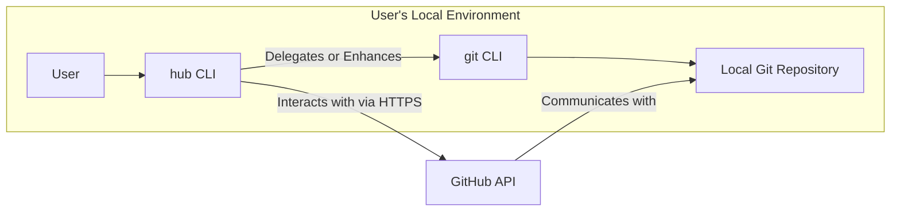
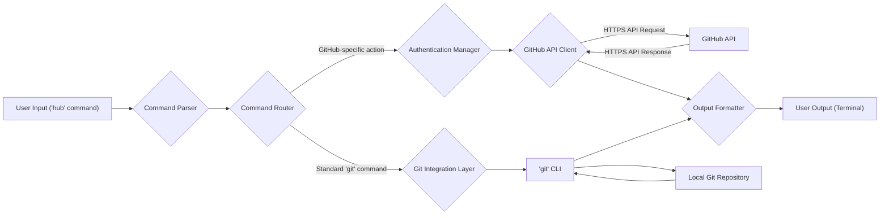

# Project Design Document: hub CLI Tool

**Version:** 1.1
**Date:** October 26, 2023
**Author:** AI Software Architect

## 1. Project Overview

This document details the design of the `hub` command-line interface (CLI) tool, as found in the repository [https://github.com/mislav/hub](https://github.com/mislav/hub). `hub` serves as a powerful extension to the standard `git` command, enriching it with GitHub-specific functionalities and streamlining interactions with GitHub repositories directly from the command line. This document aims to provide a clear and comprehensive understanding of the tool's architecture, its constituent components, and the flow of data within the system. This understanding is crucial for subsequent threat modeling activities.

## 2. Goals and Objectives

The primary goals of the `hub` project are to:

*   Extend the capabilities of the standard `git` command with features specifically designed for GitHub.
*   Simplify and optimize common GitHub workflows accessible through the command line interface.
*   Offer a more intuitive and efficient method for interacting with GitHub repositories, reducing complexity.
*   Minimize the need for users to switch between the command line environment and the GitHub website for routine tasks.

## 3. Target Audience

This document is primarily intended for:

*   Security engineers and architects tasked with performing threat modeling and security assessments.
*   Software developers who contribute to or maintain the `hub` project codebase.
*   Individuals seeking a deeper technical understanding of the `hub` tool's internal architecture and operation.

## 4. System Architecture

The `hub` CLI tool operates as a sophisticated wrapper around the core `git` command. It intelligently intercepts `git` commands entered by the user, analyzes them to identify opportunities for enhancement or replacement with GitHub-specific actions, and subsequently interacts with the GitHub API or performs local Git operations as required.

**Key Architectural Aspects:**

*   **Command Interception and Analysis:** `hub` intercepts commands entered by the user in the terminal, scrutinizing them for GitHub-related extensions.
*   **Intelligent Command Routing:** The tool determines whether the command is a standard `git` command that should be passed through or a `hub`-specific extension requiring custom handling.
*   **Secure GitHub API Interaction:** For operations involving GitHub, `hub` establishes secure connections (HTTPS) and makes requests to the GitHub API.
*   **Seamless Local Git Interaction:** For standard Git operations, `hub` transparently delegates execution to the underlying `git` CLI, ensuring compatibility.
*   **Robust Configuration Management:** `hub` maintains its own configuration, securely managing sensitive information such as GitHub authentication tokens.

## 5. Components

The `hub` CLI tool is logically structured into the following key components:

*   **Command Parser Module:**
    *   Responsibility:  Receives and parses the command input provided by the user.
    *   Functionality:  Identifies the specific action intended by the user and extracts any associated arguments or options.
*   **Command Router Module:**
    *   Responsibility:  Directs the parsed command to the appropriate handler.
    *   Functionality:  Distinguishes between standard `git` commands and `hub`-specific extensions, routing each accordingly.
*   **Authentication Manager Module:**
    *   Responsibility:  Manages the user's authentication credentials for accessing GitHub.
    *   Functionality:  Supports various authentication methods, such as OAuth or personal access tokens, and securely stores and retrieves these credentials.
*   **GitHub API Client Module:**
    *   Responsibility:  Facilitates communication with the GitHub API.
    *   Functionality:  Constructs, sends, and processes API requests, handling authentication and error responses. Typically uses HTTPS for secure communication.
*   **Git Integration Layer Module:**
    *   Responsibility:  Interfaces with the local Git installation.
    *   Functionality:  Executes standard `git` commands on behalf of the user when `hub` determines it's necessary.
*   **Configuration Manager Module:**
    *   Responsibility:  Manages the configuration settings for the `hub` tool.
    *   Functionality:  Stores and retrieves configuration parameters, including the user's preferred editor, GitHub hostname, and authentication details.
*   **Output Formatter Module:**
    *   Responsibility:  Formats the output of `hub` commands for presentation to the user.
    *   Functionality:  Transforms data retrieved from the GitHub API or the `git` CLI into a user-friendly and readable format in the terminal.

## 6. Data Flow

The following diagram illustrates a typical data flow for a `hub` command that necessitates interaction with the GitHub API:

**Detailed Data Flow Description:**

1. **User Initiates Command:** The user enters a `hub` command in their terminal.
2. **Command Parsing:** The Command Parser module analyzes the input to determine the intended command and any associated arguments.
3. **Command Routing:** The Command Router module evaluates the parsed command to decide if it's a `hub`-specific extension or a standard `git` command.
4. **Authentication Handling (If Required):** For commands targeting GitHub, the Authentication Manager module retrieves the necessary authentication credentials.
5. **Secure API Request:** The GitHub API Client module constructs and sends a secure HTTPS request to the GitHub API based on the command.
6. **API Processing and Response:** The GitHub API processes the incoming request and sends back a corresponding HTTPS response.
7. **Output Formatting:** The Output Formatter module receives the API response or output from the `git` CLI and formats it for clear presentation to the user.
8. **Displaying Output:** The formatted output is displayed to the user in their terminal.
9. **Standard Git Command Execution:** If the command is a standard `git` command, the Command Router directs it to the Git Integration Layer, which executes the command using the underlying `git` CLI and interacts with the local Git repository.

## 7. Security Considerations (Detailed)

The following security considerations are crucial for the `hub` project:

*   **Secure Authentication Credential Management:**
    *   Threat: Exposure of GitHub authentication tokens (OAuth tokens or personal access tokens) could lead to unauthorized access to the user's GitHub account.
    *   Mitigation: Employ secure storage mechanisms for credentials (e.g., operating system's credential manager), avoid storing credentials in plain text, and potentially support short-lived tokens.
*   **Authorization Enforcement:**
    *   Threat: `hub` might attempt actions on GitHub that the authenticated user is not authorized to perform.
    *   Mitigation: Ensure that `hub` respects the permissions and roles associated with the authenticated user's GitHub account.
*   **GitHub API Security:**
    *   Threat: Vulnerabilities in the GitHub API or insecure communication could be exploited.
    *   Mitigation:  Always use HTTPS for communication with the GitHub API, stay updated with GitHub's security advisories, and adhere to API best practices.
*   **Input Validation and Sanitization:**
    *   Threat: Malicious user input could lead to command injection vulnerabilities if not properly validated.
    *   Mitigation: Implement robust input validation and sanitization techniques to prevent the execution of unintended commands or scripts.
*   **Dependency Management Security:**
    *   Threat: Vulnerabilities in third-party libraries and dependencies could be exploited.
    *   Mitigation: Regularly audit and update dependencies to their latest secure versions, and use dependency scanning tools to identify potential vulnerabilities.
*   **Local File System Security:**
    *   Threat: Improper handling of file paths or permissions could lead to unauthorized access or modification of local files.
    *   Mitigation:  Exercise caution when interacting with the local file system, validate file paths, and adhere to the principle of least privilege.
*   **Protection Against Man-in-the-Middle (MITM) Attacks:**
    *   Threat: Attackers could intercept communication between `hub` and the GitHub API to steal credentials or manipulate data.
    *   Mitigation: Enforce the use of HTTPS for all API communication and potentially implement certificate pinning for added security.
*   **Secure Handling of Sensitive Data in Memory:**
    *   Threat: Sensitive data, such as API responses containing private information, could be exposed if not handled securely in memory.
    *   Mitigation: Minimize the duration that sensitive data resides in memory and consider techniques for securely erasing sensitive data when it's no longer needed.

## 8. Deployment

The `hub` CLI tool is typically deployed through the following methods:

*   **Downloadable Pre-compiled Binaries:** Users can download pre-compiled executable files tailored for their specific operating system (e.g., macOS, Windows, Linux).
*   **Package Managers:** Installation via popular package managers such as `brew` (macOS), `apt` (Debian/Ubuntu), and `yum` (CentOS/RHEL) simplifies the installation process.
*   **Compilation from Source:** Developers can build the `hub` tool directly from the source code, providing flexibility and allowing for customization.

Once installed, the `hub` executable is added to the system's PATH environment variable, enabling users to invoke it from any directory in the command line.

## 9. Technologies Used

*   **Primary Programming Language:** Go (Golang)
*   **GitHub API Interaction:** Utilizes the official GitHub API for accessing and manipulating GitHub resources.
*   **Core Git Functionality:** Leverages the underlying `git` CLI for standard Git operations.
*   **Operating System Interfaces:** Interacts with the host operating system's APIs for tasks such as file system access and process execution.