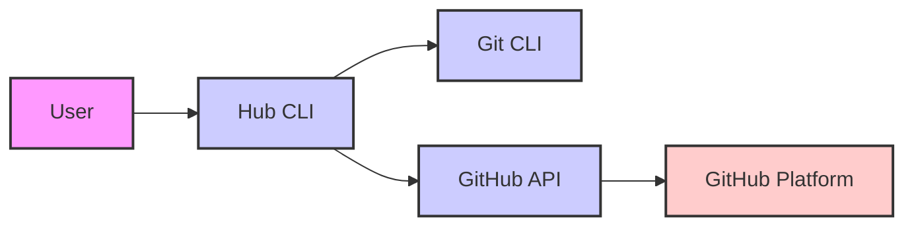

# Project Design Document: Hub CLI Tool for GitHub Interaction

**Project Name:** Hub CLI Tool

**Project Repository:** [https://github.com/mislav/hub](https://github.com/mislav/hub)

**Document Version:** 1.1

**Date:** 2023-10-27

**Author:** AI Cloud & Security Architect

## 1. Introduction

This document provides a design overview of the `hub` command-line tool, a wrapper around `git` that enhances GitHub interaction from the terminal. This document is intended to be used as a basis for threat modeling and security analysis of the `hub` project. It outlines the system's architecture, components, data flow, and key security considerations to facilitate the identification of potential threats and vulnerabilities.

## 2. Project Overview

`hub` is a command-line interface (CLI) tool that extends the functionality of `git` to simplify interactions with GitHub. It provides convenient commands for common GitHub operations such as:

*   Creating and managing repositories
*   Working with issues and pull requests
*   Managing releases
*   Interacting with gists
*   And more, directly from the terminal.

`hub` leverages the official GitHub API (both REST and GraphQL) to perform these operations, abstracting away the complexities of API interactions and providing a user-friendly command-line experience. It aims to improve developer productivity by streamlining common GitHub workflows directly within the terminal environment.

## 3. System Architecture

The following diagram illustrates the high-level architecture of the `hub` CLI tool and its interactions with external systems. Communication between "Hub CLI" and "GitHub API" is over HTTPS. Communication between "Hub CLI" and "Git CLI" is via local system calls. Communication between "Git CLI" and "GitHub Platform" (when Git interacts directly with remote repositories) can be over HTTPS or SSH, depending on Git configuration.



**Components:**

*   **"User":** The end-user, a human operator interacting with the `hub` CLI tool through a terminal or command prompt.
*   **"Hub CLI":** The `hub` application itself, written primarily in Go. This is the core component responsible for command parsing, business logic, interaction orchestration, and security functions.
*   **"Git CLI":** The standard Git command-line interface, a prerequisite for `hub`. `hub` delegates local repository operations to `git`.
*   **"GitHub API":** The official REST and GraphQL API provided by GitHub, used by `hub` for all interactions with the GitHub platform for remote operations.
*   **"GitHub Platform":** The comprehensive GitHub platform infrastructure, encompassing web interface, repositories, databases, and services.

## 4. Component Description

### 4.1. User

*   **Description:** The human user who initiates and interacts with the `hub` CLI tool.
*   **Functionality:**
    *   Executes `hub` commands via a terminal.
    *   Provides command-line arguments and input to `hub` commands (e.g., repository names, issue descriptions, authentication credentials during initial setup).
    *   Receives and interprets output from `hub` commands, including data retrieved from GitHub and Git.
*   **Security Considerations:**
    *   User identity is managed by the local operating system and GitHub.
    *   User actions are constrained by their GitHub permissions and local system privileges.
    *   Compromised user accounts or workstations can lead to unauthorized actions via `hub`.

### 4.2. Hub CLI

*   **Description:** The core application logic of `hub`, acting as the intermediary between the user, Git CLI, and GitHub API.
*   **Functionality:**
    *   **Command Parsing and Routing:** Interprets user commands, options, and arguments, and routes requests to appropriate internal modules or external components (Git CLI, GitHub API).
    *   **Git CLI Orchestration:** Executes `git` commands by invoking the Git CLI binary, parsing its output, and integrating it into `hub` workflows.
    *   **GitHub API Client:** Constructs and sends requests to the GitHub API (REST and GraphQL endpoints) based on user commands. Handles API responses, error codes, and data parsing.
    *   **Authentication and Authorization Management:**
        *   Handles user authentication with GitHub, typically using OAuth 2.0 flow or Personal Access Tokens (PATs).
        *   Securely stores and retrieves authentication tokens.
        *   Includes tokens in API requests for authorization.
    *   **Configuration Management:** Stores user-specific configurations, including GitHub API tokens, preferred settings, and potentially custom aliases or extensions. Configuration might be stored in files within the user's home directory.
    *   **Input Validation and Sanitization:** Validates user-provided input to prevent injection attacks and ensure data integrity. Sanitizes input before passing it to Git CLI or GitHub API.
    *   **Output Formatting and Presentation:** Formats data received from Git CLI and GitHub API into user-friendly output in the terminal.
    *   **Error Handling and Logging:** Manages errors gracefully, provides informative error messages to the user, and potentially logs events for debugging and auditing.
    *   **Dependency Management:** Relies on external Go libraries for various functionalities (e.g., HTTP clients, JSON parsing, OAuth handling). Uses Go modules for dependency management.
*   **Security Considerations:**
    *   **Credential Storage Security:**  Critical to securely store GitHub API tokens. Potential vulnerabilities include storing tokens in plaintext configuration files, insecure file permissions, or lack of encryption. Secure storage mechanisms like OS keychain or encrypted configuration files should be used.
    *   **Input Validation Vulnerabilities:** Improper input validation could lead to command injection (in Git CLI interactions) or API injection vulnerabilities.  Specifically, filenames, repository names, issue titles, and other user-provided strings need careful validation.
    *   **API Request Security:** Ensuring all communication with the GitHub API is over HTTPS to prevent eavesdropping and man-in-the-middle attacks. Proper handling of API rate limits and error responses is also important for resilience.
    *   **Dependency Vulnerabilities:**  Vulnerabilities in third-party Go libraries used by `hub` could be exploited. Regular dependency updates and vulnerability scanning are necessary. Supply chain attacks targeting dependencies are also a concern.
    *   **Information Leakage:**  Error messages, logs, or verbose output could inadvertently expose sensitive information like API tokens, internal paths, or user data. Output sanitization and controlled logging are important.
    *   **Authentication Bypass/Weaknesses:** Vulnerabilities in the authentication flow or token handling could lead to unauthorized access to GitHub resources. Secure OAuth 2.0 implementation and robust token management are crucial.

### 4.3. Git CLI

*   **Description:** The standard Git command-line interface, a widely adopted version control system client. `hub` relies on a properly installed and configured Git CLI.
*   **Functionality:**
    *   **Local Git Repository Operations:** Handles all local Git operations as requested by `hub`, including cloning, committing, branching, merging, pushing, pulling, and managing local repository configurations.
    *   **Remote Repository Communication (Direct Git):**  Communicates directly with remote Git repositories (including GitHub repositories) using Git protocols (SSH, HTTPS) when `hub` commands trigger direct Git operations (e.g., `git clone`, `git push`).
*   **Security Considerations:**
    *   **Git Protocol Security:** Relies on the security of Git protocols (SSH, HTTPS). Weaknesses in these protocols or their implementations could be exploited.
    *   **Local File System Access:** Git CLI has broad access to the local file system within the repository and working directory.  Malicious repositories or commands could potentially exploit this access.
    *   **Git Hooks Security (Indirect):** While `hub` doesn't directly manage Git hooks, actions initiated by `hub` might trigger Git hooks in local repositories. Maliciously crafted Git hooks could execute arbitrary code on the user's system. Users should be aware of the risks of running code from untrusted repositories.
    *   **Git Vulnerabilities:**  Known vulnerabilities in the Git CLI itself could be exploited if `hub` triggers vulnerable Git commands or if a user interacts with malicious repositories through `hub`.

### 4.4. GitHub API

*   **Description:** The official programmatic interface to GitHub, providing REST and GraphQL endpoints for accessing and manipulating GitHub resources.
*   **Functionality:**
    *   **Authentication and Authorization:** Provides mechanisms for authenticating applications and users (OAuth 2.0, Personal Access Tokens) and authorizing access to specific resources based on scopes and permissions.
    *   **Repository Management API:** Allows programmatic creation, deletion, modification, and retrieval of repository metadata.
    *   **Issue and Pull Request API:** Enables programmatic interaction with issues and pull requests, including creation, modification, listing, and commenting.
    *   **Release Management API:** Supports creation, modification, and retrieval of software releases and release assets.
    *   **Gist API:** Provides access to GitHub Gists for code snippet sharing.
    *   **User and Organization API:** Allows access to user and organization profiles and related information.
    *   **GraphQL API:** Offers a more flexible and efficient way to query and mutate GitHub data.
*   **Security Considerations:**
    *   **API Authentication Security:**  Relies on secure API authentication using tokens. Weaknesses in token generation, storage, or transmission could lead to unauthorized access.
    *   **API Authorization Enforcement:** GitHub API enforces access control based on token scopes and user permissions.  Bypassing or weakening this authorization would be a critical vulnerability in GitHub's platform.
    *   **API Rate Limiting and Abuse Prevention:** GitHub API implements rate limiting to protect against abuse and ensure service availability.  Clients (like `hub`) need to handle rate limits gracefully.
    *   **Data Security in Transit:**  All communication with the GitHub API should be over HTTPS to protect data confidentiality and integrity.
    *   **API Vulnerabilities (GitHub's Responsibility):**  Vulnerabilities in the GitHub API itself are GitHub's responsibility to address. However, `hub`'s code should be resilient to potential API changes or unexpected behavior.

### 4.5. GitHub Platform

*   **Description:** The underlying infrastructure and services that constitute the GitHub platform, hosting Git repositories and providing all related functionalities.
*   **Functionality:**
    *   **Git Repository Hosting and Management:**  Provides secure and reliable storage and access to Git repositories.
    *   **Issue Tracking and Project Management:**  Offers issue tracking, project boards, and related features for software development collaboration.
    *   **Pull Request and Code Review System:**  Facilitates code review and collaboration through pull requests.
    *   **Release Management and Distribution:**  Supports software release management and distribution through releases and release assets.
    *   **User and Organization Account Management:**  Manages user accounts, organizations, and access permissions.
    *   **Authentication and Authorization Services (Platform Level):** Provides core authentication and authorization services for all GitHub users and applications interacting with the platform.
    *   **Security Infrastructure (Platform Level):** Implements platform-wide security measures to protect user data, code, and infrastructure.
*   **Security Considerations:**
    *   **Platform Security (GitHub's Responsibility):** GitHub is responsible for the overall security of its platform, including physical security of data centers, network security, application security, and data protection.
    *   **Data Confidentiality, Integrity, and Availability (CIA):** GitHub is responsible for ensuring the confidentiality, integrity, and availability of user data and code hosted on the platform.
    *   **Compliance and Regulatory Requirements (GitHub's Responsibility):** GitHub must comply with relevant security and privacy regulations and standards.
    *   **Platform Resilience and Disaster Recovery (GitHub's Responsibility):** GitHub needs to ensure high availability and resilience of the platform against failures and disasters.

## 5. Data Flow Diagram

The following diagram illustrates the data flow within the `hub` system, highlighting the movement of sensitive data and interactions between components. Sensitive data includes GitHub API tokens, repository code, issue/PR details, and potentially user-specific configurations.

```mermaid
graph LR
    A["User"] --> B["Hub CLI"]: "Commands, Credentials (initially)";
    B --> C["Git CLI"]: "Git Commands, Repository Data";
    B --> D["GitHub API"]: "API Requests, Credentials (tokens)";
    D --> E["GitHub Platform"]: "API Requests, Data (e.g., issue/PR details)";
    E --> D["GitHub API"]: "API Responses, Data (e.g., issue/PR details)";
    C --> B["Hub CLI"]: "Git Output, Repository Data";
    D -.-> B["Hub CLI"]: "API Responses, Data (e.g., JSON responses)";
    B -.-> A["User"]: "Output, Data";
    classDef component fill:#ccf,stroke:#333,stroke-width:2px;
    classDef external fill:#fcc,stroke:#333,stroke-width:2px;
    classDef user fill:#f9f,stroke:#333,stroke-width:2px;
    class A user;
    class B,C,D component;
    class E external;
    linkStyle 2,3,4,5 stroke-dasharray: 5 5;
```

**Data Flow Description:**

1.  **User to Hub CLI:** The user inputs `hub` commands and, during initial setup or token refresh, provides GitHub authentication credentials.
2.  **Hub CLI to Git CLI:** `hub` CLI sends Git commands and potentially repository data (e.g., file paths, commit messages) to the Git CLI for local Git operations.
3.  **Hub CLI to GitHub API:** `hub` CLI constructs and sends API requests to the GitHub API, including authentication credentials (API tokens) in headers or request bodies. These requests carry data related to GitHub operations (e.g., issue creation data, repository names).
4.  **GitHub API to GitHub Platform:** The GitHub API forwards validated and authorized requests to the underlying GitHub Platform to access and manipulate data stored and managed by the platform.
5.  **GitHub Platform to GitHub API:** The GitHub Platform processes requests and sends API responses back to the GitHub API, including requested data (e.g., issue details, repository lists) and status codes.
6.  **GitHub API to Hub CLI:** The GitHub API sends API responses and data back to the `hub` CLI. Responses are typically in JSON format.
7.  **Git CLI to Hub CLI:** Git CLI sends output (stdout, stderr) and repository data back to the `hub` CLI after executing Git commands. This output might include commit hashes, file changes, and error messages.
8.  **Hub CLI to User:** The `hub` CLI processes responses from Git CLI and GitHub API, formats the data, and presents user-friendly output in the terminal.

**Sensitive Data Flows:**

*   **Credentials (GitHub API Tokens):**  GitHub API tokens are initially entered by the User, stored by the Hub CLI, and transmitted from the Hub CLI to the GitHub API in every authenticated request. Secure handling of these tokens is paramount.
*   **Repository Data (Code, History):** Git repository data, including source code, commit history, and file contents, flows between the Git CLI and the Hub CLI during local Git operations. When interacting with remote repositories, Git CLI also transmits this data over the network (potentially via SSH or HTTPS).
*   **GitHub API Data (Issues, PRs, Releases, etc.):** Data related to GitHub entities like issues, pull requests, releases, gists, and repository metadata is transmitted between the Hub CLI and the GitHub API. This data can contain sensitive project information, discussions, and code snippets.
*   **User Configuration Data:** User-specific configurations stored by `hub` might contain preferences or settings that, if exposed, could be considered sensitive in certain contexts.

## 6. Security Considerations

Based on the architecture and data flow, the following are key security considerations and potential threats for the `hub` CLI tool:

*   **Credential Management Vulnerabilities:**
    *   **Threat:** Plaintext storage of GitHub API tokens in configuration files.
    *   **Threat:** Insecure file permissions on configuration files allowing unauthorized access to tokens.
    *   **Threat:** Token leakage through debug logs, temporary files, or insecure transmission during initial setup.
    *   **Threat:** Lack of token rotation or revocation mechanisms, increasing the impact of token compromise.
*   **Authentication and Authorization Bypass/Weaknesses:**
    *   **Threat:** Vulnerabilities in the OAuth 2.0 flow implementation in `hub` leading to authentication bypass.
    *   **Threat:** Weak token generation or validation mechanisms allowing for token forgery or hijacking.
    *   **Threat:** Privilege escalation if `hub` incorrectly assumes or grants higher GitHub permissions than intended.
    *   **Threat:** Insecure handling of authentication sessions, leading to session hijacking or replay attacks.
*   **Input Validation and Command Injection Attacks:**
    *   **Threat:** Command injection vulnerabilities in Git CLI interactions if user-provided input (e.g., filenames, branch names) is not properly sanitized before being passed to Git commands.
    *   **Threat:** API injection vulnerabilities if user input is directly embedded into API requests without proper encoding or validation, potentially leading to unexpected API calls or data manipulation.
    *   **Example Vulnerable Inputs:** Repository names, issue titles, branch names, filenames, commit messages, user-provided URLs.
*   **API Security Vulnerabilities:**
    *   **Threat:** Man-in-the-middle attacks if HTTPS is not consistently used for all GitHub API communication, allowing eavesdropping and data interception.
    *   **Threat:** API key compromise if tokens are exposed or leaked, leading to unauthorized access to GitHub resources via the API.
    *   **Threat:** Insufficient handling of API rate limits, leading to denial of service or degraded functionality.
    *   **Threat:** Vulnerabilities in the GitHub API itself (though less directly related to `hub`'s code, `hub` should be resilient to API issues).
*   **Dependency Security Risks:**
    *   **Threat:** Use of vulnerable third-party Go libraries with known security flaws, which could be exploited through `hub`.
    *   **Threat:** Supply chain attacks targeting `hub`'s dependencies, where malicious code is injected into dependencies.
    *   **Mitigation:** Regular dependency scanning, updates, and using dependency management tools to track and mitigate vulnerabilities.
*   **Output Sanitization and Information Leakage:**
    *   **Threat:** Accidental exposure of sensitive information (API tokens, internal paths, user data, error details) in error messages displayed to the user or written to logs.
    *   **Threat:** Verbose output modes or debugging features inadvertently leaking sensitive data.
    *   **Mitigation:** Careful sanitization of output, controlled logging levels, and avoiding exposure of sensitive data in user-facing messages.
*   **Git CLI Security Exploitation:**
    *   **Threat:** Exploiting known vulnerabilities in the underlying Git CLI through commands triggered by `hub`.
    *   **Threat:** Interaction with malicious Git repositories through `hub` that could exploit Git vulnerabilities or trigger malicious Git hooks.
    *   **Mitigation:** Keeping Git CLI updated to the latest secure version and educating users about the risks of interacting with untrusted repositories.

## 7. Assumptions and Out of Scope

**Assumptions:**

*   The user has a valid GitHub account and possesses the necessary permissions to perform actions via `hub`.
*   Git CLI is correctly installed, configured, and accessible in the user's environment.
*   The GitHub API and GitHub Platform are functioning as designed and are inherently secure (within GitHub's responsibility).
*   This document focuses on the design and architecture of `hub` and its immediate interactions.

**Out of Scope:**

*   Detailed source code review and line-by-line analysis of the `hub` codebase.
*   Penetration testing or vulnerability scanning of the `hub` application.
*   Security assessment of the GitHub API or GitHub Platform infrastructure.
*   Deployment and operational security aspects of running `hub` (as it's a client-side tool).
*   Performance, scalability, and reliability aspects of `hub`.
*   In-depth threat modeling of specific `hub` commands individually. This document provides a broader architectural threat landscape.

## 8. Conclusion

This improved design document provides a more detailed and threat-focused overview of the `hub` CLI tool. It outlines the system's architecture, component functionalities, data flows, and critically, highlights specific security considerations and potential threats. This document is intended to be a valuable resource for conducting a comprehensive threat model of the `hub` project, enabling security analysts and developers to identify, assess, and mitigate potential vulnerabilities effectively. The detailed security considerations section should serve as a starting point for more granular threat analysis and the development of security requirements and mitigations.