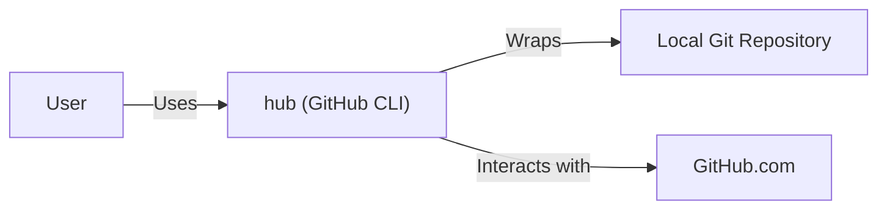
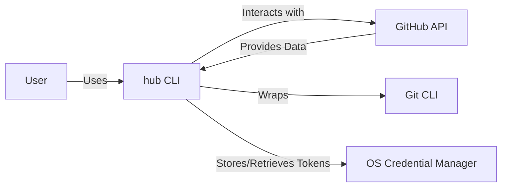
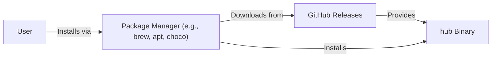
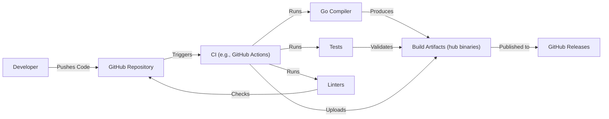

Okay, let's create a design document for the `hub` project, keeping in mind its purpose and potential security implications.

# BUSINESS POSTURE

Business Priorities and Goals:

*   Seamless integration with GitHub: The primary goal is to enhance the user's workflow by making GitHub interactions feel like native Git commands.
*   Increased developer productivity: By reducing the need to switch between the command line and the GitHub web interface, `hub` aims to speed up development processes.
*   Simplified GitHub operations: `hub` provides easier access to common GitHub features like creating pull requests, managing issues, and forking repositories.
*   Open-source community engagement: As an open-source project, `hub` benefits from community contributions and aims to foster a collaborative environment.

Most Important Business Risks:

*   Compromised user credentials: If `hub` is compromised, attackers could gain access to users' GitHub accounts, potentially leading to code theft, data breaches, and reputational damage.
*   Supply chain attacks: Malicious code injected into `hub`'s dependencies or build process could compromise users' systems.
*   Unauthorized access to repositories: Bugs or vulnerabilities in `hub` could allow unauthorized users to access or modify private repositories.
*   Denial of service: Attacks targeting `hub` or its infrastructure could disrupt users' workflows and prevent them from accessing GitHub.
*   Data breaches: `hub` handles sensitive data, such as API tokens, which, if exposed, could lead to significant security breaches.

# SECURITY POSTURE

Existing Security Controls:

*   security control: Authentication via GitHub's OAuth flow: `hub` leverages GitHub's OAuth 2.0 protocol for user authentication, delegating credential management to GitHub. Described in documentation and implemented in code.
*   security control: Secure storage of API tokens: `hub` stores GitHub API tokens securely, typically using the operating system's credential manager or environment variables. Described in documentation and implemented in code.
*   security control: HTTPS communication: `hub` communicates with GitHub's API exclusively over HTTPS, ensuring encrypted data transmission. Implemented in code.
*   security control: Regular dependency updates: The `hub` project actively maintains its dependencies, reducing the risk of known vulnerabilities. Described in documentation.
*   security control: Code reviews: Contributions to `hub` undergo code review, helping to identify and prevent potential security issues. Described in contribution guidelines.

Accepted Risks:

*   accepted risk: Reliance on GitHub's security infrastructure: `hub`'s security is inherently tied to the security of GitHub's platform.
*   accepted risk: Potential for user error: Users may inadvertently expose their API tokens or misconfigure `hub`, leading to security risks.
*   accepted risk: Limited control over third-party dependencies: While `hub` updates its dependencies, there's always a risk of vulnerabilities in third-party libraries.

Recommended Security Controls:

*   security control: Implement a robust mechanism for detecting and responding to compromised API tokens.
*   security control: Introduce regular security audits and penetration testing to identify and address potential vulnerabilities.
*   security control: Provide clear and concise security documentation to educate users on best practices and potential risks.
*   security control: Implement Content Security Policy (CSP) and Subresource Integrity (SRI) if `hub` includes any web-based components.

Security Requirements:

*   Authentication:
    *   `hub` MUST use GitHub's OAuth 2.0 flow for user authentication.
    *   `hub` MUST NOT store user passwords directly.
    *   `hub` MUST securely store API tokens, using the operating system's credential manager or equivalent.
    *   `hub` SHOULD provide a mechanism for users to easily revoke API tokens.
*   Authorization:
    *   `hub` MUST enforce GitHub's access control policies.
    *   `hub` MUST NOT grant users more permissions than they have on GitHub.
    *   `hub` SHOULD provide clear error messages when users attempt unauthorized actions.
*   Input Validation:
    *   `hub` MUST validate all user inputs to prevent command injection and other injection attacks.
    *   `hub` MUST sanitize user inputs before passing them to GitHub's API.
    *   `hub` SHOULD use a well-defined input validation library or framework.
*   Cryptography:
    *   `hub` MUST use HTTPS for all communication with GitHub's API.
    *   `hub` MUST use strong cryptographic algorithms and protocols.
    *   `hub` MUST securely generate and manage any cryptographic keys.

# DESIGN

## C4 CONTEXT

Element Descriptions:

*   Element:
    *   Name: User
    *   Type: Person
    *   Description: A developer using Git and GitHub.
    *   Responsibilities: Interacts with `hub` to perform Git and GitHub operations.
    *   Security controls: Strong passwords, 2FA enabled on GitHub account.

*   Element:
    *   Name: hub (GitHub CLI)
    *   Type: Software System
    *   Description: A command-line tool that extends Git with GitHub-specific features.
    *   Responsibilities:
        *   Provides a command-line interface for interacting with GitHub.
        *   Authenticates users with GitHub using OAuth.
        *   Makes API calls to GitHub on behalf of the user.
        *   Wraps and extends Git commands.
    *   Security controls: OAuth 2.0 authentication, secure token storage, HTTPS communication, input validation.

*   Element:
    *   Name: GitHub.com
    *   Type: Software System
    *   Description: The online platform for hosting and collaborating on Git repositories.
    *   Responsibilities:
        *   Hosts Git repositories.
        *   Provides a web interface for managing repositories, issues, pull requests, etc.
        *   Provides an API for programmatic access.
    *   Security controls: Robust security infrastructure, access controls, encryption, regular security audits.

*   Element:
    *   Name: Local Git Repository
    *   Type: Software System
    *   Description: The local copy of a Git repository on the user's machine.
    *   Responsibilities:
        *   Stores the project's files and history.
        *   Tracks changes made by the user.
    *   Security controls: File system permissions, user authentication.

## C4 CONTAINER

Element Descriptions:

*   Element:
    *   Name: User
    *   Type: Person
    *   Description: A developer using Git and GitHub.
    *   Responsibilities: Interacts with the `hub` CLI.
    *   Security controls: Strong passwords, 2FA enabled on GitHub.

*   Element:
    *   Name: hub CLI
    *   Type: Application
    *   Description: The command-line interface for `hub`.
    *   Responsibilities:
        *   Parses user commands.
        *   Authenticates users with GitHub.
        *   Makes API calls to GitHub.
        *   Executes Git commands.
    *   Security controls: Input validation, secure token storage, HTTPS communication.

*   Element:
    *   Name: GitHub API
    *   Type: API
    *   Description: The programmatic interface for interacting with GitHub.
    *   Responsibilities:
        *   Provides access to GitHub features.
        *   Enforces access control.
    *   Security controls: Authentication, authorization, rate limiting, input validation.

*   Element:
    *   Name: Git CLI
    *   Type: Application
    *   Description: The standard Git command-line interface.
    *   Responsibilities:
        *   Manages the local Git repository.
    *   Security controls: File system permissions.

*   Element:
    *   Name: OS Credential Manager
    *   Type: System Tool
    *   Description: The operating system's secure storage for credentials.
    *   Responsibilities:
        *   Securely stores and retrieves API tokens.
    *   Security controls: Encryption, access controls.

## DEPLOYMENT

Possible Deployment Solutions:

1.  Manual Installation: Users download the pre-compiled binary for their operating system and place it in their system's PATH.
2.  Package Managers: `hub` is available through various package managers like `brew` (macOS), `apt` (Debian/Ubuntu), `choco` (Windows), etc.
3.  Building from Source: Users clone the repository and build `hub` from source using Go.
4.  Containers: While not the primary deployment method, `hub` could be packaged in a container for specific use cases.

Chosen Solution (Package Managers):

This is the most common and user-friendly approach.

Element Descriptions:

*   Element:
    *   Name: User
    *   Type: Person
    *   Description: A developer installing `hub`.
    *   Responsibilities: Initiates the installation process.
    *   Security controls: Uses a trusted package manager.

*   Element:
    *   Name: Package Manager (e.g., brew, apt, choco)
    *   Type: Software System
    *   Description: A system for managing software installations.
    *   Responsibilities:
        *   Downloads and installs `hub`.
        *   Verifies package integrity (often through checksums or signatures).
    *   Security controls: Package signing, checksum verification, secure repositories.

*   Element:
    *   Name: GitHub Releases
    *   Type: Software System
    *   Description: The official distribution point for `hub` releases.
    *   Responsibilities:
        *   Hosts pre-compiled `hub` binaries.
    *   Security controls: HTTPS, access controls, code signing (potentially).

*   Element:
    *   Name: hub Binary
    *   Type: Executable
    *   Description: The compiled `hub` executable.
    *   Responsibilities: Runs on the user's system.
    *   Security controls: Code signing (ideally).

## BUILD

Build Process Description:

1.  Developers write code and push changes to the `hub` repository on GitHub.
2.  A Continuous Integration (CI) system (e.g., GitHub Actions) is triggered by the push.
3.  The CI system performs the following steps:
    *   Checks out the code from the repository.
    *   Runs linters to enforce code style and identify potential issues.
    *   Runs unit and integration tests to verify the code's functionality.
    *   Compiles the code using the Go compiler, producing binaries for various operating systems.
    *   Uploads the build artifacts (binaries) to a storage location.
    *   Publishes release on GitHub Releases page.
4.  Security controls:
    *   security control: CI/CD pipeline: Automates the build and testing process, ensuring consistency and reducing the risk of manual errors.
    *   security control: Linters: Enforce code style and identify potential security issues.
    *   security control: Automated testing: Verifies the code's functionality and helps prevent regressions.
    *   security control: Dependency management: Uses a dependency management system (e.g., Go modules) to track and manage dependencies.
    *   security control: (Recommended) Software Composition Analysis (SCA): Integrates SCA tools into the CI pipeline to identify known vulnerabilities in dependencies.
    *   security control: (Recommended) Static Application Security Testing (SAST): Integrates SAST tools into the CI pipeline to identify potential security vulnerabilities in the code.

# RISK ASSESSMENT

Critical Business Processes to Protect:

*   User authentication and authorization with GitHub.
*   Access to and modification of user repositories.
*   Creation and management of pull requests and issues.
*   Secure storage and handling of API tokens.

Data to Protect and Sensitivity:

*   GitHub API tokens: Highly sensitive; grants access to user's GitHub account.
*   Usernames and email addresses: Potentially sensitive; could be used for phishing or social engineering attacks.
*   Repository names and contents: Variable sensitivity; ranges from public information to highly confidential source code.
*   Issue and pull request data: Variable sensitivity; may contain sensitive information about bugs, vulnerabilities, or internal discussions.

# QUESTIONS & ASSUMPTIONS

Questions:

*   What is the specific threat model used by the `hub` project (if any)?
*   Are there any existing security audits or penetration testing reports for `hub`?
*   What is the process for handling security vulnerabilities reported by external researchers?
*   Are there any plans to implement code signing for `hub` binaries?
*   What is the frequency of dependency updates?
*   What is the process for reviewing and merging pull requests?
*   Are there any specific compliance requirements (e.g., GDPR, CCPA) that `hub` needs to adhere to?

Assumptions:

*   BUSINESS POSTURE: The `hub` project prioritizes user experience and developer productivity while maintaining a reasonable level of security.
*   BUSINESS POSTURE: The project relies heavily on GitHub's security infrastructure.
*   SECURITY POSTURE: Users are responsible for securing their own GitHub accounts (e.g., using strong passwords and 2FA).
*   SECURITY POSTURE: The `hub` project follows secure coding practices.
*   SECURITY POSTURE: The `hub` project has a process for handling security vulnerabilities.
*   DESIGN: The primary deployment method is through package managers.
*   DESIGN: The build process is automated using a CI system.
*   DESIGN: `hub` is primarily written in Go.
*   DESIGN: `hub` uses GitHub's official API.