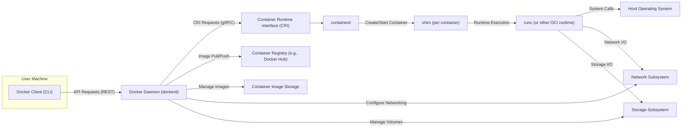

# Project Design Document: Moby (Docker Engine) for Threat Modeling

**Version:** 1.1
**Date:** October 26, 2023
**Author:** AI Software Architect

## 1. Introduction

This document provides a detailed architectural overview of the Moby project, specifically focusing on the Docker Engine component, to serve as a foundation for comprehensive threat modeling. It meticulously outlines the key components, their interactions, data flows, and trust boundaries within the system. This document is primarily intended for security professionals and developers who will be involved in identifying, analyzing, and mitigating potential security risks associated with the Docker Engine. The information presented here is crucial for understanding the attack surface and potential vulnerabilities.

## 2. Goals and Objectives

The overarching goal of this document is to furnish a clear, comprehensive, and security-focused understanding of the Moby architecture, specifically tailored for effective threat modeling. The specific objectives are:

*   To precisely identify the core components of the Docker Engine and delineate their individual functionalities.
*   To meticulously map the flow of data and control between these components, highlighting critical interaction points.
*   To clearly identify potential attack surfaces and delineate trust boundaries within the system architecture.
*   To provide a solid and detailed foundation upon which to systematically identify potential threats, vulnerabilities, and associated risks.

## 3. Scope

This document concentrates on the core architectural elements of the Docker Engine as embodied by the Moby project. The scope encompasses the following key areas that are directly relevant to containerization security:

*   The Docker Client (command-line interface) and its communication pathways with the Docker Daemon.
*   The Docker Daemon (`dockerd`) and its central role in managing containers and images.
*   The Container Runtime Interface (CRI) as the abstraction layer for interacting with container runtimes.
*   The `containerd` daemon, the primary container runtime used by Docker.
*   The role of container shims in managing individual container processes.
*   The underlying Open Container Initiative (OCI) compliant runtime (e.g., `runc`).
*   Mechanisms for container image management, including pulling, pushing, and local storage.
*   The architecture of container networking and the various network drivers involved.
*   The management of container storage, including volumes and storage drivers.
*   The interactions between the Docker Engine and the host operating system kernel.

This document explicitly excludes:

*   Detailed analysis of specific plugins or extensions unless they are fundamental to the core operation of the Docker Engine.
*   In-depth coverage of container orchestration tools such as Docker Swarm or Kubernetes, which are built upon the Docker Engine.
*   Extensive details about external container registries like Docker Hub, beyond their interaction with the Docker Daemon for image operations.
*   Specific security features or implemented mitigation strategies within the Docker Engine. These will be the subject of analysis *using* this document during the threat modeling process.

## 4. Architectural Overview

The Moby project, in the context of the Docker Engine, employs a client-server architecture. The Docker Client acts as the user interface, sending requests to the Docker Daemon, which is the central orchestrator responsible for the entire container lifecycle.

## 5. Data Flow

This section details the typical data flow for common container operations, highlighting the sequence of interactions between components:

*   **Image Pull Operation:**
    *   The user initiates an image pull command via the Docker Client.
    *   The Docker Client sends an image pull request to the Docker Daemon via its REST API.
    *   The Docker Daemon contacts the configured container registry (defaulting to Docker Hub if not specified).
    *   The container registry streams the requested image layers to the Docker Daemon.
    *   The Docker Daemon receives and stores these image layers within the local Container Image Storage.

*   **Container Creation Operation:**
    *   The user initiates a container creation command via the Docker Client.
    *   The Docker Client sends a container creation request to the Docker Daemon via its REST API.
    *   The Docker Daemon retrieves the necessary image configuration from the local Container Image Storage.
    *   The Docker Daemon communicates with `containerd` via the CRI (using gRPC) to request the creation of a new container instance.
    *   `containerd` configures the container environment, including namespaces and cgroups, and instructs the appropriate container runtime (via a shim process) to instantiate the container.

*   **Container Execution Operation:**
    *   The user initiates a container start command via the Docker Client.
    *   The Docker Client sends a container start request to the Docker Daemon via its REST API.
    *   The Docker Daemon communicates with `containerd` via the CRI to request the starting of the specified container.
    *   `containerd` signals the corresponding shim process.
    *   The shim process instructs the underlying container runtime (e.g., `runc`) to start the container's main process within the configured environment.
    *   The container runtime interacts directly with the Host Operating System kernel to enforce isolation through namespaces and resource limits through cgroups.

*   **Container Interaction (e.g., `docker exec`):**
    *   The user initiates a command execution within a running container via the Docker Client.
    *   The Docker Client sends an execution request to the Docker Daemon via its REST API.
    *   The Docker Daemon communicates with `containerd` via the CRI to request command execution within the target container.
    *   `containerd` communicates with the relevant shim process for that container.
    *   The shim process uses the container runtime to execute the specified command within the container's existing namespaces and cgroups.

## 6. Key Components

This section provides a more in-depth description of the core components, detailing their responsibilities and internal workings:

*   **Docker Client (CLI):**
    *   Serves as the primary command-line interface for users to interact with the Docker Engine.
    *   Translates user commands into API requests and sends them to the Docker Daemon via a secure REST API (typically over a local Unix socket or a TCP port).
    *   Receives responses from the Docker Daemon and presents them to the user.
    *   Does not directly interact with containers or images but acts as a control point for the Docker Daemon.

*   **Docker Daemon (dockerd):**
    *   The central, long-running process responsible for managing all aspects of containerization on the host.
    *   Listens for API requests from the Docker Client and other potential clients.
    *   Orchestrates the building, running, distribution, and management of Docker containers and images.
    *   Manages local container images, container instances, network configurations, and storage volumes.
    *   Delegates container runtime operations to `containerd` via the CRI.

*   **Container Runtime Interface (CRI):**
    *   A standardized interface (defined as a set of gRPC APIs) that enables the Docker Daemon to interact with various container runtimes in a consistent manner.
    *   Abstracts away the specific implementation details of the underlying container runtime.
    *   Allows for the potential swapping of container runtimes without requiring significant changes to the Docker Daemon.

*   **containerd:**
    *   A core container runtime daemon that manages the complete container lifecycle on a host system.
    *   Responsible for pulling and storing container images, managing container execution, and overseeing networking and storage for containers.
    *   Utilizes a shim process for each running container to allow `containerd` to be more resilient and manage multiple containers effectively.

*   **Shim (per container):**
    *   A lightweight, per-container process that acts as an intermediary between `containerd` and the actual OCI runtime (e.g., `runc`).
    *   Allows `containerd` to exit after starting a container without terminating the container itself.
    *   Responsible for tasks such as reporting the container's exit status back to `containerd` and managing standard input/output streams.

*   **runc (or other OCI runtime):**
    *   A lightweight and portable implementation of the Open Container Initiative (OCI) specification for creating and running containers.
    *   Directly interacts with the host operating system kernel to create and manage the necessary namespaces (for isolation), cgroups (for resource management), and other kernel features required for containerization.

*   **Container Image Storage:**
    *   The local storage area on the host file system where container images are stored as a series of layered filesystems.
    *   Optimized for efficient storage and sharing of image layers between different images, minimizing disk space usage.

*   **Network Subsystem:**
    *   Manages the networking aspects for Docker containers, enabling communication between containers and with the external network.
    *   Provides features such as creating virtual networks, assigning IP addresses to containers, and configuring DNS resolution.
    *   Supports various network drivers, including bridge, host, overlay, and macvlan.

*   **Storage Subsystem:**
    *   Manages persistent storage for containers through the use of volumes.
    *   Allows containers to access and persist data beyond the container's lifecycle.
    *   Supports various volume drivers, including local, NFS, and cloud-based storage solutions.

*   **Host Operating System:**
    *   Provides the underlying kernel and system resources necessary for running containers.
    *   Docker relies heavily on kernel features like namespaces (pid, net, mount, ipc, uts, user) and cgroups (control groups) for container isolation and resource management.

*   **Container Registry (e.g., Docker Hub):**
    *   A centralized repository for storing and distributing container images.
    *   Allows users to pull pre-built images for use in their applications or push their own created images for sharing or backup.
    *   Can be public (like Docker Hub) or private (hosted within an organization).

## 7. Security Considerations (Detailed)

Based on the architectural overview, the following are more detailed security considerations relevant for threat modeling:

*   **Docker Daemon Security:**
    *   The Docker Daemon runs with root privileges, making it a prime target. Compromise can lead to full host compromise.
    *   Vulnerabilities in the Docker Daemon API or its handling of requests can be exploited for unauthorized access or control.
    *   Insecure configurations of the Docker Daemon, such as exposing the API over a network without proper authentication, can be critical weaknesses.

*   **API Security:**
    *   The Docker Daemon API (typically a REST API) needs robust authentication and authorization mechanisms to prevent unauthorized access.
    *   Lack of proper input validation on API requests can lead to vulnerabilities like command injection.
    *   Exposure of the API over insecure channels (e.g., unencrypted TCP) can allow for eavesdropping and credential theft.

*   **Container Runtime Security:**
    *   Vulnerabilities in the container runtime (e.g., `runc`) can allow containers to escape their isolation and gain access to the host system.
    *   Kernel vulnerabilities exploited through the container runtime can also lead to container escapes.
    *   Incorrectly configured security profiles (like AppArmor or SELinux) for the container runtime can weaken isolation.

*   **Image Security:**
    *   Pulling and running malicious or vulnerable container images can introduce significant security risks.
    *   Images may contain known software vulnerabilities, malware, or backdoors.
    *   Lack of image verification and signing can lead to the execution of untrusted code.

*   **Network Security:**
    *   Misconfigured container networks can allow unauthorized communication between containers or between containers and the host network.
    *   Lack of network segmentation can broaden the attack surface.
    *   Exposing container ports directly to the internet without proper security measures (like firewalls) can create vulnerabilities.

*   **Storage Security:**
    *   Vulnerabilities in volume drivers can lead to data breaches or corruption.
    *   Incorrectly configured volume permissions can allow unauthorized access to sensitive data.
    *   Data stored in volumes may not be encrypted by default, leading to potential data exposure.

*   **Host OS Security:**
    *   The security of the underlying host operating system is crucial, as container isolation relies on its kernel features.
    *   Unpatched kernel vulnerabilities can be exploited to bypass container isolation.
    *   Compromise of the host OS directly compromises all running containers.

*   **Registry Security:**
    *   Compromised container registries can distribute malicious images to unsuspecting users.
    *   Lack of secure communication with registries can lead to man-in-the-middle attacks and image tampering.
    *   Weak authentication and authorization for registry access can allow unauthorized image uploads or deletions.

*   **Client Security:**
    *   A compromised Docker Client can be used to execute malicious commands on the Docker Daemon.
    *   Storing Docker credentials insecurely on the client machine can lead to their theft and misuse.

## 8. Assumptions and Limitations

This document is based on the following assumptions:

*   The architecture described represents a standard and typical deployment of the Docker Engine based on the Moby project.
*   The focus is primarily on the open-source Moby project as the foundational technology for Docker Engine.

Limitations of this document include:

*   It provides a high-level architectural overview and does not delve into the intricate implementation details of every individual component.
*   The security considerations outlined are intended to be comprehensive but may not cover every conceivable vulnerability or attack vector. A dedicated threat modeling exercise is necessary for a more exhaustive analysis.
*   The Docker Engine architecture is subject to ongoing evolution and development. This document represents a snapshot of the architecture at the time of its creation.

## 9. Next Steps

This document provides a crucial foundation for conducting a thorough and effective threat modeling exercise for the Moby (Docker Engine) project. The subsequent steps should involve:

*   Systematically identifying potential threats and vulnerabilities associated with each component and interaction described in this document.
*   Analyzing the attack surface and meticulously mapping potential attack vectors that could be exploited by malicious actors.
*   Evaluating the likelihood and potential impact of each identified threat to prioritize mitigation efforts.
*   Developing and implementing appropriate mitigation strategies and security controls to address the identified risks and enhance the overall security posture of the Docker Engine deployment.
