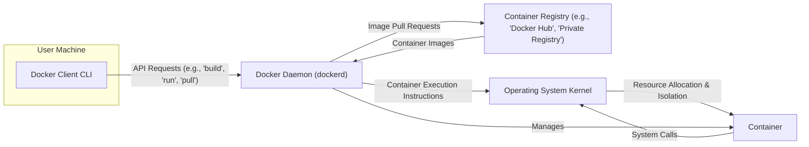

# Project Design Document: Moby (Docker) for Threat Modeling

**Version:** 1.1
**Date:** October 26, 2023
**Author:** AI Software Architect

## 1. Introduction

This document provides an enhanced architectural overview of the Moby project (commonly known as Docker), specifically tailored for threat modeling activities. It details the core components, their interactions, and the flow of data within the system, with a strong emphasis on security-relevant aspects. This document serves as a crucial resource for security professionals to proactively identify potential vulnerabilities and design effective mitigation strategies.

## 2. Goals and Objectives

The primary goal of this document is to provide a comprehensive and security-focused description of the Moby architecture to facilitate thorough threat modeling. Specific objectives include:

*   Clearly identifying the major components of the Moby system and their security responsibilities.
*   Precisely describing the interactions and communication pathways between these components, highlighting potential attack surfaces.
*   Detailing the data flows within the system, including the types of data transmitted and their sensitivity.
*   Explicitly outlining potential trust boundaries and security-sensitive areas requiring careful consideration.
*   Providing a clear and informative visual representation of the architecture to aid understanding.

## 3. High-Level Architecture

The Moby project employs a client-server architecture with several interconnected components that enable the building, distribution, and execution of containerized applications.

### 3.1. Architectural Diagram

### 3.2. Key Components

*   **Docker Client CLI:** The command-line interface utilized by users to interact with the Docker daemon. It translates user commands into Docker API requests and transmits them to the daemon.
*   **Docker Daemon (dockerd):** A persistent background process responsible for managing Docker images, containers, networks, and storage volumes. It listens for Docker API requests (typically over a local socket or a network interface) and executes the corresponding actions.
*   **Container Registry:** A service that stores and distributes Docker images. These registries can be public (e.g., Docker Hub) or private, often requiring authentication for access.
*   **Container:** A runnable instance of a Docker image. It encapsulates an application and its dependencies, isolated from other containers and the host system through kernel features.
*   **Operating System Kernel:** The core of the host operating system, providing the fundamental mechanisms for resource management and isolation that underpin containerization (e.g., namespaces, cgroups).

## 4. Component Details

### 4.1. Docker Client CLI

*   **Functionality:**
    *   Provides a user-friendly command-line interface for interacting with the Docker system.
    *   Translates user commands into structured Docker API requests (typically HTTP-based).
    *   Communicates with the Docker daemon, usually over a local Unix socket or a network socket (potentially secured with TLS).
    *   Receives and displays responses from the Docker daemon to the user.
*   **Security Considerations:**
    *   Authentication of the user interacting with the CLI (often relies on local user credentials or client certificates).
    *   Authorization to perform specific actions on the Docker daemon.
    *   Risk of command injection vulnerabilities if user input processed by the daemon is not properly sanitized.
    *   Exposure of sensitive information (e.g., credentials) if the client machine is compromised.

### 4.2. Docker Daemon (dockerd)

*   **Functionality:**
    *   Listens for Docker API requests on a configured interface (e.g., Unix socket, TCP port).
    *   Manages container images: pulling from registries, building from Dockerfiles, storing locally.
    *   Creates, starts, stops, and manages the lifecycle of containers.
    *   Configures and manages networking for containers, including virtual networks and port mappings.
    *   Manages storage volumes used by containers.
    *   Interacts directly with the operating system kernel to provision and manage container resources (namespaces, cgroups).
*   **Security Considerations:**
    *   Robust authentication and authorization mechanisms for API requests are crucial to prevent unauthorized control.
    *   Secure handling of container images to prevent the execution of malicious or compromised images (e.g., image signature verification).
    *   Strict enforcement of container isolation to prevent container escape and resource abuse by malicious containers.
    *   Secure management of networking and storage resources to prevent unauthorized access or data breaches.
    *   The daemon itself is a critical component; vulnerabilities in the daemon can have widespread impact.
    *   Proper configuration of security features like AppArmor or SELinux profiles for containers.

### 4.3. Container Registry

*   **Functionality:**
    *   Serves as a repository for storing and distributing Docker images.
    *   Provides an API (typically HTTP-based) for pushing and pulling images.
    *   Often includes features like user authentication, authorization, and image access control.
    *   May offer additional security features like vulnerability scanning of images and content trust mechanisms.
*   **Security Considerations:**
    *   Strong authentication and authorization are essential to control access to images.
    *   Ensuring the integrity of images to prevent tampering or the introduction of malware.
    *   Vulnerability scanning of images to identify and mitigate known security weaknesses.
    *   Protection against denial-of-service attacks targeting the registry service.
    *   Secure storage of image layers and metadata.

### 4.4. Container

*   **Functionality:**
    *   Executes an application and its dependencies within an isolated environment provided by the operating system kernel.
    *   Utilizes kernel features like namespaces (for process, network, mount, etc. isolation) and cgroups (for resource limitation).
    *   Interacts with the host operating system through system calls, which are subject to kernel security policies.
*   **Security Considerations:**
    *   The security of the application running within the container is paramount.
    *   Configuration of container isolation settings (e.g., user namespaces for rootless containers, seccomp profiles to restrict system calls).
    *   Resource limits (CPU, memory, etc.) to prevent resource exhaustion on the host system.
    *   Potential for container escape vulnerabilities if kernel isolation mechanisms are flawed or misconfigured.
    *   Secure handling of secrets and sensitive data within the container.

### 4.5. Operating System Kernel

*   **Functionality:**
    *   Provides the fundamental infrastructure for running containers, including namespaces and cgroups.
    *   Enforces isolation between containers, preventing them from interfering with each other or the host system.
    *   Manages system resources (CPU, memory, network, storage) allocated to containers.
    *   Handles system calls originating from containers, enforcing security policies.
*   **Security Considerations:**
    *   Kernel vulnerabilities can directly impact container security, potentially leading to container escape or host compromise.
    *   Proper configuration and patching of the kernel are crucial for maintaining a secure container environment.
    *   The security features of the kernel (e.g., SELinux, AppArmor) play a vital role in enforcing container isolation.

## 5. Data Flow

Understanding the data flow within the Moby ecosystem is critical for identifying potential data breaches or manipulation points.

*   **Image Pull Operation:**
    1. The user initiates an `docker pull <image_name>` command via the **Docker Client CLI**.
    2. The **Docker Client CLI** sends an API request to the **Docker Daemon**. This request includes the image name and potentially authentication credentials for the registry.
    3. The **Docker Daemon** contacts the specified **Container Registry**. This communication involves authentication and authorization checks.
    4. The **Container Registry** authenticates the request and, if authorized, provides the container image layers (typically as compressed archives).
    5. The **Docker Daemon** downloads and stores the image layers locally.
    6. The **Docker Daemon** informs the **Docker Client CLI** of the successful image pull. **Data Transferred:** Container image layers, authentication tokens.

*   **Container Run Operation:**
    1. The user initiates an `docker run <image_name>` command via the **Docker Client CLI**.
    2. The **Docker Client CLI** sends a run request to the **Docker Daemon**, including container configuration parameters (e.g., port mappings, volume mounts).
    3. The **Docker Daemon** retrieves the specified image from its local storage.
    4. The **Docker Daemon** interacts with the **Operating System Kernel** to create a new container instance with the requested isolation settings (namespaces, cgroups).
    5. The application within the **Container** starts executing. **Data Transferred:** Container configuration, application data within the container.

*   **Image Build Operation:**
    1. The user initiates an `docker build` command via the **Docker Client CLI**, providing a Dockerfile and build context.
    2. The **Docker Client CLI** sends the build context (Dockerfile and related files) to the **Docker Daemon**.
    3. The **Docker Daemon** executes the instructions in the Dockerfile, potentially pulling base images from a **Container Registry**.
    4. The **Docker Daemon** creates new image layers based on the Dockerfile instructions.
    5. The **Docker Daemon** stores the newly built image locally. **Data Transferred:** Dockerfile, build context, base image layers.

*   **Image Push Operation:**
    1. The user initiates an `docker push <image_name>` command via the **Docker Client CLI**.
    2. The **Docker Client CLI** sends a push request to the **Docker Daemon**, including authentication credentials for the registry.
    3. The **Docker Daemon** contacts the specified **Container Registry**.
    4. The **Container Registry** authenticates the request.
    5. The **Docker Daemon** uploads the image layers to the **Container Registry**.
    6. The **Container Registry** stores the image. **Data Transferred:** Container image layers, authentication tokens.

## 6. Trust Boundaries

Clearly defining trust boundaries helps identify areas where security controls are critical. Key trust boundaries in the Moby architecture include:

*   **User Machine <-> Docker Daemon:** The communication channel between the potentially untrusted user environment and the privileged Docker Daemon. The daemon must authenticate and authorize all requests from the client.
*   **Docker Daemon <-> Container Registry:** The interaction for pulling images from and pushing images to registries. The daemon must trust the registry to provide legitimate and uncompromised images and the registry must trust the daemon's identity during push operations.
*   **Docker Daemon <-> Container:** The boundary between the managed environment of the daemon and the isolated environment of the container. The daemon is responsible for enforcing isolation and must not allow containers to escape their boundaries.
*   **Container <-> Operating System Kernel:** The interface through which containers make system calls. The kernel must enforce security policies and prevent containers from performing unauthorized actions.

## 7. Security Considerations (Pre-Threat Modeling)

These are inherent security aspects to consider before a formal threat modeling exercise:

*   **Image Security:** Ensuring the integrity and safety of container images is paramount. This includes verifying image signatures, scanning for vulnerabilities, and using trusted base images.
*   **Container Isolation:** Proper configuration and enforcement of container isolation mechanisms (namespaces, cgroups, seccomp, AppArmor/SELinux) are critical to prevent container escape and resource abuse.
*   **Docker API Security:** Securing the Docker API (both local socket and remote access) is essential to prevent unauthorized access and control of the Docker daemon. This includes using TLS and strong authentication/authorization.
*   **Network Security:** Securely configuring container networking is important to prevent unauthorized access to and from containers. This involves using network policies, firewalls, and potentially overlay networks.
*   **Resource Management:** Properly managing container resources (CPU, memory, storage) prevents denial-of-service scenarios and resource exhaustion on the host.
*   **Supply Chain Security:**  The security of the entire container supply chain, from image creation to deployment, needs to be considered. This includes securing the build process and the registries used.
*   **Secret Management:** Securely managing secrets (passwords, API keys, etc.) used by containers is crucial. Avoid embedding secrets in images and use dedicated secret management solutions.
*   **Logging and Auditing:** Implementing comprehensive logging and auditing of Docker events is essential for security monitoring and incident response.

## 8. Potential Attack Vectors

Understanding potential attack vectors helps focus threat modeling efforts:

*   **Malicious Images:** Attackers could distribute compromised container images through public or private registries.
*   **Container Escape:** Vulnerabilities in the container runtime or kernel could allow attackers to break out of container isolation and gain access to the host system.
*   **API Exploitation:** Unsecured or vulnerable Docker APIs could be exploited to gain unauthorized control of the daemon.
*   **Denial of Service:** Attackers could attempt to overwhelm the Docker daemon or container registry with requests, causing service disruption.
*   **Man-in-the-Middle Attacks:** If communication channels are not properly secured (e.g., no TLS), attackers could intercept sensitive data.
*   **Privilege Escalation:** Attackers within a container could attempt to escalate their privileges to gain root access on the host.
*   **Supply Chain Compromise:** Attackers could compromise the tools or processes used to build container images, injecting malicious code.

## 9. Assumptions and Constraints

*   This document provides a general architectural overview and may not cover all specific configurations or extensions of the Moby project.
*   The security considerations outlined are not exhaustive and should be further explored during a dedicated threat modeling exercise.
*   The architecture described represents a common deployment model; variations may exist in specific environments.

## 10. Next Steps

Following this design document, the next crucial steps for enhancing the security of the Moby project involve:

*   **Conducting a thorough threat modeling exercise:** Utilize this document as a basis to identify specific threats, vulnerabilities, and attack vectors relevant to the Moby deployment.
*   **Developing and implementing mitigation strategies:** Based on the identified threats, design and implement appropriate security controls and countermeasures.
*   **Performing security testing and vulnerability assessments:** Regularly test the Moby environment for vulnerabilities and misconfigurations.
*   **Establishing secure development practices:** Implement secure coding practices and security reviews for any custom components or extensions.
*   **Implementing robust monitoring and logging:** Set up comprehensive monitoring and logging to detect and respond to security incidents.
*   **Regularly reviewing and updating the threat model and security controls:** The threat landscape is constantly evolving, so continuous review and adaptation are essential.