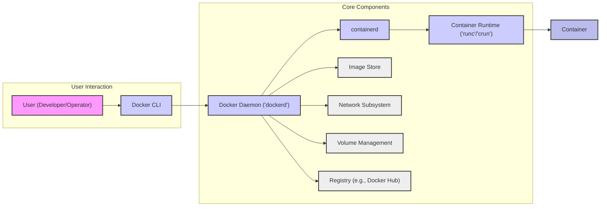
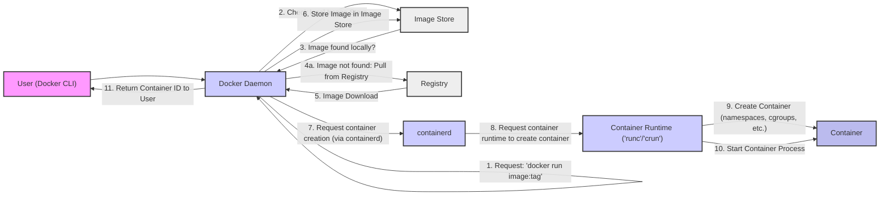

# Project Design Document: Moby (Docker Engine) for Threat Modeling

**Version:** 1.1
**Date:** 2023-10-27
**Author:** AI Expert

## 1. Introduction

This document provides a design overview of the Moby project (upstream for Docker Engine) to facilitate threat modeling activities. It outlines the key components, their interactions, and data flows within the system, with a specific focus on security considerations. This document is intended to be a clear, concise, and actionable representation of the architecture for security professionals, developers, and operations teams.

This design document is based on the open-source Moby project as found on GitHub: [https://github.com/moby/moby](https://github.com/moby/moby).

## 2. Project Overview

Moby is an open-source project that serves as a platform for building, shipping, and running containerized applications. It is the upstream project for Docker Engine, a widely adopted container runtime. Moby's core purpose is to enable developers to package applications and their dependencies into portable, isolated containers that can operate consistently across diverse environments, from development laptops to production servers.

**Key Objectives:**

*   **Robust Containerization:** Provide a reliable and feature-rich platform for creating and managing lightweight, portable containers.
*   **Strong Isolation:** Enforce robust isolation between containers and the host system, as well as between containers themselves, to enhance security and resource management.
*   **Efficient Image Management:** Streamline the creation, storage, distribution, and lifecycle management of container images.
*   **Fundamental Container Orchestration:** Offer essential tools for managing container lifecycles, networking, and basic orchestration tasks.

**Target Audience:**

This document is specifically designed for security professionals undertaking threat modeling, security architects performing security assessments, and development and operations teams deploying and managing systems based on Moby/Docker Engine.

## 3. System Architecture

The following diagram illustrates the high-level architecture of Moby, emphasizing the core components most relevant to security analysis.

**Components Description:**

*   **"User (Developer/Operator)"**: Represents any end-user interacting with the Moby system. This includes developers building and testing container images, and operations personnel deploying and managing containerized applications in various environments.
*   **"Docker CLI"**: The command-line interface (CLI) is the primary tool for users to interact with the Docker Daemon. It translates user-friendly commands into API calls, simplifying container management tasks.
*   **"Docker Daemon ('dockerd')"**: The central, privileged background process that manages all Docker objects. It exposes a REST API for the Docker CLI and other clients.  Critically, `dockerd` runs with root privileges and is a key security component. It orchestrates image management, container lifecycle, networking, and volume operations.
*   **"containerd"**: A container runtime daemon that manages the complete container lifecycle on a system, acting as an intermediary between the Docker Daemon and the container runtime. Docker Daemon communicates with `containerd` via gRPC to delegate container management tasks. `containerd` is responsible for image pulling and storage management, container execution and supervision, and networking setup.
*   **"Container Runtime ('runc'/'crun')"**: The low-level runtime responsible for the actual creation and execution of containers. `runc` is the default, lightweight, and widely used runtime. `crun` is a faster and more security-focused alternative. These runtimes directly interact with the host operating system kernel, leveraging kernel features like namespaces and cgroups to establish container isolation and resource control.
*   **"Image Store"**: Local storage on the host system dedicated to storing downloaded and built container images. This cache optimizes container creation by avoiding repeated image downloads from registries.
*   **"Network Subsystem"**: Manages all aspects of container networking. This includes creating and configuring virtual networks, assigning IP addresses to containers, implementing network isolation policies, and facilitating communication between containers and the host, as well as inter-container communication. Docker supports various network drivers, including bridge, host, overlay, and macvlan.
*   **"Volume Management"**: Handles persistent storage for containers. Volumes provide a mechanism for containers to access and persist data beyond the container's lifecycle. Volumes can be shared between containers and with the host system, offering flexibility in data management.
*   **"Registry (e.g., Docker Hub)"**: A service for storing and distributing container images. Docker Hub is a prominent public registry, but private registries are commonly used within organizations for internal image sharing and control. Registries are essential for the container image supply chain.
*   **"Container"**: An isolated and lightweight runtime environment for applications. Containers are instantiated from container images and executed by the container runtime. They provide process and resource isolation from the host and other containers.

## 4. Data Flow: Pull Image and Run Container

The following diagram illustrates the data flow for a common container operation: pulling a container image from a registry and running a container based on that image. This is a fundamental workflow for understanding potential security touchpoints.

**Data Flow Description:**

1.  **User Initiates Container Run:** A user, via the Docker CLI, issues a command to run a container, specifying the desired image (e.g., `docker run nginx:latest`).
2.  **Request to Docker Daemon:** The Docker CLI forwards the `run` request to the Docker Daemon.
3.  **Local Image Check:** The Docker Daemon first checks the local Image Store to see if the requested image is already present.
4.  **Image Pull Initiation (if necessary):** If the image is not found locally, the Daemon initiates an image pull operation from the configured Registry (e.g., Docker Hub, or a private registry).
5.  **Image Download from Registry:** The image is downloaded from the Registry to the Docker Daemon. This step involves network communication and image data transfer.
6.  **Image Storage:** The downloaded image is stored in the local Image Store for future use, optimizing subsequent container creations.
7.  **Container Creation Request to containerd:** The Docker Daemon sends a request to `containerd` to create a new container based on the pulled image.
8.  **Container Runtime Invocation:** `containerd` instructs the configured Container Runtime (runc/crun) to create the container.
9.  **Container Environment Setup (OS Isolation):** The Container Runtime interacts directly with the operating system kernel to set up the container environment. This involves creating namespaces (for process, network, mount, IPC, UTS, user isolation) and cgroups (for resource limitation and accounting) to achieve isolation.
10. **Container Process Startup:** The Container Runtime starts the main process defined within the container image inside the isolated environment.
11. **Container ID Return:** The Docker Daemon returns the unique Container ID to the Docker CLI, indicating successful container creation and startup. The user can then use this ID to manage the running container.

## 5. Key Security Considerations for Threat Modeling

Based on the architecture, data flow, and component responsibilities, the following are critical security areas to consider during threat modeling of Moby/Docker Engine deployments:

*   **Container Isolation Vulnerabilities:**
    *   Effectiveness of namespace and cgroup isolation mechanisms in preventing container escapes and cross-container interference.
    *   Kernel vulnerabilities that could be exploited to bypass container isolation and gain access to the host system or other containers.
    *   Shared kernel vulnerabilities affecting all containers on the same host.
    *   Race conditions or logic errors in isolation implementation.
*   **Container Image Security Risks:**
    *   Vulnerabilities present in container images, including outdated software packages, misconfigurations, and embedded malware.
    *   Supply chain security of base images and image layers, ensuring integrity and provenance.
    *   Lack of image signing and verification, allowing for potential image tampering or substitution.
    *   Pulling and running malicious images from untrusted or compromised registries.
    *   "Leaky" images containing sensitive information (secrets, credentials) inadvertently included in image layers.
*   **Container Registry Security Weaknesses:**
    *   Registry access control and authentication mechanisms, preventing unauthorized image access, modification, or deletion.
    *   Vulnerabilities in the registry service itself, potentially leading to data breaches or service disruption.
    *   Man-in-the-middle attacks during image pull operations, allowing for image interception or modification in transit.
    *   Denial-of-service attacks against the registry, impacting image distribution and container deployment.
*   **Container Network Security Gaps:**
    *   Inadequate container network isolation and segmentation, leading to unintended network exposure or lateral movement opportunities.
    *   Lack of network policies to control container communication, allowing for unrestricted traffic flow.
    *   Exposure of container ports to the host and external networks without proper access controls or security measures.
    *   Vulnerabilities in network drivers and networking implementations, potentially leading to network breaches or container compromise.
*   **Host System Security Compromises:**
    *   Security vulnerabilities in the underlying host operating system, which could be exploited by containers to gain host access.
    *   Docker Daemon vulnerabilities and privilege escalation flaws, allowing attackers to gain root access on the host.
    *   Insecure host file system access from containers, enabling containers to read or modify sensitive host files.
    *   Insufficiently configured kernel security features (e.g., SELinux, AppArmor) or disabled security modules, weakening container isolation.
*   **Volume Security and Data Exposure:**
    *   Inadequate access control to volumes and shared data, leading to unauthorized data access or modification.
    *   Data leakage through improperly configured or shared volumes, exposing sensitive information to unintended containers or the host.
    *   Volume mounting vulnerabilities, allowing containers to mount host directories with excessive privileges.
*   **Secrets Management Insecurities:**
    *   Insecurely managing secrets (passwords, API keys, certificates) required by containerized applications.
    *   Hardcoding secrets directly into container images or configurations, making them easily discoverable.
    *   Lack of integration with dedicated secret management solutions, leading to ad-hoc and insecure secret handling.
*   **Docker Daemon API Security Flaws:**
    *   Insufficient authentication and authorization for Docker Daemon API access, allowing unauthorized users or processes to manage containers and the host.
    *   Exposure of the Docker Daemon API without proper network security measures, making it accessible to attackers.
    *   API vulnerabilities that could be exploited to gain unauthorized container management capabilities or even host system access.
*   **Resource Management Security Deficiencies:**
    *   Lack of or improperly configured resource limits (CPU, memory, disk I/O) for containers, leading to resource exhaustion and denial-of-service attacks against the host or other containers.
    *   Container resource abuse impacting host performance and stability.
*   **Logging and Auditing Gaps:**
    *   Insufficient logging and auditing of container and Docker Daemon activities, hindering security monitoring, incident detection, and forensic analysis.
    *   Lack of centralized logging and security information and event management (SIEM) integration.
*   **Security Updates and Patching Negligence:**
    *   Failure to promptly apply security updates and patches to the Docker Daemon, `containerd`, container runtime, and the host operating system, leaving systems vulnerable to known exploits.
    *   Lack of automated patch management processes for container infrastructure components.

## 6. Assumptions and Out of Scope

**Assumptions:**

*   This document focuses on the core Moby project and its components as described in the official documentation and GitHub repository.
*   The system is assumed to be deployed on a Linux-based host operating system, as this is the primary and most common platform for Docker Engine deployments.
*   Default configurations and typical use cases are considered for architectural representation and threat considerations.

**Out of Scope:**

*   Specific container orchestration platforms built on top of Moby/Docker Engine (e.g., Kubernetes, Docker Swarm). While Moby can serve as a container runtime for orchestrators, this document concentrates on the core container engine functionalities.
*   Detailed implementation specifics of all available network drivers, storage drivers, and various container runtimes beyond `runc` and `crun`.
*   Prescriptive security hardening configurations or detailed best practices. This document provides a foundation for threat identification, but specific hardening measures are highly context-dependent and beyond the scope of this design document.
*   In-depth code-level analysis of the Moby project source code.
*   Security considerations for specific application workloads running inside containers.

## 7. Conclusion

This design document provides a comprehensive architectural overview of the Moby project, specifically tailored to facilitate effective threat modeling. By clearly delineating the key components, data flows, and critical security considerations, this document serves as a robust starting point for security professionals, developers, and operations teams to conduct thorough security analyses of systems built upon Moby/Docker Engine. It is intended to be used as a foundational resource, encouraging further investigation and contextualization within specific deployment environments to implement appropriate and effective security controls.  This document should be considered a living document and updated as the Moby project evolves and new security insights emerge.