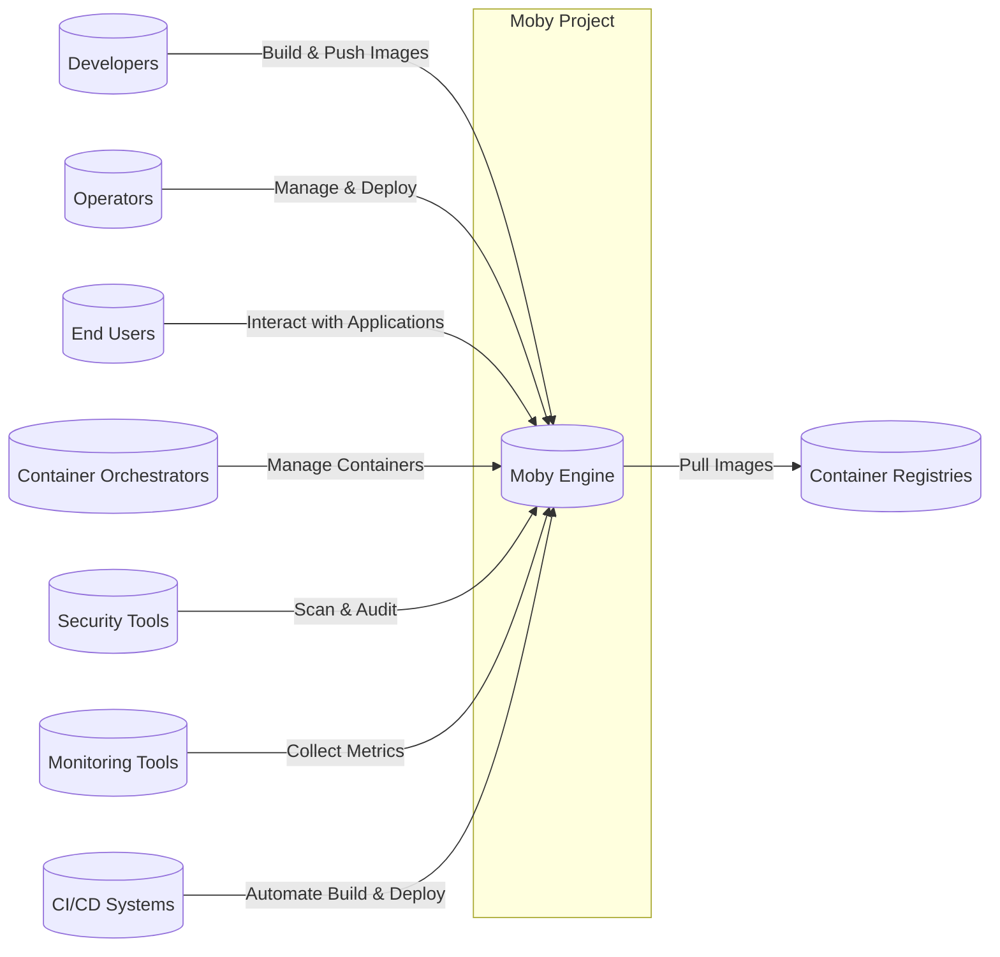
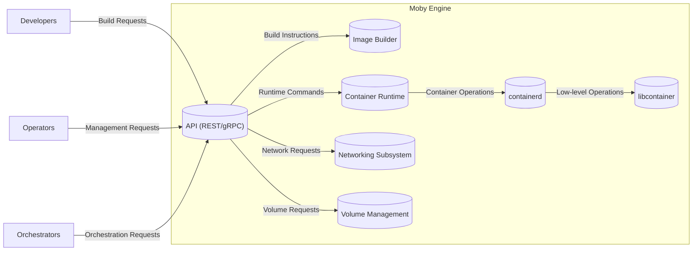
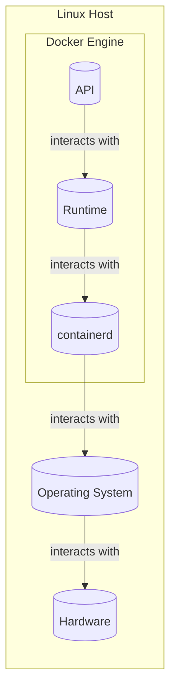
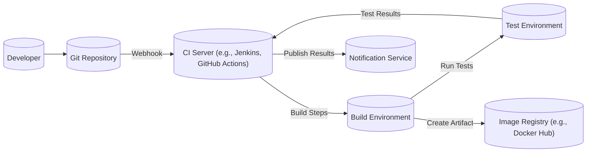

Okay, let's create a design document for the Moby project (https://github.com/moby/moby), keeping in mind its purpose and potential security concerns.

# BUSINESS POSTURE

Business Priorities and Goals:

*   Provide an open-source platform for building and running containerized applications.
*   Enable developers to package applications and their dependencies into portable, isolated containers.
*   Facilitate efficient and consistent application deployment across different environments.
*   Foster a collaborative community around containerization technology.
*   Maintain a modular and extensible architecture to support evolving containerization needs.
*   Be de facto standard for building and shipping containers.

Most Important Business Risks:

*   Security vulnerabilities in the Moby platform could lead to container escapes, host compromise, and data breaches.
*   Inability to keep pace with evolving containerization standards and technologies could lead to obsolescence.
*   Lack of adoption by developers and organizations could limit the project's impact and sustainability.
*   Competition from other containerization platforms could erode Moby's market share.
*   Legal and licensing issues related to open-source contributions could create liabilities.
*   Reputational damage due to security incidents or project mismanagement.

# SECURITY POSTURE

Existing Security Controls:

*   security control: AppArmor profiles: Used to restrict container capabilities and reduce the attack surface. (Described in documentation and implemented in the codebase).
*   security control: Seccomp profiles: Used to limit the system calls that containers can make, further enhancing isolation. (Described in documentation and implemented in the codebase).
*   security control: SELinux support: Provides an additional layer of mandatory access control (MAC) for enhanced security. (Described in documentation and implemented in the codebase).
*   security control: User namespaces: Isolates user IDs and group IDs between the host and containers, preventing privilege escalation attacks. (Described in documentation and implemented in the codebase).
*   security control: Capabilities: Fine-grained control over the privileges granted to containers, allowing for the principle of least privilege. (Described in documentation and implemented in the codebase).
*   security control: Read-only root filesystem: Prevents containers from modifying their root filesystem, mitigating the impact of potential exploits. (Described in documentation and implemented as a configuration option).
*   security control: Content Trust (Notary): Ensures that only signed and trusted images are pulled and run. (Described in documentation and implemented as a separate component).
*   security control: Secrets management: Integrations with secrets management solutions (e.g., Docker Secrets, HashiCorp Vault) to securely handle sensitive data. (Described in documentation and implemented through plugins and integrations).
*   security control: Regular security audits and vulnerability scanning: Performed by the Moby community and external security researchers. (Evidenced by public vulnerability disclosures and security advisories).
*   security control: Secure coding practices: Followed by Moby developers to minimize the introduction of vulnerabilities. (Evidenced by code reviews and contribution guidelines).

Accepted Risks:

*   accepted risk: Complexity of containerization technology: The inherent complexity of containerization introduces a large attack surface and potential for misconfiguration.
*   accepted risk: Reliance on third-party components: Moby relies on various third-party libraries and tools, which may introduce their own vulnerabilities.
*   accepted risk: Rapid pace of development: The fast-paced development of containerization technology can make it challenging to maintain a consistently high level of security.
*   accepted risk: User error: Misconfiguration of container settings or insecure application practices can compromise security.
*   accepted risk: Zero-day vulnerabilities: Unknown vulnerabilities may exist in Moby or its dependencies, which could be exploited before patches are available.

Recommended Security Controls:

*   Implement a comprehensive vulnerability management program with automated scanning and reporting.
*   Enhance security documentation and provide clear guidance on secure configuration and best practices.
*   Establish a security response team to handle vulnerability reports and coordinate security updates.
*   Conduct regular penetration testing to identify and address potential weaknesses.
*   Integrate with security information and event management (SIEM) systems for enhanced monitoring and threat detection.

Security Requirements:

*   Authentication:
    *   Secure authentication of users interacting with the Docker daemon.
    *   Support for multi-factor authentication (MFA) for enhanced security.
    *   Integration with existing identity providers (e.g., LDAP, Active Directory).
*   Authorization:
    *   Fine-grained access control to Docker resources (e.g., images, containers, networks).
    *   Role-based access control (RBAC) to manage user permissions.
    *   Ability to restrict container capabilities and privileges.
*   Input Validation:
    *   Thorough validation of all inputs to the Docker daemon and API.
    *   Protection against common injection attacks (e.g., command injection, path traversal).
    *   Secure handling of user-provided configuration files.
*   Cryptography:
    *   Use of strong cryptographic algorithms for secure communication (e.g., TLS/SSL).
    *   Secure storage of sensitive data (e.g., passwords, API keys).
    *   Support for image signing and verification to ensure integrity and authenticity.
    *   Secure generation and management of cryptographic keys.

# DESIGN

## C4 CONTEXT

Element Descriptions:

*   Element:
    *   Name: Moby Engine
    *   Type: Software System
    *   Description: The core container runtime and build system.
    *   Responsibilities: Building, running, and managing containers.
    *   Security controls: AppArmor, Seccomp, SELinux, User Namespaces, Capabilities, Read-only root filesystem, Content Trust.

*   Element:
    *   Name: Developers
    *   Type: Person
    *   Description: Individuals who create and package applications into containers.
    *   Responsibilities: Writing code, building images, pushing images to registries.
    *   Security controls: Secure coding practices, image signing.

*   Element:
    *   Name: Operators
    *   Type: Person
    *   Description: Individuals who manage and deploy containerized applications.
    *   Responsibilities: Deploying containers, configuring networks, managing resources.
    *   Security controls: Access controls, network security, monitoring.

*   Element:
    *   Name: End Users
    *   Type: Person
    *   Description: Individuals who interact with the applications running in containers.
    *   Responsibilities: Using the applications.
    *   Security controls: Application-level security controls.

*   Element:
    *   Name: Container Registries
    *   Type: Software System
    *   Description: Repositories for storing and distributing container images.
    *   Responsibilities: Storing images, providing access control, supporting image signing.
    *   Security controls: Authentication, authorization, image scanning, content trust.

*   Element:
    *   Name: Container Orchestrators
    *   Type: Software System
    *   Description: Systems for managing and scaling containerized applications (e.g., Kubernetes, Docker Swarm).
    *   Responsibilities: Scheduling containers, managing resources, providing networking.
    *   Security controls: Network policies, access controls, secrets management.

*   Element:
    *   Name: Security Tools
    *   Type: Software System
    *   Description: Tools for scanning and auditing container images and runtime environments.
    *   Responsibilities: Identifying vulnerabilities, enforcing security policies.
    *   Security controls: Vulnerability scanning, compliance checking.

*   Element:
    *   Name: Monitoring Tools
    *   Type: Software System
    *   Description: Tools for collecting metrics and logs from containers and the host system.
    *   Responsibilities: Monitoring performance, detecting anomalies, providing alerts.
    *   Security controls: Intrusion detection, anomaly detection.

*   Element:
    *   Name: CI/CD Systems
    *   Type: Software System
    *   Description: Systems for automating the build, test, and deployment of containerized applications.
    *   Responsibilities: Building images, running tests, deploying to environments.
    *   Security controls: Secure build pipelines, automated security checks.

## C4 CONTAINER

Element Descriptions:

*   Element:
    *   Name: API (REST/gRPC)
    *   Type: API
    *   Description: Interface for interacting with the Moby Engine.
    *   Responsibilities: Handling requests, validating inputs, routing commands.
    *   Security controls: Authentication, authorization, input validation, TLS/SSL.

*   Element:
    *   Name: Image Builder
    *   Type: Component
    *   Description: Component responsible for building container images.
    *   Responsibilities: Processing Dockerfiles, fetching layers, creating images.
    *   Security controls: Content trust, secure build environment.

*   Element:
    *   Name: Container Runtime
    *   Type: Component
    *   Description: Component responsible for running containers.
    *   Responsibilities: Creating containers, managing processes, enforcing isolation.
    *   Security controls: AppArmor, Seccomp, SELinux, User Namespaces, Capabilities.

*   Element:
    *   Name: Networking Subsystem
    *   Type: Component
    *   Description: Component responsible for managing container networks.
    *   Responsibilities: Creating networks, assigning IP addresses, providing DNS.
    *   Security controls: Network policies, firewall rules.

*   Element:
    *   Name: Volume Management
    *   Type: Component
    *   Description: Component responsible for managing persistent data volumes.
    *   Responsibilities: Creating volumes, mounting volumes, managing data.
    *   Security controls: Access controls, encryption.

*   Element:
    *   Name: libcontainer
    *   Type: Library
    *   Description: Low-level library for creating and managing containers.
    *   Responsibilities: Interacting with the kernel, setting up namespaces, cgroups, etc.
    *   Security controls: Kernel-level security features.

*   Element:
    *   Name: containerd
    *   Type: Daemon
    *   Description: An industry-standard container runtime.
    *   Responsibilities: Managing the complete container lifecycle of its host system, from image transfer and storage to container execution and supervision.
    *   Security controls: AppArmor, Seccomp, SELinux, User Namespaces, Capabilities.

## DEPLOYMENT

Possible Deployment Solutions:

1.  Standalone Docker Engine on a single host (Linux, Windows, macOS).
2.  Docker Swarm cluster for multi-host orchestration.
3.  Kubernetes cluster with Moby as the container runtime (via CRI-O or containerd).
4.  Cloud-based container services (e.g., AWS ECS, Azure Container Instances, Google Kubernetes Engine).

Chosen Deployment Solution (for detailed description): Standalone Docker Engine on a single Linux host.

Element Descriptions:

*   Element:
    *   Name: Linux Host
    *   Type: Server
    *   Description: A physical or virtual machine running a Linux distribution.
    *   Responsibilities: Providing the underlying infrastructure for running containers.
    *   Security controls: OS-level security hardening, firewall, intrusion detection.

*   Element:
    *   Name: Docker Engine
    *   Type: Software System
    *   Description: The Moby Engine deployed on the host.
    *   Responsibilities: Building, running, and managing containers.
    *   Security controls: AppArmor, Seccomp, SELinux, User Namespaces, Capabilities.

*   Element:
    *   Name: API
    *   Type: API
    *   Description: Interface for interacting with the Moby Engine.
    *   Responsibilities: Handling requests, validating inputs, routing commands.
    *   Security controls: Authentication, authorization, input validation, TLS/SSL.

*   Element:
    *   Name: Runtime
    *   Type: Component
    *   Description: Component responsible for running containers.
    *   Responsibilities: Creating containers, managing processes, enforcing isolation.
    *   Security controls: AppArmor, Seccomp, SELinux, User Namespaces, Capabilities.

*   Element:
    *   Name: containerd
    *   Type: Daemon
    *   Description: An industry-standard container runtime.
    *   Responsibilities: Managing the complete container lifecycle of its host system.
    *   Security controls: AppArmor, Seccomp, SELinux, User Namespaces, Capabilities.

*   Element:
    *   Name: Operating System
    *   Type: Operating System
    *   Description: The Linux kernel and userland utilities.
    *   Responsibilities: Managing hardware resources, providing system services.
    *   Security controls: Kernel security features, user access controls.

*   Element:
    *   Name: Hardware
    *   Type: Hardware
    *   Description: The physical server components (CPU, memory, storage, network).
    *   Responsibilities: Providing the physical resources for the host.
    *   Security controls: Physical security, hardware-based security features.

## BUILD

Build Process Description:

1.  Developer commits code to a Git repository.
2.  A webhook triggers the CI server (e.g., Jenkins, GitHub Actions).
3.  The CI server clones the repository and starts the build process in a dedicated build environment.
4.  Build steps include:
    *   Dependency resolution and installation.
    *   Static analysis (SAST) using tools like SonarQube or linters.
    *   Compilation of code (if applicable).
    *   Building the Docker image using a Dockerfile.
    *   Image vulnerability scanning using tools like Clair or Trivy.
5.  The built image is pushed to a container image registry (e.g., Docker Hub, private registry).
6.  Automated tests (unit, integration, system) are run in a separate test environment.
7.  Test results are reported back to the CI server.
8.  The CI server publishes build and test results to a notification service (e.g., email, Slack).

Security Controls:

*   security control: Secure build environment: Isolated and ephemeral build environments to prevent contamination.
*   security control: Dependency management: Use of trusted sources for dependencies and vulnerability scanning of dependencies.
*   security control: Static analysis (SAST): Automated code analysis to identify potential vulnerabilities.
*   security control: Image vulnerability scanning: Scanning of container images for known vulnerabilities.
*   security control: Signed commits: Ensuring the integrity and authenticity of code changes.
*   security control: Least privilege: Build agents should run with minimal necessary privileges.
*   security control: Artifact signing: Signing of build artifacts (container images) to ensure integrity and authenticity.
*   security control: Supply chain security: Using tools like in-toto or Sigstore to secure the software supply chain.

# RISK ASSESSMENT

Critical Business Processes:

*   Building container images: Ensuring the integrity and security of the image build process is crucial.
*   Running containers: Protecting the host system and other containers from malicious or compromised containers.
*   Managing container networks: Preventing unauthorized access and data breaches through container networks.
*   Storing and distributing container images: Ensuring the security and availability of container registries.

Data Sensitivity:

*   Container images: May contain sensitive data such as application code, configuration files, and credentials. Sensitivity: High.
*   Container runtime data: Includes logs, temporary files, and potentially sensitive data processed by applications. Sensitivity: Medium to High.
*   Host system data: The host operating system and its data are at risk if a container escape occurs. Sensitivity: High.
*   Network traffic: Data transmitted between containers and external systems may contain sensitive information. Sensitivity: Medium to High.

# QUESTIONS & ASSUMPTIONS

Questions:

*   What specific compliance requirements (e.g., PCI DSS, HIPAA) must Moby deployments adhere to?
*   What are the existing security policies and procedures for managing open-source contributions?
*   What is the process for handling security vulnerability reports and disclosures?
*   Are there any specific threat models or attack scenarios that have been considered for Moby?
*   What level of support and maintenance is provided for different versions of Moby?

Assumptions:

*   BUSINESS POSTURE: The Moby project prioritizes security and aims to provide a secure platform for containerization.
*   SECURITY POSTURE: The Moby community actively addresses security vulnerabilities and follows secure development practices.
*   DESIGN: The design of Moby is modular and extensible, allowing for the integration of new security features and technologies. The deployment will follow best practices for the chosen environment. The build process will incorporate security checks at multiple stages.