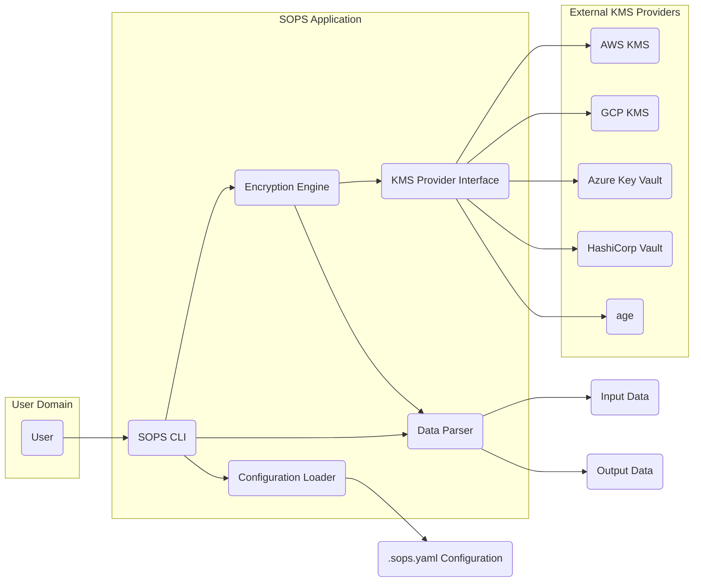
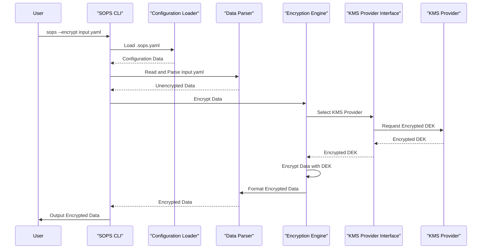
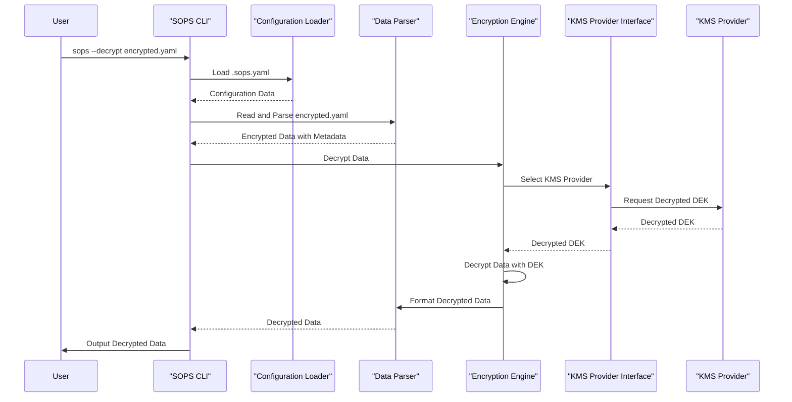

# Project Design Document: SOPS (Secrets OPerationS)

**Version:** 1.1
**Date:** October 26, 2023
**Author:** AI Software Architect

## 1. Introduction

This document provides an enhanced and detailed design overview of the SOPS (Secrets OPerationS) project, an open-source command-line tool designed for managing secrets within configuration files. The primary purpose of this document is to offer a comprehensive understanding of the system's architecture, its constituent components, and the flow of data during its operation. This detailed understanding is crucial for effectively conducting threat modeling exercises to identify potential security vulnerabilities.

## 2. Goals

*   To furnish a clear and comprehensive description of the SOPS architecture and its core functionalities.
*   To explicitly outline the various components involved in the critical processes of data encryption and decryption.
*   To meticulously detail the flow of data as it moves through the SOPS system.
*   To identify and highlight key security considerations and potential attack surfaces that are relevant to SOPS.
*   To serve as a robust and reliable foundation for subsequent threat modeling activities and security assessments.

## 3. Scope

This document comprehensively covers the essential functionalities of SOPS, including:

*   The encryption and decryption of sensitive data.
*   Seamless integration with a variety of external Key Management Services (KMS).
*   The ability to handle diverse data formats commonly used for configuration, such as YAML and JSON.
*   Configuration management through the use of `.sops.yaml` configuration files.

This document specifically excludes:

*   In-depth implementation specifics of individual KMS providers and their internal workings.
*   The functionalities and intricacies of the SOPS editor integration.
*   Detailed analysis of community contributions or external integrations beyond the core supported KMS providers.

## 4. High-Level Architecture

SOPS functions as a command-line tool that orchestrates interactions between several key components to achieve the encryption and decryption of data. The primary components are:

*   **"SOPS CLI"**: The command-line interface through which users interact with SOPS, issuing commands and providing input.
*   **"Configuration Loader"**: The module responsible for reading, parsing, and validating the `.sops.yaml` configuration file, which dictates SOPS's behavior.
*   **"Data Parser"**:  The component that handles the serialization and deserialization of data in various formats (e.g., YAML, JSON, ENV), ensuring SOPS can process different configuration file types.
*   **"Encryption Engine"**: The core logic unit that performs the actual encryption and decryption operations on the data.
*   **"KMS Provider Interface"**: An abstraction layer that provides a consistent interface for the "Encryption Engine" to interact with different KMS providers, hiding the specific implementation details of each.
*   **"KMS Provider Implementations"**: Concrete implementations of the "KMS Provider Interface" for each supported KMS provider (e.g., AWS KMS, GCP KMS, Azure Key Vault, HashiCorp Vault, age), handling the specific API calls and authentication required by each.
*   **"Input Data"**: The original, unencrypted data that needs to be protected.
*   **"Output Data"**: The resulting data after the encryption or decryption process has been completed.
*   **".sops.yaml Configuration"**: The file that defines the encryption rules, specifies which KMS providers to use, and configures key associations.

## 5. Detailed Design

### 5.1. Workflow

The fundamental workflows within SOPS are the encryption and decryption of data. These processes involve a series of well-defined steps:

#### 5.1.1. Encryption Workflow

1. The user initiates the encryption process by executing the SOPS CLI with the `sops --encrypt` command, specifying the path to the input file and potentially other relevant parameters.
2. The **"SOPS CLI"** invokes the **"Configuration Loader"** to load and parse the `.sops.yaml` configuration file. This file contains the instructions on how the encryption should be performed.
3. The **"Configuration Loader"** analyzes the configuration to determine the appropriate KMS provider(s) to use and the specific encryption rules that apply to the input data.
4. The **"Data Parser"** reads and parses the **"Input Data"** file, converting it into an internal representation that SOPS can work with.
5. The **"Encryption Engine"** iterates through the data, and based on the rules defined in the configuration, selects the relevant KMS provider through the **"KMS Provider Interface"**.
6. The **"KMS Provider Implementation"** for the chosen KMS interacts with the external KMS service to encrypt the Data Encryption Key (DEK). The DEK is a symmetric key used to encrypt the actual data.
7. The **"Encryption Engine"** then uses the generated DEK to encrypt the **"Input Data"**.
8. The **"Data Parser"** formats the encrypted data, including metadata about the encryption process (such as the encrypted DEK and information about the KMS used).
9. Finally, the **"SOPS CLI"** writes the **"Output Data"** (the encrypted data) to the specified output file or to standard output.

#### 5.1.2. Decryption Workflow

1. The user initiates the decryption process by executing the SOPS CLI with the `sops --decrypt` command, specifying the path to the encrypted input file.
2. The **"SOPS CLI"** uses the **"Configuration Loader"** to load the `.sops.yaml` file. While less critical for the core decryption process itself, it might be used for validation or other auxiliary tasks.
3. The **"Data Parser"** reads and parses the **"Input Data"** (the encrypted data file). This file contains the encrypted data as well as metadata about how it was encrypted.
4. The **"Encryption Engine"** extracts the necessary information from the metadata, including details about the KMS provider used for encryption and the encrypted DEK.
5. The **"Encryption Engine"** selects the appropriate KMS provider through the **"KMS Provider Interface"** based on the metadata.
6. The **"KMS Provider Implementation"** for the identified KMS interacts with the external KMS service to decrypt the DEK. This step typically involves authentication and authorization checks to ensure the user has the necessary permissions to decrypt the key.
7. Once the DEK is successfully decrypted, the **"Encryption Engine"** uses it to decrypt the actual encrypted data.
8. The **"Data Parser"** formats the decrypted data back into its original structure.
9. The **"SOPS CLI"** writes the **"Output Data"** (the decrypted data) to the specified output file or to standard output.

### 5.2. Data Flow

The movement and transformation of data within SOPS can be described as follows:

*   **"Unencrypted Data Input"**: The process begins with the user providing unencrypted data, typically in a structured format like YAML or JSON.
*   **"Configuration Loading"**: The `.sops.yaml` file is loaded and parsed, providing the necessary instructions for the encryption or decryption process.
*   **"Encryption Process"**:
    *   The **"Input Data"** is parsed by the **"Data Parser"**.
    *   A Data Encryption Key (DEK) is generated by the **"Encryption Engine"**.
    *   The DEK is encrypted using the Key Encryption Key (KEK) retrieved from the configured KMS provider.
    *   The original data is encrypted using the generated DEK.
    *   The encrypted data, along with the encrypted DEK and metadata about the encryption, are combined.
*   **"Decryption Process"**:
    *   The encrypted data is parsed by the **"Data Parser"**.
    *   The encrypted DEK is extracted from the metadata.
    *   SOPS communicates with the appropriate KMS provider to decrypt the DEK using the KEK.
    *   The decrypted DEK is used to decrypt the actual encrypted data.
*   **"Decrypted Data Output"**: The final output is the decrypted data, presented in its original format.

### 5.3. Key Management

SOPS's security model heavily relies on the robust key management capabilities of external KMS providers.

*   **"KEK Management"**: The lifecycle management of Key Encryption Keys (KEKs), including generation, rotation, access control policies, and auditing, is the responsibility of the chosen KMS provider (e.g., AWS KMS, GCP KMS). SOPS leverages these existing mechanisms.
*   **"DEK Generation"**: SOPS is responsible for generating Data Encryption Keys (DEKs). These are typically generated locally by the SOPS client during the encryption process.
*   **"DEK Encryption"**: The generated DEK is encrypted using the KEK provided by the configured KMS provider before being stored. This ensures that the DEK itself is protected.
*   **"DEK Storage"**: The encrypted DEK is stored alongside the encrypted data. This is often embedded as metadata within the encrypted file itself, allowing SOPS to retrieve it during decryption.
*   **"DEK Decryption"**: During decryption, SOPS retrieves the encrypted DEK from the encrypted data and uses the configured KMS provider to decrypt it, requiring appropriate authorization.

### 5.4. Configuration Management

The `.sops.yaml` file plays a central role in configuring SOPS's behavior. It defines:

*   **"Encryption Rules"**: These rules specify which parts of the data should be encrypted and which KMS provider should be used for specific data paths or file types, allowing for granular control over encryption.
*   **"KMS Provider Configuration"**: This section contains the necessary details for SOPS to authenticate and authorize access to the configured KMS providers. This might include AWS regions, GCP project IDs, or Azure Key Vault names.
*   **"Key Identifiers"**: References to the specific KEKs within the KMS providers that should be used for encryption.
*   **"PGP Key Support (Legacy)"**: While less frequently used now, `.sops.yaml` can still define PGP keys for encryption, offering an alternative to KMS-based encryption.

## 6. Security Considerations

Several security aspects are crucial for the secure operation of SOPS:

*   **Authentication and Authorization**:
    *   SOPS relies entirely on the authentication and authorization mechanisms provided by the underlying KMS providers. Properly configured IAM roles, policies, and access controls within the KMS are paramount to restrict access to KEKs.
    *   Access to the `.sops.yaml` file must be strictly controlled, as it contains sensitive configuration information, including details about KMS providers and potentially key identifiers.
    *   The security of the environment where SOPS is executed, especially the user's credentials used to access KMS providers, is critical. Compromised credentials can lead to unauthorized decryption.
*   **Encryption Strength**:
    *   SOPS itself utilizes strong encryption algorithms. The actual strength of the encryption depends on the specific algorithms and key sizes supported and configured within the chosen KMS provider.
    *   The overall security of the encrypted data is fundamentally tied to the security and robustness of the KEKs managed by the KMS provider.
*   **Key Management Security**:
    *   The security of the KEKs is the most critical security consideration. Any compromise of the KEKs would render all data encrypted with them vulnerable to decryption.
    *   Implementing and enforcing proper key rotation policies within the KMS provider is essential to limit the impact of potential key compromise.
    *   Enabling and regularly reviewing audit logs provided by the KMS provider is crucial for detecting any unauthorized access or usage of KEKs.
*   **Data Integrity**:
    *   SOPS helps ensure data integrity by including metadata about the encryption process within the encrypted output. Any unauthorized modification of the encrypted data is likely to cause decryption failures, indicating tampering.
*   **Secrets in Transit**:
    *   All communication between SOPS and the KMS providers should be conducted over secure channels using TLS/HTTPS to protect the confidentiality and integrity of the exchanged data, including the DEK.
*   **Local Machine Security**:
    *   The security posture of the machine where SOPS is run is important. If this machine is compromised, an attacker might be able to intercept decrypted secrets or gain access to KMS credentials stored or used on the machine.
*   **Configuration File Security**:
    *   The `.sops.yaml` file should be treated as highly sensitive data and stored securely, as it reveals encryption configurations and KMS provider details.
*   **Supply Chain Security**:
    *   Verifying the integrity of the SOPS binary and its dependencies is crucial to prevent supply chain attacks where malicious code might be introduced into the SOPS tool itself.

## 7. Deployment Considerations

SOPS is a versatile tool that can be deployed in various environments:

*   **Local Development Environments**: Developers commonly use SOPS on their local machines to encrypt secrets within configuration files before committing them to version control systems, preventing accidental exposure of sensitive information.
*   **CI/CD Pipelines**: SOPS can be seamlessly integrated into Continuous Integration and Continuous Deployment (CI/CD) pipelines to automate the decryption of secrets at runtime during the deployment process. This requires the CI/CD environment to be configured with the necessary credentials to access the designated KMS providers.
*   **Server Environments**: SOPS can be utilized directly on server environments to manage secrets for applications running on those servers. In such scenarios, securely managing the KMS credentials on the server is of paramount importance.

## 8. Future Considerations

Potential future enhancements and areas for development in SOPS include:

*   Expanding integration to support a wider range of KMS providers and secret management solutions.
*   Improving error handling mechanisms and providing more detailed and actionable logging information.
*   Implementing more fine-grained control over encryption rules, allowing for more complex and nuanced encryption configurations.
*   Exploring the development of a more user-friendly interface beyond the command-line interface, potentially a graphical user interface or a web-based interface.

This enhanced document provides a more detailed and comprehensive design overview of the SOPS project, with a strong focus on aspects relevant to threat modeling. A thorough understanding of SOPS's architecture, data flow, and security considerations is essential for security professionals to effectively identify potential vulnerabilities and develop appropriate mitigation strategies to ensure the secure management of secrets.