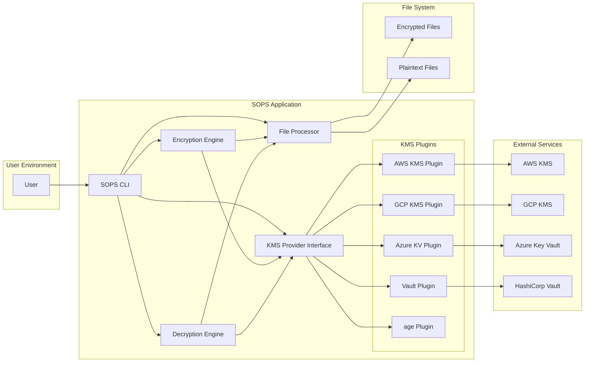
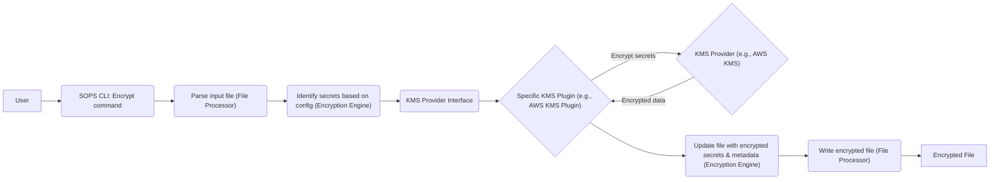
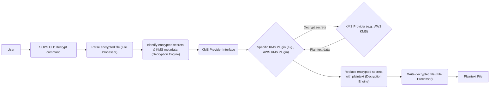

# Project Design Document: SOPS (Secrets OPerationS)

**Project Repository:** https://github.com/mozilla/sops

**Version:** 1.1
**Date:** October 26, 2023
**Author:** AI Software Architect

## 1. Introduction

This document provides an enhanced design overview of the SOPS (Secrets OPerationS) project. SOPS, developed by Mozilla, is a crucial open-source tool for managing sensitive information by encrypting secrets directly within files. This allows for the secure co-location of secrets with application code and configuration in version control systems. The design emphasizes flexibility through its support for various Key Management Service (KMS) providers. This document aims to provide a comprehensive understanding of SOPS's architecture, operational flow, and security considerations, serving as a solid foundation for subsequent threat modeling activities.

## 2. Goals

* **Robust Secret Management:** Facilitate the secure storage and management of application secrets within version control, reducing the risk of exposure.
* **Broad KMS Provider Compatibility:** Offer seamless integration with a diverse range of KMS providers, including AWS KMS, Google Cloud KMS, Azure Key Vault, HashiCorp Vault, and age, providing users with flexibility and avoiding vendor lock-in.
* **Versatile File Format Handling:**  Support commonly used configuration file formats such as YAML, JSON, ENV, INI, and DOTENV, ensuring wide applicability.
* **Intuitive User Experience:** Provide a straightforward command-line interface (CLI) for executing encryption and decryption operations, minimizing the learning curve.
* **Seamless Workflow Integration:** Enable easy integration into existing development and deployment pipelines, streamlining the secret management process.
* **Granular Access Control Enforcement:** Leverage the capabilities of the underlying KMS providers to enforce fine-grained control over who can encrypt and decrypt specific secrets.

## 3. Non-Goals

* **Real-time Secret Injection:** SOPS is primarily designed for encrypting secrets at rest within files. It does not handle the dynamic injection of secrets into running applications during runtime.
* **Comprehensive Secrets Management Platform:** SOPS focuses on file-based encryption and is not intended to be a complete secrets management platform with features like automated secret rotation, detailed audit logging beyond KMS provider logs, or centralized policy management beyond KMS capabilities.
* **Inherent Secret Generation:** SOPS is a tool for encrypting existing secrets; it does not possess the functionality to generate new secrets.

## 4. System Architecture

### 4.1. High-Level Architecture

**Components:**

* **User:** The individual or automated system interacting with SOPS to manage secrets.
* **SOPS CLI:** The command-line interface providing the primary interaction point for users.
* **Encryption Engine:** The core component responsible for the encryption logic of secrets within files.
* **Decryption Engine:** The core component responsible for the decryption logic of secrets within encrypted files.
* **File Processor:**  Handles the reading, parsing, and serialization of various supported file formats. This ensures the integrity and structure of the files are maintained during encryption and decryption.
* **KMS Provider Interface:** An abstraction layer that defines a consistent interface for interacting with different KMS providers, enabling pluggable support.
* **KMS Plugins (AWS KMS Plugin, GCP KMS Plugin, Azure KV Plugin, Vault Plugin, age Plugin):** Specific implementations of the KMS Provider Interface for each supported KMS provider, handling provider-specific authentication and API interactions.
* **External Services (AWS KMS, GCP KMS, Azure Key Vault, HashiCorp Vault):** External, managed services responsible for the secure management of cryptographic keys.
* **Encrypted Files:** Files containing secrets that have been processed by SOPS and are in an encrypted state.
* **Plaintext Files:** Files containing the original, unencrypted secrets (used as input for encryption and output after decryption).

### 4.2. Detailed Component Description

* **SOPS CLI:**
    * Accepts commands and arguments from the user, initiating encryption or decryption operations.
    * Parses configuration files (e.g., `.sops.yaml`) to determine encryption rules, KMS provider settings, and file matching patterns.
    * Orchestrates the overall encryption or decryption workflow, calling upon other components as needed.
    * Provides feedback to the user through error messages, status updates, and output formatting.

* **Encryption Engine:**
    * Receives the parsed file content from the File Processor.
    * Identifies which values within the file should be treated as secrets based on the configured rules (e.g., specific keys or patterns).
    * Utilizes the KMS Provider Interface to encrypt the identified secrets, delegating the actual cryptographic operations to the appropriate KMS plugin.
    * Updates the file content, replacing the plaintext secrets with their encrypted representations and including necessary metadata (e.g., the KMS key used, encryption algorithm).
    * Passes the modified file content to the File Processor for serialization.

* **Decryption Engine:**
    * Receives the content of an encrypted file from the File Processor.
    * Identifies the encrypted secrets and the associated KMS metadata embedded within the file.
    * Uses the KMS Provider Interface to initiate the decryption process, calling the relevant KMS plugin based on the metadata.
    * Receives the decrypted plaintext secrets from the KMS plugin.
    * Replaces the encrypted values in the file content with their corresponding plaintext values.
    * Passes the decrypted file content to the File Processor for serialization.

* **File Processor:**
    * Responsible for reading files in various supported formats (YAML, JSON, ENV, INI, DOTENV).
    * Parses the file content into a structured representation that can be easily processed by the Encryption and Decryption Engines.
    * Serializes the processed file content back into the original format after encryption or decryption.
    * Ensures that the file structure and formatting are preserved throughout the process.

* **KMS Provider Interface:**
    * Defines a set of abstract methods for interacting with KMS providers (e.g., `Encrypt`, `Decrypt`, `GetKeyArn`).
    * Allows for the addition of new KMS provider support without modifying the core SOPS logic.

* **KMS Plugins (AWS KMS Plugin, GCP KMS Plugin, Azure KV Plugin, Vault Plugin, age Plugin):**
    * Implement the KMS Provider Interface for specific KMS providers.
    * Handle authentication with the respective KMS provider using configured credentials or environment variables.
    * Translate SOPS's abstract encryption and decryption requests into API calls specific to the KMS provider.
    * Manage KMS-specific error handling and retry logic.
    * For `age`, handles local key management and cryptographic operations.

* **External Services (AWS KMS, GCP KMS, Azure Key Vault, HashiCorp Vault):**
    * Provide the underlying infrastructure for secure key management, encryption, and decryption.
    * Enforce access control policies to restrict who can use specific encryption keys.
    * Offer audit logging of key usage.

## 5. Data Flow

### 5.1. Encryption Process

**Steps:**

1. The **User** initiates the encryption process using the **SOPS CLI** with the appropriate command.
2. The **SOPS CLI** invokes the **File Processor** to read and parse the input file containing secrets.
3. The **Encryption Engine** analyzes the parsed file content and identifies the secrets to be encrypted based on the defined configuration.
4. The **Encryption Engine** interacts with the **KMS Provider Interface**.
5. The **KMS Provider Interface** selects the appropriate **Specific KMS Plugin** based on the configuration.
6. The **Specific KMS Plugin** communicates with the configured **KMS Provider** (e.g., AWS KMS, GCP KMS) to encrypt the secrets.
7. The **KMS Provider** encrypts the secrets using its managed keys and returns the encrypted data to the KMS Plugin.
8. The **Specific KMS Plugin** returns the encrypted data to the **Encryption Engine**.
9. The **Encryption Engine** updates the file content, replacing the plaintext secrets with their encrypted counterparts and adding necessary metadata (e.g., which KMS key was used).
10. The **Encryption Engine** instructs the **File Processor** to write the resulting encrypted data to a new or the same file.
11. The **Encrypted File** is stored.

### 5.2. Decryption Process

**Steps:**

1. The **User** initiates the decryption process using the **SOPS CLI** with the appropriate command.
2. The **SOPS CLI** invokes the **File Processor** to read and parse the encrypted file.
3. The **Decryption Engine** analyzes the parsed file content and identifies the encrypted secrets and the associated KMS metadata (indicating which KMS key was used for encryption).
4. The **Decryption Engine** interacts with the **KMS Provider Interface**.
5. The **KMS Provider Interface** selects the appropriate **Specific KMS Plugin** based on the metadata found in the encrypted file.
6. The **Specific KMS Plugin** communicates with the corresponding **KMS Provider** to decrypt the secrets.
7. The **KMS Provider** decrypts the secrets using the identified key and returns the plaintext data to the KMS Plugin.
8. The **Specific KMS Plugin** returns the decrypted data to the **Decryption Engine**.
9. The **Decryption Engine** replaces the encrypted secrets in the file content with their corresponding plaintext values.
10. The **Decryption Engine** instructs the **File Processor** to write the resulting plaintext data to a new or the same file.
11. The **Plaintext File** is available.

## 6. Security Considerations

* **KMS Provider Security:** The fundamental security of SOPS relies on the security posture of the chosen KMS provider. This includes the provider's key management practices, access control mechanisms (IAM policies, key policies), and physical security.
* **Access Control within KMS:**  Properly configuring access control policies within the KMS provider is paramount. This ensures that only authorized identities (users, roles, services) can encrypt and decrypt secrets using the designated keys.
* **Encryption in Transit to KMS:** All communication between SOPS and KMS providers must be encrypted using TLS/HTTPS to protect the confidentiality and integrity of the secrets and key material during transit.
* **Local Key Security (age):** When using the `age` provider, the security of the secrets hinges entirely on the secure generation, storage, and handling of the `age` private key. Loss or compromise of this key results in the compromise of all secrets encrypted with it.
* **SOPS Configuration Security:** The `.sops.yaml` configuration file, which dictates encryption rules and KMS provider settings, should be protected from unauthorized modification. Tampering with this file could lead to unintended encryption or decryption behavior.
* **Prevention of Secret Spillage:**  Developers and operators must be vigilant to avoid accidentally committing decrypted secrets to version control systems. Utilizing `.gitignore` effectively is crucial to prevent this.
* **Dependency Chain Security:** The security of SOPS is also dependent on the security of its third-party dependencies. Regularly updating dependencies and performing vulnerability scanning are essential practices.
* **In-Memory Secret Handling:** During the decryption process, plaintext secrets exist in the memory of the machine running SOPS. Minimizing the duration secrets reside in memory and preventing memory leaks are important security considerations. Secure coding practices should be followed to mitigate these risks.
* **Auditing and Logging:**  While SOPS itself may not provide extensive audit logs, leveraging the audit logging capabilities of the underlying KMS providers is crucial for tracking key usage and identifying potential security incidents.

## 7. Deployment Considerations

* **Installation Methods:** SOPS is typically installed as a command-line tool on developer workstations, build servers, and CI/CD agents. Installation methods include direct downloads, package managers (e.g., `brew`, `apt`), and container images.
* **KMS Provider Credential Management:** Securely managing credentials required to authenticate with the chosen KMS provider is critical. This may involve environment variables, configuration files, or integration with credential management systems.
* **Integration with Version Control Systems:** Encrypted files generated by SOPS are designed to be stored alongside code and configuration in version control systems like Git.
* **CI/CD Pipeline Integration:** SOPS can be seamlessly integrated into CI/CD pipelines to decrypt secrets at deployment time, ensuring that applications are deployed with the necessary credentials.
* **User Permissions and Roles:**  Users interacting with SOPS require appropriate permissions to access and utilize the configured KMS provider. This involves setting up appropriate IAM roles or key policies.
* **Configuration Management:** Managing the `.sops.yaml` configuration across different environments and teams requires careful planning and potentially the use of configuration management tools.

## 8. Future Considerations

* **Automated Secret Rotation:** Implementing features to automate the rotation of encryption keys used by SOPS, enhancing security by limiting the lifespan of individual keys.
* **Enhanced Error Handling and Reporting:** Providing more granular and informative error messages to assist users in troubleshooting issues.
* **Graphical User Interface (GUI):** Exploring the development of a GUI or web interface to provide a more user-friendly alternative to the command-line interface for certain tasks.
* **Integration with Secrets Management Platforms:** Investigating deeper integrations with comprehensive secrets management platforms to leverage their advanced features like centralized auditing and policy enforcement.
* **Plugin Architecture Enhancements:** Further developing the plugin architecture to facilitate easier integration of new KMS providers, secret formats, or custom encryption logic.
* **Improved Key Discovery Mechanisms:** Exploring more robust and flexible ways for SOPS to discover the appropriate KMS keys to use for encryption and decryption, potentially based on file paths or other contextual information.

This enhanced document provides a more detailed and comprehensive design overview of the SOPS project. The added clarity, expanded descriptions, and refined diagrams offer a stronger foundation for understanding the system's intricacies and will be particularly valuable for conducting a thorough threat model.