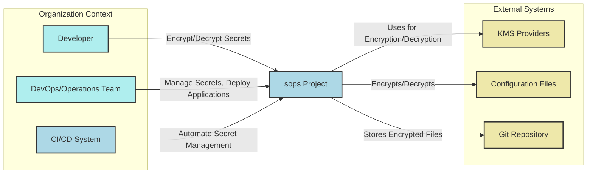
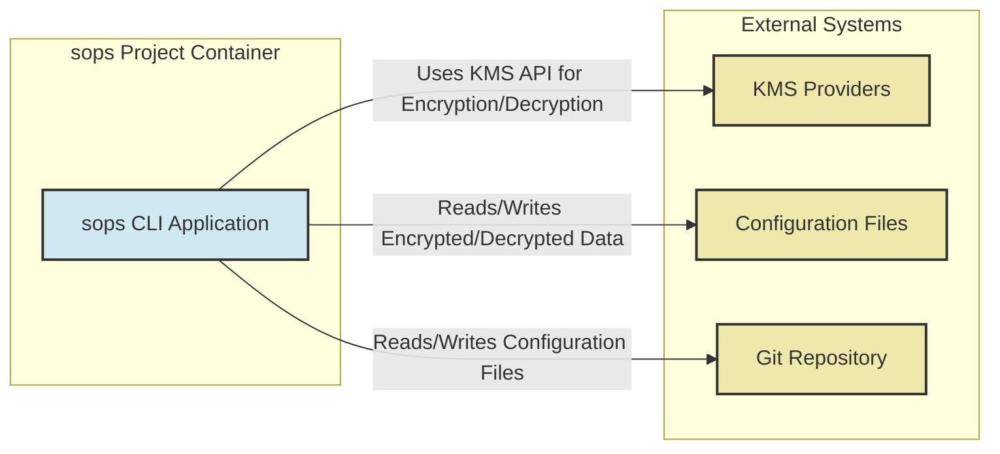
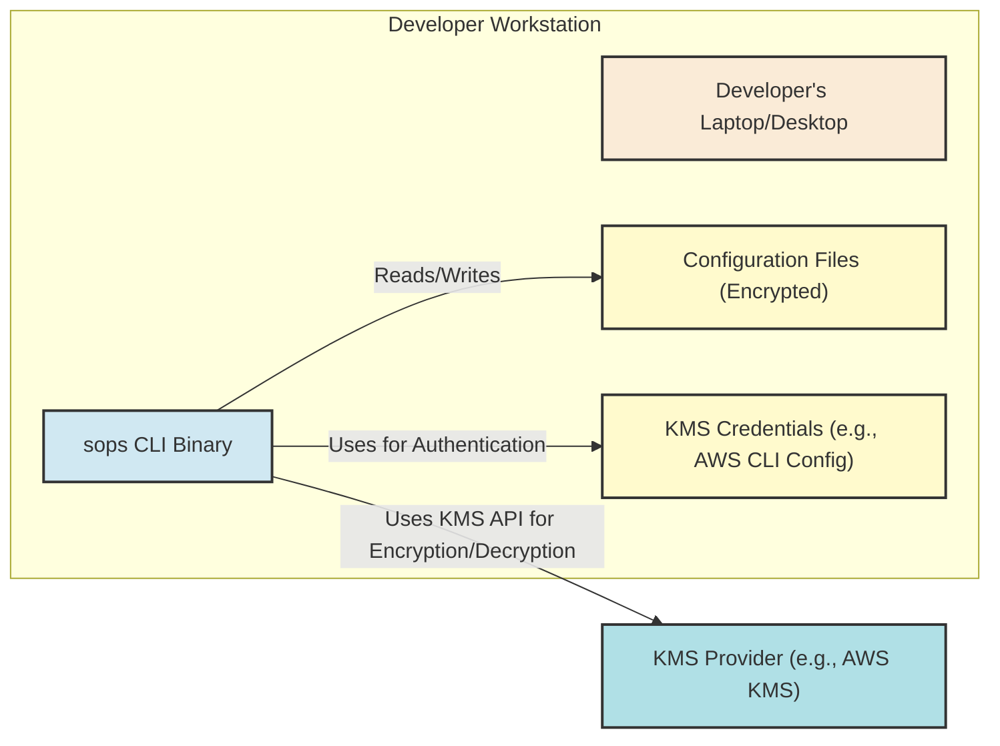

# BUSINESS POSTURE

The sops project aims to solve the problem of managing secrets in configuration files in a secure and manageable way. In modern software development and operations, sensitive information like API keys, database passwords, and certificates are often required by applications. Storing these secrets in plain text within configuration files or version control systems poses significant security risks. `sops` provides a solution by allowing users to encrypt these secrets within configuration files, ensuring that sensitive data is protected both in transit and at rest.

Business Priorities and Goals:

- Secure Secret Management: The primary goal is to enhance the security posture of applications and infrastructure by providing a robust and user-friendly way to manage secrets. This directly addresses the risk of unauthorized access to sensitive information.
- Developer Productivity: `sops` aims to integrate seamlessly into developer workflows, allowing them to manage secrets without significantly increasing complexity or hindering productivity.
- Operational Efficiency: By providing a consistent and reliable method for secret management, `sops` contributes to operational efficiency by reducing the risk of misconfiguration and security incidents related to secrets.
- Compliance and Auditability: Using `sops` helps organizations meet compliance requirements related to data protection and access control. It also improves auditability by providing a clear and controlled way to manage secrets.

Most Important Business Risks:

- Secret Leakage: Despite encryption, there's still a risk of secret leakage if `sops` itself or the underlying encryption mechanisms are compromised, or if misconfigured.
- Unauthorized Access: If access to the decryption keys or the KMS (Key Management System) is not properly controlled, unauthorized users could potentially decrypt and access secrets.
- Operational Errors: Incorrect usage of `sops`, misconfiguration of KMS providers, or improper handling of encrypted files can lead to operational errors and potential security vulnerabilities.
- Dependency on KMS Providers: `sops` relies on external KMS providers for encryption and decryption. Availability and security of these providers are critical dependencies.

# SECURITY POSTURE

Security Controls:

- security control: Encryption at rest: `sops` encrypts secrets within configuration files using strong encryption algorithms (e.g., AES-256-GCM). Implemented by `sops` core encryption logic.
- security control: Support for multiple KMS providers: `sops` integrates with various KMS providers (AWS KMS, GCP KMS, Azure Key Vault, HashiCorp Vault, age, PGP) allowing users to leverage existing key management infrastructure. Implemented by `sops` KMS provider integrations.
- security control: Access control through KMS providers: Access to decryption keys is managed by the underlying KMS providers, leveraging their IAM and access control policies. Implemented by KMS providers (AWS IAM, GCP IAM, Azure RBAC, Vault policies, etc.).
- security control: Version control integration: Encrypted files can be safely stored in version control systems, as secrets are not in plain text. Implemented by user workflows and Git/VCS systems.
- security control: Command-line interface: `sops` provides a CLI for encrypting, decrypting, and managing secrets, allowing for automation and integration into scripts. Implemented by `sops` CLI application.

Accepted Risks:

- accepted risk: Reliance on KMS provider security: The security of `sops` is inherently tied to the security of the chosen KMS provider. Compromises in the KMS provider could lead to secret exposure.
- accepted risk: User misconfiguration: Incorrect configuration of `sops` or KMS providers, or improper handling of encrypted files by users can lead to security vulnerabilities.
- accepted risk: Vulnerabilities in `sops` itself: Like any software, `sops` may contain vulnerabilities that could be exploited.
- accepted risk: Key management complexity: Managing encryption keys and access policies across different KMS providers can introduce complexity.

Recommended Security Controls:

- security control: Static Application Security Testing (SAST): Implement SAST tools in the CI/CD pipeline to automatically scan `sops` codebase for potential security vulnerabilities.
- security control: Software Composition Analysis (SCA): Utilize SCA tools to track and manage third-party dependencies used by `sops`, identifying and mitigating risks associated with vulnerable dependencies.
- security control: Regular Security Audits: Conduct periodic security audits and penetration testing of `sops` to identify and address potential security weaknesses.
- security control: Secure Software Development Lifecycle (SSDLC): Implement SSDLC practices throughout the development lifecycle of `sops`, including security reviews, threat modeling, and secure coding guidelines.
- security control: Code signing for releases: Sign `sops` releases to ensure integrity and authenticity, protecting users from tampered binaries.
- security control: Principle of least privilege: Apply the principle of least privilege when granting access to KMS keys and `sops` functionalities.

Security Requirements:

- Authentication:
  - Requirement: `sops` itself does not handle user authentication directly. Authentication is delegated to the underlying KMS providers.
  - Implementation: Users must authenticate with their chosen KMS provider (e.g., AWS IAM credentials, GCP service account keys, Azure AD credentials, Vault tokens, age keys, PGP keys) to perform encryption and decryption operations.
- Authorization:
  - Requirement: Authorization to encrypt and decrypt secrets is managed by the KMS providers. `sops` should respect and enforce the authorization policies defined in the KMS provider.
  - Implementation: `sops` relies on the KMS provider's authorization mechanisms (e.g., AWS IAM policies, GCP IAM roles, Azure RBAC roles, Vault policies, age key access control, PGP key access control) to control who can encrypt and decrypt secrets.
- Input Validation:
  - Requirement: `sops` must validate all user inputs, including file paths, file formats, KMS provider configurations, and encryption parameters, to prevent injection attacks and other input-related vulnerabilities.
  - Implementation: Input validation should be implemented throughout the `sops` codebase, especially in CLI argument parsing, file parsing, and KMS provider interaction logic.
- Cryptography:
  - Requirement: `sops` must use strong and well-vetted cryptographic algorithms and libraries for encryption and decryption. Key management practices must be secure.
  - Implementation: `sops` uses established cryptographic libraries. The choice of encryption algorithms (e.g., AES-256-GCM) should be reviewed and kept up-to-date with security best practices. Secure key handling within `sops` and its interactions with KMS providers is crucial.

# DESIGN

## C4 CONTEXT



Context Diagram Elements:

- Element:
  - Name: Developer
  - Type: Person
  - Description: Software developers who use `sops` to encrypt secrets in configuration files during development.
  - Responsibilities: Encrypting secrets before committing configuration files to version control, decrypting secrets for local development and testing.
  - Security controls: Local workstation security controls, access control to KMS provider for development keys (if applicable).

- Element:
  - Name: DevOps/Operations Team
  - Type: Person
  - Description: Operations and DevOps engineers who use `sops` to manage secrets for application deployments and infrastructure configurations.
  - Responsibilities: Managing secrets for production and staging environments, automating secret management in deployment pipelines, ensuring secure configuration of KMS providers.
  - Security controls: Access control to KMS provider for production keys, secure infrastructure for running `sops` operations, monitoring and logging of secret management activities.

- Element:
  - Name: CI/CD System
  - Type: System
  - Description: Continuous Integration and Continuous Delivery systems that integrate `sops` to automate secret management as part of the deployment pipeline.
  - Responsibilities: Automating encryption and decryption of secrets during build and deployment processes, ensuring secrets are securely injected into applications during deployment.
  - Security controls: Secure configuration of CI/CD pipelines, secure storage of KMS credentials within CI/CD environment (if needed), audit logging of secret management operations.

- Element:
  - Name: sops Project
  - Type: System
  - Description: The `sops` tool itself, a command-line utility for encrypting and decrypting secrets in various file formats using different KMS providers.
  - Responsibilities: Providing encryption and decryption functionalities, integrating with KMS providers, handling various file formats, ensuring secure cryptographic operations.
  - Security controls: Input validation, secure cryptographic implementation, dependency management, code signing for releases, security testing.

- Element:
  - Name: KMS Providers
  - Type: External System
  - Description: External Key Management System providers such as AWS KMS, GCP KMS, Azure Key Vault, HashiCorp Vault, age, PGP, used by `sops` to manage encryption keys.
  - Responsibilities: Securely storing and managing encryption keys, providing access control to keys, performing encryption and decryption operations on behalf of `sops`.
  - Security controls: KMS provider's own security controls, including physical security, access control, encryption of keys at rest, audit logging, compliance certifications.

- Element:
  - Name: Configuration Files
  - Type: External System
  - Description: Configuration files (e.g., YAML, JSON, ENV, INI, BINARY) that contain secrets and are encrypted/decrypted by `sops`.
  - Responsibilities: Storing application and infrastructure configurations, including secrets in encrypted form.
  - Security controls: File system access controls, version control system access controls, encryption of secrets within files by `sops`.

- Element:
  - Name: Git Repository
  - Type: External System
  - Description: Version control system (e.g., GitHub, GitLab, Bitbucket) used to store configuration files, including encrypted files managed by `sops`.
  - Responsibilities: Version controlling configuration files, providing a history of changes, facilitating collaboration on configuration management.
  - Security controls: Access control to the repository, branch protection, audit logging of repository access and changes.

## C4 CONTAINER



Container Diagram Elements:

- Element:
  - Name: sops CLI Application
  - Type: Container
  - Description: The `sops` command-line application, written in Go, responsible for all core functionalities of `sops`.
  - Responsibilities:
    - Parsing command-line arguments.
    - Reading and writing configuration files in various formats (YAML, JSON, ENV, INI, BINARY).
    - Integrating with different KMS providers through their APIs or SDKs.
    - Performing encryption and decryption operations using cryptographic libraries.
    - Managing key selection and encryption parameters.
  - Security controls:
    - Input validation for all CLI arguments and file inputs.
    - Secure implementation of cryptographic operations.
    - Secure handling of KMS provider credentials and API keys (passed through environment variables or configuration files, ideally not stored directly in code).
    - Dependency management and vulnerability scanning of Go dependencies.
    - Code signing of releases.

- Element:
  - Name: KMS Providers
  - Type: External System
  - Description: Same as in Context Diagram. External Key Management System providers.
  - Responsibilities: Same as in Context Diagram. Securely storing and managing encryption keys.
  - Security controls: Same as in Context Diagram. KMS provider's own security controls.

- Element:
  - Name: Configuration Files
  - Type: External System
  - Description: Same as in Context Diagram. Configuration files that contain secrets.
  - Responsibilities: Same as in Context Diagram. Storing application and infrastructure configurations.
  - Security controls: Same as in Context Diagram. File system access controls, encryption of secrets within files by `sops`.

- Element:
  - Name: Git Repository
  - Type: External System
  - Description: Same as in Context Diagram. Version control system.
  - Responsibilities: Same as in Context Diagram. Version controlling configuration files.
  - Security controls: Same as in Context Diagram. Access control to the repository.

## DEPLOYMENT

Deployment Scenario: Developer Workstation



Deployment Diagram Elements (Developer Workstation):

- Element:
  - Name: Developer's Laptop/Desktop
  - Type: Node
  - Description: The physical or virtual machine used by a developer for software development.
  - Responsibilities: Running `sops` CLI, storing configuration files, managing KMS credentials.
  - Security controls: Operating system security controls (firewall, antivirus), user authentication, disk encryption, physical security of the device.

- Element:
  - Name: sops CLI Binary
  - Type: Container
  - Description: The `sops` executable binary installed on the developer's workstation.
  - Responsibilities: Providing `sops` functionalities to the developer.
  - Security controls: Code integrity (ideally downloaded from a trusted source or built from source), file system permissions.

- Element:
  - Name: Configuration Files (Encrypted)
  - Type: File
  - Description: Configuration files containing encrypted secrets, stored on the developer's workstation.
  - Responsibilities: Persistently storing encrypted secrets.
  - Security controls: File system access controls, disk encryption of the workstation.

- Element:
  - Name: KMS Credentials (e.g., AWS CLI Config)
  - Type: File
  - Description: Files containing credentials for authenticating with the KMS provider (e.g., AWS CLI configuration files, GCP service account keys, Azure credentials, age keys, PGP keys).
  - Responsibilities: Providing authentication information to `sops` for accessing the KMS provider.
  - Security controls: File system access controls (restrict access to developer user only), secure storage of credentials (e.g., using operating system's credential manager if applicable).

- Element:
  - Name: KMS Provider (e.g., AWS KMS)
  - Type: Cloud
  - Description: External KMS provider used for key management and encryption/decryption operations.
  - Responsibilities: Securely managing encryption keys, providing encryption and decryption services.
  - Security controls: KMS provider's inherent security controls (as described in Context and Container diagrams).

## BUILD

```mermaid
flowchart LR
    A["Developer"]:::person -->|Code Commit| B["Version Control System (e.g., GitHub)"]:::vcs
    B -->|Webhook Trigger| C["CI/CD Pipeline (e.g., GitHub Actions)"]:::cicd
    C -->|Checkout Code| D["Build Environment"]:::buildenv
    D -->|Compile Code, Run Tests| E["Build Artifacts (Binaries)"]:::artifact
    E -->|Static Analysis Security Testing (SAST)| F["SAST Results"]:::results
    E -->|Software Composition Analysis (SCA)| G["SCA Results"]:::results
    E -->|Code Signing| H["Signed Binaries"]:::artifact
    H -->|Publish Release| I["Release Repository (e.g., GitHub Releases)"]:::repo

    classDef person fill:#AFEEEE,stroke:#333,stroke-width:2px
    classDef vcs fill:#ADD8E6,stroke:#333,stroke-width:2px
    classDef cicd fill:#ADD8E6,stroke:#333,stroke-width:2px
    classDef buildenv fill:#FAEBD7,stroke:#333,stroke-width:2px
    classDef artifact fill:#FFFACD,stroke:#333,stroke-width:2px
    classDef results fill:#EEE8AA,stroke:#333,stroke-width:2px
    classDef repo fill:#ADD8E6,stroke:#333,stroke-width:2px
```

Build Process Description:

1. Developer commits code changes to the Version Control System (e.g., GitHub).
2. A webhook in the Version Control System triggers the CI/CD Pipeline (e.g., GitHub Actions).
3. The CI/CD Pipeline checks out the code into a Build Environment.
4. In the Build Environment, the code is compiled, and automated tests are executed.
5. Build Artifacts (binaries for different platforms) are created.
6. Static Application Security Testing (SAST) tools are run against the codebase to identify potential security vulnerabilities.
7. Software Composition Analysis (SCA) tools are used to scan dependencies for known vulnerabilities.
8. The Build Artifacts are signed using code signing certificates to ensure integrity and authenticity.
9. Signed Binaries are published to a Release Repository (e.g., GitHub Releases) for distribution.

Build Security Controls:

- security control: Automated Build Pipeline: Using a CI/CD pipeline ensures a consistent and repeatable build process, reducing the risk of manual errors and unauthorized modifications.
- security control: Static Application Security Testing (SAST): SAST tools help identify potential security vulnerabilities in the codebase early in the development lifecycle.
- security control: Software Composition Analysis (SCA): SCA tools help manage and mitigate risks associated with third-party dependencies.
- security control: Code Signing: Signing releases ensures the integrity and authenticity of the `sops` binaries, protecting users from tampered or malicious versions.
- security control: Secure Build Environment: The build environment should be hardened and secured to prevent unauthorized access and tampering.
- security control: Access Control to CI/CD Pipeline: Access to modify and manage the CI/CD pipeline should be restricted to authorized personnel.
- security control: Dependency Management: Use dependency management tools to track and manage dependencies, and regularly update dependencies to address known vulnerabilities.

# RISK ASSESSMENT

Critical Business Processes:

- Secure Secret Management: Protecting sensitive information used by applications and infrastructure is a critical business process. Failure to manage secrets securely can lead to data breaches, service disruptions, and compliance violations.
- Software Deployment: Secure and reliable software deployment processes rely on the ability to manage secrets effectively. `sops` contributes to secure deployment by enabling the encryption of secrets in configuration files.
- Configuration Management: Managing configurations securely and consistently is essential for maintaining the stability and security of IT systems. `sops` enhances configuration management by providing a secure way to handle secrets within configurations.

Data to Protect and Sensitivity:

- Encryption Keys: Keys used to encrypt secrets are highly sensitive. Compromise of encryption keys would allow decryption of all secrets protected by those keys. Sensitivity: Critical.
- Secrets in Configuration Files: Secrets such as API keys, database passwords, certificates, and other sensitive credentials stored in configuration files. Sensitivity: High to Critical, depending on the nature of the secret.
- Audit Logs (related to secret management): Logs of secret management operations (encryption, decryption, key access) can contain sensitive information and are important for security monitoring and incident response. Sensitivity: Medium to High.

# QUESTIONS & ASSUMPTIONS

Questions:

- What is the primary target environment for `sops` usage? (e.g., cloud environments, on-premises data centers, developer workstations).
- What KMS providers are most commonly used by `sops` users?
- What is the expected scale of `sops` usage? (e.g., number of users, number of secrets managed).
- Are there specific compliance requirements that `sops` needs to adhere to? (e.g., PCI DSS, HIPAA, GDPR).
- What is the process for reporting and handling security vulnerabilities in `sops`?

Assumptions:

- BUSINESS POSTURE:
  - Security is a high priority for organizations using `sops`.
  - Organizations are seeking to improve their secret management practices.
  - Users are generally familiar with basic security concepts and the importance of secret management.

- SECURITY POSTURE:
  - Organizations using `sops` have some existing security controls in place, but are looking to enhance them specifically for secret management.
  - KMS providers are assumed to be configured and managed securely by users.
  - Users understand the shared responsibility model when using KMS providers.

- DESIGN:
  - `sops` is primarily used as a command-line tool, integrated into developer workflows and CI/CD pipelines.
  - Configuration files are stored in version control systems.
  - Users have access to and are familiar with at least one of the supported KMS providers.
  - Deployment scenarios include developer workstations, CI/CD environments, and application deployment environments.