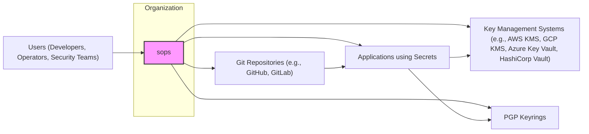

# BUSINESS POSTURE

This project, `sops` (Secrets OPerationS), addresses the critical business need for secure and manageable secrets in modern software development and operations. Managing secrets directly in code or configuration files is a significant security risk, leading to potential exposure and breaches. `sops` aims to mitigate this risk by providing a way to encrypt secrets and manage them within version control systems or other storage solutions.

Business priorities and goals that `sops` addresses:
- Secure secret management: Protecting sensitive information like API keys, passwords, and certificates from unauthorized access.
- Developer productivity: Enabling developers to manage secrets without compromising security or workflow efficiency.
- Operational efficiency: Simplifying secret deployment and management across different environments.
- Compliance and auditability: Meeting regulatory requirements and providing an auditable trail of secret management activities.

Most important business risks that need to be addressed:
- Secret leakage: Accidental exposure of secrets due to misconfiguration or vulnerabilities in `sops` or related systems.
- Unauthorized access to secrets: Individuals or systems gaining access to secrets they are not authorized to use.
- Data breaches: Compromise of systems or data due to leaked or misused secrets.
- Availability and reliability: Ensuring `sops` and the secrets management system are available when needed for application deployments and operations.
- Supply chain attacks: Compromise of the `sops` software itself, leading to malicious modifications or vulnerabilities.

# SECURITY POSTURE

Existing security controls:
- security control: Encryption of secrets using various encryption technologies (e.g., AES-256, KMS, PGP). Implemented within `sops` core encryption/decryption logic.
- security control: Access control to encrypted secrets is delegated to underlying Key Management Systems (KMS) or PGP keyrings. Implemented by KMS providers (AWS KMS, GCP KMS, Azure Key Vault, HashiCorp Vault) and PGP implementations.
- security control: Version control of encrypted secrets using Git. Implemented by Git and platforms like GitHub, GitLab, Bitbucket.

Accepted risks:
- accepted risk: Reliance on the security of underlying KMS providers or PGP implementations. Vulnerabilities in these systems could compromise `sops` security.
- accepted risk: User misconfiguration of `sops` or KMS/PGP, leading to weakened security or secret exposure.
- accepted risk: Compromise of user workstations or systems where `sops` is used, potentially exposing decrypted secrets in memory or temporary files.

Recommended security controls:
- security control: Implement automated key rotation for KMS keys and PGP keys used with `sops`.
- security control: Implement comprehensive audit logging of `sops` usage, including encryption, decryption, and key management operations.
- security control: Integrate static and dynamic application security testing (SAST/DAST) into the `sops` development lifecycle.
- security control: Implement vulnerability scanning for dependencies and runtime environment of `sops`.
- security control: Provide security training and awareness programs for `sops` users, focusing on secure configuration and best practices.

Security requirements:
- Authentication:
    - Requirement: `sops` itself does not directly handle user authentication. Authentication is delegated to the underlying KMS providers or PGP key management. Access to KMS or PGP keys should be secured and authenticated.
    - Requirement: For systems accessing decrypted secrets, appropriate authentication mechanisms must be in place to verify the identity of the system or user.
- Authorization:
    - Requirement: `sops` relies on KMS or PGP for authorization. Access control policies within KMS or PGP keyrings must be configured to ensure only authorized entities can decrypt secrets.
    - Requirement: Applications consuming secrets decrypted by `sops` must implement their own authorization mechanisms to control access to functionalities and data based on the retrieved secrets.
- Input validation:
    - Requirement: `sops` should validate input data, such as file formats, encryption parameters, and key identifiers, to prevent injection attacks or unexpected behavior.
    - Requirement: Configuration files used by `sops` should be validated against a schema to ensure proper format and prevent misconfiguration.
- Cryptography:
    - Requirement: `sops` must use strong cryptographic algorithms and libraries for encryption and decryption of secrets (e.g., AES-256, robust KMS integrations).
    - Requirement: Key management practices must adhere to security best practices, including secure key generation, storage, and rotation.
    - Requirement: Encryption at rest for secrets stored in files or repositories.
    - Requirement: Encryption in transit when secrets are transferred or accessed (although `sops` primarily deals with secrets at rest).

# DESIGN

## C4 CONTEXT



Context Diagram Elements:
- Element:
    - Name: sops
    - Type: Software System
    - Description: Secrets OPerationS (sops) is a command-line tool for encrypting and decrypting secrets. It supports various encryption key sources including KMS providers and PGP. It allows managing encrypted secrets in text files, YAML, JSON, etc.
    - Responsibilities: Encrypting and decrypting data, managing encryption keys via KMS or PGP, integrating with version control systems for secret storage.
    - Security controls: Encryption of secrets, delegation of access control to KMS/PGP, input validation.
- Element:
    - Name: Users (Developers, Operators, Security Teams)
    - Type: Person
    - Description: Individuals who use `sops` to manage secrets for applications and infrastructure.
    - Responsibilities: Using `sops` to encrypt and decrypt secrets, configuring `sops` and KMS/PGP, managing secret files in repositories.
    - Security controls: Authentication to access systems where `sops` is used, authorization to manage secrets, secure handling of decrypted secrets.
- Element:
    - Name: Git Repositories (e.g., GitHub, GitLab)
    - Type: External System
    - Description: Version control systems used to store and manage encrypted secret files.
    - Responsibilities: Storing versions of encrypted secret files, providing access control to repositories.
    - Security controls: Access control to repositories (authentication, authorization), audit logging of repository access.
- Element:
    - Name: Key Management Systems (e.g., AWS KMS, GCP KMS, Azure Key Vault, HashiCorp Vault)
    - Type: External System
    - Description: Cloud-based or on-premise services that manage encryption keys used by `sops`.
    - Responsibilities: Generating, storing, and managing encryption keys, providing access control to keys, performing encryption and decryption operations on behalf of `sops`.
    - Security controls: Key lifecycle management, access control to keys, audit logging, encryption of keys at rest.
- Element:
    - Name: PGP Keyrings
    - Type: External System
    - Description: Local or centralized storage for PGP keys used by `sops`.
    - Responsibilities: Storing PGP keys, providing access to keys for encryption and decryption.
    - Security controls: Access control to PGP keyrings, secure storage of private keys.
- Element:
    - Name: Applications using Secrets
    - Type: Software System
    - Description: Applications that require secrets managed by `sops` for configuration or operation.
    - Responsibilities: Retrieving and using decrypted secrets, securely storing and handling secrets in memory or configuration.
    - Security controls: Secure configuration management, input validation, secure coding practices, access control to application resources.

## C4 CONTAINER

```mermaid
flowchart LR
    subgraph "sops Container"
        CLI["sops CLI"]
        Config["Configuration Files"]
        Engine["Encryption/Decryption Engine"]
        KeyIntegration["Key Management Integration (KMS, PGP)"]
    end
    Users["Users (Developers, Operators, Security Teams)"]
    Git["Git Repositories"]
    KMS["Key Management Systems"]
    PGP["PGP Keyrings"]
    Applications["Applications using Secrets"]

    Users --> CLI
    CLI --> Config
    CLI --> Engine
    CLI --> KeyIntegration
    Engine --> KeyIntegration
    KeyIntegration --> KMS
    KeyIntegration --> PGP
    CLI --> Git
    Engine --> Applications
    style "sops Container" fill:#ccf,stroke:#333,stroke-width:2px
    style CLI fill:#ddf,stroke:#333,stroke-width:1px
    style Config fill:#ddf,stroke:#333,stroke-width:1px
    style Engine fill:#ddf,stroke:#333,stroke-width:1px
    style KeyIntegration fill:#ddf,stroke:#333,stroke-width:1px
```

Container Diagram Elements:
- Element:
    - Name: sops CLI
    - Type: Application
    - Description: Command-line interface for interacting with `sops`. Provides commands for encrypting, decrypting, creating, and managing secret files.
    - Responsibilities: Parsing user commands, reading configuration files, invoking encryption/decryption engine, interacting with key management integration, reading and writing secret files.
    - Security controls: Input validation of command-line arguments, secure handling of user credentials (if any), logging of user actions.
- Element:
    - Name: Configuration Files
    - Type: Data Store
    - Description: Configuration files (e.g., `.sops.yaml`) that define encryption rules, key sources, and other settings for `sops`.
    - Responsibilities: Storing configuration parameters for `sops` behavior.
    - Security controls: Access control to configuration files, validation of configuration file format and content.
- Element:
    - Name: Encryption/Decryption Engine
    - Type: Application Component
    - Description: Core component responsible for performing encryption and decryption operations using configured algorithms and keys.
    - Responsibilities: Implementing encryption and decryption algorithms, managing data formats, handling errors during encryption/decryption.
    - Security controls: Secure implementation of cryptographic algorithms, protection against side-channel attacks, memory management to prevent secret leakage.
- Element:
    - Name: Key Management Integration (KMS, PGP)
    - Type: Application Component
    - Description: Component that integrates with external Key Management Systems (KMS) and PGP keyrings to retrieve and manage encryption keys.
    - Responsibilities: Interacting with KMS APIs or PGP keyrings, handling key retrieval and storage, managing key identifiers.
    - Security controls: Secure communication with KMS providers, secure handling of KMS credentials or PGP private keys, access control to key material.

## DEPLOYMENT

Deployment Diagram for User Workstation Usage:

```mermaid
flowchart LR
    subgraph "User Workstation"
        SopsCLI["sops CLI"]
        ConfigFile["Configuration File (.sops.yaml)"]
        SecretFile["Encrypted Secret File"]
    end
    Developer["Developer"]
    GitRepo["Git Repository"]
    KMSProvider["KMS Provider (e.g., AWS KMS)"]
    PGPKeyring["PGP Keyring"]

    Developer --> SopsCLI
    SopsCLI --> ConfigFile
    SopsCLI --> SecretFile
    SopsCLI --> KMSProvider
    SopsCLI --> PGPKeyring
    SecretFile --> GitRepo
    style "User Workstation" fill:#eef,stroke:#333,stroke-width:2px
    style SopsCLI fill:#f0f0f0,stroke:#333,stroke-width:1px
    style ConfigFile fill:#f0f0f0,stroke:#333,stroke-width:1px
    style SecretFile fill:#f0f0f0,stroke:#333,stroke-width:1px
```

Deployment Diagram Elements (User Workstation):
- Element:
    - Name: User Workstation
    - Type: Environment
    - Description: Developer's local machine where `sops` is installed and used.
    - Responsibilities: Running `sops` CLI, storing configuration files, temporarily holding decrypted secrets in memory.
    - Security controls: Workstation security hardening, endpoint protection, access control to workstation, secure handling of decrypted secrets (e.g., avoiding writing to disk in plaintext).
- Element:
    - Name: sops CLI
    - Type: Software
    - Description: `sops` command-line tool installed on the user's workstation.
    - Responsibilities: Executing `sops` commands, performing encryption and decryption operations.
    - Security controls: Software integrity verification (e.g., checksum validation), regular updates to the latest version.
- Element:
    - Name: Configuration File (.sops.yaml)
    - Type: File
    - Description: `sops` configuration file stored on the workstation.
    - Responsibilities: Defining `sops` settings, encryption rules, and key sources.
    - Security controls: Access control to configuration file, secure storage on the workstation.
- Element:
    - Name: Encrypted Secret File
    - Type: File
    - Description: File containing encrypted secrets, stored on the workstation and committed to Git repositories.
    - Responsibilities: Storing encrypted secrets.
    - Security controls: Encryption at rest, access control via Git repository permissions.
- Element:
    - Name: Git Repository
    - Type: Infrastructure
    - Description: Version control repository where encrypted secret files are stored.
    - Responsibilities: Versioning and storing encrypted secret files, providing access control.
    - Security controls: Repository access control (authentication, authorization), branch protection, audit logging.
- Element:
    - Name: KMS Provider (e.g., AWS KMS) / PGP Keyring
    - Type: Infrastructure
    - Description: External KMS provider or local PGP keyring used by `sops` for key management.
    - Responsibilities: Managing encryption keys, providing access to keys for `sops`.
    - Security controls: KMS/PGP provider security controls (key management, access control, audit logging).

## BUILD

```mermaid
flowchart LR
    Developer["Developer"] --> CodeChanges["Code Changes (sops source code)"]
    CodeChanges --> GitHub["GitHub Repository"]
    GitHub --> GitHubActions["GitHub Actions CI"]
    GitHubActions --> BuildProcess["Build Process (Go build, tests, linters, SAST)"]
    BuildProcess --> BuildArtifacts["Build Artifacts (sops binaries)"]
    BuildArtifacts --> Release["Release (GitHub Releases)"]
    style GitHubActions fill:#eef,stroke:#333,stroke-width:2px
    style BuildProcess fill:#f0f0f0,stroke:#333,stroke-width:1px
    style BuildArtifacts fill:#f0f0f0,stroke:#333,stroke-width:1px
```



Build Process Description:
- Developer: Developers write and commit code changes to the `sops` GitHub repository.
- GitHub Repository: Source code repository hosted on GitHub.
- GitHub Actions CI: Continuous Integration system using GitHub Actions workflows defined in the repository.
- Build Process: Automated build process triggered by code changes. This includes:
    - Fetching dependencies.
    - Compiling Go code.
    - Running unit and integration tests.
    - Performing static analysis (linters, SAST scanners).
    - Building binaries for different platforms.
- Build Artifacts: Compiled `sops` binaries and other build outputs.
- Release: Publishing build artifacts as GitHub Releases, making them available for users to download.

Build Process Security Controls:
- security control: Secure coding practices followed by developers.
- security control: Code review process for all code changes.
- security control: Use of linters and SAST scanners in the build process to identify potential vulnerabilities.
- security control: Automated testing (unit and integration tests) to ensure code quality and security.
- security control: Dependency scanning to identify vulnerabilities in third-party libraries.
- security control: Build environment security hardening (GitHub Actions runners).
- security control: Signing of build artifacts to ensure integrity and authenticity.
- security control: Access control to GitHub repository and CI/CD pipelines.
- security control: Audit logging of build process activities.

# RISK ASSESSMENT

Critical business process we are trying to protect:
- Secure management and deployment of secrets for applications and infrastructure.
- Maintaining confidentiality, integrity, and availability of secrets.

Data we are trying to protect and their sensitivity:
- Secrets: API keys, passwords, certificates, database credentials, and other sensitive configuration data.
- Sensitivity: Highly sensitive. Exposure of these secrets can lead to unauthorized access to systems, data breaches, and significant business impact.

# QUESTIONS & ASSUMPTIONS

BUSINESS POSTURE:
- Question: What is the target user profile for `sops`? Is it primarily for startups, enterprises, or a broad range of users?
- Assumption: `sops` is intended for a wide range of users, from startups to enterprises, who need to manage secrets securely.
- Question: What are the primary use cases for `sops`? Is it mainly for application configuration, infrastructure secrets, or both?
- Assumption: `sops` is used for managing secrets for both application configuration and infrastructure.
- Question: What is the acceptable level of complexity for users to adopt and use `sops`?
- Assumption: Users are willing to invest some effort in learning and configuring `sops` to achieve a higher level of security for their secrets.

SECURITY POSTURE:
- Question: What are the common KMS providers and PGP implementations used with `sops`?
- Assumption: AWS KMS, GCP KMS, Azure Key Vault, HashiCorp Vault are the most commonly used KMS providers. GnuPG is the primary PGP implementation.
- Question: Are there any specific compliance requirements that `sops` users need to meet (e.g., PCI DSS, HIPAA, GDPR)?
- Assumption: Users may need to use `sops` to comply with various security and data privacy regulations.
- Question: What is the assumed level of security awareness among `sops` users?
- Assumption: Users have a basic understanding of security principles and best practices, but may require guidance on secure `sops` configuration and usage.

DESIGN:
- Question: What are the typical deployment environments where applications using `sops`-managed secrets are deployed (e.g., cloud, on-premise, hybrid)?
- Assumption: Applications are deployed in various environments, including cloud, on-premise, and hybrid setups.
- Question: What are the common workflows for integrating `sops` into CI/CD pipelines?
- Assumption: `sops` is often integrated into CI/CD pipelines to automate secret decryption and application deployment.
- Question: Are there any specific scalability or performance requirements for `sops`?
- Assumption: `sops` performance is generally not a critical bottleneck, as it is primarily used for secret management rather than high-throughput data processing. Scalability is more related to the number of secrets and users, which `sops` is designed to handle effectively.