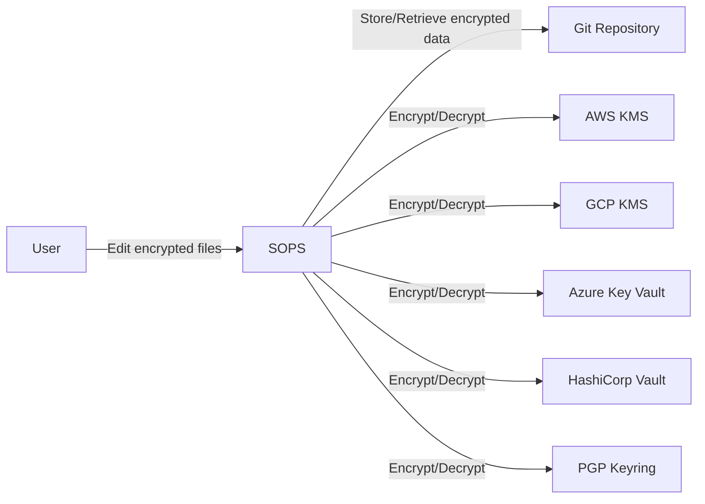
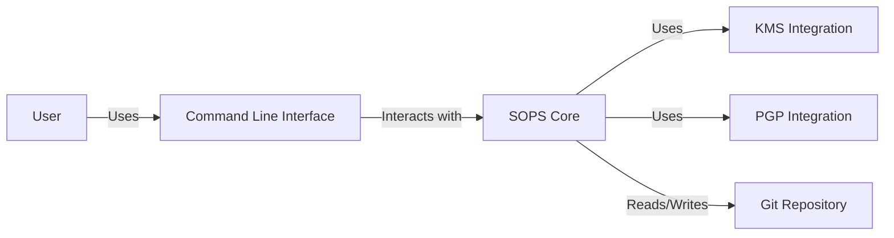
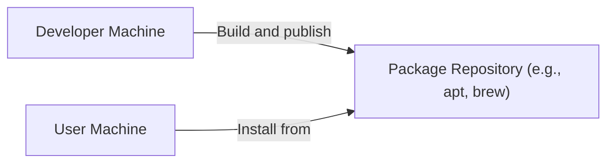
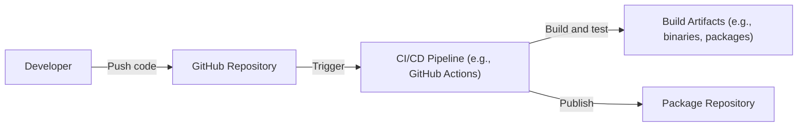

# BUSINESS POSTURE

Business Priorities and Goals:

*   Provide a user-friendly tool for managing secrets.
*   Integrate with various cloud provider key management services (KMS).
*   Ensure the security and integrity of encrypted secrets.
*   Support various data formats (YAML, JSON, ENV, binary).
*   Enable easy integration with existing workflows and tools.
*   Maintain an open-source and community-driven project.

Business Risks:

*   Compromise of encrypted secrets due to vulnerabilities in SOPS or integrated KMS.
*   Unauthorized access to secrets due to misconfiguration or weak access controls.
*   Loss of secrets due to accidental deletion or KMS unavailability.
*   Supply chain attacks targeting SOPS or its dependencies.
*   Difficulty in integrating SOPS with specific environments or workflows.
*   Lack of adoption due to complexity or usability issues.

# SECURITY POSTURE

Existing Security Controls:

*   security control: Encryption at rest using cloud provider KMS (AWS KMS, GCP KMS, Azure Key Vault, HashiCorp Vault). Implemented in SOPS core logic and documented in the README.
*   security control: Support for PGP encryption. Implemented in SOPS core logic and documented in the README.
*   security control: Data format validation (YAML, JSON, ENV, binary). Implemented in SOPS core logic.
*   security control: Version control integration (Git). Encouraged through documentation and best practices.
*   security control: Regular updates and security patches. Maintained by the Mozilla SOPS team and community contributors.

Accepted Risks:

*   accepted risk: Reliance on the security of the chosen KMS provider.
*   accepted risk: Potential for user error in managing encryption keys and configurations.
*   accepted risk: Limited protection against physical access attacks on machines where SOPS is used.

Recommended Security Controls:

*   security control: Implement regular security audits and penetration testing.
*   security control: Enforce strong password policies and multi-factor authentication for KMS access.
*   security control: Implement detailed audit logging of all SOPS operations.
*   security control: Provide clear and concise security documentation and best practices.
*   security control: Implement a robust vulnerability disclosure program.
*   security control: Integrate with security linters and static analysis tools.

Security Requirements:

*   Authentication:
    *   SOPS itself does not handle user authentication directly. It relies on the authentication mechanisms of the underlying KMS or PGP keys.
    *   Access to KMS should require strong authentication, preferably with multi-factor authentication.
    *   PGP keys should be protected with strong passphrases.

*   Authorization:
    *   SOPS relies on the authorization mechanisms of the underlying KMS.
    *   Access to secrets should be granted on a least-privilege basis.
    *   KMS policies should be carefully configured to restrict access to authorized users and services.

*   Input Validation:
    *   SOPS performs basic validation of input data formats (YAML, JSON, ENV, binary).
    *   Further validation of the content of secrets may be required depending on the application.

*   Cryptography:
    *   SOPS uses strong encryption algorithms provided by the KMS or PGP.
    *   Key management should follow best practices, including regular key rotation.
    *   Ensure that only supported and secure cryptographic algorithms are used.

# DESIGN

## C4 CONTEXT

Element Descriptions:

*   Element:
    *   Name: User
    *   Type: Person
    *   Description: A person who uses SOPS to manage secrets.
    *   Responsibilities: Editing encrypted files, managing encryption keys, configuring SOPS.
    *   Security controls: Strong passwords, multi-factor authentication (for KMS access), secure handling of PGP keys.

*   Element:
    *   Name: SOPS
    *   Type: Software System
    *   Description: Secrets OPerationS. An editor of encrypted files that transparently encrypts/decrypts data.
    *   Responsibilities: Encrypting and decrypting data, interacting with KMS and PGP, validating data formats.
    *   Security controls: Encryption at rest, data format validation, integration with KMS and PGP.

*   Element:
    *   Name: Git Repository
    *   Type: Software System
    *   Description: A version control system used to store encrypted files.
    *   Responsibilities: Storing encrypted data, tracking changes, enabling collaboration.
    *   Security controls: Access controls, audit logging, repository integrity checks.

*   Element:
    *   Name: AWS KMS
    *   Type: Software System
    *   Description: Amazon Web Services Key Management Service.
    *   Responsibilities: Managing encryption keys, performing cryptographic operations.
    *   Security controls: Strong authentication, authorization, audit logging, key rotation.

*   Element:
    *   Name: GCP KMS
    *   Type: Software System
    *   Description: Google Cloud Platform Key Management Service.
    *   Responsibilities: Managing encryption keys, performing cryptographic operations.
    *   Security controls: Strong authentication, authorization, audit logging, key rotation.

*   Element:
    *   Name: Azure Key Vault
    *   Type: Software System
    *   Description: Microsoft Azure Key Vault.
    *   Responsibilities: Managing encryption keys, performing cryptographic operations.
    *   Security controls: Strong authentication, authorization, audit logging, key rotation.

*   Element:
    *   Name: HashiCorp Vault
    *   Type: Software System
    *   Description: HashiCorp Vault.
    *   Responsibilities: Managing encryption keys, performing cryptographic operations.
    *   Security controls: Strong authentication, authorization, audit logging, key rotation.

*   Element:
    *   Name: PGP Keyring
    *   Type: Software System
    *   Description: A collection of PGP keys.
    *   Responsibilities: Storing and managing PGP keys.
    *   Security controls: Strong passphrases, secure key storage, regular key backups.

## C4 CONTAINER

Element Descriptions:

*   Element:
    *   Name: User
    *   Type: Person
    *   Description: A person who uses SOPS to manage secrets.
    *   Responsibilities: Editing encrypted files, managing encryption keys, configuring SOPS.
    *   Security controls: Strong passwords, multi-factor authentication (for KMS access), secure handling of PGP keys.

*   Element:
    *   Name: Command Line Interface
    *   Type: Container
    *   Description: The interface through which users interact with SOPS.
    *   Responsibilities: Parsing user commands, invoking SOPS core functionality.
    *   Security controls: Input validation, secure handling of command-line arguments.

*   Element:
    *   Name: SOPS Core
    *   Type: Container
    *   Description: The core logic of SOPS.
    *   Responsibilities: Encrypting and decrypting data, managing encryption keys, interacting with KMS and PGP, validating data formats.
    *   Security controls: Encryption at rest, data format validation, secure key management.

*   Element:
    *   Name: KMS Integration
    *   Type: Container
    *   Description: The component that handles interaction with cloud provider KMS.
    *   Responsibilities: Communicating with KMS APIs, performing cryptographic operations using KMS keys.
    *   Security controls: Secure communication with KMS, proper handling of KMS credentials.

*   Element:
    *   Name: PGP Integration
    *   Type: Container
    *   Description: The component that handles interaction with PGP.
    *   Responsibilities: Using PGP keys for encryption and decryption.
    *   Security controls: Secure handling of PGP keys and passphrases.

*   Element:
    *   Name: Git Repository
    *   Type: Software System
    *   Description: A version control system used to store encrypted files.
    *   Responsibilities: Storing encrypted data, tracking changes, enabling collaboration.
    *   Security controls: Access controls, audit logging, repository integrity checks.

## DEPLOYMENT

Possible deployment solutions:

1.  Local installation via package manager (e.g., apt, brew).
2.  Containerized deployment using Docker.
3.  Building from source.

Chosen deployment solution (detailed description): Local installation via package manager.

Element Descriptions:

*   Element:
    *   Name: Developer Machine
    *   Type: Infrastructure Node
    *   Description: The machine where SOPS is built and packaged.
    *   Responsibilities: Building SOPS binaries, creating packages, publishing packages to the repository.
    *   Security controls: Secure build environment, code signing, vulnerability scanning.

*   Element:
    *   Name: Package Repository
    *   Type: Infrastructure Node
    *   Description: A repository that hosts SOPS packages (e.g., apt, brew).
    *   Responsibilities: Storing SOPS packages, providing access to packages for installation.
    *   Security controls: Access controls, integrity checks, secure communication.

*   Element:
    *   Name: User Machine
    *   Type: Infrastructure Node
    *   Description: The machine where SOPS is installed and used.
    *   Responsibilities: Running SOPS, managing secrets.
    *   Security controls: Secure operating system, regular updates, user authentication.

## BUILD

Build Process Description:

1.  Developer pushes code changes to the GitHub repository.
2.  The CI/CD pipeline (e.g., GitHub Actions) is triggered.
3.  The CI/CD pipeline builds SOPS from source.
4.  The CI/CD pipeline runs tests (unit tests, integration tests).
5.  Security checks are performed:
    *   security control: Static analysis (SAST) to identify potential vulnerabilities.
    *   security control: Dependency scanning to identify vulnerable dependencies.
    *   security control: Code linting to enforce coding standards.
6.  If all tests and security checks pass, build artifacts (binaries, packages) are created.
7.  The build artifacts are published to a package repository (e.g., apt, brew) or a container registry (e.g., Docker Hub).
8.  security control: Build artifacts are signed to ensure their integrity.

# RISK ASSESSMENT

Critical Business Processes:

*   Secure storage and management of secrets used by applications and services.
*   Secure deployment of applications and services.
*   Maintaining the confidentiality, integrity, and availability of sensitive data.

Data Sensitivity:

*   Data: Secrets (e.g., API keys, passwords, certificates).
*   Sensitivity: High. These secrets are critical for the security and operation of applications and services. Compromise of these secrets could lead to unauthorized access, data breaches, and service disruptions.

# QUESTIONS & ASSUMPTIONS

Questions:

*   Are there any specific compliance requirements (e.g., PCI DSS, HIPAA) that need to be considered?
*   What is the expected frequency of secret rotation?
*   What are the specific threat models for the different KMS providers used?
*   What are the recovery procedures in case of KMS unavailability or key compromise?
*   What level of logging and auditing is required?

Assumptions:

*   BUSINESS POSTURE: The primary goal is to provide a secure and user-friendly tool for managing secrets. The organization has a moderate risk appetite and prioritizes security over speed of development.
*   SECURITY POSTURE: The chosen KMS providers are trusted and have adequate security controls in place. Users are responsible for managing their own encryption keys and configurations securely.
*   DESIGN: SOPS will be primarily used through the command-line interface. The integration with Git is a key part of the workflow. The deployment will be primarily through package managers. The build process will be automated using a CI/CD pipeline.