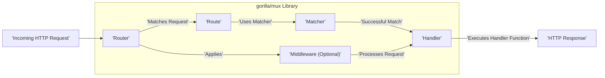
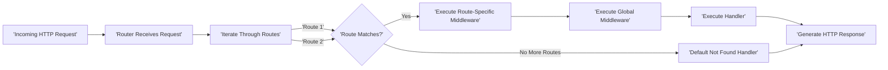

# Project Design Document: gorilla/mux

**Version:** 1.1
**Date:** October 26, 2023
**Author:** AI Software Architect

## 1. Introduction

This document provides an enhanced design overview of the `gorilla/mux` library, a powerful HTTP request router and dispatcher for Go. This document aims to clearly articulate the architecture, key components, and data flow within `gorilla/mux`, providing a more robust foundation for subsequent threat modeling activities.

## 2. Goals

*   Provide a comprehensive and refined architectural overview of the `gorilla/mux` library.
*   Clearly identify and describe key components and their interactions with greater detail.
*   Elaborate on the request processing flow within the library, including error handling and edge cases.
*   Highlight potential areas of security concern with more specific examples for future threat modeling.

## 3. Non-Goals

*   Detailed code-level analysis of the `gorilla/mux` implementation beyond architectural understanding.
*   Performance benchmarking or optimization strategies.
*   A comparative analysis with other Go routing libraries.
*   Specific deployment or configuration instructions beyond illustrating the library's role.

## 4. Architectural Overview

`gorilla/mux` serves as a central dispatcher for incoming HTTP requests. It intelligently matches these requests against a predefined set of routes based on a variety of criteria, including path, HTTP method, headers, and more. Upon a successful match, the request is dispatched to the associated handler function. The core of the library is the `Router`, which manages the collection of routes and orchestrates the matching process.

## 5. Key Components

*   **Router:**
    *   The central orchestrator, responsible for managing and matching routes against incoming requests.
    *   Maintains a collection of `Route` objects, organized for efficient matching.
    *   Provides methods for dynamically adding, retrieving, and manipulating routes.
    *   Implements the `http.Handler` interface, seamlessly integrating with Go's `net/http` package. This allows the `Router` to be directly served by an HTTP server.
    *   Supports the creation of subrouters, enabling modular and hierarchical routing structures within an application. This is crucial for organizing complex applications.
    *   Manages global middleware that applies to all routes registered with the router.

*   **Route:**
    *   Represents a specific mapping between an incoming request and a corresponding handler function.
    *   Encapsulates the matching criteria that must be met for a request to be routed to its associated handler. These criteria can include:
        *   Path patterns with support for variables (e.g., `/users/{id}`).
        *   Specific HTTP methods (GET, POST, PUT, DELETE, etc.).
        *   Presence or specific values of HTTP headers.
        *   Presence or specific values of query parameters.
        *   The request host.
        *   The request scheme (HTTP or HTTPS).
    *   Holds a reference to the `http.HandlerFunc` that will be executed upon a successful match.
    *   Can have associated route-specific middleware functions that are executed before the main handler.
    *   Provides functionality for building URLs based on the route's defined parameters, facilitating the generation of links within the application.

*   **Matcher:**
    *   An interface defining the contract for matching an HTTP request against a `Route`'s criteria. This allows for a flexible and extensible matching mechanism.
    *   `gorilla/mux` provides several built-in concrete implementations of the `Matcher` interface:
        *   **Path Matcher:** Compares the request path against the route's defined path pattern. Supports path variables and regular expressions for more complex matching.
        *   **Method Matcher:** Checks if the request's HTTP method matches the route's specified method.
        *   **Host Matcher:** Verifies if the request's host matches the route's defined host.
        *   **Header Matcher:** Examines the request headers to see if they match the route's header requirements (presence or specific values).
        *   **Query Matcher:** Checks the request's query parameters against the route's defined query parameter requirements.
        *   **Scheme Matcher:** Matches the request's scheme (HTTP or HTTPS) against the route's specified scheme.
    *   The library allows developers to implement custom `Matcher` interfaces to create specialized matching logic tailored to specific application needs.

*   **Handler:**
    *   A function that conforms to the `http.HandlerFunc` signature (`func(http.ResponseWriter, *http.Request)`).
    *   The core logic that processes the incoming request and generates the corresponding HTTP response.
    *   Executed when a `Route` successfully matches the incoming request and after all associated middleware has been processed.

*   **Middleware:**
    *   Optional functions that can intercept and process HTTP requests as they pass through the routing pipeline.
    *   Form a chain of responsibility, where each middleware can perform specific actions before or after the next middleware in the chain or the final handler.
    *   Common use cases for middleware include:
        *   Logging request details.
        *   Authenticating and authorizing users.
        *   Modifying request headers or body.
        *   Compressing or decompressing request/response bodies.
        *   Handling errors and panics.
        *   Setting security headers.
    *   Middleware can be applied at the `Router` level (affecting all routes) or at the `Route` level (affecting only specific routes).

## 6. Data Flow

The following steps detail the typical flow of an incoming HTTP request as it is processed by `gorilla/mux`:

1. An incoming HTTP request is received by the Go `net/http` server, which is configured to use the `gorilla/mux` `Router` as its handler.
2. The `Router` instance receives the `http.ResponseWriter` and `http.Request` objects.
3. The `Router` iterates through its registered `Route` objects, attempting to find a match for the incoming request. The order in which routes are registered can be significant, as the first matching route typically wins.
4. For each `Route`, the associated `Matcher` implementations are invoked to determine if the request satisfies the route's defined criteria (path, method, headers, etc.).
5. The matching process involves evaluating various aspects of the request against the route's constraints. For example, the `Path Matcher` compares the request path against the route's path pattern, potentially extracting path variables.
6. If a `Route` successfully matches the request:
    *   Any associated middleware functions defined for that specific `Route` are executed sequentially in the order they were added.
    *   Middleware can inspect and modify the request and response. They can also short-circuit the request processing pipeline if necessary (e.g., by returning an error response).
    *   After route-specific middleware, any global middleware registered with the `Router` is executed.
    *   Finally, the `Handler` function associated with the matching `Route` is invoked. The handler receives the `http.ResponseWriter` and the `http.Request` (which may have been modified by middleware).
    *   The `Handler` processes the request, generates the HTTP response, and writes it to the `http.ResponseWriter`.
7. If no `Route` matches the request after iterating through all registered routes, `gorilla/mux`'s default behavior is to invoke a "not found" handler. By default, this results in a 404 Not Found response. However, this default behavior can be customized by setting a custom `NotFoundHandler` on the `Router`.
8. The HTTP response generated by the `Handler` (or the `NotFoundHandler`) is sent back to the client by the `net/http` server.

## 7. Security Considerations (For Threat Modeling)

The following areas represent potential security considerations that should be thoroughly examined during threat modeling of applications utilizing `gorilla/mux`:

*   **Route Definition Vulnerabilities:**
    *   **Path Traversal:**  Careless definition of path matchers, particularly when using wildcards or regular expressions, can inadvertently allow attackers to access resources outside the intended scope. For example, a route like `/files/{file}` without proper sanitization could be exploited to access arbitrary files on the server.
    *   **Route Overlap and Shadowing:**  Ambiguous or overlapping route definitions can lead to requests being routed to unintended handlers. This can expose sensitive information or functionality that was meant to be protected by a different route. Prioritization of routes becomes critical.
    *   **Regular Expression Denial of Service (ReDoS):**  If regular expressions are used within path matchers, poorly constructed or overly complex expressions can be exploited by attackers to cause excessive CPU consumption, leading to a denial of service. Input validation and careful regex design are crucial.

*   **Middleware Security:**
    *   **Vulnerable Middleware Components:**  Security vulnerabilities within custom-built or third-party middleware can introduce significant risks to the application. Thorough vetting and security audits of middleware are essential.
    *   **Middleware Ordering Issues:**  The order in which middleware is applied is critical. Incorrect ordering can lead to security bypasses. For example, if an authentication middleware is placed after an authorization middleware, unauthorized requests might be processed.
    *   **Information Leakage in Middleware:** Middleware might unintentionally log or expose sensitive information (e.g., API keys, user credentials) in logs or error messages. Secure logging practices are important.

*   **Handler Security:**
    *   **Standard Web Application Vulnerabilities:** While `gorilla/mux` handles routing, the handlers themselves are susceptible to common web application vulnerabilities such as SQL injection, cross-site scripting (XSS), cross-site request forgery (CSRF), and insecure deserialization. Secure coding practices within handlers are paramount.

*   **Input Validation and Sanitization:**
    *   `gorilla/mux` facilitates the extraction of parameters from requests (path variables, query parameters, headers). Failure to properly validate and sanitize these inputs within handlers can lead to various vulnerabilities, including injection attacks.

*   **Error Handling and Information Disclosure:**
    *   Default error handling mechanisms and custom error handlers should be carefully reviewed to prevent the disclosure of sensitive information to attackers. Detailed error messages should generally be avoided in production environments.

*   **Subrouter Security and Isolation:**
    *   When utilizing subrouters to create modular routing structures, it's crucial to ensure proper isolation and access control between different parts of the application. Misconfigurations can lead to unintended access between subdomains or modules.

*   **CORS Misconfiguration:**
    *   If middleware is used to handle Cross-Origin Resource Sharing (CORS), misconfigurations can allow unauthorized cross-origin requests, potentially exposing sensitive data or functionality.

## 8. Assumptions and Constraints

*   This design document focuses on the core architectural principles and common usage patterns of `gorilla/mux`.
*   It assumes a foundational understanding of HTTP protocol, Go programming language, and basic web application security concepts.
*   The security considerations outlined are intended to be a starting point for more in-depth threat modeling exercises.
*   The document provides a general overview and may not encompass every single feature or less common use case of the library.

## 9. Future Considerations

*   A more granular analysis of the security implications of specific `Matcher` implementations, including potential vulnerabilities within their matching logic.
*   A deeper examination of the subrouter implementation and potential security boundaries and vulnerabilities associated with their use.
*   Development of best practice guidelines for secure route definition, middleware implementation, and handler development when using `gorilla/mux`.
*   Investigation into potential integration with security scanning tools and frameworks to automate vulnerability detection in applications using `gorilla/mux`.
