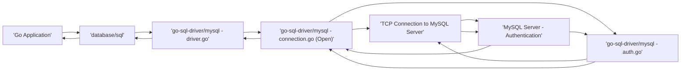
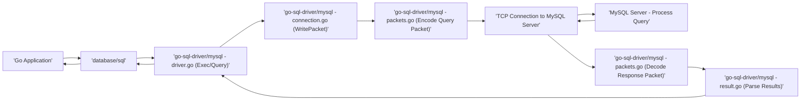

# Project Design Document: go-sql-driver/mysql

**Version:** 1.1
**Date:** October 26, 2023
**Author:** AI Software Architect

## 1. Introduction

This document provides an enhanced and more detailed design overview of the `go-sql-driver/mysql` project, a pure Go MySQL driver for the Go programming language's `database/sql` package. This revised document aims to provide a more granular understanding of the driver's architecture, components, and data flow, specifically tailored for effective threat modeling activities. The enhancements focus on providing richer context and identifying potential attack surfaces.

## 2. Goals and Scope

The primary goal of this document is to provide a clear and comprehensive articulation of the design of the `go-sql-driver/mysql` library, optimized for security analysis. This includes:

*   Describing the key components and their interactions with greater detail on security implications.
*   Illustrating the data flow within the driver, highlighting potential points of vulnerability.
*   Identifying external dependencies and interfaces, with a focus on their security relevance.
*   Providing sufficient detail and context for thorough security analysis and threat modeling exercises.

The scope of this document remains limited to the internal architecture and functionality of the `go-sql-driver/mysql` library itself. It does not cover the Go `database/sql` package or the MySQL server in detail, except where their interaction is directly relevant to the driver's security.

## 3. High-Level Overview

The `go-sql-driver/mysql` library serves as a crucial intermediary, facilitating communication between Go applications leveraging the `database/sql` interface and a MySQL database server. It meticulously implements the necessary protocols and logic to establish secure connections, transmit and receive queries and results, and manage database transactions. Being a pure Go implementation, it avoids reliance on potentially less secure C libraries for its core operations, enhancing its security posture.

## 4. Architectural Design

The driver's architecture is structured around several key functional areas, each with specific security considerations:

*   **Connection Management:** Responsible for the secure establishment, maintenance, and graceful closure of connections to the MySQL server. This includes handling connection pooling and security protocols.
*   **Protocol Handling:** Implements the intricate details of the MySQL client/server protocol, ensuring correct and secure communication. This involves encoding and decoding messages and handling protocol-specific security features.
*   **Query Processing:** Manages the secure and efficient execution of SQL queries, including handling parameters to prevent injection attacks.
*   **Data Type Handling:**  Focuses on the correct and secure conversion between Go and MySQL data types, preventing potential data corruption or misinterpretation.
*   **Security Features:**  Directly implements security mechanisms such as TLS encryption and various authentication methods.

### 4.1. Component Diagram


### 4.2. Detailed Component Description

*   **Go Application Code:** The user's Go application, the initiator of database interactions, which must be designed with security best practices in mind to prevent vulnerabilities that the driver might expose.
*   **`database/sql` Package:** The standard Go library providing a consistent and secure interface for database interactions. The `go-sql-driver/mysql` driver adheres to this interface, inheriting some of its security characteristics and responsibilities.
*   **`go-sql-driver/mysql`:** The core of this analysis, comprising several interconnected modules:
    *   **`connection.go` (Connection Management):**
        *   Manages the complete lifecycle of TCP connections, including secure socket creation and handling potential connection failures.
        *   Implements connection pooling with considerations for secure credential management and connection reuse.
        *   Handles the initial MySQL handshake, a critical phase for negotiating security features.
        *   Provides support for TLS/SSL connections, including configuration options and certificate verification (important for preventing MITM attacks).
    *   **`packets.go` (Protocol Handling - Packet Layer):**
        *   Handles the low-level encoding and decoding of MySQL protocol packets, ensuring data integrity and preventing malformed packet attacks.
        *   Manages packet sequencing and error handling at the packet level, crucial for reliable and secure communication.
    *   **`buffer.go` (Protocol Handling - Buffer Management):**
        *   Provides efficient and secure byte buffer management, preventing buffer overflows or underflows during data processing.
    *   **`auth.go` (Authentication):**
        *   Implements various MySQL authentication methods, including `mysql_native_password`, `caching_sha2_password`, and potentially others, each with different security implications.
        *   Handles the secure exchange of authentication credentials with the server, protecting against eavesdropping.
        *   Implements password hashing and secure storage of temporary authentication data.
    *   **`query.go` (Query Processing):**
        *   Formats and securely sends SQL queries to the MySQL server, with a focus on supporting parameterized queries to prevent SQL injection.
        *   Parses and processes the server's response to queries, handling potential error conditions and malicious server responses.
        *   Manages prepared statements and parameter binding, key features for secure query execution.
    *   **`result.go` (Result Handling):**
        *   Parses the result sets returned by the MySQL server, ensuring data integrity and preventing data corruption.
        *   Converts MySQL data types to Go data types, handling potential type mismatches or malicious data.
        *   Provides methods for securely iterating through result rows, preventing access violations or unexpected behavior.
    *   **`types.go` (Data Type Mapping):**
        *   Defines the mapping between Go data types and MySQL data types, crucial for preventing data truncation or misinterpretation that could lead to vulnerabilities.
        *   Handles type conversion and validation, ensuring data conforms to expected formats and preventing injection through data fields.
    *   **`utils.go` (Utility Functions):**
        *   Contains various helper functions used throughout the driver, some of which might have security implications if not implemented correctly (e.g., string sanitization, data encoding).
    *   **`driver.go` (Driver Registration):**
        *   Registers the MySQL driver with the `database/sql` package, making it available for use. This registration process itself doesn't inherently have security implications but is necessary for the driver to function.
        *   Implements the `database/sql/driver` interfaces, ensuring compatibility and adherence to the standard library's security expectations.
    *   **`errors.go` (Error Handling):**
        *   Defines custom error types for the driver, providing more specific error information. Careful error handling is important to avoid leaking sensitive information.
        *   Handles error reporting from the MySQL server, ensuring that error messages do not inadvertently expose sensitive data.
*   **MySQL Server:** The database server, responsible for enforcing its own security policies and handling authentication and authorization. The driver's security is heavily reliant on the proper configuration and security of the MySQL server.

### 4.3. Data Flow Diagram - Connection Establishment



**Data Flow Description - Connection Establishment (with Security Focus):**

1. The Go application requests a database connection through the `database/sql` package. This request might contain connection parameters, including credentials, which need to be handled securely by the application.
2. The `database/sql` package calls the `Open` method of the registered MySQL driver (`driver.go`).
3. The `Open` method in `connection.go` initiates a TCP connection to the MySQL server. This step might involve establishing a TLS connection based on the provided configuration, protecting against eavesdropping.
4. The MySQL server sends an initial handshake packet, which includes information about its capabilities and supported authentication methods. This information is crucial for the driver to negotiate secure communication.
5. The driver's connection management code processes the handshake, validating the server's identity (if configured) and selecting an appropriate authentication method.
6. The authentication process is initiated by `auth.go`. This involves securely exchanging credentials with the server, potentially using cryptographic protocols to protect the password.
7. Authentication credentials are exchanged with the MySQL server over the established connection. The security of this exchange depends on the chosen authentication method and the underlying transport security (TLS).
8. Upon successful authentication, the connection is established and returned to the `database/sql` package.
9. The `database/sql` package returns the established connection to the Go application.

### 4.4. Data Flow Diagram - Query Execution



**Data Flow Description - Query Execution (with Security Focus):**

1. The Go application executes a SQL query through the `database/sql` package. It's crucial that the application uses parameterized queries to prevent SQL injection vulnerabilities at this stage.
2. The `database/sql` package calls the appropriate method (e.g., `Exec`, `Query`) on the MySQL driver.
3. The driver's `Exec` or `Query` method in `driver.go` prepares the query for sending. This includes properly escaping or parameterizing user-provided input.
4. The query is written to the TCP connection using `connection.go`'s `WritePacket` method. If TLS is enabled, this data is encrypted.
5. The `packets.go` module encodes the SQL query into a MySQL protocol packet. Care must be taken to prevent malformed packets that could exploit vulnerabilities in the server.
6. The packet is sent to the MySQL server over the established connection.
7. The MySQL server processes the query, enforcing its own security rules and permissions.
8. The MySQL server sends a response packet back to the driver.
9. The `packets.go` module decodes the response packet, validating its structure and integrity.
10. The `result.go` module parses the result set from the response packet, ensuring that the data is handled correctly and securely.
11. The results are returned to the `database/sql` package.
12. The `database/sql` package returns the results to the Go application. The application must handle the returned data securely to prevent further vulnerabilities.

## 5. Security Considerations

This section provides a more detailed breakdown of potential security considerations, linking them to specific components and data flows:

*   **SQL Injection:**
    *   **Vulnerability Point:** Primarily at the application level when constructing SQL queries. The driver mitigates this through support for parameterized queries.
    *   **Driver's Role:** `query.go` handles parameterized queries, ensuring that user-provided data is treated as data, not executable code. Improper use of string concatenation for query building in the application bypasses this protection.
*   **Authentication and Authorization:**
    *   **Vulnerability Point:** During connection establishment. Weak or compromised credentials can lead to unauthorized access.
    *   **Driver's Role:** `auth.go` implements various authentication methods. The security of the connection depends on the chosen method and the strength of the credentials. The driver's support for secure authentication methods like `caching_sha2_password` is crucial.
*   **Man-in-the-Middle (MITM) Attacks:**
    *   **Vulnerability Point:** Data transmission between the driver and the MySQL server.
    *   **Driver's Role:** `connection.go` handles TLS/SSL encryption. Proper configuration and certificate validation are essential to prevent interception and tampering of data. Lack of TLS or improper certificate validation makes the connection vulnerable.
*   **Denial of Service (DoS):**
    *   **Vulnerability Point:**  Can target both the driver and the MySQL server.
    *   **Driver's Role:** `connection.go`'s connection pooling mechanisms and timeouts can help mitigate DoS attacks by limiting resource consumption. However, vulnerabilities in the driver's handling of malformed requests could also be exploited for DoS.
*   **Data Exposure:**
    *   **Vulnerability Point:** During data transmission and in application logs or temporary storage.
    *   **Driver's Role:** TLS encryption in `connection.go` protects data in transit. However, the driver itself might temporarily store sensitive data in memory, which could be a vulnerability if not handled carefully. Error messages generated by the driver (in `errors.go`) should also avoid exposing sensitive information.
*   **Dependency Vulnerabilities:**
    *   **Vulnerability Point:**  Potential vulnerabilities in the Go standard library components used by the driver.
    *   **Driver's Role:**  While the driver primarily relies on the Go standard library, staying updated with Go releases is important to benefit from security patches in these dependencies.
*   **Memory Safety:**
    *   **Vulnerability Point:** Potential buffer overflows or other memory-related issues within the driver's code.
    *   **Driver's Role:** As a Go application, the driver benefits from Go's memory safety features. However, careful coding practices are still necessary to prevent vulnerabilities in `packets.go` and `buffer.go` that could lead to memory corruption.
*   **Protocol Vulnerabilities:**
    *   **Vulnerability Point:**  Exploitable flaws in the MySQL client/server protocol itself.
    *   **Driver's Role:** `packets.go` implements the protocol. Staying up-to-date with protocol specifications and implementing them correctly is crucial to avoid vulnerabilities.

## 6. Dependencies

The `go-sql-driver/mysql` project primarily relies on the following packages from the Go standard library, each with its own security considerations:

*   `net`: For network communication (TCP). Potential vulnerabilities related to socket handling and network protocols.
*   `time`: For handling time-related operations. Generally less critical from a direct security perspective but can be relevant in timing attacks or session management.
*   `crypto/tls`: For TLS/SSL support. Critical for secure communication. Vulnerabilities in TLS implementations can have significant security implications.
*   `crypto/sha256`, `crypto/rsa`, `crypto/des`, etc.: For cryptographic operations used in authentication. Vulnerabilities in these cryptographic implementations could compromise authentication security.
*   `encoding/binary`: For encoding and decoding binary data. Incorrect handling could lead to data corruption or vulnerabilities.
*   `errors`: For error handling. Improper error handling can leak sensitive information.
*   `io`: For input/output operations. Potential vulnerabilities related to handling untrusted input streams.
*   `strings`: For string manipulation. Improper string handling can lead to vulnerabilities like buffer overflows (though less common in Go).
*   `strconv`: For string conversion. Potential vulnerabilities if not handled carefully with untrusted input.

The driver's reliance on the Go standard library means its security posture is also influenced by the security of these underlying components.

## 7. Deployment

The deployment of `go-sql-driver/mysql` as a Go library has the following security implications:

*   The security of the driver is directly tied to the security of the application that uses it. Vulnerabilities in the application can expose the driver to attacks.
*   Developers must ensure they are using the latest version of the driver to benefit from security patches.
*   Configuration of the driver (e.g., enabling TLS, providing secure credentials) is the responsibility of the application developer.

To use it, developers import the driver in their Go applications:

```go
import _ "github.com/go-sql-driver/mysql"
```

The application then uses the `database/sql` package's functions (e.g., `sql.Open`) to establish connections using the "mysql" driver name, passing connection parameters that should be handled securely.

## 8. Future Considerations

Future enhancements with potential security implications include:

*   **Improved support for newer MySQL authentication plugins:**  Adopting more secure authentication methods as they become available.
*   **Enhanced connection security options:**  Providing more granular control over TLS configuration and certificate validation.
*   **Integration with security auditing and logging frameworks:**  Improving the ability to monitor and detect suspicious activity.
*   **Further hardening against protocol-level attacks:**  Staying ahead of potential vulnerabilities in the MySQL protocol.

This enhanced design document provides a more detailed and security-focused overview of the `go-sql-driver/mysql` project. The granular descriptions of components, data flows, and security considerations are intended to facilitate more effective threat modeling and security analysis, ultimately leading to more secure applications.