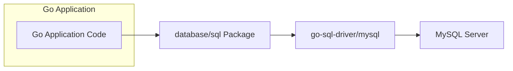
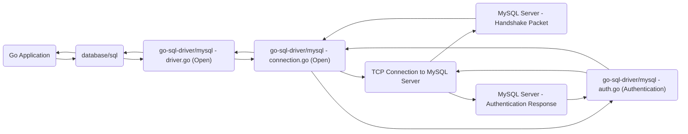
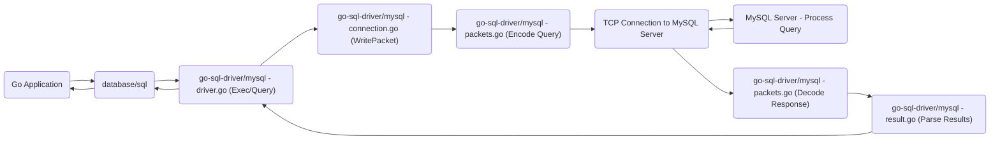

# Project Design Document: go-sql-driver/mysql

**Version:** 1.1
**Date:** October 26, 2023
**Author:** AI Software Architect

## 1. Introduction

This document provides a detailed design overview of the `go-sql-driver/mysql` project, a pure Go MySQL driver for the Go programming language's `database/sql` package. This document aims to provide a comprehensive understanding of the driver's architecture, components, and data flow, which will serve as the foundation for subsequent threat modeling activities. This revision includes more detail on component responsibilities and potential security implications.

## 2. Goals and Scope

The primary goal of this document is to clearly articulate the design of the `go-sql-driver/mysql` library. This includes:

*   Describing the key components and their interactions with greater specificity.
*   Illustrating the data flow within the driver, highlighting data transformation points.
*   Identifying external dependencies and interfaces, including specific protocols.
*   Providing sufficient detail for security analysis and threat modeling, including potential attack surfaces.

The scope of this document is limited to the internal architecture and functionality of the `go-sql-driver/mysql` library itself. It does not cover the Go `database/sql` package or the MySQL server's internal workings in detail, but their interactions are considered.

## 3. High-Level Overview

The `go-sql-driver/mysql` library acts as a crucial intermediary, facilitating communication between Go applications leveraging the `database/sql` interface and a MySQL database server. It meticulously implements the intricacies of the MySQL client/server protocol, managing connection establishment, secure query transmission, efficient result retrieval, and robust transaction management. Being a pure Go implementation, it avoids the complexities and potential security concerns associated with C library dependencies.

## 4. Architectural Design

The driver's architecture is modular, focusing on separation of concerns. Key areas include:

*   **Connection Management:**  Responsible for the entire lifecycle of connections to the MySQL server, from initial handshake to graceful closure.
*   **Protocol Handling:**  Implements the binary MySQL client/server protocol, including packet encoding, decoding, and state management.
*   **Query Processing:**  Handles the formatting and execution of SQL queries, including support for prepared statements and parameter binding.
*   **Data Type Handling:**  Manages the seamless conversion between Go's data types and MySQL's diverse data types.
*   **Security Features:**  Implements critical security mechanisms such as TLS encryption and various authentication methods.

### 4.1. Component Diagram



### 4.2. Detailed Component Description

*   **Go Application Code:** The user's Go application that utilizes the `database/sql` package to interact with the database. This code initiates database operations.
*   **`database/sql` Package:** The standard Go library providing a consistent and abstract interface for database interactions. The `go-sql-driver/mysql` driver registers itself as a concrete implementation.
*   **`go-sql-driver/mysql`:** The core of this design. Its internal modules are:
    *   **`connection.go` (Connection Management):**
        *   Manages the underlying TCP connections, including establishing new connections, reusing existing connections from a pool, and closing connections.
        *   Implements the initial MySQL handshake process, exchanging server capabilities and client authentication details.
        *   Handles TLS/SSL negotiation and encryption setup using the `crypto/tls` package.
        *   Implements connection pooling logic to optimize resource utilization and reduce connection overhead.
    *   **`packets.go` (Protocol Handling - Packet Layer):**
        *   Implements the low-level details of the MySQL client/server protocol, including the structure and interpretation of protocol packets.
        *   Provides functions for encoding outgoing data into MySQL protocol packets and decoding incoming packets.
        *   Manages packet sequencing to ensure reliable communication.
        *   Handles basic error detection at the packet level.
    *   **`buffer.go` (Protocol Handling - Buffer Management):**
        *   Provides efficient byte buffer management for reading data from and writing data to the network socket. This minimizes memory allocations and copies.
        *   Includes methods for reading various data types (integers, strings, etc.) from the buffer according to the MySQL protocol.
    *   **`auth.go` (Authentication):**
        *   Implements various MySQL authentication methods, including `mysql_native_password`, `caching_sha2_password`, and potentially others.
        *   Handles the secure exchange of authentication credentials with the MySQL server, including password hashing and challenge-response mechanisms.
        *   Integrates with the `crypto` package for cryptographic operations.
    *   **`query.go` (Query Processing):**
        *   Formats SQL queries received from the `database/sql` package into the format expected by the MySQL server.
        *   Handles the preparation and execution of SQL statements, including parameterized queries to prevent SQL injection.
        *   Manages the sending of query packets to the server.
        *   Parses the server's response to queries, including error codes and result set metadata.
    *   **`result.go` (Result Handling):**
        *   Parses the result sets returned by the MySQL server in response to queries.
        *   Converts MySQL data types received from the server into corresponding Go data types.
        *   Provides methods for iterating through the rows of a result set and accessing individual column values.
        *   Handles different result set formats and metadata.
    *   **`types.go` (Data Type Mapping):**
        *   Defines the mapping between Go data types (e.g., `int`, `string`, `time.Time`) and their corresponding MySQL data types (e.g., `INT`, `VARCHAR`, `DATETIME`).
        *   Implements the logic for converting data between these types, handling potential data loss or overflow.
        *   Includes validation logic to ensure data integrity.
    *   **`utils.go` (Utility Functions):**
        *   Contains various helper functions used throughout the driver for tasks such as string manipulation, error formatting, and logging (if enabled).
    *   **`driver.go` (Driver Registration and Interface Implementation):**
        *   Registers the MySQL driver with the `database/sql` package using the `database/sql.Register` function.
        *   Implements the interfaces defined in the `database/sql/driver` package, such as `Driver`, `Conn`, `Stmt`, and `Rows`. This is the entry point for `database/sql` to interact with the driver.
    *   **`errors.go` (Error Handling):**
        *   Defines custom error types specific to the MySQL driver, providing more context than generic errors.
        *   Handles the translation of MySQL server error codes into Go error values.
*   **MySQL Server:** The database server responsible for receiving, parsing, and executing SQL queries, and returning the results to the client driver.

### 4.3. Data Flow Diagram - Connection Establishment



**Data Flow Description - Connection Establishment:**

1. The Go application requests a database connection through the `database/sql` package's `sql.Open()` function.
2. The `database/sql` package identifies the registered "mysql" driver and calls its `Open()` method in `driver.go`.
3. The `Open()` method in `connection.go` initiates a TCP connection to the specified MySQL server address and port.
4. The MySQL server sends an initial handshake packet containing server version, capabilities, and a salt for authentication.
5. The driver's connection management code in `connection.go` receives and parses the handshake packet.
6. The authentication process is initiated by `auth.go`. Based on the server's capabilities and the provided credentials, an appropriate authentication method is chosen.
7. Authentication credentials (potentially hashed or encrypted) are exchanged with the MySQL server over the established connection.
8. The MySQL server responds with an authentication success or failure packet.
9. The `auth.go` module verifies the server's response.
10. Upon successful authentication, the `connection.go` module marks the connection as established and returns it to the `driver.go`.
11. The `driver.go` returns the established connection to the `database/sql` package.
12. The `database/sql` package returns the usable database connection to the Go application.

### 4.4. Data Flow Diagram - Query Execution



**Data Flow Description - Query Execution:**

1. The Go application executes a SQL query using methods like `db.Exec()` or `db.Query()` from the `database/sql` package.
2. The `database/sql` package calls the corresponding `Exec()` or `Query()` method on the MySQL driver's `driver.go`.
3. The driver's `Exec()` or `Query()` method in `driver.go` prepares the SQL query for transmission. This might involve parameter binding for prepared statements.
4. The query is passed to `connection.go`, which uses its `WritePacket()` method to send data to the server.
5. The `packets.go` module encodes the SQL query into one or more MySQL protocol packets according to the protocol specification.
6. The encoded query packet(s) are sent over the established TCP connection to the MySQL server.
7. The MySQL server receives, parses, and executes the query.
8. The MySQL server sends a response packet (or a series of packets for result sets) back to the driver.
9. The `packets.go` module decodes the incoming response packet(s).
10. If the response contains a result set, the `result.go` module parses the data, converting MySQL data types to Go data types.
11. The parsed results (or an error) are returned to the calling method in `driver.go`.
12. The `driver.go` passes the results (or error) back to the `database/sql` package.
13. The `database/sql` package returns the results (or error) to the Go application.

## 5. Security Considerations

This section details potential security considerations and attack vectors related to the driver's design and usage:

*   **SQL Injection:** While the driver itself provides mechanisms like parameterized queries to *prevent* SQL injection, misuse by the application developer (e.g., concatenating user input directly into SQL strings) remains a significant risk. Threat modeling should focus on how the application utilizes the driver's features.
*   **Authentication and Authorization Bypass:** The driver relies on the security of the authentication mechanisms implemented in `auth.go`. Vulnerabilities in these implementations or the use of weak or default credentials can lead to unauthorized database access. The driver's support for various authentication plugins should be carefully considered.
*   **Man-in-the-Middle (MITM) Attacks:** Communication between the driver and the MySQL server, if not encrypted, is susceptible to eavesdropping and manipulation. The driver's support for TLS/SSL encryption (configured via connection string parameters) is crucial. Threat modeling should consider scenarios where TLS is not enforced or certificate validation is bypassed.
*   **Denial of Service (DoS):**
    *   **Connection Exhaustion:**  An attacker might attempt to exhaust the driver's connection pool or the MySQL server's connection limits by rapidly opening and closing connections. Proper connection pooling configuration and timeouts are essential mitigations.
    *   **Malicious Queries:** Sending computationally expensive or resource-intensive queries can overload the MySQL server. While the driver doesn't directly control query execution, it facilitates it.
*   **Data Exposure:** If TLS is not enabled or is improperly configured, sensitive data transmitted between the application and the database (including credentials and query results) can be intercepted.
*   **Dependency Vulnerabilities:** Although the driver primarily relies on the Go standard library, future inclusion of external dependencies could introduce vulnerabilities that need to be addressed. Regular dependency scanning would be necessary.
*   **Memory Safety Issues:** While Go's memory management provides a degree of safety, vulnerabilities within the driver's code (e.g., buffer overflows in packet handling) could potentially lead to memory corruption. Thorough code reviews and testing are important.
*   **Protocol Implementation Flaws:**  Bugs or vulnerabilities in the implementation of the MySQL client/server protocol within `packets.go` could be exploited by a malicious server or through crafted network traffic.
*   **Configuration Errors:** Incorrectly configured connection parameters (e.g., weak encryption ciphers, disabled certificate validation) can weaken the security posture.

## 6. Dependencies

The `go-sql-driver/mysql` project has minimal external dependencies, primarily relying on the Go standard library:

*   `net`: For network communication (TCP sockets).
*   `time`: For handling time-related operations and timeouts.
*   `crypto/tls`: For implementing TLS/SSL encryption for secure connections.
*   `crypto/sha256`, `crypto/sha1`, `crypto/rsa`, `crypto/des`: For cryptographic operations used in authentication methods.
*   `encoding/binary`: For encoding and decoding binary data according to the MySQL protocol.
*   `errors`: For creating and handling error types.
*   `io`: For basic input/output operations.
*   `strings`: For string manipulation.
*   `strconv`: For converting strings to numbers and vice versa.
*   `sync`: For synchronization primitives (e.g., mutexes) used in connection pooling.

This limited dependency footprint reduces the potential attack surface associated with third-party libraries.

## 7. Deployment

The `go-sql-driver/mysql` is deployed as a Go library. Developers integrate it into their Go applications by importing it:

```go
import _ "github.com/go-sql-driver/mysql"
```

The blank import `_` is used to trigger the driver's `init()` function, which registers the driver with the `database/sql` package. Applications then use the `database/sql` interface to interact with MySQL databases using the "mysql" driver name in the connection string. The driver's behavior is largely configured through the connection string parameters.

## 8. Future Considerations

Potential future enhancements and considerations include:

*   **Support for Newer MySQL Features:**  Continuously updating the driver to support new features and data types introduced in newer MySQL versions.
*   **Performance Optimizations:**  Exploring further optimizations in areas like connection pooling, packet handling, and data type conversion.
*   **Enhanced Observability:**  Adding more detailed logging and metrics for monitoring and troubleshooting. Integration with tracing systems could also be considered.
*   **Improved Security Features:**  Exploring support for more advanced authentication methods or encryption algorithms as they become available.
*   **Pluggable Authentication Modules (PAM):** Investigating the feasibility of supporting PAM for more flexible authentication options.
*   **Connection Multiplexing:**  Exploring techniques like connection multiplexing to further improve performance and reduce resource consumption.

This revised document provides a more detailed and security-focused design overview of the `go-sql-driver/mysql` project. The enhanced descriptions of components, data flow, and security considerations should be valuable for conducting thorough threat modeling activities.