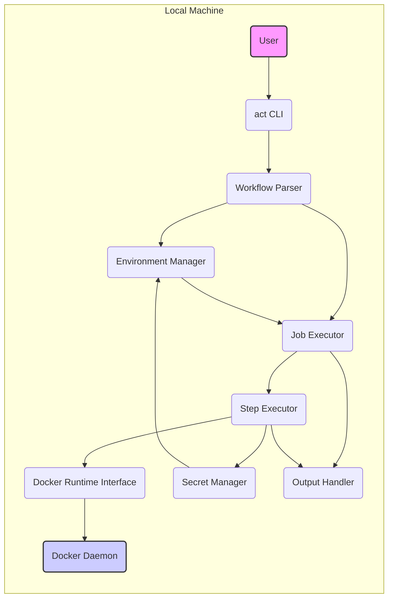
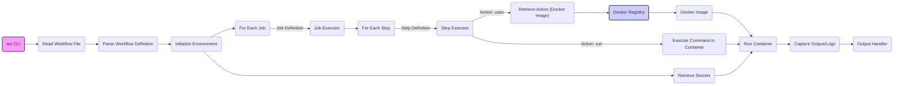

# Project Design Document: act - Run your GitHub Actions locally

**Version:** 1.1
**Date:** October 26, 2023
**Author:** AI Software Architect

## 1. Introduction

This document provides a detailed architectural design for the `act` project, a command-line tool enabling developers to execute GitHub Actions workflows locally. This document meticulously outlines the system's constituent components, their intricate interactions, and the flow of data within the system. It is specifically crafted to serve as a robust foundation for subsequent threat modeling endeavors.

### 1.1. Purpose

The central purpose of this document is to furnish a comprehensive and granular architectural overview of the `act` project. This detailed exposition will serve as the primary input for thorough threat modeling, facilitating the identification of potential security vulnerabilities and associated risks inherent within the system's design and operation.

### 1.2. Scope

This document comprehensively covers the core operational facets of `act`, with a specific focus on:

*   The process of parsing and interpreting GitHub Actions workflow definition files located at `.github/workflows/*.yml`.
*   The creation and management of a simulated GitHub Actions runtime environment on the local machine.
*   The execution of individual workflow jobs and their constituent steps, predominantly utilizing Docker containers.
*   The mechanisms for handling various event triggers and user-provided inputs.
*   The strategies employed for managing sensitive information, including secrets and environment variables.
*   The interaction patterns and dependencies on the local file system.

This document explicitly excludes the following aspects:

*   The specific implementation details and internal logic of individual GitHub Actions.
*   The low-level operational mechanics of the Docker runtime environment.
*   The intricate implementation details of the `act` command-line interface itself.
*   The architecture and behavior of external services or APIs that might be invoked by the workflows during execution.

### 1.3. Goals

*   To deliver an exceptionally clear and meticulously detailed description of the `act` system architecture.
*   To precisely identify the key components within the system and delineate their specific responsibilities.
*   To visually illustrate the intricate flow of data as it traverses the system's components.
*   To proactively highlight potential areas of security concern, thereby informing and streamlining future threat modeling activities.

## 2. System Overview

`act` empowers developers to execute GitHub Actions workflows directly on their local machines, mirroring the behavior of the GitHub Actions platform. This is achieved through a process involving the parsing of workflow definitions, the instantiation of a simulated GitHub Actions environment, and the execution of workflow steps within isolated Docker containers. This localized execution capability significantly accelerates the development and testing cycle for workflows, allowing for rapid iteration and validation before committing and pushing changes to a remote repository.

The fundamental operation of `act` can be decomposed into the following distinct stages:

*   **Workflow Parsing:** The system begins by reading and interpreting the contents of `.github/workflows/*.yml` files, which define the workflow structure.
*   **Environment Setup:**  A local execution environment is established, meticulously mimicking the runtime environment provided by GitHub Actions. This includes setting up relevant environment variables and structuring the file system.
*   **Job Execution:** Individual jobs defined within the workflow are executed in the specified order, respecting any dependencies between them.
*   **Step Execution:** Each step within a job is executed, typically encapsulated within a dedicated Docker container to ensure isolation and consistency.
*   **Event Handling:**  GitHub event triggers, which initiate workflows on the remote platform, are simulated locally to test event-driven workflows.
*   **Output and Logging:**  Comprehensive feedback on the workflow execution status, including detailed logs from each step, is provided to the user.

## 3. Component Details

This section provides an in-depth look at the key components that constitute the `act` system, detailing their individual responsibilities and functionalities.

*   **CLI ("act" Command Line Interface):**
    *   Responsibility: Serves as the primary interface through which users interact with the `act` tool.
    *   Functionality: Accepts user commands (e.g., `act`, `act -W my_workflow.yml`), parses command-line arguments, validates user input, and orchestrates the initiation of the workflow execution process.
    *   Interactions: Communicates with the Workflow Parser to load workflow definitions, the Environment Manager to set up the execution environment, and the Output Handler to display results and logs.

*   **Workflow Parser:**
    *   Responsibility:  Responsible for reading and interpreting GitHub Actions workflow definition files, which are typically written in YAML.
    *   Functionality: Parses the YAML structure of the workflow file, extracting key information such as job definitions, steps within each job, event triggers, defined environment variables, and sensitive secrets.
    *   Interactions: Receives the file path of the workflow definition from the CLI. Provides a structured, in-memory representation of the workflow to the Environment Manager and the Job Executor.

*   **Environment Manager:**
    *   Responsibility:  Sets up the necessary local execution environment that closely mirrors the GitHub Actions runtime environment.
    *   Functionality: Creates required directories, sets environment variables based on the workflow definition and any user-provided inputs, and securely manages the availability of secrets to the executing workflow.
    *   Interactions: Receives the parsed workflow information from the Workflow Parser. Interacts directly with the local file system to create and manage directories. Provides the configured execution environment to the Job Executor. Also interacts with the Secret Manager to retrieve secrets.

*   **Job Executor:**
    *   Responsibility: Manages the execution lifecycle of individual jobs defined within a workflow.
    *   Functionality: Determines the correct order of job execution, taking into account any defined dependencies between jobs. Invokes the Step Executor for each step contained within a job. Monitors the status of each job and handles potential failures.
    *   Interactions: Receives job definitions from the Workflow Parser. Interacts with the Step Executor to execute individual steps.

*   **Step Executor:**
    *   Responsibility: Executes individual steps within the context of a running job.
    *   Functionality:
        *   For steps utilizing the `uses` keyword (referencing pre-built actions): Retrieves the specified action, which often involves pulling a Docker image from a container registry. Subsequently executes the action within a Docker container.
        *   For steps utilizing the `run` keyword: Executes the specified shell commands directly within a newly created Docker container.
    *   Interactions: Interacts directly with the Docker Runtime Interface to manage Docker images and containers. Potentially fetches Docker images from remote registries. Interacts with the local file system within the running container as dictated by the executed commands or actions.

*   **Docker Runtime Interface:**
    *   Responsibility: Provides a standardized interface for interacting with the local Docker daemon.
    *   Functionality:  Handles the pulling of Docker images from configured registries, the creation and starting of Docker containers, the execution of commands within running containers, and the management of the container lifecycle (start, stop, remove).
    *   Interactions:  Primarily utilized by the Step Executor to perform container-related operations.

*   **Event Simulator:**
    *   Responsibility:  Simulates the triggering of workflows based on various GitHub events.
    *   Functionality: Allows users to provide custom event payloads or select from a set of predefined GitHub event types to trigger specific workflows or individual jobs within a workflow.
    *   Interactions: Provides simulated event data to the Workflow Parser and the Environment Manager, which can influence the workflow execution.

*   **Secret Manager:**
    *   Responsibility:  Handles the secure management and provision of secrets that are intended for use within the executing workflows.
    *   Functionality: Retrieves secret values from various sources, such as environment variables defined on the host system or values stored in `.env` files within the project directory. Makes these secrets securely available to the workflow execution environment without exposing them in logs or other insecure channels.
    *   Interactions: Utilized by the Environment Manager to retrieve and make secrets available to the running workflow.

*   **Output Handler:**
    *   Responsibility: Manages the output and logging generated during the workflow execution process.
    *   Functionality: Captures and displays real-time logs generated by the executed steps, provides updates on the overall execution status of the workflow, and reports any errors or failures that occur during execution.
    *   Interactions: Receives output streams and status updates from the Step Executor and other internal components of `act`.

## 4. Data Flow Diagrams

### 4.1. High-Level Data Flow

### 4.2. Detailed Workflow Execution Data Flow

## 5. Security Considerations

This section explicitly outlines potential security considerations derived from the architectural design of `act`. These points will form the basis for a more in-depth threat modeling exercise.

*   **Unrestricted Local File System Access:** `act` requires read access to workflow files and potentially other files within the project directory. A malicious actor could potentially exploit this if `act` can be tricked into accessing or processing sensitive files outside the intended scope (e.g., through crafted workflow files).
*   **Supply Chain Risks via Docker Images:** When using actions defined with `uses`, `act` retrieves and executes Docker images. This introduces a significant supply chain risk.
    *   **Pulling from Untrusted Registries:** If workflow files specify images without a fully qualified registry, `act` might pull from public, potentially compromised registries like Docker Hub without explicit verification.
    *   **Vulnerabilities in Docker Images:** The Docker images themselves might contain known vulnerabilities that could be exploited during or after execution.
    *   **Malicious Docker Images:**  A compromised action could contain malicious code designed to harm the local system or exfiltrate data.
*   **Insecure Secret Management:** The methods used to store and access secrets locally present potential vulnerabilities.
    *   **Secrets in Environment Variables:** Secrets stored as environment variables might be unintentionally logged or exposed through other processes.
    *   **Secrets in `.env` Files:** `.env` files, if not properly handled, could be accidentally committed to version control or accessed by unauthorized users.
    *   **Exposure During Execution:** Secrets might be inadvertently printed to logs or exposed in the container environment if not handled carefully by the actions themselves.
*   **Command Injection Vulnerabilities:** When executing `run` steps, user-defined shell commands are executed within Docker containers.
    *   **Insufficient Input Sanitization:** If `act` doesn't properly sanitize or escape commands derived from workflow files or user input, it could be susceptible to command injection attacks, allowing arbitrary code execution within the container.
*   **Potential for Privilege Escalation:** Running Docker containers inherently involves elevated privileges.
    *   **Docker Socket Exposure:** If the Docker socket is directly accessible within the container (a common practice for some actions), it could allow for container breakout and host system compromise.
    *   **Misconfigured Containers:**  Improperly configured containers or actions might grant excessive privileges, which could be exploited.
*   **Workflow File Tampering:** If an attacker gains write access to the `.github/workflows` directory, they could modify workflow files to execute arbitrary code when `act` is run, effectively gaining control of the local machine.
*   **Insufficient Input Validation:** `act` receives input from the CLI (arguments, flags) and workflow files. Lack of proper validation could lead to various issues.
    *   **Denial of Service:**  Maliciously crafted input could cause `act` to crash or consume excessive resources.
    *   **Unexpected Behavior:** Invalid input might lead to unpredictable or unintended behavior.
*   **Path Traversal Vulnerabilities:** If workflow files or actions specify file paths without proper validation, an attacker could potentially use path traversal techniques to access files outside the intended working directory.

## 6. Assumptions and Constraints

*   It is assumed that the user has a functional installation of Docker on their local machine and that the Docker daemon is running and accessible.
*   `act` inherently trusts the availability and integrity of Docker images specified within the workflow files. It does not perform any built-in verification of image contents or provenance.
*   The security posture of the local environment where `act` is executed is considered the responsibility of the user. `act` does not implement extensive sandboxing or isolation beyond the use of Docker containers.
*   This design document primarily focuses on the core functionality of `act`. It does not delve into the specifics of potential extensions, plugins, or integrations with other tools.

## 7. Future Considerations

*   **Support for Alternative Container Runtimes:** Exploring the feasibility of supporting container runtimes other than Docker (e.g., Podman, containerd) to offer users more flexibility and potentially enhanced security options.
*   **Enhanced and More Granular Secret Management:**  Investigating integration with dedicated secret management solutions (like HashiCorp Vault or cloud provider secret services) to provide more robust and secure secret handling capabilities.
*   **Comprehensive Logging and Auditing Mechanisms:** Implementing more detailed logging and auditing features to track workflow executions, identify potential security incidents, and aid in debugging.
*   **Integration of Docker Image Security Scanning:**  Exploring the integration of tools or processes to automatically scan pulled Docker images for known vulnerabilities before execution, providing users with warnings or the option to block vulnerable images.
*   **Strengthened Sandboxing and Isolation Techniques:** Researching and implementing more advanced sandboxing or isolation techniques beyond basic Docker containerization to further limit the potential impact of malicious actions. This could involve technologies like seccomp or gVisor.
