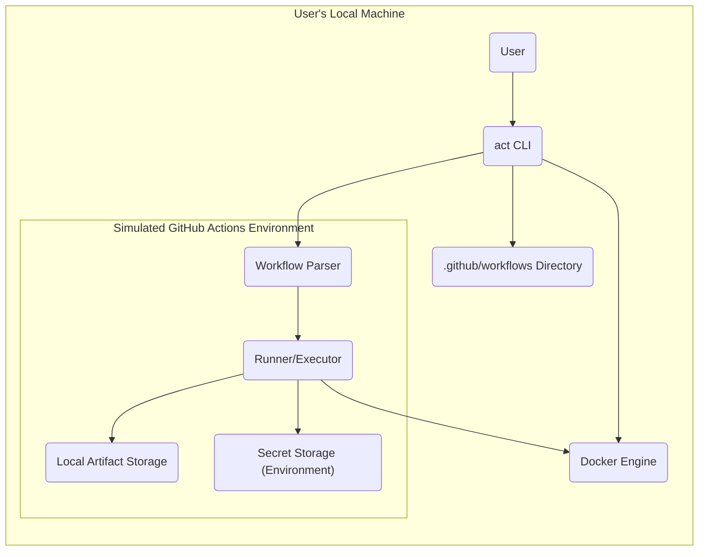
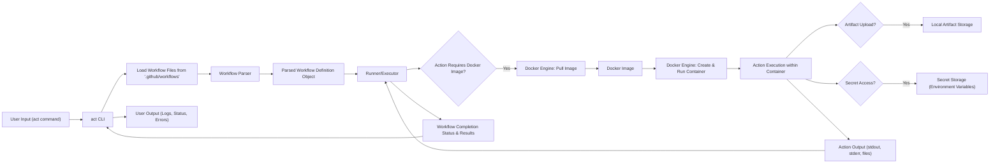

# Project Design Document: act (GitHub Actions Local Runner)

**Version:** 1.1
**Date:** October 26, 2023
**Author:** AI Software Architect

## 1. Introduction

This document provides a detailed design overview of the `act` project, a command-line tool enabling users to execute GitHub Actions workflows locally. This document aims to furnish a comprehensive understanding of the system's architecture, components, and data flow, serving as the foundation for subsequent threat modeling activities.

### 1.1. Purpose

The purpose of this document is to:

*   Articulate a clear and concise description of the `act` architecture and design.
*   Pinpoint key components and their interactions within the system.
*   Illustrate the data flow as it traverses the system.
*   Establish a basis for identifying potential security vulnerabilities during the threat modeling process.

### 1.2. Scope

This document encompasses the core functionality of `act`, concentrating on the local execution of GitHub Actions workflows defined within `.github/workflows` directories. The scope includes:

*   The command-line interface (CLI) and its functionalities.
*   The process of workflow parsing and interpretation.
*   Action execution leveraging Docker containers.
*   The simulation of the GitHub Actions environment and its constructs.
*   Mechanisms for handling artifacts and secrets.

This document explicitly excludes:

*   The intricate details of individual GitHub Actions implementations.
*   The internal operations of the Docker runtime environment.
*   The low-level implementation specifics of the Go programming language used in `act`.

### 1.3. Goals

The primary goals of this design are to:

*   Present a lucid and succinct description of the `act` architecture.
*   Facilitate effective threat modeling by clearly highlighting key components and data flow pathways.
*   Act as a reference for comprehending the system's functionality and potential security ramifications.

## 2. System Overview

`act` empowers users to execute GitHub Actions workflows, defined in `.github/workflows` directories, directly on their local machines. This is achieved through the following steps:

*   Parsing the workflow definition files, which can be in YAML or JSON format.
*   Identifying the necessary actions and their respective dependencies.
*   Retrieving and executing Docker images that correspond to the identified actions.
*   Simulating the GitHub Actions environment, including environment variables, contexts, and file system structure.
*   Managing the sequential execution of steps within the defined workflow.

The subsequent diagram offers a high-level visualization of the system's architecture:

**Key Components:**

*   **User:** The individual who interacts with the `act` tool via command-line instructions.
*   **`act` CLI:** The command-line interface, serving as the primary interaction point with the system. It manages command parsing, workflow loading, and execution orchestration.
*   **`.github/workflows Directory`:** The directory containing the YAML or JSON files that define the GitHub Actions workflows intended for execution.
*   **Docker Engine:** The containerization platform utilized by `act` to execute individual actions within isolated environments.
*   **Workflow Parser:**  The component responsible for reading and interpreting the workflow definition files, extracting details about jobs, steps, and actions.
*   **Runner/Executor:** The core component that orchestrates the execution of workflow steps. It interacts with the Docker engine to manage action containers and controls the execution sequence.
*   **Local Artifact Storage:** A designated local directory where artifacts generated during the workflow execution are stored.
*   **Secret Storage (Environment):** Secrets defined within the workflow or provided via the command line are typically stored as environment variables within the Docker containers.

## 3. Component Details

This section provides a more granular description of the key components identified in the system overview, detailing their functionalities and interactions.

### 3.1. `act` CLI

*   **Functionality:**
    *   Processes command-line arguments and options provided by the user.
    *   Loads workflow definitions from the specified `.github/workflows` directory.
    *   Initiates the workflow parsing and subsequent execution processes.
    *   Provides real-time feedback to the user regarding the execution status and any encountered errors.
    *   Manages configuration options, such as specifying the working directory, providing secret values, or selecting specific jobs to run.
*   **Key Interactions:**
    *   Receives commands and input from the **User**.
    *   Reads workflow definition files from the **`.github/workflows Directory`**.
    *   Invokes the **Workflow Parser** to interpret the workflow definitions.
    *   Communicates with the **Runner/Executor** to initiate and manage workflow execution.
    *   Potentially interacts with the **Docker Engine** for tasks like image management (pulling images if they are not locally available).

### 3.2. Workflow Parser

*   **Functionality:**
    *   Reads and parses workflow definition files, supporting both YAML and JSON formats.
    *   Performs validation checks on the syntax and structure of the workflow definition to ensure it adheres to the expected schema.
    *   Extracts crucial information, including jobs, individual steps within each job, the actions to be performed, input parameters for actions, output definitions, and environment variable specifications.
    *   Resolves dependencies between different jobs and steps within the workflow, determining the correct execution order.
*   **Key Interactions:**
    *   Receives the paths to workflow files from the **`act` CLI**.
    *   Provides the fully parsed and structured workflow definition to the **Runner/Executor**.

### 3.3. Runner/Executor

*   **Functionality:**
    *   Orchestrates the execution of jobs and steps as defined in the parsed workflow.
    *   Determines the precise order of execution based on explicitly defined dependencies and conditional statements within the workflow.
    *   Identifies the specific Docker image required for each action to be executed.
    *   Interacts directly with the **Docker Engine** to create, start, and manage the lifecycle of containers for each action.
    *   Sets up the execution environment within each container, including configuring environment variables, setting the working directory, and mounting necessary volumes.
    *   Manages the flow of data into and out of actions, handling input parameters and capturing output.
    *   Facilitates the upload and download of artifacts as specified in the workflow definition.
    *   Simulates the GitHub Actions context, providing access to predefined variables and functions (e.g., `github`, `secrets`, `runner`).
*   **Key Interactions:**
    *   Receives the parsed workflow structure from the **Workflow Parser**.
    *   Communicates extensively with the **Docker Engine** to manage container creation, execution, and termination.
    *   Writes generated artifact files to the **Local Artifact Storage**.
    *   Retrieves secret values from the **Secret Storage (Environment)** to inject them into the container environment.

### 3.4. Docker Engine

*   **Functionality:**
    *   Manages Docker images and containers on the host system.
    *   Pulls Docker images from configured registries (typically Docker Hub or other specified registries).
    *   Creates and starts isolated Docker containers for each action execution.
    *   Provides resource isolation and management for the execution of actions.
*   **Key Interactions:**
    *   Receives requests from the **Runner/Executor** to pull necessary Docker images.
    *   Receives instructions from the **Runner/Executor** to create, start, stop, and manage containers.
    *   Provides the isolated execution environment for the actions.

### 3.5. Local Artifact Storage

*   **Functionality:**
    *   Provides a designated location on the local file system for storing artifacts generated by workflow steps.
    *   Allows actions running within containers to upload files to this storage and subsequently download them.
*   **Key Interactions:**
    *   Receives artifact files written by actions through the **Runner/Executor**.
    *   Provides access to stored artifact files when requested by subsequent actions via the **Runner/Executor**.

### 3.6. Secret Storage (Environment)

*   **Functionality:**
    *   Stores secret values that are either defined directly within the workflow definition or provided externally via the command line.
    *   Makes these secrets accessible as environment variables within the Docker containers during the execution of actions.
*   **Key Interactions:**
    *   Receives secret values from the **`act` CLI** (through command-line flags or environment variables) or from the parsed workflow definition.
    *   Provides secret values to the **Runner/Executor**, which then injects them into the environment of the Docker containers before action execution.

## 4. Data Flow

The following diagram illustrates the typical flow of data during the execution of a workflow using `act`:

**Data Flow Description:**

1. The **User** initiates the process by providing input to the **`act` CLI** command.
2. The **`act` CLI** proceeds to load the workflow definition files from the **'.github/workflows'** directory.
3. The **Workflow Parser** analyzes these files, generating a **Parsed Workflow Definition Object**.
4. This object is then passed to the **Runner/Executor**.
5. The **Runner/Executor** checks if the current **Action Requires a Docker Image**.
6. If a Docker image is required and not locally available, the **Runner/Executor** instructs the **Docker Engine** to **Pull the Image**.
7. The **Docker Image** is retrieved by the Docker Engine.
8. The **Runner/Executor** then commands the **Docker Engine** to **Create and Run a Container** using the pulled image.
9. The **Action** executes within the isolated **Container**.
10. During execution, the **Action** might upload artifacts to the **Local Artifact Storage**.
11. The **Action** may also access secrets stored in **Secret Storage (Environment Variables)**.
12. The **Action** produces **Action Output**, including standard output, standard error, and potentially new files.
13. This **Action Output** is processed and managed by the **Runner/Executor**.
14. The **Runner/Executor** determines the overall **Workflow Completion Status & Results**.
15. This status is communicated back to the **`act` CLI**.
16. Finally, the **`act` CLI** presents **User Output**, including logs, status updates, and any error messages.

## 5. Security Considerations (Detailed for Threat Modeling)

This section expands on the initial security considerations, providing more specific examples and potential attack vectors for threat modeling.

*   **Workflow File Tampering:**
    *   **Threat:** A malicious user could modify workflow files to inject malicious commands that execute on the host machine when `act` is run.
    *   **Attack Vector:** Modifying the `.github/workflows` files directly or through a compromised development environment.
    *   **Example:** Adding a step that deletes critical files or installs malware.
*   **Insecure Action Usage:**
    *   **Threat:** Relying on untrusted or compromised Docker images for actions can introduce vulnerabilities.
    *   **Attack Vector:** Using actions from unknown sources or actions with known security flaws.
    *   **Example:** An action that contains a backdoor or exploits a vulnerability in a system library.
*   **Secret Exposure:**
    *   **Threat:** Improper handling or storage of secrets can lead to their unintended disclosure. Storing secrets as environment variables within Docker containers, while convenient, can be less secure than dedicated secret management solutions.
    *   **Attack Vector:** Secrets being logged, exposed in container metadata, or accessed by malicious actions.
    *   **Example:** An action intentionally printing out environment variables or exfiltrating them.
*   **Local File System Access Abuse:**
    *   **Threat:** Actions running within Docker containers have access to volumes mounted from the host file system. This access, if not carefully managed, can be abused to access or modify sensitive files outside the intended scope.
    *   **Attack Vector:** A compromised action reading sensitive files or overwriting critical system files.
    *   **Example:** An action reading SSH keys or modifying configuration files on the host.
*   **Uncontrolled Network Access:**
    *   **Threat:** Actions might require network access, which could be exploited if not properly controlled. This could allow malicious actions to communicate with external command-and-control servers or perform other malicious activities.
    *   **Attack Vector:** A compromised action making unauthorized network requests or opening listening ports.
    *   **Example:** An action downloading and executing arbitrary code from the internet.
*   **Input Validation Failures:**
    *   **Threat:** Insufficient validation of inputs from workflow files or command-line arguments could lead to injection attacks.
    *   **Attack Vector:** Providing specially crafted input that exploits vulnerabilities in the parsing or execution logic.
    *   **Example:**  Command injection through improperly sanitized input parameters to an action.
*   **Insufficient Logging and Auditing:**
    *   **Threat:** Lack of comprehensive logging can hinder the detection and investigation of malicious activity or security breaches.
    *   **Attack Vector:** Malicious actions performing unauthorized activities without leaving sufficient traces.
    *   **Example:** A compromised action silently exfiltrating data without being logged.
*   **Dependency Vulnerabilities in `act`:**
    *   **Threat:** Vulnerabilities in the dependencies used by the `act` tool itself could be exploited by a malicious actor who has gained access to the system where `act` is installed.
    *   **Attack Vector:** Exploiting known vulnerabilities in libraries used by `act`.
    *   **Example:** A vulnerability in a Go library used for parsing YAML files.

## 6. Deployment

`act` is typically deployed as a command-line tool installed directly on a developer's local machine or within a Continuous Integration/Continuous Deployment (CI/CD) environment. A prerequisite for its operation is the installation and running of Docker on the same machine where `act` is deployed.

## 7. Future Considerations

*   **Enhanced Secret Management:** Investigate and implement more robust methods for managing secrets, potentially integrating with dedicated secret management vaults or utilizing secure enclave technologies.
*   **Network Isolation for Action Containers:** Implement stricter network isolation policies for action containers to limit the potential impact of compromised actions on the network.
*   **Workflow Validation and Security Scanning:** Incorporate more comprehensive workflow validation and security scanning capabilities to proactively identify potential security issues before workflow execution. This could include static analysis of workflow files and checks for known vulnerable actions.
*   **Fine-grained Resource Control:** Implement mechanisms to control the resources (CPU, memory, network) available to individual action containers, mitigating potential denial-of-service scenarios.
*   **Support for Signed Actions:** Explore the possibility of verifying the authenticity and integrity of actions through digital signatures.

This revised document provides a more detailed and nuanced design overview of the `act` project, offering a stronger foundation for conducting thorough threat modeling activities. By clearly outlining the system's architecture, component interactions, and data flow, it facilitates the identification and mitigation of potential security vulnerabilities.