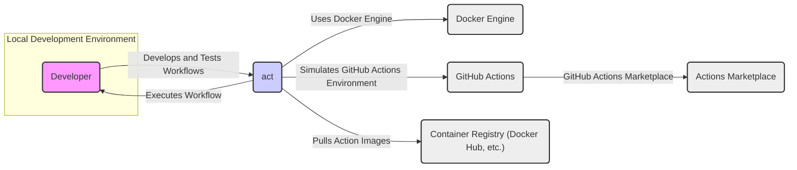
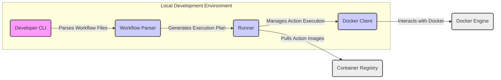
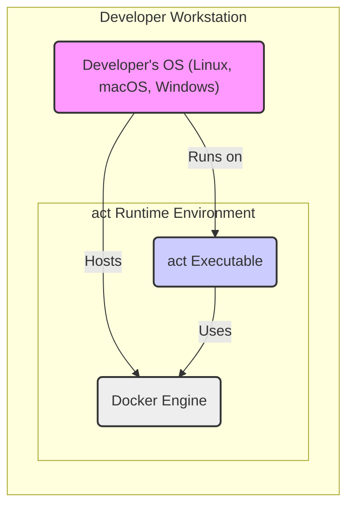
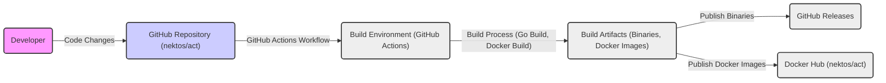

# BUSINESS POSTURE

This project, "act", aims to enable developers to run GitHub Actions workflows locally. This allows for faster iteration and debugging of workflows without needing to commit and push code to GitHub for every test.

- Business Priorities:
  - Improve developer productivity by enabling faster feedback loops for GitHub Actions development.
  - Reduce reliance on remote CI/CD runners for testing, potentially saving resources and time.
  - Enhance the developer experience by providing a local environment that closely mirrors the GitHub Actions execution environment.

- Business Goals:
  - Increase the efficiency of developing and maintaining GitHub Actions workflows.
  - Lower the cost associated with testing and debugging GitHub Actions on remote runners.
  - Promote wider adoption and more effective use of GitHub Actions within development teams.

- Business Risks:
  - Security risks associated with running potentially untrusted actions locally, especially if Docker images are not properly managed or if actions access sensitive local resources.
  - Compatibility issues between the local "act" environment and the actual GitHub Actions environment, leading to discrepancies in workflow behavior.
  - Risk of developers bypassing proper CI/CD processes by relying solely on local testing, potentially missing integration issues or security vulnerabilities that would be caught in a full CI/CD pipeline.

# SECURITY POSTURE

- Security Controls:
  - security control: Repository hosted on GitHub, benefiting from GitHub's security measures for code hosting and access control. (Implemented by: GitHub)
  - security control: Utilizes Docker for containerization, leveraging Docker's security features for container isolation. (Implemented by: Docker)
  - security control: Documentation provides guidance on running actions in a secure manner, including considerations for volumes and networking. (Implemented by: Documentation)

- Accepted Risks:
  - accepted risk: Users are responsible for the security of their local development environments where "act" is executed.
  - accepted risk: Users are responsible for the security of the Docker images used by "act" and the actions it runs.
  - accepted risk: Potential for actions to access local resources if not configured carefully, requiring user awareness and caution.

- Recommended Security Controls:
  - security control: Implement static analysis security testing (SAST) on the "act" codebase to identify potential vulnerabilities in the tool itself.
  - security control: Integrate Docker image scanning into the build process to ensure the base Docker images used by "act" are free from known vulnerabilities.
  - security control: Provide more detailed documentation and examples on securely configuring "act" to minimize the risk of actions accessing unintended local resources or introducing security issues.
  - security control: Consider implementing a mechanism to validate or sanitize action inputs to prevent potential injection attacks within the local execution environment.

- Security Requirements:
  - Authentication:
    - Not directly applicable to "act" itself as it's a local execution tool. However, actions run by "act" might interact with external services that require authentication. "act" should facilitate the secure handling of credentials required by actions, potentially through environment variables or mounted secrets.
  - Authorization:
    - Actions run by "act" operate within the permissions defined by the action's code and the user's local environment. "act" should not introduce new authorization mechanisms but should respect the authorization context of the actions it executes. Users need to be aware of the permissions granted to actions within their local environment.
  - Input Validation:
    - "act" should ensure that inputs provided to actions are handled safely within the local execution environment. While input validation is primarily the responsibility of the action code itself, "act" could potentially offer mechanisms to help users validate inputs before they are passed to actions, especially if inputs are sourced from external or untrusted sources.
  - Cryptography:
    - If actions utilize cryptography, "act" should not interfere with or weaken the cryptographic operations. "act" should provide a transparent environment for actions to perform cryptographic operations as they would in a standard GitHub Actions environment. Secure handling of cryptographic keys and secrets within actions remains the responsibility of the action developer and user.

# DESIGN

## C4 CONTEXT

- Context Diagram Elements:
  - - Name: Developer
    - Type: Person
    - Description: Software developer who uses "act" to develop and test GitHub Actions workflows locally.
    - Responsibilities: Develops, tests, and debugs GitHub Actions workflows before deploying them to GitHub. Uses "act" to simulate the GitHub Actions environment locally.
    - Security controls: Responsible for the security of their local development environment. Should follow secure coding practices when developing actions and using "act".
  - - Name: act
    - Type: Software System
    - Description: Command-line tool that allows developers to run GitHub Actions workflows locally. It simulates the GitHub Actions environment using Docker.
    - Responsibilities: Parses GitHub Actions workflow files, pulls necessary Docker images, executes actions within Docker containers, and provides output and logs similar to GitHub Actions.
    - Security controls: Implements secure handling of workflow definitions and action execution within the local environment. Relies on Docker for container isolation.
  - - Name: Docker Engine
    - Type: Software System
    - Description: Container runtime environment used by "act" to execute actions in isolated containers.
    - Responsibilities: Provides containerization and isolation for actions executed by "act". Manages container lifecycle and resource allocation.
    - Security controls: Docker Engine provides container isolation and security features. Users should ensure Docker Engine is securely configured and updated.
  - - Name: GitHub Actions
    - Type: Software System
    - Description: Cloud-based CI/CD service provided by GitHub. "act" aims to simulate its behavior locally.
    - Responsibilities: Executes GitHub Actions workflows in the cloud. Provides the official environment that "act" attempts to replicate locally.
    - Security controls: GitHub Actions platform implements comprehensive security controls for workflow execution, secrets management, and infrastructure security.
  - - Name: Container Registry (Docker Hub, etc.)
    - Type: Software System
    - Description: Public or private registry where Docker images for GitHub Actions are stored and retrieved.
    - Responsibilities: Hosts and distributes Docker images for actions. "act" pulls action images from container registries to execute workflows locally.
    - Security controls: Container registries should implement security scanning and access control for Docker images. Users should be mindful of the source and security of Docker images pulled by "act".
  - - Name: Actions Marketplace
    - Type: Software System
    - Description: GitHub Marketplace where pre-built GitHub Actions are published and discoverable.
    - Responsibilities: Provides a repository of reusable GitHub Actions. Actions used in workflows executed by "act" might be sourced from the Actions Marketplace.
    - Security controls: GitHub Actions Marketplace provides a platform for action discovery but does not guarantee the security of individual actions. Users should review and trust actions before using them.

## C4 CONTAINER

- Container Diagram Elements:
  - - Name: Developer CLI
    - Type: Container - Executable Application
    - Description: Command-line interface of "act" that developers interact with to initiate local workflow executions. Written in Go.
    - Responsibilities: Accepts user commands, reads workflow files, displays output and logs to the developer.
    - Security controls: Input validation on command-line arguments. Secure handling of configuration files if any.
  - - Name: Workflow Parser
    - Type: Container - Library/Module
    - Description: Component responsible for parsing GitHub Actions workflow files (YAML or JSON) and converting them into an internal representation. Part of the "act" application.
    - Responsibilities: Parses workflow syntax, validates workflow structure, extracts action definitions and execution steps.
    - Security controls: Input validation to prevent parsing vulnerabilities. Secure handling of potentially malicious workflow files.
  - - Name: Runner
    - Type: Container - Library/Module
    - Description: Core execution engine of "act" that orchestrates the execution of actions within Docker containers. Part of the "act" application.
    - Responsibilities: Manages the lifecycle of action containers, executes action steps, handles events and context, captures output and logs.
    - Security controls: Enforces container isolation, manages resource allocation for containers, handles secrets and environment variables securely within the container context.
  - - Name: Docker Client
    - Type: Container - Library/Module
    - Description:  Component that interacts with the Docker Engine API to manage containers, images, and volumes. Part of the "act" application.
    - Responsibilities: Sends commands to Docker Engine to create, start, stop, and remove containers. Pulls Docker images from registries.
    - Security controls: Secure communication with Docker Engine API. Proper handling of Docker credentials if needed.
  - - Name: Docker Engine
    - Type: External Container - Infrastructure Software
    - Description:  Container runtime environment that "act" relies on to execute actions in containers.
    - Responsibilities: Provides containerization and isolation. Manages container resources.
    - Security controls: Docker Engine's built-in security features. User responsibility to secure Docker Engine installation and configuration.
  - - Name: Container Registry
    - Type: External Container - Data Store
    - Description:  Remote registry (e.g., Docker Hub) where action Docker images are stored.
    - Responsibilities: Stores and serves Docker images.
    - Security controls: Registry's security controls for image storage and access. Image signing and scanning if available.

## DEPLOYMENT

"act" is primarily designed to be deployed and run on a developer's local machine. There isn't a typical "deployment" to a production environment for "act" itself. However, we can consider the deployment of "act" onto a developer's workstation as the relevant deployment scenario.

- Deployment Diagram Elements:
  - - Name: Developer's OS (Linux, macOS, Windows)
    - Type: Infrastructure - Operating System
    - Description: The operating system running on the developer's local machine where "act" is installed and executed.
    - Responsibilities: Provides the base environment for running "act" and Docker Engine. Manages system resources and security.
    - Security controls: Operating system security controls, including user access management, firewalls, and security updates. User responsibility to maintain a secure OS.
  - - Name: act Executable
    - Type: Software - Executable Application
    - Description: The compiled binary of the "act" command-line tool, installed on the developer's workstation.
    - Responsibilities: Provides the "act" functionality to the developer. Executes workflows by interacting with Docker Engine.
    - Security controls: Software integrity checks during installation. Permissions to prevent unauthorized modification.
  - - Name: Docker Engine
    - Type: Infrastructure - Container Runtime
    - Description: The Docker Engine installed on the developer's workstation, used by "act" to run containers.
    - Responsibilities: Provides container runtime environment for actions. Manages container lifecycle and resources.
    - Security controls: Docker Engine security features, including namespace isolation, cgroups, and security profiles. User responsibility to configure and maintain Docker Engine securely.

## BUILD

- Build Process Elements:
  - - Name: Developer
    - Type: Person
    - Description: Developers contributing to the "act" project.
    - Responsibilities: Writes code, submits pull requests, and contributes to the project.
    - Security controls: Code review process, secure coding practices.
  - - Name: GitHub Repository (nektos/act)
    - Type: Software - Code Repository
    - Description: GitHub repository hosting the source code of "act".
    - Responsibilities: Version control, code storage, collaboration platform.
    - Security controls: GitHub's security features for code hosting, access control, and vulnerability scanning.
  - - Name: GitHub Actions Workflow
    - Type: Software - CI/CD Pipeline
    - Description: GitHub Actions workflows defined in the repository for automating the build, test, and release process of "act".
    - Responsibilities: Automates build process, runs tests, builds binaries and Docker images, publishes releases.
    - Security controls: Secure workflow definitions, secrets management for publishing credentials, controlled access to workflow execution.
  - - Name: Build Environment (GitHub Actions)
    - Type: Infrastructure - CI/CD Environment
    - Description: GitHub Actions runners where the build workflows are executed.
    - Responsibilities: Provides compute resources for build process, executes build steps defined in workflows.
    - Security controls: GitHub Actions security controls for runner environment, isolation, and infrastructure security.
  - - Name: Build Artifacts (Binaries, Docker Images)
    - Type: Software - Build Output
    - Description: Compiled binaries for different platforms and Docker images of "act" produced by the build process.
    - Responsibilities: Distributable artifacts of the "act" project.
    - Security controls: Code signing for binaries, Docker image signing and scanning, integrity checks for artifacts.
  - - Name: GitHub Releases
    - Type: Software - Distribution Platform
    - Description: GitHub Releases feature used to distribute "act" binaries.
    - Responsibilities: Hosts and distributes "act" binaries for users to download.
    - Security controls: GitHub's security features for file hosting and distribution. Integrity checks (e.g., checksums) for released binaries.
  - - Name: Docker Hub (nektos/act)
    - Type: Software - Container Registry
    - Description: Docker Hub repository where "act" Docker images are published.
    - Responsibilities: Hosts and distributes "act" Docker images.
    - Security controls: Docker Hub's security features for image storage and access control. Image scanning and signing.

# RISK ASSESSMENT

- Critical Business Processes:
  - Secure and efficient software development lifecycle for projects using GitHub Actions.
  - Developer productivity and reduced feedback loop in GitHub Actions workflow development.

- Data to Protect:
  - Source code of "act" (Low sensitivity, publicly available).
  - Build process integrity and artifacts (Medium sensitivity, ensuring no malicious modifications).
  - User's local environment and potentially sensitive data accessed by actions run locally (High sensitivity, user responsibility).

- Data Sensitivity:
  - Public code repository: Low sensitivity.
  - Build artifacts: Medium sensitivity (integrity is important).
  - User's local environment data: High sensitivity (secrets, personal data, project data).

# QUESTIONS & ASSUMPTIONS

- Questions:
  - What is the intended user base's security expertise level? Are they expected to be security-conscious developers?
  - Are there specific compliance requirements that "act" needs to adhere to (e.g., for handling user data, although it's a local tool)?
  - What is the expected threat model for "act"? Are we primarily concerned about vulnerabilities in "act" itself, or misuse by users, or malicious actions?

- Assumptions:
  - BUSINESS POSTURE:
    - The primary business driver is developer productivity and efficiency.
    - Cost reduction in CI/CD testing is a secondary benefit.
    - Security is important but balanced with usability and developer experience.
  - SECURITY POSTURE:
    - Users are developers with some understanding of security best practices, but may not be security experts.
    - Users are responsible for securing their local environments and Docker setups.
    - The project aims to provide a secure tool, but user education and responsible usage are crucial.
  - DESIGN:
    - "act" is designed to be a lightweight, command-line tool for local development.
    - Docker is a core dependency and assumed to be available in the user's environment.
    - The architecture is relatively simple, focused on workflow parsing, execution, and Docker interaction.