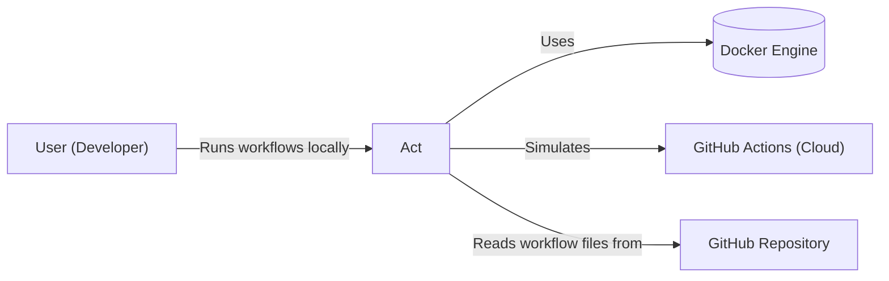
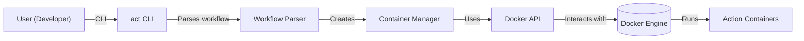
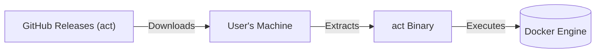
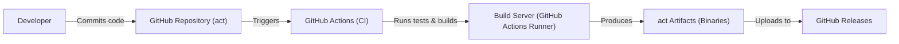

# Project Design Document: act

## BUSINESS POSTURE

_Priorities and Goals:_

The primary goal of `act` is to enable developers to test their GitHub Actions workflows locally, without needing to push code to GitHub and wait for the cloud-based runners. This significantly speeds up the development and debugging cycle for GitHub Actions. It aims to provide a faithful reproduction of the GitHub Actions environment, allowing for consistent and reliable testing. The project prioritizes ease of use, speed, and accuracy in mimicking the GitHub Actions environment.

_Business Risks:_

-   _Inaccurate Workflow Execution:_ If `act` fails to accurately simulate the GitHub Actions environment, developers might encounter discrepancies between local testing and actual behavior on GitHub, leading to deployment issues and wasted time.
-   _Security Vulnerabilities in Dependencies:_ `act` relies on Docker and other third-party tools. Vulnerabilities in these dependencies could be exploited, potentially compromising the user's system or CI/CD pipeline.
-   _Maintenance and Support Overhead:_ As GitHub Actions evolves, `act` needs to be continuously updated to maintain compatibility. Failure to do so could render the tool obsolete and disrupt users' workflows.
-   _Lack of Support for Advanced Features:_ `act` may not support all features of GitHub Actions, especially complex or newly introduced ones. This limitation could hinder the adoption of `act` for projects that rely on these features.
-   _Supply Chain Attacks:_ The `act` project itself, or its distribution channels, could be targeted by supply chain attacks, leading to the distribution of compromised versions of the tool.

## SECURITY POSTURE

_Existing Security Controls:_

-   security control: _Dependency Management:_ The project uses Go modules for dependency management, allowing for version pinning and vulnerability scanning (though the extent of scanning is not explicitly stated in the repository).
-   security control: _Code Reviews:_ The project is open-source and hosted on GitHub, implying that code reviews are part of the development process.
-   security control: _Testing:_ The project includes tests, although the extent and type of testing (unit, integration, security) are not fully detailed in the provided repository link.
-   security control: _Issue Tracking:_ GitHub Issues are used to track bugs and feature requests, which indirectly helps in managing security vulnerabilities reported by users.

_Accepted Risks:_

-   accepted risk: _Limited Security Auditing:_ There's no explicit mention of regular security audits or penetration testing.
-   accepted risk: _Docker Image Security:_ The project relies heavily on Docker, and the security of the base images used is not explicitly addressed.
-   accepted risk: _GitHub Actions Feature Parity:_ `act` may not perfectly replicate all GitHub Actions features, potentially leading to security-relevant differences in behavior.
-   accepted risk: _Supply Chain Security of Dependencies:_ While Go modules provide some protection, the project's security is still dependent on the security of its dependencies.

_Recommended Security Controls:_

-   security control: _Regular Security Audits:_ Conduct regular security audits and penetration testing to identify and address potential vulnerabilities.
-   security control: _SAST and DAST:_ Integrate Static Application Security Testing (SAST) and Dynamic Application Security Testing (DAST) tools into the CI/CD pipeline.
-   security control: _Software Composition Analysis (SCA):_ Implement SCA to continuously monitor and manage vulnerabilities in third-party dependencies.
-   security control: _Harden Docker Images:_ Use minimal base images, regularly update them, and scan them for vulnerabilities.
-   security control: _Code Signing:_ Sign releases to ensure the integrity of the distributed binaries.
-   security control: _Secrets Management:_ Provide clear guidance on how to securely manage secrets when using `act`.

_Security Requirements:_

-   _Authentication:_ Not directly applicable to `act` itself, as it leverages the user's existing GitHub credentials (if needed for private repositories or actions). However, `act` should handle these credentials securely, avoiding storage in plain text or insecure locations.
-   _Authorization:_ `act` should accurately simulate GitHub Actions' permission model, ensuring that workflows run with the expected privileges.
-   _Input Validation:_ `act` should validate user inputs, such as workflow files and environment variables, to prevent injection attacks or unexpected behavior.
-   _Cryptography:_ If `act` handles sensitive data (e.g., secrets), it should use appropriate cryptographic techniques to protect it. This includes secure storage and transmission of secrets.

## DESIGN

### C4 CONTEXT

_Elements Description:_

-   1.  Name: User (Developer)
    2.  Type: Person
    3.  Description: A developer who wants to test GitHub Actions workflows locally.
    4.  Responsibilities:
        -   Writes and modifies GitHub Actions workflow files.
        -   Runs `act` to execute workflows locally.
        -   Provides necessary inputs and configurations to `act`.
    5.  Security controls:
        -   Uses strong passwords and multi-factor authentication for their GitHub account.
        -   Keeps their local development environment secure.

-   1.  Name: Act
    2.  Type: Software System
    3.  Description: The `act` tool, which simulates the GitHub Actions environment locally.
    4.  Responsibilities:
        -   Parses GitHub Actions workflow files.
        -   Manages Docker containers to execute workflow steps.
        -   Provides a command-line interface for users to interact with.
        -   Simulates GitHub Actions environment variables and contexts.
    5.  Security controls:
        -   Dependency management using Go modules.
        -   Code reviews as part of the development process.
        -   Basic testing to ensure functionality.

-   1.  Name: Docker Engine
    2.  Type: Software System
    3.  Description: Docker Engine, used by `act` to run workflow steps in isolated containers.
    4.  Responsibilities:
        -   Provides a container runtime environment.
        -   Manages Docker images and containers.
        -   Isolates workflow steps from the host system.
    5.  Security controls:
        -   Relies on Docker's built-in security features (e.g., namespaces, cgroups).
        -   Security of Docker images used is crucial.

-   1.  Name: GitHub Actions (Cloud)
    2.  Type: Software System
    3.  Description: The cloud-based GitHub Actions service, which `act` aims to simulate.
    4.  Responsibilities:
        -   Provides a platform for running CI/CD workflows.
        -   Manages runners, jobs, and steps.
        -   Provides various integrations and features for automation.
    5.  Security controls:
        -   GitHub's security infrastructure and practices.

-   1.  Name: GitHub Repository
    2.  Type: Software System
    3.  Description: The GitHub repository containing the workflow files and source code.
    4.  Responsibilities:
        -   Stores the project's source code and workflow definitions.
        -   Provides version control and collaboration features.
    5.  Security controls:
        -   GitHub's repository security features (e.g., branch protection, access controls).

### C4 CONTAINER

_Elements Description:_

-   1.  Name: User (Developer)
    2.  Type: Person
    3.  Description: A developer who wants to test GitHub Actions workflows locally.
    4.  Responsibilities:
        -   Writes and modifies GitHub Actions workflow files.
        -   Runs `act` to execute workflows locally.
        -   Provides necessary inputs and configurations to `act`.
    5.  Security controls:
        -   Uses strong passwords and multi-factor authentication for their GitHub account.
        -   Keeps their local development environment secure.

-   1.  Name: act CLI
    2.  Type: Container (Application)
    3.  Description: The command-line interface for `act`.
    4.  Responsibilities:
        -   Receives commands and arguments from the user.
        -   Initiates the workflow execution process.
        -   Displays output and results to the user.
    5.  Security controls:
        -   Input validation to prevent command injection.

-   1.  Name: Workflow Parser
    2.  Type: Container (Application)
    3.  Description: Component responsible for parsing GitHub Actions workflow files.
    4.  Responsibilities:
        -   Reads and interprets workflow YAML files.
        -   Extracts information about jobs, steps, and dependencies.
        -   Validates the syntax and structure of the workflow file.
    5.  Security controls:
        -   Secure parsing of YAML to prevent injection vulnerabilities.
        -   Schema validation against the GitHub Actions workflow schema.

-   1.  Name: Container Manager
    2.  Type: Container (Application)
    3.  Description: Component that manages the creation and execution of Docker containers.
    4.  Responsibilities:
        -   Creates Docker containers based on the workflow definition.
        -   Manages the lifecycle of containers (start, stop, remove).
        -   Handles communication between containers and the host system.
    5.  Security controls:
        -   Secure configuration of Docker containers.
        -   Resource limits to prevent denial-of-service attacks.

-   1.  Name: Docker API
    2.  Type: Container (Library/API)
    3.  Description: The API used by `act` to interact with the Docker Engine.
    4.  Responsibilities:
        -   Provides an interface for creating, managing, and monitoring containers.
        -   Abstracts the underlying Docker commands.
    5.  Security controls:
        -   Secure communication with the Docker Engine (e.g., using TLS if necessary).

-   1.  Name: Docker Engine
    2.  Type: Container (Software System)
    3.  Description: Docker Engine, used by `act` to run workflow steps in isolated containers.
    4.  Responsibilities:
        -   Provides a container runtime environment.
        -   Manages Docker images and containers.
        -   Isolates workflow steps from the host system.
    5.  Security controls:
        -   Relies on Docker's built-in security features (e.g., namespaces, cgroups).
        -   Security of Docker images used is crucial.

-   1.  Name: Action Containers
    2.  Type: Container (Docker Container)
    3.  Description: Docker containers created by `act` to execute individual workflow steps.
    4.  Responsibilities:
        -   Run the commands specified in the workflow steps.
        -   Provide an isolated environment for each step.
    5.  Security controls:
        -   Isolation provided by Docker.
        -   Security of the base images and any installed software within the container.

### DEPLOYMENT

_Possible Deployment Solutions:_

1.  _Local Installation (Binary):_ Users download a pre-built binary for their operating system and architecture.
2.  _Installation via Package Managers:_ `act` can be installed using package managers like `brew` (macOS), `choco` (Windows), or `apt` (Linux).
3.  _Containerized Deployment:_ `act` itself could be run within a Docker container.
4.  _Build from Source:_ Users can clone the repository and build `act` from source.

_Chosen Solution (Detailed Description): Local Installation (Binary)_

This is the most common and user-friendly approach.

_Elements Description:_

-   1.  Name: GitHub Releases (act)
    2.  Type: Infrastructure Node (Server)
    3.  Description: The GitHub Releases page for the `act` project, hosting pre-built binaries.
    4.  Responsibilities:
        -   Stores and serves `act` binaries for different platforms.
    5.  Security controls:
        -   GitHub's infrastructure security.
        -   Code signing of releases (recommended).

-   1.  Name: User's Machine
    2.  Type: Infrastructure Node (Workstation)
    3.  Description: The user's local development machine.
    4.  Responsibilities:
        -   Downloads and executes the `act` binary.
        -   Runs Docker Engine.
    5.  Security controls:
        -   User's responsibility to keep their system secure.
        -   Firewall, antivirus, and other security software.

-   1.  Name: act Binary
    2.  Type: Software
    3.  Description: The downloaded and extracted `act` executable.
    4.  Responsibilities:
        -   Executes `act`'s functionality.
    5.  Security controls:
        -   Integrity checks (e.g., checksum verification).

-   1.  Name: Docker Engine
    2.  Type: Software System
    3.  Description: Docker Engine, used by `act` to run workflow steps in isolated containers.
    4.  Responsibilities:
        -   Provides a container runtime environment.
        -   Manages Docker images and containers.
        -   Isolates workflow steps from the host system.
    5.  Security controls:
        -   Relies on Docker's built-in security features (e.g., namespaces, cgroups).
        -   Security of Docker images used is crucial.

### BUILD

_Build Process Description:_

1.  _Developer Commits Code:_ A developer commits changes to the `act` source code in the GitHub repository.
2.  _GitHub Actions Triggered:_ The commit triggers a GitHub Actions workflow (CI pipeline).
3.  _Build Server Executes:_ A GitHub Actions runner (build server) is provisioned.
4.  _Tests and Build:_ The workflow executes various steps, including:
    -   _Checkout Code:_ The source code is checked out from the repository.
    -   _Setup Go:_ The Go environment is set up.
    -   _Run Tests:_ Unit tests, integration tests, and potentially linters are executed.
    -   _Build Binaries:_ `act` binaries are built for different operating systems and architectures.
    -   _Security Checks:_ SAST (Static Application Security Testing) and SCA (Software Composition Analysis) tools are run to identify potential vulnerabilities.
5.  _Artifacts Produced:_ The build process produces `act` binaries (artifacts).
6.  _Upload to GitHub Releases:_ The artifacts are uploaded to the GitHub Releases page for the project, making them available for download.

_Security Controls:_

-   security control: _Automated Build Process:_ The build process is fully automated using GitHub Actions, ensuring consistency and reproducibility.
-   security control: _Testing:_ Unit and integration tests are run as part of the build process to catch bugs and regressions.
-   security control: _SAST:_ Static analysis tools are used to identify potential security vulnerabilities in the code.
-   security control: _SCA:_ Software Composition Analysis tools are used to identify vulnerabilities in third-party dependencies.
-   security control: _Build Environment Security:_ The GitHub Actions runners are managed by GitHub and provide a relatively secure build environment.
-   security control: _Code Signing (Recommended):_ The released binaries should be code-signed to ensure their integrity and authenticity.

## RISK ASSESSMENT

_Critical Business Processes:_

-   _Local Testing of GitHub Actions Workflows:_ The core functionality of `act` is to enable developers to test their workflows locally. This is a critical business process as it directly impacts developer productivity and the reliability of CI/CD pipelines.
-   _Continuous Integration and Continuous Delivery (CI/CD):_ `act` supports CI/CD by allowing developers to test their workflows before pushing them to GitHub.

_Data Protection:_

-   _Workflow Files:_ These files define the CI/CD process and may contain sensitive information, such as deployment scripts or environment variables. _Sensitivity: Medium_
-   _Source Code:_ The source code of the project being tested, which may contain proprietary logic or intellectual property. _Sensitivity: Medium to High_
-   _Environment Variables:_ These variables may contain secrets, such as API keys or passwords. _Sensitivity: High_
-   _Docker Images:_ The Docker images used by `act` may contain sensitive data or vulnerabilities. _Sensitivity: Medium to High_
-   _User Credentials:_ `act` may interact with the user's GitHub credentials (e.g., for private repositories). _Sensitivity: High_

## QUESTIONS & ASSUMPTIONS

_Questions:_

-   What is the specific process for managing dependencies and ensuring their security?
-   What types of tests are included in the project (unit, integration, end-to-end, security)?
-   Are there any plans for regular security audits or penetration testing?
-   How are secrets (e.g., API keys, passwords) handled when using `act`?
-   What is the process for updating `act` to maintain compatibility with new GitHub Actions features?
-   What is the process for handling user-reported security vulnerabilities?
-   Are there any specific security configurations or best practices that users should follow when using `act`?

_Assumptions:_

-   _BUSINESS POSTURE:_ The project prioritizes ease of use and developer productivity. The project has a moderate risk appetite, balancing functionality with security.
-   _SECURITY POSTURE:_ The project relies on GitHub's security infrastructure for repository and CI/CD security. The project assumes that users are responsible for securing their own development environments. The project assumes that users are aware of the potential risks of using Docker and take appropriate precautions.
-   _DESIGN:_ The project is designed to be modular and extensible. The project uses Docker as its primary containerization technology. The project's build process is automated using GitHub Actions.