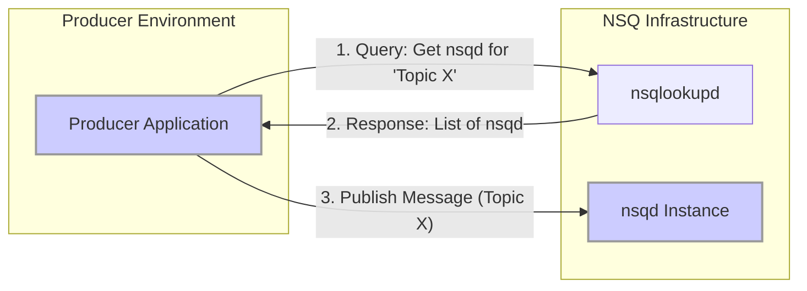
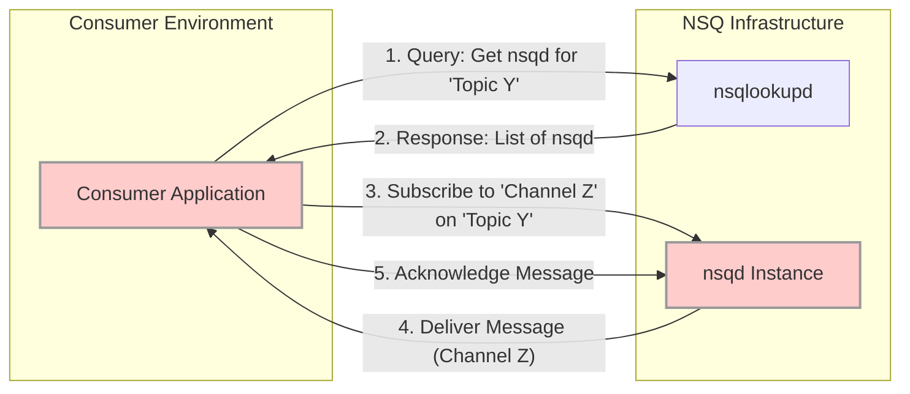
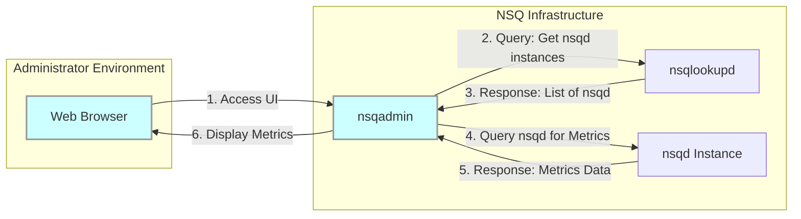

# Project Design Document: NSQ Distributed Messaging Platform

**Version:** 1.1
**Date:** October 26, 2023
**Author:** AI Software Architect

## 1. Introduction

This document provides a detailed architectural design of the NSQ distributed messaging platform. It outlines the core components, their interactions, data flows, and key considerations relevant for understanding the system's structure and potential security vulnerabilities. This document is specifically designed to serve as the foundation for subsequent threat modeling activities.

## 2. Goals and Non-Goals

### 2.1. Goals

*   Clearly define the architecture of the NSQ messaging platform, focusing on elements relevant to security analysis.
*   Describe the roles and responsibilities of each core component, highlighting their trust boundaries and potential attack surfaces.
*   Illustrate the data flow between components, emphasizing the movement of sensitive information.
*   Identify key communication protocols and data formats, noting any inherent security characteristics or vulnerabilities.
*   Highlight important operational aspects relevant to security, such as deployment patterns and configuration options.

### 2.2. Non-Goals

*   Provide a step-by-step guide to NSQ installation and configuration.
*   Detail every possible configuration parameter or command-line option.
*   Include performance benchmarking data or optimization strategies.
*   Offer specific security hardening recommendations or implementation details (these will be the output of the threat modeling phase).

## 3. Architectural Overview

NSQ is a real-time distributed messaging platform engineered for high-throughput message delivery with guarantees of message delivery and minimal latency. Its decentralized nature avoids single points of failure, enhancing resilience.

### 3.1. Key Components

*   **`nsqd`:** The core message broker daemon responsible for receiving, queuing, and delivering messages. It manages topics and channels independently.
*   **`nsqlookupd`:** The directory service daemon that maintains a real-time registry of `nsqd` instances and the topics they manage. It facilitates service discovery for producers and consumers.
*   **`nsqadmin`:** A web-based user interface for monitoring and basic administration of the NSQ cluster. It provides visibility into the state of topics, channels, and `nsqd` instances.
*   **Producers:** Applications or services that generate and publish messages to specific NSQ topics.
*   **Consumers:** Applications or services that subscribe to specific NSQ channels within topics to receive and process messages.

## 4. Component Details

### 4.1. `nsqd`

*   **Role:** The central message processing and queuing component.
*   **Responsibilities:**
    *   Accepting messages from producers over the network.
    *   Persisting messages in memory and optionally to disk for durability.
    *   Organizing messages into topics and channels.
    *   Delivering messages to connected consumers subscribed to specific channels.
    *   Tracking message acknowledgments (ACKs) from consumers to ensure delivery guarantees.
    *   Handling negative acknowledgments (NACKs) and message redelivery.
    *   Enforcing message retention policies based on configuration.
    *   Providing an HTTP API for administrative tasks and health checks.
    *   Registering its presence and topic information with one or more `nsqlookupd` instances.
*   **Key Features Relevant to Security:**
    *   Configurable TLS support for encrypting network communication.
    *   Optional client certificate authentication for producers and consumers.
    *   Authorization mechanisms to control publish and subscribe access (configurable).
    *   Mechanisms for limiting resource consumption (e.g., queue sizes).
    *   Logging of events, which can be crucial for security auditing.

### 4.2. `nsqlookupd`

*   **Role:** The service discovery and coordination component.
*   **Responsibilities:**
    *   Maintaining an up-to-date registry of active `nsqd` instances and the topics they host.
    *   Responding to queries from producers seeking `nsqd` instances for a given topic.
    *   Responding to queries from consumers seeking `nsqd` instances that have a specific topic.
    *   Providing an HTTP API for administrative tasks and querying the registry.
*   **Key Features Relevant to Security:**
    *   Relatively simple design, reducing the attack surface.
    *   Can be configured to require authentication for administrative API access.
    *   Its availability is critical for the overall functioning of the NSQ cluster.

### 4.3. `nsqadmin`

*   **Role:** The monitoring and administrative user interface.
*   **Responsibilities:**
    *   Providing a web-based dashboard to visualize the status of the NSQ cluster.
    *   Displaying real-time metrics on topics, channels, and queue depths.
    *   Allowing administrators to perform basic management operations, such as creating or deleting topics and channels.
*   **Key Features Relevant to Security:**
    *   Web-based interface, making it susceptible to common web application vulnerabilities.
    *   Typically connects to `nsqlookupd` to discover `nsqd` instances.
    *   Should be protected with appropriate authentication and authorization mechanisms.

### 4.4. Producers

*   **Role:** The source of messages within the NSQ ecosystem.
*   **Responsibilities:**
    *   Discovering available `nsqd` instances for a target topic by querying `nsqlookupd`.
    *   Establishing connections to one or more `nsqd` instances.
    *   Publishing messages to specific topics.
    *   Handling potential network errors or failures during message transmission.
*   **Communication:** Primarily uses the NSQ TCP protocol or the HTTP API to interact with `nsqd`.

### 4.5. Consumers

*   **Role:** The destination for messages within the NSQ ecosystem.
*   **Responsibilities:**
    *   Discovering `nsqd` instances hosting the desired topic by querying `nsqlookupd`.
    *   Connecting to one or more `nsqd` instances.
    *   Subscribing to specific channels within a topic to receive messages.
    *   Processing received messages.
    *   Sending acknowledgments (ACKs) to `nsqd` upon successful message processing.
    *   Sending negative acknowledgments (NACKs) to request message redelivery.
*   **Communication:** Primarily uses the NSQ TCP protocol to interact with `nsqd`.

## 5. Data Flow Diagrams

### 5.1. Message Publishing Flow (Focus on Data Origin and Destination)

*   **Step 1:** The producer application queries `nsqlookupd` to find the location of `nsqd` instances responsible for the target topic. This query might contain information about the topic itself.
*   **Step 2:** `nsqlookupd` responds with a list of `nsqd` instances. This response reveals the infrastructure topology to the producer.
*   **Step 3:** The producer sends the message, intended for a specific topic, to a chosen `nsqd` instance. This message constitutes the core data being transmitted.

### 5.2. Message Consumption Flow (Focus on Data Retrieval and Processing)

*   **Step 1:** The consumer application queries `nsqlookupd` to discover `nsqd` instances that handle the desired topic.
*   **Step 2:** `nsqlookupd` provides the consumer with a list of relevant `nsqd` instances.
*   **Step 3:** The consumer connects to a chosen `nsqd` and subscribes to a specific channel within the topic. This action establishes the data stream.
*   **Step 4:** `nsqd` delivers messages belonging to the subscribed channel to the consumer. This is the point where the consumer receives the actual message data.
*   **Step 5:** The consumer sends an acknowledgment back to `nsqd`, confirming successful processing of the message.

### 5.3. `nsqadmin` Monitoring Flow (Focus on Administrative Access and Data Exposure)

*   **Step 1:** An administrator accesses the `nsqadmin` web interface, potentially over an unencrypted connection.
*   **Step 2:** `nsqadmin` queries `nsqlookupd` to discover the available `nsqd` instances.
*   **Step 3:** `nsqlookupd` provides a list of `nsqd` instances, revealing the cluster topology.
*   **Step 4:** `nsqadmin` queries individual `nsqd` instances for their internal metrics and status.
*   **Step 5:** `nsqd` instances respond with potentially sensitive operational data.
*   **Step 6:** `nsqadmin` displays this information in the web UI, making it accessible to the administrator.

## 6. Communication Protocols and Data Formats

*   **NSQ TCP Protocol:** A custom binary protocol used for high-performance communication between producers, consumers, and `nsqd`. Its binary nature can make manual inspection and debugging more challenging.
    *   Supports commands for publishing, subscribing, acknowledging, and managing connections.
    *   Can be secured with TLS encryption.
*   **HTTP:** Used for communication with `nsqadmin`, `nsqlookupd`, and optionally `nsqd` (for publishing).
    *   Susceptible to standard web vulnerabilities if not properly secured (e.g., XSS, CSRF).
    *   Can be secured with HTTPS (TLS).
*   **Data Format:** Messages are treated as opaque byte arrays by NSQ. The format of the message content is determined by the producer and interpreted by the consumer. Common formats include:
    *   JSON (human-readable, but can be verbose).
    *   Protocol Buffers (binary, efficient, requires schema definition).
    *   Avro (supports schema evolution).
    *   Plain text.

## 7. Security Considerations (Detailed)

*   **Authentication and Authorization:**
    *   NSQ supports configurable authentication mechanisms to verify the identity of producers and consumers.
    *   Authorization controls determine which entities can publish to specific topics or subscribe to specific channels.
    *   Misconfigured or weak authentication/authorization can lead to unauthorized access and data breaches.
*   **Transport Layer Security (TLS):**
    *   TLS can be enabled to encrypt communication between all NSQ components, protecting data in transit from eavesdropping and tampering.
    *   Proper certificate management and configuration are crucial for the effectiveness of TLS.
*   **Network Segmentation:**
    *   Deploying NSQ components within isolated network segments can limit the impact of a security breach.
    *   Firewall rules should be configured to restrict access to only necessary ports and protocols.
*   **Input Validation (Application Level):**
    *   NSQ does not perform validation on message content. Applications using NSQ must implement robust input validation to prevent injection attacks or processing of malicious data.
*   **Rate Limiting:**
    *   Implementing rate limiting on producers and consumers can help prevent denial-of-service attacks and resource exhaustion.
    *   NSQ provides some built-in mechanisms for managing queue sizes and flow control.
*   **Logging and Auditing:**
    *   Comprehensive logging of events within NSQ components is essential for security monitoring, incident response, and auditing.
    *   Logs should include information about connection attempts, authentication events, and administrative actions.
*   **Web UI Security (`nsqadmin`):**
    *   `nsqadmin` should be protected with strong authentication and authorization to prevent unauthorized access to monitoring data and administrative functions.
    *   Regular security assessments should be performed to identify and mitigate web application vulnerabilities.
*   **Service Discovery Security (`nsqlookupd`):**
    *   While `nsqlookupd` itself doesn't store message data, its compromise could disrupt the entire messaging system.
    *   Securing access to its administrative API is important.

## 8. Deployment Considerations (Security Implications)

*   **Clustered Deployment:**
    *   While enhancing availability, a clustered deployment increases the attack surface due to the larger number of interconnected components.
    *   Secure communication between cluster members is crucial.
*   **Public vs. Private Networks:**
    *   Exposing NSQ components directly to the public internet significantly increases the risk of attack.
    *   Deployment within private networks with restricted access is recommended.
*   **Containerization (e.g., Docker, Kubernetes):**
    *   Containerization can provide isolation and simplify deployment, but container security best practices must be followed.
    *   Properly configured network policies and resource limits are essential.
*   **Resource Management:**
    *   Insufficient resources can lead to performance degradation and potential denial-of-service.
    *   Over-provisioning can increase the cost and complexity of the infrastructure.

## 9. Future Considerations (For Threat Modeling Focus)

*   **Message Confidentiality at Rest:**  Explore mechanisms for encrypting messages stored on disk by `nsqd`.
*   **Fine-grained Access Control:** Investigate the possibility of more granular access control policies based on message content or other attributes.
*   **Integration with Security Information and Event Management (SIEM) Systems:**  Consider how NSQ logs can be effectively integrated with SIEM tools for centralized monitoring and analysis.
*   **Resilience to Network Partitioning:** Analyze the system's behavior and security implications during network partitions or failures.
*   **Third-party Integrations:**  Assess the security implications of integrating NSQ with other systems and services.

This improved design document provides a more detailed and security-focused overview of the NSQ architecture. It highlights key areas and data flows that are particularly relevant for identifying potential threats and vulnerabilities during the threat modeling process.