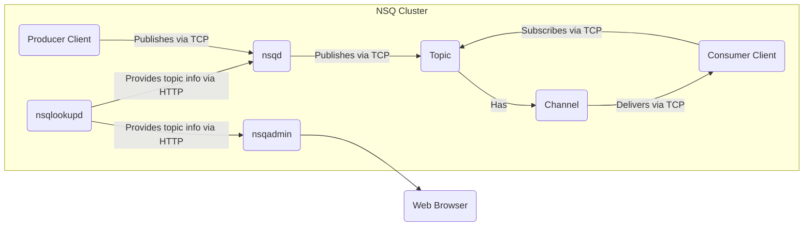
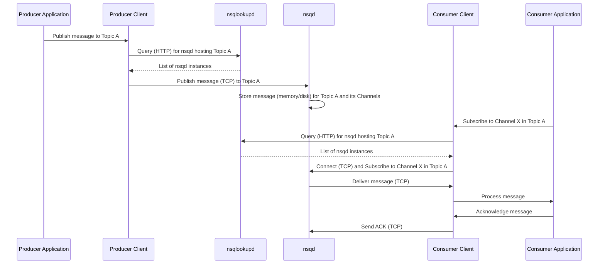

# Project Design Document: NSQ - Real-time Distributed Messaging Platform

**Version:** 1.1
**Date:** October 26, 2023
**Author:** AI Software Architect

## 1. Project Overview

This document provides an enhanced design overview of the NSQ distributed messaging platform, as described in the provided GitHub repository (https://github.com/nsqio/nsq). This revised document aims to offer greater clarity and detail, serving as a robust foundation for subsequent threat modeling activities. It meticulously outlines the key components, their interactions, and the overall architecture of the system.

## 2. Goals

* Deliver a more detailed and comprehensive overview of the NSQ architecture.
* Clearly articulate the roles, responsibilities, and key functionalities of each major component.
* Provide enhanced illustrations of the data flow within the NSQ system, including protocol details.
* Identify key security boundaries and potential areas of concern with greater specificity for future threat modeling.
* Serve as an improved and more informative reference document for security assessments and development activities.

## 3. Non-Goals

* This document still does not delve into the specific implementation details of the NSQ codebase at a granular level.
* It maintains its focus on architectural design and does not cover exhaustive deployment configurations or intricate operational procedures.
* It is not intended to be a comprehensive user manual or API reference for NSQ.
* This document's primary purpose remains to prepare the groundwork for threat modeling, not to perform the threat modeling itself.

## 4. Target Audience

* Security Engineers
* Software Architects
* Developers working with or on NSQ
* Operations Engineers managing NSQ deployments
* Anyone needing a detailed understanding of NSQ's architecture for security analysis.

## 5. Architectural Overview

NSQ employs a decentralized, distributed architecture built for scalability and resilience. The core components interact using well-defined protocols to ensure reliable message delivery.

**Key Components:**

* **nsqd:** The core daemon, acting as the message broker responsible for receiving, queuing, and delivering messages.
    * Manages named **topics**, representing a stream of messages.
    * Within each topic, manages **channels**, which are virtual queues where consumers subscribe.
    * Persists messages to disk (using a configurable backend) for durability if configured.
    * Establishes and maintains TCP connections with producers and consumers.
    * Exposes an HTTP API for administrative tasks, health checks, and metrics.
* **nsqlookupd:** The discovery service daemon that maintains a real-time directory of topology information for the NSQ cluster.
    * Producers query `nsqlookupd` via HTTP to discover available `nsqd` instances hosting the desired topic.
    * Consumers query `nsqlookupd` via HTTP to discover `nsqd` instances that have the topic they wish to subscribe to.
* **nsqadmin:** A web-based user interface providing a real-time dashboard and management capabilities for the NSQ cluster.
    * Allows monitoring of the state of topics, channels, and individual `nsqd` nodes.
    * Provides administrative functions like creating and deleting topics and channels, pausing and unpausing channels, and viewing configuration.
    * Communicates with `nsqd` and `nsqlookupd` primarily through their respective HTTP APIs.
* **Producer Client:** A client library (available in various programming languages) used by applications to publish messages to a specific topic on an `nsqd` instance.
    * Connects to `nsqd` instances using TCP.
    * Serializes and sends messages to `nsqd`.
    * Handles connection management, retries, and error handling.
* **Consumer Client:** A client library used by applications to subscribe to a specific channel within a topic on an `nsqd` instance and receive messages.
    * Connects to one or more `nsqd` instances using TCP.
    * Negotiates subscription to a specific channel.
    * Receives messages pushed from `nsqd`.
    * Sends acknowledgements (ACKs) to `nsqd` upon successful message processing or negative acknowledgements (NACKs) for redelivery.
    * Manages connection state, heartbeats, and backoff strategies.
* **Topic:** A fundamental organizing principle in NSQ, representing a named stream of messages of a particular type or category.
* **Channel:** A virtual queue associated with a topic.
    * Consumers subscribe to channels to receive messages.
    * All messages published to a topic are replicated to all its channels.
    * Each channel operates independently, allowing for different consumer groups to process the same stream of messages.
    * Messages within a channel are distributed among its connected consumers, typically using a round-robin approach.

## 6. Component Details

### 6.1. nsqd

* **Functionality:**
    * **Message Ingestion:** Accepts messages from producers over TCP.
    * **Queue Management:**  Maintains in-memory and optionally disk-backed queues for topics and channels. Uses a persistent queue (`pq`) on disk for durability.
    * **Topic and Channel Management:** Creates, manages, and destroys topics and channels.
    * **Message Delivery:** Pushes messages to subscribing consumers over TCP.
    * **Client Management:** Handles connection establishment, heartbeats, and disconnections with both producer and consumer clients.
    * **HTTP API:** Provides endpoints for:
        * Publishing messages (e.g., `/pub`, `/mpub`).
        * Administering topics and channels (e.g., creating, deleting, pausing).
        * Retrieving metrics and statistics.
        * Performing health checks (`/ping`).
    * **TLS Support:** Can be configured to use TLS for secure communication with clients.
    * **Message Protocol:** Uses a binary protocol for efficient communication with clients.
* **Key Responsibilities:** Reliable message queuing and delivery, managing the lifecycle of messages within topics and channels, providing operational insights through its API.

### 6.2. nsqlookupd

* **Functionality:**
    * **Registration:**  `nsqd` instances register themselves with `nsqlookupd`, advertising the topics they host.
    * **Lookup:**  Provides HTTP endpoints for producers and consumers to query for `nsqd` instances that handle a specific topic.
    * **Data Storage:** Maintains an in-memory registry of topic and `nsqd` mappings.
    * **HTTP API:** Provides endpoints for:
        * `nsqd` registration and unregistration (`/register`, `/unregister`).
        * Topic lookup for producers (`/lookup`).
        * Topic and node discovery for consumers and `nsqadmin` (`/topics`, `/nodes`).
        * Health checks (`/ping`).
* **Key Responsibilities:** Service discovery for the NSQ cluster, maintaining a consistent view of the cluster topology.

### 6.3. nsqadmin

* **Functionality:**
    * **Dashboard:** Presents a real-time view of the NSQ cluster's health and performance.
    * **Topic and Channel Monitoring:** Displays metrics like message counts, queue depths, and consumer counts for each topic and channel.
    * **Node Monitoring:** Shows the status and metrics of individual `nsqd` and `nsqlookupd` instances.
    * **Administrative Actions:** Allows users to create and delete topics and channels, empty channels, pause and unpause channels, and perform other management tasks.
    * **HTTP Communication:** Interacts with `nsqd` and `nsqlookupd` by making requests to their HTTP APIs.
* **Key Responsibilities:** Providing a user-friendly interface for monitoring and managing the NSQ cluster.

### 6.4. Producer Client

* **Functionality:**
    * **Connection Management:** Establishes and manages persistent TCP connections with `nsqd` instances.
    * **Message Serialization:** Serializes messages into the NSQ binary protocol format.
    * **Message Publishing:** Sends messages to `nsqd` for a specified topic.
    * **Error Handling:** Implements retry mechanisms and handles connection errors.
    * **Load Balancing (Implicit):**  Often uses `nsqlookupd` to discover available `nsqd` instances and may implement its own logic for distributing messages across them.
    * **TLS Support:** Can establish TLS-encrypted connections with `nsqd`.
* **Key Responsibilities:**  Reliably publishing messages to the NSQ cluster.

### 6.5. Consumer Client

* **Functionality:**
    * **Connection Management:** Establishes and manages persistent TCP connections with one or more `nsqd` instances.
    * **Subscription:**  Subscribes to a specific channel within a topic on an `nsqd` instance.
    * **Message Reception:** Receives messages pushed from `nsqd` in the NSQ binary protocol format.
    * **Acknowledgement (ACK):** Sends acknowledgements to `nsqd` to confirm successful message processing.
    * **Negative Acknowledgement (NACK):** Sends negative acknowledgements to `nsqd` to request redelivery of a message.
    * **Requeue:**  Can explicitly requeue a message with a delay.
    * **Heartbeats:** Sends regular heartbeats to maintain the connection with `nsqd`.
    * **Backoff:** Implements strategies to reduce load on `nsqd` during periods of high error rates.
    * **TLS Support:** Can establish TLS-encrypted connections with `nsqd`.
* **Key Responsibilities:**  Reliably consuming and processing messages from the NSQ cluster, managing message acknowledgements and redelivery.

## 7. Data Flow

The journey of a message through the NSQ system involves several key interactions between its components:

**Detailed Flow:**

1. **Message Origination:** A producer application intends to send a message to a specific topic.
2. **Producer Client Lookup:** The producer client queries `nsqlookupd` via HTTP to discover the addresses of available `nsqd` instances that are currently handling the target topic.
3. **Message Publication:** The producer client establishes a TCP connection with one of the discovered `nsqd` instances and publishes the message using the NSQ binary protocol.
4. **Message Handling in nsqd:** The receiving `nsqd` instance stores the message in its in-memory queue and, if configured, also writes it to the persistent queue on disk. It then creates copies of the message for each channel associated with the topic.
5. **Consumer Client Lookup:** A consumer application, wanting to receive messages from a specific channel within a topic, uses its consumer client to query `nsqlookupd` via HTTP to find `nsqd` instances hosting that topic.
6. **Subscription:** The consumer client establishes a TCP connection with one or more of the discovered `nsqd` instances and sends a SUBSCRIBE command for the desired channel.
7. **Message Delivery:** The `nsqd` instance pushes messages from the subscribed channel's queue to the connected consumer client over the TCP connection.
8. **Message Processing:** The consumer client receives the message and passes it to the consumer application for processing.
9. **Acknowledgement:** After successfully processing the message, the consumer application instructs the consumer client to send an acknowledgement (ACK) back to the `nsqd` instance via TCP. If processing fails, a negative acknowledgement (NACK) or a requeue command might be sent, leading to message redelivery.

## 8. Security Considerations (More Specific)

This section expands on the initial security considerations, providing more specific examples and potential threats.

* **Authentication and Authorization:**
    * **Producer Authentication:** How does `nsqd` verify the identity of producers?  Are there mechanisms like TLS client certificates or shared secrets? Lack of authentication could allow unauthorized message injection.
    * **Consumer Authorization:** How does `nsqd` control which consumers can subscribe to specific channels?  Without authorization, sensitive data in certain channels could be accessed by unauthorized consumers.
    * **nsqadmin Access Control:** How is access to the `nsqadmin` web interface controlled?  Default configurations might leave it open, allowing unauthorized administrative actions. Consider authentication mechanisms and role-based access control.
    * **Inter-Component Authentication:** How does `nsqd` trust registration requests from `nsqlookupd`? Spoofing could lead to incorrect routing.
* **Data Confidentiality and Integrity:**
    * **Transport Layer Security (TLS):** Is TLS enforced for communication between all components (`nsqd`, `nsqlookupd`, clients)? Lack of encryption exposes message data and control commands.
    * **Message Encryption at Rest:** Are messages encrypted when persisted to disk by `nsqd`? Unencrypted data at rest is vulnerable to unauthorized access.
    * **Message Integrity:** Are there mechanisms to ensure messages haven't been tampered with in transit?  Consider message signing or checksums.
* **Availability and Resilience:**
    * **Denial of Service (DoS):** How does NSQ protect against DoS attacks on `nsqd`, `nsqlookupd`, and `nsqadmin`?  Consider rate limiting, connection limits, and input validation.
    * **Message Loss:** What mechanisms prevent message loss in case of `nsqd` failures?  Replication and persistent queues are key, but their configuration and resilience need scrutiny.
    * **nsqlookupd Availability:** How is the availability of `nsqlookupd` ensured?  A single point of failure here could disrupt the entire cluster. Clustering `nsqlookupd` is crucial.
* **Input Validation:**
    * **HTTP API Vulnerabilities:** How are inputs to the HTTP APIs of `nsqd`, `nsqlookupd`, and `nsqadmin` validated to prevent injection attacks (e.g., command injection, cross-site scripting)?
    * **Message Payload Validation:** Does `nsqd` or the consumer client validate the format and content of messages?  Malformed messages could cause processing errors or security vulnerabilities in consumer applications.
* **Inter-Component Communication Security:**
    * **Trust Boundaries:**  Are the communication channels between `nsqd` and `nsqlookupd` secured?  Compromise here could lead to incorrect cluster information.
* **Management Interface Security:**
    * **Web Application Security:** Are standard web security practices applied to `nsqadmin` to prevent vulnerabilities like cross-site scripting (XSS), cross-site request forgery (CSRF), and insecure session management?

## 9. Deployment Considerations

* **Clustering:** `nsqd` instances are typically deployed in a cluster to provide horizontal scalability and fault tolerance.
* **nsqlookupd Clustering:** Deploying multiple `nsqlookupd` instances is essential for high availability and preventing a single point of failure. Clients should be configured with a list of `nsqlookupd` addresses.
* **Network Topology:** Network segmentation and firewall rules should be configured to restrict access to NSQ components and ports.
* **Resource Allocation:**  Adequate CPU, memory, and disk resources should be provisioned for `nsqd` instances, especially considering message persistence requirements.
* **Monitoring and Alerting:** Implement robust monitoring of NSQ components and configure alerts for critical metrics and errors.
* **TLS Configuration:**  Properly configure TLS certificates and keys for secure communication.
* **Security Hardening:** Follow security hardening best practices for the operating systems and environments hosting NSQ components.

## 10. Future Considerations

* **Enhanced Authentication and Authorization:** Exploring more sophisticated authentication mechanisms like OAuth 2.0 or integration with identity providers. Implementing fine-grained authorization policies for topics and channels.
* **Message-Level Encryption:** Adding support for encrypting message payloads at the producer level, ensuring end-to-end confidentiality.
* **Audit Logging:** Implementing comprehensive audit logging of administrative actions and security-related events within the NSQ cluster.
* **Integration with Security Tools:**  Exploring integration with security information and event management (SIEM) systems for centralized security monitoring.
* **Rate Limiting and Quotas:** Implementing more advanced rate limiting and quota mechanisms to protect against abuse and ensure fair resource utilization.

This enhanced document provides a more detailed and nuanced understanding of the NSQ architecture, offering a stronger foundation for thorough threat modeling and security analysis. The more specific security considerations aim to guide the identification of potential vulnerabilities and the development of appropriate mitigation strategies.