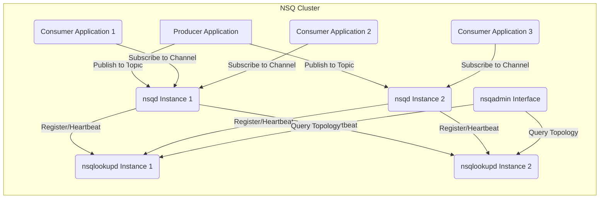
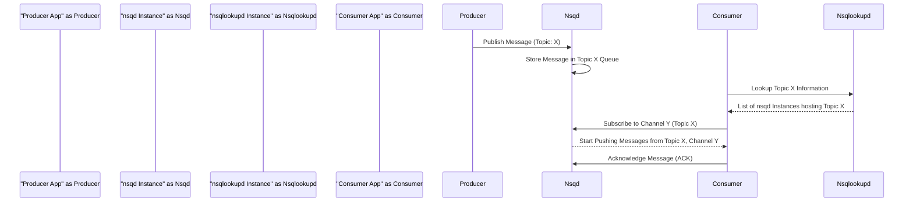

# Project Design Document: NSQ Distributed Messaging Platform

**Version:** 1.1
**Date:** October 26, 2023
**Author:** AI Software Architect

## 1. Introduction

This document provides an enhanced and detailed design overview of the NSQ distributed messaging platform, focusing on aspects critical for threat modeling. It outlines the system's architecture, key components with greater detail, data flow, and crucial considerations for security and deployment. This document serves as a robust foundation for subsequent threat modeling activities.

## 2. Goals and Objectives

The primary goals of NSQ are to provide:

* **High Scalability:** Ability to handle a massive volume of messages and a large number of consumers concurrently.
* **Guaranteed Reliability:** Assurance of message delivery, even in the presence of network partitions or component failures.
* **Decentralized Architecture:** Elimination of single points of failure through a distributed design.
* **Developer Friendliness:**  Simple and intuitive APIs and client libraries for producers and consumers in various programming languages.
* **Low-Latency Processing:** Enabling near real-time message delivery and processing.

## 3. System Architecture

NSQ employs a decentralized, distributed architecture comprising three core components that interact to facilitate message delivery:

* **`nsqd`:** The workhorse daemon responsible for receiving, queuing, and delivering messages. Each `nsqd` instance manages local topics and channels.
* **`nsqlookupd`:** The directory service acting as a rendezvous point, managing topology information and enabling consumers to discover relevant `nsqd` instances.
* **`nsqadmin`:** The web-based user interface providing real-time monitoring, administrative capabilities, and insights into the NSQ cluster's health and performance.

## 4. Component Details

### 4.1. `nsqd`

* **Functionality:** The central message processing daemon. It listens for incoming messages on configured TCP ports, organizes them into topics and channels, and delivers them to subscribed consumers.
* **Key Responsibilities:**
    * **Message Ingestion:** Receiving messages from producers over TCP.
    * **Topic and Channel Management:** Creating and managing topics (named message streams) and channels (subscriptions to topics).
    * **Message Queuing:** Storing messages in in-memory queues and optionally persisting them to disk for durability.
    * **Consumer Management:** Handling consumer connections, subscriptions, and unsubscriptions.
    * **Message Delivery:** Pushing messages to connected consumers based on their channel subscriptions.
    * **Heartbeating:** Periodically sending heartbeat signals to `nsqlookupd` to announce its presence and the topics it hosts.
    * **HTTP API:** Exposing an HTTP interface for administrative tasks like topic/channel creation, deletion, and health checks.
* **Data Storage:**
    * **In-Memory Queue:**  Primary storage for active messages, providing fast access for delivery.
    * **Disk-Backed Queue (Optional):**  Provides message durability by writing messages to disk. This is used when memory limits are reached or for persistent message storage. The disk queue uses a simple, append-only file format.
* **Communication Protocols:**
    * **TCP:**  The primary protocol for communication with producers and consumers, enabling efficient message transfer.
    * **HTTP:** Used for the administrative API, health checks, and interactions with `nsqadmin`.

### 4.2. `nsqlookupd`

* **Functionality:**  The distributed directory service that maintains a real-time map of the NSQ topology. Consumers query `nsqlookupd` to discover the locations of `nsqd` instances that are producing messages for specific topics.
* **Key Responsibilities:**
    * **`nsqd` Registration:** Receiving registration information (topic ownership) from `nsqd` instances.
    * **Topology Management:** Maintaining an up-to-date view of topics and the `nsqd` instances that host them.
    * **Consumer Lookup:** Responding to lookup requests from consumers, providing them with a list of relevant `nsqd` addresses.
    * **HTTP API:** Exposing an HTTP interface for querying topology information by consumers and `nsqadmin`.
* **Data Storage:**
    * **In-Memory Store:**  Stores the current cluster topology, including which `nsqd` instances are responsible for which topics. This data is ephemeral and rebuilt from `nsqd` registrations.
* **Communication Protocols:**
    * **TCP:** Used by `nsqd` instances to register and send heartbeat signals.
    * **HTTP:** Used by consumers and `nsqadmin` to query topology information.

### 4.3. `nsqadmin`

* **Functionality:** A web-based dashboard providing a user-friendly interface for monitoring and managing the NSQ cluster.
* **Key Responsibilities:**
    * **Real-time Monitoring:** Displaying live statistics about topics, channels, message rates, consumer counts, and `nsqd` instance health.
    * **Administrative Actions:** Providing tools to create and delete topics and channels, empty channels, and perform other administrative tasks.
    * **Cluster Visualization:** Offering a visual representation of the NSQ cluster topology.
    * **Querying `nsqlookupd`:**  Retrieving cluster information from `nsqlookupd` instances to populate the dashboard.
* **Data Storage:**
    * **No Persistent Storage:** `nsqadmin` does not store any persistent data. It dynamically fetches information from `nsqlookupd` and `nsqd` instances.
* **Communication Protocols:**
    * **HTTP:**  Used for user interface access and for making API calls to `nsqlookupd` and `nsqd` (for certain administrative actions).

## 5. Data Flow

The typical lifecycle of a message within the NSQ ecosystem involves these key stages:

* **Message Publication:**
    * A producer application sends a message to a specific `nsqd` instance, identifying the target topic.
    * The receiving `nsqd` instance appends the message to the in-memory queue for that topic and optionally to the disk-backed queue.

* **Consumer Discovery and Subscription:**
    * A consumer application queries one or more `nsqlookupd` instances to find the addresses of `nsqd` instances that host the desired topic.
    * The consumer establishes a TCP connection to one or more of the discovered `nsqd` instances.
    * The consumer subscribes to a specific channel within the topic on the connected `nsqd` instance.

* **Message Delivery and Processing:**
    * The `nsqd` instance pushes messages from the topic's queue to the subscribed consumers on the designated channel.
    * Consumers process the received messages.

* **Acknowledgement and Potential Requeuing:**
    * Upon successful processing, a consumer sends an acknowledgement (ACK) back to the `nsqd` instance.
    * If a consumer fails to process a message or does not send an ACK within a configurable timeout, the `nsqd` instance can requeue the message. This can involve placing the message back on the queue for redelivery (potentially to a different consumer on the same channel) or moving it to a dead-letter queue (if configured).

## 6. Security Considerations

* **Network Security:**
    * **Transport Layer Security (TLS):** Communication between `nsqd`, `nsqlookupd`, and clients can be secured using TLS encryption. This protects message data in transit from eavesdropping. Consider using strong TLS versions and cipher suites.
    * **Firewall Rules:** Implement strict firewall rules to restrict access to `nsqd` and `nsqlookupd` ports, allowing only authorized connections.
    * **Network Segmentation:** Deploy NSQ components within a private network to limit exposure to external threats.
* **Authentication and Authorization:**
    * **Limited Built-in Mechanisms:** NSQ has basic HTTP authentication for the `nsqd` administrative API. However, it lacks comprehensive built-in authentication and authorization for producers and consumers.
    * **Application-Level Security:** Implement authentication and authorization within the producer and consumer applications to control access to topics and channels. This might involve using API keys, tokens, or other authentication methods.
    * **Client Identification:** While NSQ provides client identification, it's primarily for tracking and does not offer strong authentication.
* **Input Validation:**
    * **Message Validation:** `nsqd` should perform validation on messages received from producers to prevent injection attacks (e.g., command injection) or the introduction of malformed data that could disrupt processing.
* **Denial of Service (DoS) Protection:**
    * **Rate Limiting:** Configure rate limits on message publishing and connection establishment to prevent malicious actors from overwhelming `nsqd` instances.
    * **Connection Limits:** Set limits on the number of concurrent connections to `nsqd` to prevent resource exhaustion.
    * **Resource Limits:** Configure appropriate resource limits (CPU, memory) for `nsqd` processes to prevent resource starvation.
* **Data Security:**
    * **Disk Encryption:** Messages persisted to disk by `nsqd` are not encrypted by default. Implement disk encryption at the operating system or volume level to protect data at rest.
    * **Payload Encryption:** For sensitive data, encrypt message payloads at the application level before publishing them to NSQ.
* **`nsqadmin` Security:**
    * **Access Control:** Restrict access to the `nsqadmin` web interface to authorized users only. Implement strong authentication mechanisms for `nsqadmin`.
    * **HTTPS:** Ensure `nsqadmin` is served over HTTPS to protect login credentials and administrative actions.
* **Configuration Security:**
    * **Secure Configuration Files:** Protect configuration files for `nsqd` and `nsqlookupd` to prevent unauthorized modifications.
    * **Principle of Least Privilege:** Run NSQ processes with the minimum necessary privileges.

## 7. Deployment Considerations

* **Infrastructure Choices:**
    * **Cloud Platforms:** NSQ can be effectively deployed on cloud platforms like AWS, Azure, and GCP, leveraging services like EC2, virtual machines, or container orchestration services.
    * **On-Premise Deployment:**  Suitable for environments requiring local control and compliance with specific regulations.
    * **Containerization:** Utilize Docker for packaging and deploying NSQ components, simplifying management and ensuring consistency across environments.
    * **Orchestration:** Employ Kubernetes or similar orchestration platforms for managing and scaling NSQ deployments, providing features like automated deployments, scaling, and self-healing.
* **Scalability and High Availability:**
    * **Multiple `nsqd` Instances:** Deploy multiple `nsqd` instances to distribute the message load and provide redundancy.
    * **Multiple `nsqlookupd` Instances:** Run multiple `nsqlookupd` instances for high availability of the directory service, preventing a single point of failure.
    * **Consumer Distribution:** Ensure consumers are distributed across multiple `nsqd` instances to maximize throughput and resilience.
    * **Load Balancing:** Use load balancers to distribute producer traffic across available `nsqd` instances.
    * **Replication Factor (Application Level):** While NSQ doesn't have built-in message replication across `nsqd` instances, consider implementing application-level strategies if cross-instance message persistence is critical.
* **Monitoring and Logging:**
    * **Metrics Collection:** Integrate with monitoring systems like Prometheus to collect key metrics from `nsqd` and `nsqlookupd` (e.g., message rates, queue depths, connection counts, error rates).
    * **Visualization:** Use tools like Grafana to visualize collected metrics and create dashboards for real-time monitoring.
    * **Log Aggregation:** Implement centralized logging using tools like Elasticsearch, Fluentd, and Kibana (EFK stack) or the equivalent on other platforms to aggregate and analyze logs from all NSQ components.
    * **Alerting:** Configure alerts based on critical metrics to proactively identify and address potential issues.
* **Configuration Management:**
    * **Automation Tools:** Utilize configuration management tools like Ansible, Chef, or Puppet to automate the deployment and configuration of NSQ components, ensuring consistency and reducing manual errors.
* **Resource Provisioning:**
    * **Appropriate Sizing:**  Provision adequate CPU, memory, and disk resources for `nsqd` instances based on anticipated message volume, retention policies, and consumer load.

## 8. Future Considerations

* **Enhanced Authentication and Authorization:** Explore integrating more sophisticated authentication and authorization mechanisms, potentially leveraging existing identity providers or standards like OAuth 2.0.
* **Built-in Message Encryption:** Implement native message encryption options within NSQ to simplify securing message payloads.
* **Improved Monitoring and Alerting Capabilities:** Enhance the built-in monitoring features and provide more granular alerting options.
* **Integration with Security Information and Event Management (SIEM) Systems:** Facilitate integration with SIEM systems for centralized security monitoring and threat detection.
* **Support for Message Tracing:** Implement message tracing capabilities to track messages through the system for debugging and auditing purposes.

This enhanced design document provides a more detailed and comprehensive overview of the NSQ distributed messaging platform, with a strong emphasis on security considerations relevant for threat modeling. The information presented here should be a valuable asset for identifying potential vulnerabilities and developing effective mitigation strategies.