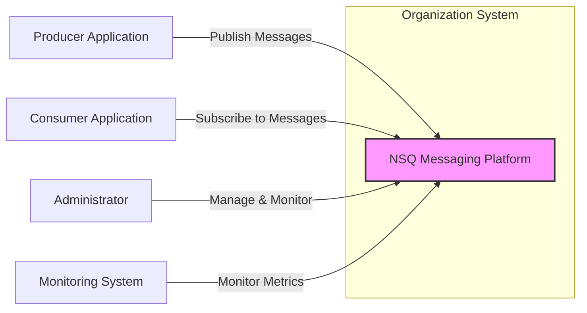

# BUSINESS POSTURE

This project, NSQ, aims to provide a real-time distributed messaging platform. It is designed to operate at scale, handling high volumes of messages and enabling asynchronous communication between different parts of a distributed system.

Business priorities and goals:
- Enable real-time data processing and distribution.
- Decouple services in a distributed architecture, improving system resilience and scalability.
- Provide a reliable message delivery system, ensuring no message loss.
- Offer a performant messaging solution capable of handling high throughput and low latency.
- Simplify the development of applications that require asynchronous communication.

Most important business risks:
- Data loss or message corruption leading to incomplete or incorrect data processing.
- System unavailability or performance degradation impacting real-time applications and dependent services.
- Unauthorized access to message queues potentially leading to data breaches or manipulation.
- Operational complexity in managing and monitoring a distributed messaging system.
- Lack of security features could expose sensitive data transmitted through the message queue.

# SECURITY POSTURE

Existing security controls:
- security control: TLS support for encrypting communication channels between nsq components and clients. Implemented in code and configurable during deployment.
- security control: Authentication and authorization mechanisms are not built-in features of NSQ. Security is expected to be handled at the application level or through network security measures. Described in documentation as a design choice for performance reasons.
- security control: Input validation is expected to be performed by message producers and consumers. NSQ itself performs minimal validation on message payloads. Implicitly described in documentation by focusing on message delivery and not content inspection.
- accepted risk: Lack of built-in authentication and authorization. NSQ relies on external mechanisms for access control.
- accepted risk: Minimal input validation at the NSQ level. Message content security is the responsibility of the application.

Recommended security controls:
- security control: Implement network segmentation to isolate NSQ components and restrict access to authorized networks.
- security control: Integrate with an external authentication and authorization service (e.g., OAuth 2.0, LDAP) to manage access to NSQ topics and channels.
- security control: Implement rate limiting and traffic shaping to protect against denial-of-service attacks.
- security control: Regularly audit and monitor NSQ infrastructure and logs for security events.
- security control: Implement security scanning in the build process to identify vulnerabilities in NSQ dependencies and configurations.

Security requirements:
- Authentication:
  - Requirement: Securely authenticate clients (producers, consumers, admin tools) connecting to NSQ components.
  - Requirement: Support mutual TLS authentication for enhanced security of communication channels.
- Authorization:
  - Requirement: Implement fine-grained authorization to control access to topics and channels based on user roles or application identities.
  - Requirement: Enforce least privilege principle for access control to NSQ resources.
- Input validation:
  - Requirement: Validate message payloads at the application level to prevent injection attacks and data corruption.
  - Requirement: Sanitize inputs to nsqadmin web interface to protect against cross-site scripting (XSS) vulnerabilities.
- Cryptography:
  - Requirement: Use TLS encryption for all communication channels between NSQ components and clients to protect data in transit.
  - Requirement: Consider encryption of sensitive data within message payloads at the application level if required.

# DESIGN

## C4 CONTEXT



Context Diagram Elements:

- Element:
  - Name: NSQ Messaging Platform
  - Type: Software System
  - Description: A real-time distributed messaging platform designed for scale and high throughput. It facilitates asynchronous communication between applications.
  - Responsibilities:
    - Receiving messages from producers.
    - Storing messages reliably.
    - Delivering messages to subscribed consumers.
    - Providing discovery and management capabilities.
  - Security controls:
    - security control: TLS encryption for inter-component and client communication.
    - security control: Network segmentation to restrict access.

- Element:
  - Name: Producer Application
  - Type: Software System
  - Description: Applications that publish messages to NSQ topics. These can be microservices, backend processes, or external systems.
  - Responsibilities:
    - Generating and publishing messages to NSQ.
    - Handling message publishing errors and retries.
    - Implementing input validation and data sanitization for messages.
  - Security controls:
    - security control: Authenticate with NSQ if authentication is implemented.
    - security control: Encrypt sensitive data in message payloads if required.

- Element:
  - Name: Consumer Application
  - Type: Software System
  - Description: Applications that subscribe to NSQ topics and process messages. These can be microservices, data processing pipelines, or user-facing applications.
  - Responsibilities:
    - Subscribing to relevant NSQ topics and channels.
    - Processing received messages.
    - Handling message processing errors and acknowledgements.
    - Implementing authorization checks based on message content or context if needed.
  - Security controls:
    - security control: Authenticate with NSQ if authentication is implemented.
    - security control: Decrypt sensitive data in message payloads if required.

- Element:
  - Name: Administrator
  - Type: Person
  - Description: Operations or DevOps personnel responsible for managing and monitoring the NSQ platform.
  - Responsibilities:
    - Deploying and configuring NSQ components.
    - Monitoring NSQ performance and health.
    - Managing topics, channels, and nodes.
    - Troubleshooting issues and ensuring system availability.
  - Security controls:
    - security control: Role-Based Access Control (RBAC) for NSQ management tools (if implemented externally).
    - security control: Secure access to NSQ management interfaces (e.g., nsqadmin).

- Element:
  - Name: Monitoring System
  - Type: Software System
  - Description: A system used to collect and visualize metrics from NSQ components for performance monitoring and alerting.
  - Responsibilities:
    - Collecting metrics from nsqd and nsqlookupd instances.
    - Aggregating and storing metrics data.
    - Providing dashboards and alerts based on metrics.
  - Security controls:
    - security control: Secure communication channels for metric collection (e.g., HTTPS).
    - security control: Access control to monitoring dashboards and data.

## C4 CONTAINER

```mermaid
graph LR
    subgraph "NSQ Messaging Platform"
        nsqd["nsqd Container"]
        nsqlookupd["nsqlookupd Container"]
        nsqadmin["nsqadmin Container"]
    end
    ProducerApp["Producer Application"]
    ConsumerApp["Consumer Application"]

    ProducerApp -->|TCP, TLS (Publish)| nsqd
    ConsumerApp -->|TCP, TLS (Subscribe)| nsqd
    nsqd -->|TCP, TLS (Register, Lookup)| nsqlookupd
    nsqadmin -->|HTTP, TLS (Admin API)| nsqd
    nsqadmin -->|HTTP, TLS (Lookup API)| nsqlookupd

    style NSQ Messaging Platform fill:#ccf,stroke:#333,stroke-width:2px
    style nsqd fill:#fcf,stroke:#333,stroke-width:1px
    style nsqlookupd fill:#fcf,stroke:#333,stroke-width:1px
    style nsqadmin fill:#fcf,stroke:#333,stroke-width:1px
```

Container Diagram Elements:

- Element:
  - Name: nsqd Container
  - Type: Container / Application
  - Description: The core message queue daemon. It receives, stores, and delivers messages. Each nsqd instance manages a set of topics and channels.
  - Responsibilities:
    - Receiving messages from producers over TCP/TLS.
    - Storing messages in memory and disk-backed queues.
    - Delivering messages to consumers over TCP/TLS.
    - Registering topic and channel information with nsqlookupd.
    - Providing an HTTP/TLS API for administrative tasks and monitoring.
  - Security controls:
    - security control: TLS encryption for client and inter-component communication.
    - security control: Configuration options to limit resource usage (e.g., memory, disk space).
    - security control: Access control to the HTTP admin API (can be implemented via network policies or reverse proxy).

- Element:
  - Name: nsqlookupd Container
  - Type: Container / Application
  - Description: The discovery service for nsqd instances. Consumers query nsqlookupd to find nsqd instances that host the topics they are interested in.
  - Responsibilities:
    - Accepting registrations from nsqd instances.
    - Providing lookup information to consumers about nsqd instances hosting specific topics.
    - Providing an HTTP/TLS API for administrative tasks and monitoring.
  - Security controls:
    - security control: TLS encryption for inter-component communication.
    - security control: Access control to the HTTP admin API (can be implemented via network policies or reverse proxy).

- Element:
  - Name: nsqadmin Container
  - Type: Container / Application
  - Description: A web-based UI for monitoring and managing the NSQ cluster. It interacts with nsqd and nsqlookupd via their HTTP APIs.
  - Responsibilities:
    - Providing a web interface for monitoring NSQ cluster health and metrics.
    - Allowing administrators to manage topics, channels, and nodes.
    - Querying nsqd and nsqlookupd APIs to retrieve information and perform actions.
  - Security controls:
    - security control: HTTPS/TLS for web interface access.
    - security control: Authentication and authorization for accessing nsqadmin (typically handled by reverse proxy or application-level authentication if implemented).
    - security control: Input sanitization to prevent XSS vulnerabilities.

## DEPLOYMENT

Deployment Solution: Containerized Deployment on Cloud Infrastructure (e.g., Kubernetes)

```mermaid
graph LR
    subgraph "Cloud Infrastructure (e.g., AWS, GCP, Azure)"
        subgraph "Kubernetes Cluster"
            subgraph "Namespace: nsq-cluster"
                nsqd_pod["nsqd Pods (Replicaset)"]
                nsqlookupd_pod["nsqlookupd Pods (Replicaset)"]
                nsqadmin_pod["nsqadmin Pod (Deployment)"]
                LoadBalancer["Load Balancer (Service)"]
                PersistentVolume["Persistent Volume (Disk)"]
            end
            KubeAPI["Kubernetes API Server"]
        end
        CloudNetwork["Cloud Virtual Network"]
    end
    ProducerApp_External["External Producer Application"]
    ConsumerApp_Internal["Internal Consumer Application"]
    Admin_External["External Administrator"]

    ProducerApp_External -->|TCP, TLS (Publish) via Load Balancer| LoadBalancer
    LoadBalancer -->|TCP, TLS (Forward to Pods)| nsqd_pod
    ConsumerApp_Internal -->|TCP, TLS (Subscribe)| nsqd_pod
    Admin_External -->|HTTPS, TLS (nsqadmin UI) via Load Balancer| LoadBalancer
    LoadBalancer -->|HTTPS, TLS (Forward to Pod)| nsqadmin_pod
    nsqd_pod -->|TCP, TLS (Register, Lookup)| nsqlookupd_pod
    nsqd_pod --> PersistentVolume

    style Kubernetes Cluster fill:#eef,stroke:#333,stroke-width:2px
    style nsqd_pod fill:#fcf,stroke:#333,stroke-width:1px
    style nsqlookupd_pod fill:#fcf,stroke:#333,stroke-width:1px
    style nsqadmin_pod fill:#fcf,stroke:#333,stroke-width:1px
    style LoadBalancer fill:#cdf,stroke:#333,stroke-width:1px
    style PersistentVolume fill:#cdf,stroke:#333,stroke-width:1px
```

Deployment Diagram Elements:

- Element:
  - Name: Kubernetes Cluster
  - Type: Infrastructure
  - Description: A managed Kubernetes cluster in a cloud environment, providing container orchestration and management.
  - Responsibilities:
    - Orchestrating and managing NSQ containers (pods).
    - Providing networking and storage resources.
    - Ensuring high availability and scalability of the NSQ platform.
  - Security controls:
    - security control: Kubernetes RBAC for access control to the cluster API and resources.
    - security control: Network policies to isolate namespaces and control network traffic within the cluster.
    - security control: Regular security patching and updates of the Kubernetes cluster.

- Element:
  - Name: nsqd Pods (Replicaset)
  - Type: Container Instance
  - Description: Multiple instances of the nsqd container running as pods in a Kubernetes Replicaset for high availability and scalability.
  - Responsibilities:
    - Running nsqd processes.
    - Handling message queue operations.
    - Utilizing persistent storage for message persistence.
  - Security controls:
    - security control: Container image security scanning to identify vulnerabilities.
    - security control: Resource limits and quotas to prevent resource exhaustion.
    - security control: Network policies to restrict inbound and outbound traffic.

- Element:
  - Name: nsqlookupd Pods (Replicaset)
  - Type: Container Instance
  - Description: Multiple instances of the nsqlookupd container running as pods in a Kubernetes Replicaset for high availability.
  - Responsibilities:
    - Running nsqlookupd processes.
    - Providing discovery service for nsqd instances.
  - Security controls:
    - security control: Container image security scanning.
    - security control: Resource limits and quotas.
    - security control: Network policies to restrict traffic.

- Element:
  - Name: nsqadmin Pod (Deployment)
  - Type: Container Instance
  - Description: An instance of the nsqadmin container running as a pod in a Kubernetes Deployment.
  - Responsibilities:
    - Running nsqadmin web UI.
    - Providing management interface for NSQ cluster.
  - Security controls:
    - security control: Container image security scanning.
    - security control: Resource limits and quotas.
    - security control: Network policies to restrict traffic.

- Element:
  - Name: Load Balancer (Service)
  - Type: Infrastructure Service
  - Description: A cloud load balancer service exposing nsqd and nsqadmin services externally.
  - Responsibilities:
    - Distributing traffic to nsqd and nsqadmin pods.
    - Providing external access point for producers and administrators.
    - Terminating TLS connections (optional).
  - Security controls:
    - security control: TLS termination and encryption.
    - security control: Access control lists (ACLs) or security groups to restrict access to the load balancer.
    - security control: DDoS protection provided by cloud provider.

- Element:
  - Name: Persistent Volume (Disk)
  - Type: Storage
  - Description: Persistent storage volume attached to nsqd pods for message persistence.
  - Responsibilities:
    - Storing messages persistently on disk.
    - Ensuring data durability across pod restarts.
  - Security controls:
    - security control: Encryption at rest for persistent volumes (if supported by cloud provider).
    - security control: Access control policies for persistent volumes.

## BUILD

```mermaid
graph LR
    Developer["Developer"] -->|Code Changes, Commit, Push| GitHub["GitHub Repository"]
    GitHub -->|Webhook, Trigger| CI_CD["CI/CD System (e.g., GitHub Actions)"]
    CI_CD -->|Build, Test, Scan| BuildEnv["Build Environment"]
    BuildEnv -->|Static Analysis (SAST), Vulnerability Scan, Linting| SecurityChecks["Security Checks"]
    SecurityChecks -->|Build Artifacts, Container Image| ArtifactRegistry["Artifact Registry (e.g., Docker Hub, Cloud Registry)"]
    ArtifactRegistry -->|Deployment| DeploymentEnv["Deployment Environment (e.g., Kubernetes)"]

    style CI_CD fill:#cdf,stroke:#333,stroke-width:1px
    style BuildEnv fill:#cdf,stroke:#333,stroke-width:1px
    style SecurityChecks fill:#cdf,stroke:#333,stroke-width:1px
    style ArtifactRegistry fill:#cdf,stroke:#333,stroke-width:1px
```

Build Process Description:

1. Developer writes code, commits changes, and pushes to the GitHub repository.
2. GitHub repository triggers the CI/CD system (e.g., GitHub Actions) via webhook on code changes.
3. CI/CD system initiates a build pipeline.
4. Build Environment is provisioned within the CI/CD pipeline.
5. Build process compiles the code, runs unit tests, and builds artifacts (e.g., binaries, container images).
6. Security Checks are performed in the build pipeline:
   - Static Analysis Security Testing (SAST) is performed on the code to identify potential vulnerabilities.
   - Vulnerability scanning is performed on dependencies to identify known vulnerabilities.
   - Linting and code formatting checks are performed to ensure code quality and consistency.
7. Build Artifacts and Container Images are created and pushed to the Artifact Registry (e.g., Docker Hub, Cloud Registry).
8. Deployment process pulls the artifacts/images from the Artifact Registry and deploys them to the Deployment Environment (e.g., Kubernetes).

Build Process Security Controls:

- security control: Automated build process using CI/CD pipeline to ensure consistency and repeatability.
- security control: Source code version control using Git and GitHub to track changes and manage code integrity.
- security control: Static Analysis Security Testing (SAST) integrated into the build pipeline to identify code-level vulnerabilities.
- security control: Dependency vulnerability scanning to identify and mitigate known vulnerabilities in third-party libraries.
- security control: Container image scanning to identify vulnerabilities in container images before deployment.
- security control: Code linting and formatting checks to improve code quality and reduce potential security issues.
- security control: Secure artifact registry to store and manage build artifacts and container images securely.
- security control: Access control to CI/CD pipeline and build environment to prevent unauthorized modifications.
- security control: Audit logging of build process and security checks.

# RISK ASSESSMENT

Critical business processes:
- Real-time data ingestion and processing for applications relying on immediate message delivery.
- Asynchronous communication between microservices enabling core application functionalities.
- Event-driven architectures that depend on timely message distribution for system responsiveness.

Data we are trying to protect:
- Messages transmitted through NSQ.
- Sensitivity of data depends on the application using NSQ. Messages could contain:
  - Business transaction data (potentially sensitive).
  - Application logs and events (less sensitive).
  - User activity data (potentially sensitive).
  - System metrics (less sensitive).

Data sensitivity:
- Variable, depends on the application and topic.
- Assume messages can contain PII (Personally Identifiable Information) or confidential business data in some use cases.
- Need to consider data confidentiality, integrity, and availability.

# QUESTIONS & ASSUMPTIONS

Questions:
- What is the typical sensitivity of data being transmitted through NSQ in the intended use case?
- Are there specific compliance requirements (e.g., GDPR, HIPAA, PCI DSS) that need to be considered?
- What are the performance and scalability requirements for NSQ?
- What is the expected deployment environment (cloud, on-premise, hybrid)?
- Are there existing authentication and authorization infrastructure that NSQ needs to integrate with?
- What are the monitoring and logging requirements for NSQ?

Assumptions:
- NSQ will be deployed in a cloud environment using Kubernetes.
- Messages transmitted through NSQ may contain sensitive data, requiring encryption in transit.
- Security is a significant concern, and implementing recommended security controls is a priority.
- The organization has some existing security infrastructure and practices in place.
- Performance is a key requirement for NSQ, but not at the expense of essential security measures.