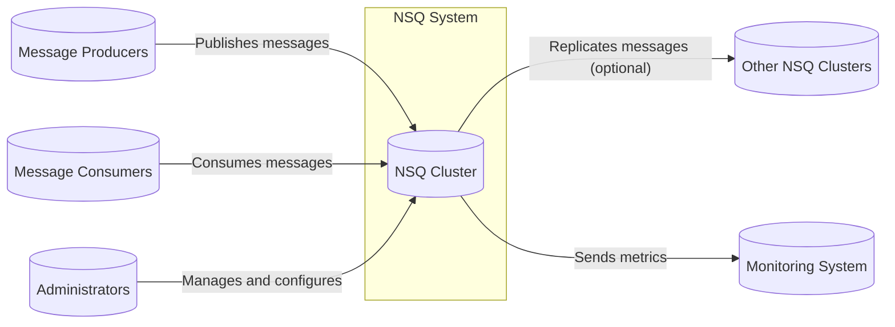
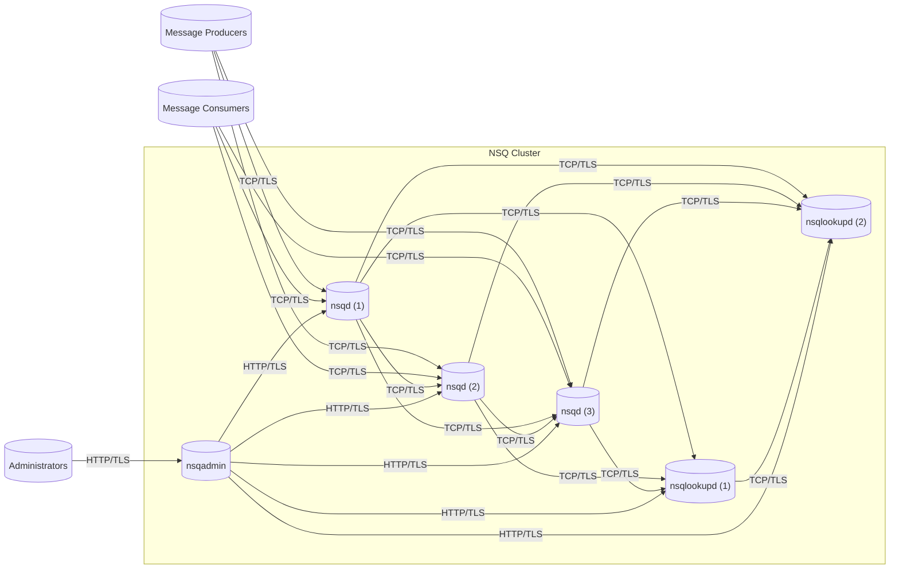
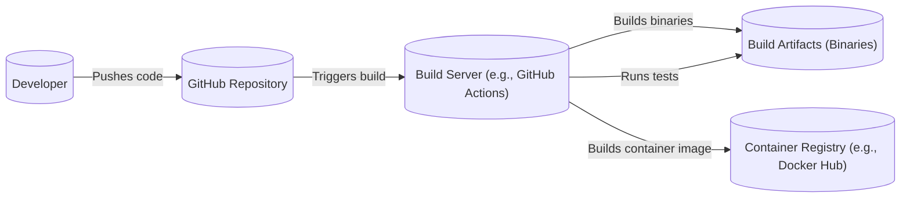

Okay, let's create a design document for the NSQ project, focusing on aspects relevant for threat modeling.

# BUSINESS POSTURE

NSQ is a real-time distributed messaging platform.  It's designed for high throughput and low latency, making it suitable for handling large volumes of messages in production environments.  It emphasizes fault tolerance and ease of deployment and configuration.  Given its nature as a core infrastructure component, the primary business goals are:

*   Reliability:  NSQ must operate continuously and reliably, without message loss or significant downtime.  Outages or data loss would directly impact any applications relying on it.
*   Scalability:  NSQ needs to scale horizontally to handle increasing message volume as the business grows.
*   Performance:  Low latency and high throughput are critical for real-time applications.
*   Operational Simplicity:  Ease of deployment, configuration, and maintenance are important to minimize operational overhead.
*   Durability: Messages should be durable and not lost in the event of node failures.

Based on these priorities, the most important business risks are:

*   Data Loss: Loss of messages due to software bugs, hardware failures, or operational errors.
*   System Outage:  Complete or partial unavailability of the NSQ cluster, disrupting dependent applications.
  Data corruption.
*   Performance Degradation:  Significant increases in latency or reductions in throughput, impacting application performance.
*   Unauthorized Access:  Unauthorized clients accessing or modifying messages, potentially leading to data breaches or system compromise.
*   Denial of Service:  Attacks that overwhelm the NSQ cluster, making it unavailable to legitimate users.

# SECURITY POSTURE

Existing security controls and accepted risks (based on the GitHub repository and common practices):

*   security control: TLS Encryption: NSQ supports TLS for encrypting communication between clients and servers, and between nsqd nodes. (Mentioned in documentation).
*   security control: Authentication: While NSQ doesn't have built-in authentication mechanisms, it suggests using TLS client certificates or a proxy for authentication. (Mentioned in documentation).
*   security control: Authorization: NSQ does not provide fine-grained authorization. Access control is typically handled at the network level (e.g., firewall rules) or through a proxy. (Implicit in the design).
*   security control: Input Validation: NSQ performs input validation on protocol commands and data to prevent malformed messages from causing issues. (Inferred from code and design).
*   security control: Go's Memory Safety: Using Go as the programming language helps mitigate memory safety vulnerabilities like buffer overflows.
*   security control: Horizontal Scalability: The distributed nature of NSQ allows for horizontal scaling, which can help mitigate some DoS attacks by distributing the load.
*   accepted risk: Lack of Fine-Grained Authorization: NSQ relies on network-level access control or external proxies for authorization, meaning it doesn't natively support per-topic or per-user permissions.
*   accepted risk: Limited Built-in Authentication: NSQ relies on external mechanisms like TLS certificates or proxies for authentication.
*   accepted risk: Potential for Resource Exhaustion: Without proper configuration and monitoring, a single nsqd node or the entire cluster could be overwhelmed by a large number of clients or messages.

Recommended Security Controls (High Priority):

*   security control: Implement a robust monitoring and alerting system: This is crucial for detecting performance issues, resource exhaustion, and potential attacks. Metrics should include queue depth, message rates, error rates, and resource utilization.
*   security control: Implement rate limiting: Rate limiting can help prevent DoS attacks and ensure fair resource usage among clients. This could be implemented at the network level or within a proxy.
*   security control: Regularly review and update dependencies: Go's dependency management system makes this relatively straightforward, but it's important to stay up-to-date with security patches.
*   security control: Conduct regular security audits and penetration testing: This will help identify vulnerabilities that might be missed during development.

Security Requirements:

*   Authentication:
    *   Clients connecting to nsqd and nsqlookupd should be authenticated, preferably using TLS client certificates.
    *   nsqd nodes should authenticate with each other when forming a cluster.
*   Authorization:
    *   While fine-grained authorization within NSQ might not be necessary, network-level access control (firewall rules, security groups) should be used to restrict access to NSQ components.
    *   Consider using a proxy if more granular authorization (e.g., per-topic permissions) is required.
*   Input Validation:
    *   All input received from clients and other nsqd nodes should be strictly validated to prevent malformed data from causing errors or vulnerabilities.
    *   Message size limits should be enforced.
*   Cryptography:
    *   TLS should be used for all communication between clients and servers, and between nsqd nodes.
    *   Strong cipher suites and key lengths should be enforced.
    *   Consider data at rest encryption for messages stored on disk, if the data is sensitive.

# DESIGN

## C4 CONTEXT



Element Descriptions:

*   Element:
    *   Name: NSQ Cluster
    *   Type: System
    *   Description: The core NSQ system, consisting of nsqd and nsqlookupd instances.
    *   Responsibilities: Receiving, queuing, and delivering messages; managing topics and channels; providing discovery services.
    *   Security controls: TLS encryption, input validation, Go's memory safety.

*   Element:
    *   Name: Message Producers
    *   Type: User
    *   Description: Applications or services that publish messages to NSQ.
    *   Responsibilities: Creating and sending messages to specific topics.
    *   Security controls: TLS client certificates (recommended), authentication via proxy (optional).

*   Element:
    *   Name: Message Consumers
    *   Type: User
    *   Description: Applications or services that consume messages from NSQ.
    *   Responsibilities: Subscribing to channels and processing messages.
    *   Security controls: TLS client certificates (recommended), authentication via proxy (optional).

*   Element:
    *   Name: Administrators
    *   Type: User
    *   Description: Users who manage and configure the NSQ cluster.
    *   Responsibilities: Deploying, configuring, monitoring, and scaling NSQ.
    *   Security controls: Secure access to NSQ management interfaces (e.g., SSH, HTTPS with strong authentication).

*   Element:
    *   Name: Other NSQ Clusters
    *   Type: System
    *   Description: Other NSQ clusters that this cluster might replicate messages to (for cross-datacenter replication).
    *   Responsibilities: Receiving and processing replicated messages.
    *   Security controls: TLS encryption, authentication between clusters.

*   Element:
    *   Name: Monitoring System
    *   Type: System
    *   Description: A system for collecting and visualizing NSQ metrics (e.g., Prometheus, Grafana).
    *   Responsibilities: Collecting, storing, and displaying metrics; providing alerting capabilities.
    *   Security controls: Secure access to monitoring data and dashboards.

## C4 CONTAINER



Element Descriptions:

*   Element:
    *   Name: nsqd (1, 2, 3)
    *   Type: Container
    *   Description: Instances of the nsqd daemon, responsible for receiving, queuing, and delivering messages.
    *   Responsibilities: Handling client connections, managing topics and channels, persisting messages to disk (optionally).
    *   Security controls: TLS encryption, input validation, Go's memory safety, rate limiting (recommended).

*   Element:
    *   Name: nsqlookupd (1, 2)
    *   Type: Container
    *   Description: Instances of the nsqlookupd daemon, providing a discovery service for nsqd nodes.
    *   Responsibilities: Maintaining a registry of nsqd nodes and their locations.
    *   Security controls: TLS encryption, input validation, Go's memory safety.

*   Element:
    *   Name: nsqadmin
    *   Type: Container
    *   Description: A web UI for monitoring and administering the NSQ cluster.
    *   Responsibilities: Providing a visual interface for viewing cluster status, managing topics and channels, and performing administrative tasks.
    *   Security controls: TLS encryption, authentication (recommended), authorization (recommended).

*   Element:
    *   Name: Message Producers
    *   Type: User
    *   Description: Applications or services that publish messages to NSQ.
    *   Responsibilities: Creating and sending messages to specific topics.
    *   Security controls: TLS client certificates (recommended), authentication via proxy (optional).

*   Element:
    *   Name: Message Consumers
    *   Type: User
    *   Description: Applications or services that consume messages from NSQ.
    *   Responsibilities: Subscribing to channels and processing messages.
    *   Security controls: TLS client certificates (recommended), authentication via proxy (optional).

*   Element:
    *   Name: Administrators
    *   Type: User
    *   Description: Users who manage and configure the NSQ cluster.
    *   Responsibilities: Deploying, configuring, monitoring, and scaling NSQ.
    *   Security controls: Secure access to NSQ management interfaces (e.g., SSH, HTTPS with strong authentication).

## DEPLOYMENT

NSQ can be deployed in various ways, including:

1.  Bare Metal:  Running nsqd and nsqlookupd directly on physical servers.
2.  Virtual Machines:  Running nsqd and nsqlookupd within virtual machines (e.g., AWS EC2, Google Compute Engine).
3.  Containers:  Running nsqd and nsqlookupd within containers (e.g., Docker), orchestrated by a system like Kubernetes.
4.  Cloud Provider Services: Some cloud providers might offer managed messaging services that are compatible with NSQ's protocol.

We'll describe a containerized deployment using Kubernetes, as it's a common and robust approach.

```mermaid
graph LR
    subgraph "Kubernetes Cluster"
        subgraph "NSQ Namespace"
            subgraph "nsqd Deployment"
                nsqd_pod1[("nsqd Pod 1")]
                nsqd_pod2[("nsqd Pod 2")]
                nsqd_pod3[("nsqd Pod 3")]
            end
            subgraph "nsqlookupd Deployment"
                nsqlookupd_pod1[("nsqlookupd Pod 1")]
                nsqlookupd_pod2[("nsqlookupd Pod 2")]
            end
            subgraph "nsqadmin Deployment"
                nsqadmin_pod[("nsqadmin Pod")]
            end
            nsqd_svc[("nsqd Service")]
            nsqlookupd_svc[("nsqlookupd Service")]
            nsqadmin_svc[("nsqadmin Service")]
        end
        ingress[("Ingress Controller")]
    end
    producers[("Message Producers")]
    consumers[("Message Consumers")]
    admins[("Administrators")]

    producers -- "TCP/TLS" --> nsqd_svc
    consumers -- "TCP/TLS" --> nsqd_svc
    nsqd_svc -- "" --> nsqd_pod1
    nsqd_svc -- "" --> nsqd_pod2
    nsqd_svc -- "" --> nsqd_pod3
    nsqd_pod1 -- "TCP/TLS" --> nsqlookupd_svc
    nsqd_pod2 -- "TCP/TLS" --> nsqlookupd_svc
    nsqd_pod3 -- "TCP/TLS" --> nsqlookupd_svc
    nsqlookupd_svc -- "" --> nsqlookupd_pod1
    nsqlookupd_svc -- "" --> nsqlookupd_pod2
    admins -- "HTTPS/TLS" --> ingress
    ingress -- "" --> nsqadmin_svc
    nsqadmin_svc -- "" --> nsqadmin_pod
```

Element Descriptions:

*   Element:
    *   Name: nsqd Pod (1, 2, 3)
    *   Type: Deployment Node
    *   Description: Kubernetes Pods running the nsqd container.
    *   Responsibilities: Running the nsqd process, handling client connections, managing messages.
    *   Security controls: Container isolation, resource limits, network policies.

*   Element:
    *   Name: nsqlookupd Pod (1, 2)
    *   Type: Deployment Node
    *   Description: Kubernetes Pods running the nsqlookupd container.
    *   Responsibilities: Running the nsqlookupd process, providing discovery services.
    *   Security controls: Container isolation, resource limits, network policies.

*   Element:
    *   Name: nsqadmin Pod
    *   Type: Deployment Node
    *   Description: Kubernetes Pod running the nsqadmin container.
    *   Responsibilities: Running the nsqadmin web UI.
    *   Security controls: Container isolation, resource limits, network policies, authentication (recommended).

*   Element:
    *   Name: nsqd Service
    *   Type: Kubernetes Service
    *   Description: A Kubernetes Service that provides a stable endpoint for accessing the nsqd Pods.
    *   Responsibilities: Load balancing traffic across the nsqd Pods.
    *   Security controls: Network policies.

*   Element:
    *   Name: nsqlookupd Service
    *   Type: Kubernetes Service
    *   Description: A Kubernetes Service that provides a stable endpoint for accessing the nsqlookupd Pods.
    *   Responsibilities: Load balancing traffic across the nsqlookupd Pods.
    *   Security controls: Network policies.

*   Element:
    *   Name: nsqadmin Service
    *   Type: Kubernetes Service
    *   Description: A Kubernetes Service that provides a stable endpoint for accessing the nsqadmin Pod.
    *   Responsibilities: Exposing the nsqadmin UI.
    *   Security controls: Network policies, Ingress configuration.

*   Element:
    *   Name: Ingress Controller
    *   Type: Kubernetes Ingress Controller
    *   Description: An Ingress controller that manages external access to the nsqadmin Service.
    *   Responsibilities: Routing external traffic to the nsqadmin Service, potentially handling TLS termination.
    *   Security controls: TLS termination, authentication (recommended), authorization (recommended).

*   Element:
    *   Name: Message Producers
    *   Type: User
    *   Description: Applications or services that publish messages to NSQ.
    *   Responsibilities: Creating and sending messages to specific topics.
    *   Security controls: TLS client certificates (recommended), authentication via proxy (optional).

*   Element:
    *   Name: Message Consumers
    *   Type: User
    *   Description: Applications or services that consume messages from NSQ.
    *   Responsibilities: Subscribing to channels and processing messages.
    *   Security controls: TLS client certificates (recommended), authentication via proxy (optional).

*   Element:
    *   Name: Administrators
    *   Type: User
    *   Description: Users who manage and configure the NSQ cluster.
    *   Responsibilities: Deploying, configuring, monitoring, and scaling NSQ.
    *   Security controls: Secure access to NSQ management interfaces (e.g., SSH, HTTPS with strong authentication).

## BUILD

NSQ is written in Go, and its build process is relatively straightforward. The repository uses `go mod` for dependency management.



Build Process Description:

1.  Developer pushes code changes to the GitHub repository.
2.  A build server (e.g., GitHub Actions, Jenkins) is triggered by the push.
3.  The build server checks out the code.
4.  The build server uses `go build` to compile the NSQ binaries (nsqd, nsqlookupd, nsqadmin, and utilities).
5.  The build server runs unit and integration tests using `go test`.
6.  Optionally, static analysis tools (e.g., linters, security scanners) are run to identify potential code quality or security issues.
7.  If all tests and checks pass, the build server creates build artifacts (binaries).
8.  A Dockerfile is used to build a container image for each NSQ component (nsqd, nsqlookupd, nsqadmin).
9.  The container images are pushed to a container registry (e.g., Docker Hub, Google Container Registry).

Security Controls in Build Process:

*   security control: Dependency Management: `go mod` ensures that dependencies are tracked and versioned, reducing the risk of using vulnerable libraries.
*   security control: Automated Testing: Unit and integration tests help catch bugs early in the development cycle.
*   security control: Static Analysis: Linters and security scanners can identify potential code quality and security issues before deployment.
*   security control: Containerization: Building container images provides a consistent and isolated runtime environment.
*   security control: Container Registry: Using a container registry allows for secure storage and distribution of container images.
*   security control: Signed Commits: Enforcing signed commits in the Git repository ensures that code changes can be traced back to their authors.

# RISK ASSESSMENT

*   Critical Business Processes:
    *   Real-time message delivery for applications relying on NSQ.
    *   Data ingestion pipelines.
    *   Event-driven architectures.

*   Data to Protect:
    *   Messages flowing through NSQ. The sensitivity of this data depends entirely on the applications using NSQ. It could range from non-sensitive operational data to highly sensitive personal or financial information.
    *   NSQ configuration data (e.g., topic and channel configurations).
    *   NSQ metadata (e.g., queue depths, message counts).

Data Sensitivity:

*   Messages: Variable, depending on the application. Could be low, medium, or high.
*   Configuration Data: Medium. Unauthorized modification could disrupt service.
*   Metadata: Low. Primarily operational data, but could be used for reconnaissance.

# QUESTIONS & ASSUMPTIONS

Questions:

*   What are the specific compliance requirements (if any) for the applications using NSQ (e.g., GDPR, HIPAA, PCI DSS)? This will influence the required security controls.
*   What is the expected message volume and throughput? This will impact scaling and resource allocation decisions.
*   What is the acceptable downtime for NSQ? This will influence the deployment architecture and redundancy requirements.
*   Are there any existing security infrastructure components (e.g., proxies, firewalls, authentication systems) that can be leveraged?
*   What level of access do developers have to the production environment?
*   What is the process for handling security incidents?

Assumptions:

*   BUSINESS POSTURE: The organization prioritizes reliability, scalability, and performance for NSQ.
*   BUSINESS POSTURE: The organization has a moderate risk appetite, willing to accept some limitations in built-in security features in exchange for operational simplicity, as long as those risks are mitigated through other means.
*   SECURITY POSTURE: Basic network security controls (firewalls, security groups) are in place.
*   SECURITY POSTURE: Developers have a good understanding of secure coding practices.
*   DESIGN: A containerized deployment using Kubernetes is the preferred approach.
*   DESIGN: Monitoring and alerting systems are in place or will be implemented.
*   DESIGN: The organization has a process for managing and updating dependencies.