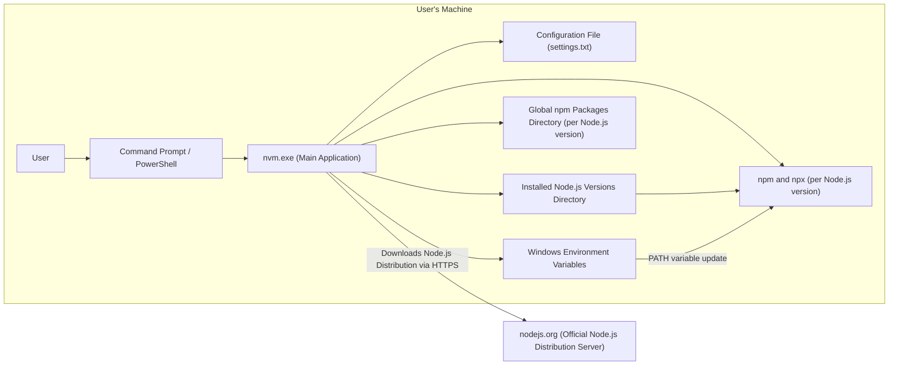

# Project Design Document: nvm-windows

**Version:** 1.1
**Date:** October 26, 2023
**Author:** Gemini (AI Language Model)

## 1. Introduction

This document provides a detailed design overview of the `nvm-windows` project, a Node.js version management utility for Windows. This document is intended to serve as a foundation for subsequent threat modeling activities. It outlines the system's architecture, components, data flow, and key interactions, with a strong emphasis on security considerations.

### 1.1. Purpose

The primary purpose of this document is to provide a comprehensive and security-focused understanding of the `nvm-windows` project's design. This understanding is crucial for identifying potential security vulnerabilities, evaluating their impact, and developing appropriate mitigation strategies during the threat modeling process.

### 1.2. Scope

This document covers the core functionality of `nvm-windows`, including:

*   Installation and uninstallation of Node.js versions from official sources.
*   Switching between locally installed Node.js versions.
*   Listing available Node.js versions (both local and remote).
*   Setting a default Node.js version to be used in new command prompts.
*   Downloading specific Node.js distributions based on version numbers or architecture.
*   Management of npm and npx associated with each installed Node.js version.
*   Modification of system environment variables to activate the selected Node.js version.

This document does not cover:

*   The internal implementation details of the Node.js runtime environment itself.
*   The specific security measures implemented by the maintainers of the official Node.js distribution servers.
*   The detailed code-level implementation of the `nvm-windows` application.

### 1.3. Target Audience

This document is intended for:

*   Security engineers and architects responsible for performing threat modeling and security assessments.
*   Software developers contributing to the `nvm-windows` project, particularly those focused on security aspects.
*   System administrators and power users seeking a deeper understanding of the system's architecture and potential security implications.

## 2. System Overview

`nvm-windows` is a command-line tool designed to simplify the management of multiple Node.js versions on a Windows operating system. It allows users to easily install, switch between, and manage different Node.js environments without manual configuration of system paths.

### 2.1. High-Level Architecture

### 2.2. Key Components

*   **`nvm.exe` (Main Application):** The core executable responsible for processing user commands, managing Node.js installations, and updating system settings.
*   **Command Prompt / PowerShell:** The primary interface through which users interact with `nvm-windows`.
*   **Configuration File (`settings.txt`):** A file storing `nvm-windows` settings, including the installation root, currently active Node.js version, and potentially download mirrors.
*   **Installed Node.js Versions Directory:** The file system location where different versions of Node.js are installed and maintained by `nvm-windows`.
*   **npm and npx (per Node.js version):** The Node.js package manager and its executor, bundled with each installed Node.js version.
*   **Global npm Packages Directory (per Node.js version):**  A directory within each Node.js installation where globally installed npm packages are stored.
*   **Windows Environment Variables:** System-level variables, particularly the `PATH` variable, that `nvm-windows` modifies to point to the active Node.js installation.
*   **nodejs.org (Official Node.js Distribution Server):** The external server from which `nvm-windows` downloads Node.js distributions.

## 3. Component Details

This section provides a more in-depth look at each component, detailing its functionality and potential security implications.

### 3.1. `nvm.exe` (Main Application)

*   **Functionality:**
    *   Parses and validates user commands entered in the command prompt.
    *   Orchestrates the download of Node.js distributions from `nodejs.org` (or potentially configured mirrors).
    *   Manages the installation and uninstallation of Node.js versions within the designated installation directory.
    *   Updates the `settings.txt` file to reflect changes in configuration and active Node.js version.
    *   Modifies the Windows environment variables (specifically `PATH`) to point to the executable of the selected Node.js version.
    *   Provides commands to list available and installed Node.js versions.
    *   Handles the management of npm and npx associated with each Node.js installation.

*   **Potential Security Considerations:**
    *   **Command Injection:** Vulnerabilities in the command parsing logic could allow an attacker to execute arbitrary commands on the system. Input validation is crucial here.
    *   **Path Traversal:** Improper handling of file paths during installation or uninstallation could allow an attacker to access or modify files outside the intended installation directories.
    *   **Insecure Download:** If downloads are not performed over HTTPS or if the integrity of downloaded files is not verified (e.g., using checksums), malicious Node.js distributions could be installed.
    *   **Privilege Escalation:** Although designed to run with user privileges, vulnerabilities in how `nvm.exe` interacts with the system could potentially be exploited for privilege escalation.
    *   **Configuration File Manipulation:** If `settings.txt` permissions are too permissive, a malicious actor could modify it to point to a rogue Node.js installation or alter other critical settings.

### 3.2. Command Prompt / PowerShell

*   **Functionality:**
    *   Provides the user interface for interacting with `nvm-windows` by executing commands.
    *   Passes user-typed commands to `nvm.exe` for processing.

*   **Potential Security Considerations:**
    *   While not a direct component of `nvm-windows`, vulnerabilities in the command prompt or PowerShell itself could be leveraged in conjunction with `nvm-windows` vulnerabilities.
    *   Users with insufficient privileges could potentially attempt to execute `nvm-windows` commands that require higher privileges, although `nvm-windows` is generally designed to operate within user privileges.

### 3.3. Configuration File (`settings.txt`)

*   **Functionality:**
    *   Persistently stores configuration settings for `nvm-windows`.
    *   Typically includes the root directory for Node.js installations, the currently active Node.js version, and potentially URLs for download mirrors.

*   **Potential Security Considerations:**
    *   **Information Disclosure:**  While unlikely to contain highly sensitive information, exposing the installation paths could aid an attacker in understanding the system's layout.
    *   **Tampering:** If write permissions are not restricted, a malicious user or process could modify this file to point to a malicious Node.js installation or alter other settings, leading to the execution of untrusted code.

### 3.4. Installed Node.js Versions Directory

*   **Functionality:**
    *   Serves as the central repository for all Node.js versions managed by `nvm-windows`.
    *   Each Node.js version is typically installed in its own subdirectory within this directory.

*   **Potential Security Considerations:**
    *   **Unauthorized Modification/Deletion:** Incorrect file system permissions could allow unauthorized users or processes to modify or delete Node.js installations, potentially disrupting development environments.
    *   **Malicious Installation:** If the download and installation process does not properly validate the integrity of Node.js distributions, this directory could become a repository for compromised versions.

### 3.5. npm and npx (per Node.js version)

*   **Functionality:**
    *   Provides package management capabilities for each installed Node.js version.
    *   Allows users to install, update, and manage dependencies for their Node.js projects.

*   **Potential Security Considerations:**
    *   **Dependency Vulnerabilities:**  While not a direct vulnerability of `nvm-windows`, the use of npm introduces the risk of installing packages with known security vulnerabilities.
    *   **Scope Confusion/Package Planting:**  Potential for vulnerabilities related to how npm resolves package names and locations, which could be exploited to install malicious packages.

### 3.6. Global npm Packages Directory (per Node.js version)

*   **Functionality:**
    *   Stores globally installed npm packages for each specific Node.js version. These packages are typically command-line tools accessible system-wide when that Node.js version is active.

*   **Potential Security Considerations:**
    *   **Malicious Global Packages:**  If a user unknowingly installs a malicious package globally, it could have broad access to system resources when the associated Node.js version is active.
    *   **Permissions Issues:** Incorrect permissions could allow unauthorized modification or replacement of globally installed packages.

### 3.7. Windows Environment Variables

*   **Functionality:**
    *   `nvm-windows` modifies the system's `PATH` environment variable to point to the directory containing the executables (node.exe, npm.cmd, npx.cmd) of the currently selected Node.js version.

*   **Potential Security Considerations:**
    *   **Path Manipulation:**  If there are vulnerabilities in how `nvm-windows` updates the `PATH` variable, it could potentially be manipulated to point to malicious executables, leading to arbitrary code execution.
    *   **Race Conditions:**  In multi-user environments or scenarios with concurrent processes, there might be a risk of race conditions when updating environment variables, although this is less likely with `nvm-windows` as it's typically a user-level tool.

### 3.8. nodejs.org (Official Node.js Distribution Server)

*   **Functionality:**
    *   Provides the official and signed distributions of Node.js for various platforms, including Windows.
    *   `nvm-windows` downloads Node.js installations from this source.

*   **Potential Security Considerations:**
    *   **Compromise of Download Server:**  While highly unlikely, if the official Node.js download servers were compromised, malicious distributions could be served to users. `nvm-windows` should rely on HTTPS and ideally verify file integrity (e.g., using checksums provided by nodejs.org).
    *   **Man-in-the-Middle Attacks:**  Without HTTPS, the download process would be vulnerable to man-in-the-middle attacks where a malicious actor could intercept and replace the legitimate Node.js distribution with a compromised one.

## 4. Data Flow

The following diagram illustrates the data flow during the process of a user installing and then switching to a specific Node.js version.

```mermaid
graph LR
    A["User enters 'nvm install <version>'"] --> B("Command Prompt receives command");
    B --> C["nvm.exe parses and validates command"];
    C --> D{Is version already installed?};
    D -- "Yes" --> E["Display 'already installed' message"];
    D -- "No" --> F["nvm.exe constructs download URL for nodejs.org"];
    F --> G["nvm.exe initiates HTTPS download from nodejs.org"];
    G -- "Node.js distribution" --> H["nvm.exe verifies download integrity (e.g., checksum)"];
    H -- "Integrity OK" --> I["nvm.exe installs Node.js to versions directory"];
    H -- "Integrity Failed" --> J["Display error message and abort installation"];
    I --> K["User enters 'nvm use <version>'"];
    K --> L["Command Prompt receives command"];
    L --> M["nvm.exe parses and validates command"];
    M --> N["nvm.exe updates Windows Environment Variables (PATH)"];
    N --> O["nvm.exe updates settings.txt with active version"];
    O --> P["Selected Node.js version is now active"];
```

**Data Flow Description:**

1. The user enters the command to install a specific Node.js version (e.g., `nvm install 18`).
2. The command prompt receives the command.
3. `nvm.exe` parses and validates the command.
4. `nvm.exe` checks if the specified version is already installed.
5. If the version is already installed, a message is displayed to the user.
6. If not installed, `nvm.exe` constructs the appropriate download URL for the requested version on `nodejs.org`.
7. `nvm.exe` initiates a secure download (HTTPS) of the Node.js distribution from `nodejs.org`.
8. Upon completion of the download, `nvm.exe` verifies the integrity of the downloaded file, ideally using checksums.
9. If the integrity check passes, `nvm.exe` proceeds with the installation of the Node.js version into the designated versions directory.
10. If the integrity check fails, an error message is displayed, and the installation is aborted.
11. The user enters the command to switch to a specific installed version (e.g., `nvm use 18`).
12. The command prompt receives the command.
13. `nvm.exe` parses and validates the command.
14. `nvm.exe` updates the Windows Environment Variables, specifically the `PATH` variable, to point to the executable directory of the selected Node.js version.
15. `nvm.exe` updates the `settings.txt` file to record the currently active Node.js version.
16. The selected Node.js version is now active and will be used for subsequent Node.js related commands in that command prompt session.

## 5. Security Considerations (Detailed)

This section expands on the initial security considerations, providing more specific examples and potential attack vectors.

*   **Download Integrity and Authenticity:**
    *   **Risk:** Downloading compromised Node.js distributions could lead to the installation of malware or backdoors.
    *   **Mitigation:** `nvm-windows` should always use HTTPS for downloads from `nodejs.org`. Implementing checksum verification (SHA-256 or similar) against known good values would further enhance security.
    *   **Threat Scenario:** An attacker compromises a mirror server or performs a man-in-the-middle attack to serve a malicious Node.js installer. Without integrity checks, this malicious version could be installed.

*   **Command Injection Vulnerabilities:**
    *   **Risk:** Improper sanitization of user input in commands could allow attackers to inject and execute arbitrary system commands.
    *   **Mitigation:** Rigorous input validation and sanitization should be implemented for all user-provided input to `nvm.exe`. Avoid direct execution of shell commands based on user input.
    *   **Threat Scenario:** A vulnerability in the `nvm install` command could be exploited by providing a specially crafted version string that includes shell commands, leading to their execution with the privileges of the user running `nvm-windows`.

*   **Path Traversal Vulnerabilities:**
    *   **Risk:** Incorrect handling of file paths could allow attackers to access or modify files and directories outside the intended scope of `nvm-windows`.
    *   **Mitigation:** Implement strict validation and sanitization of all file paths used by `nvm-windows`. Use canonical paths and avoid relying on relative paths where possible.
    *   **Threat Scenario:** A vulnerability in the installation routine could allow an attacker to specify a malicious installation path, potentially overwriting critical system files.

*   **Privilege Escalation:**
    *   **Risk:** Although designed to run with user privileges, vulnerabilities in how `nvm-windows` interacts with the operating system could potentially be exploited to gain elevated privileges.
    *   **Mitigation:** Adhere to the principle of least privilege. Avoid performing operations that require elevated privileges unless absolutely necessary. Carefully review any code sections that interact with system-level functionalities.
    *   **Threat Scenario:** A bug in how `nvm-windows` updates environment variables could be exploited to execute code with higher privileges.

*   **Configuration File Security:**
    *   **Risk:** If the `settings.txt` file is writable by unauthorized users, attackers could modify it to point to malicious Node.js installations or alter other settings.
    *   **Mitigation:** Ensure that the `settings.txt` file has appropriate file system permissions, restricting write access to the user running `nvm-windows`.
    *   **Threat Scenario:** Malware running with the user's privileges could modify `settings.txt` to point to a backdoored Node.js installation, which would then be activated by the user.

*   **Environment Variable Manipulation Risks:**
    *   **Risk:** Incorrect or insecure manipulation of environment variables, particularly the `PATH` variable, could lead to pointing to unintended or malicious executables.
    *   **Mitigation:** Implement robust and secure methods for updating environment variables. Ensure that only the intended paths are added and that existing paths are not inadvertently removed or corrupted.
    *   **Threat Scenario:** A vulnerability could allow an attacker to manipulate the `PATH` variable to prioritize a malicious `node.exe` located elsewhere on the system.

## 6. Deployment

`nvm-windows` is typically deployed through the following methods:

*   **Installer (`nvm-setup.exe`):** The most common method, involving downloading and running an executable installer from the project's GitHub releases page. The installer guides the user through the installation process.
    *   **Security Consideration:** The installer itself should be downloaded over HTTPS to prevent tampering. Users should verify the authenticity of the installer (e.g., through code signing).
*   **Standalone Executable (`nvm.exe`):**  A standalone executable can be downloaded and placed in a directory included in the system's `PATH` environment variable.
    *   **Security Consideration:** Similar to the installer, the standalone executable should be downloaded securely, and its authenticity should be verifiable.

The installation process typically involves:

*   Selecting an installation directory for `nvm-windows` itself.
*   Choosing a root directory where Node.js versions will be stored.
*   Modifying system environment variables (primarily `PATH`).

## 7. Future Considerations

*   **Automatic Checksum Verification:** Implement automatic verification of downloaded Node.js distributions against known checksums provided by `nodejs.org`.
*   **Secure Storage of Settings:** Explore more secure methods for storing configuration settings, potentially using encrypted files or Windows Credential Manager.
*   **Code Signing of Executables:** Digitally sign the `nvm.exe` and installer to provide assurance of their authenticity and integrity, helping users verify that the software has not been tampered with.
*   **Regular Security Audits and Penetration Testing:** Conduct periodic security assessments by internal or external experts to identify and address potential vulnerabilities proactively.
*   **Support for Signed Node.js Distributions:**  If `nodejs.org` provides signed distributions, `nvm-windows` could leverage these signatures for enhanced verification.
*   **Improved Error Handling and Security Logging:** Enhance error handling to prevent sensitive information leakage and implement more comprehensive security logging to aid in incident response and auditing.

This document provides a comprehensive and security-focused design overview of the `nvm-windows` project. This information is essential for conducting thorough threat modeling and implementing appropriate security measures to protect users and their systems.