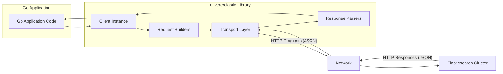

# Project Design Document: olivere/elastic Go Client

**Version:** 1.1
**Date:** October 26, 2023
**Author:** AI Software Architect

## 1. Introduction

This document provides a detailed design overview of the `olivere/elastic` Go client library for Elasticsearch. This document is intended to serve as a foundation for subsequent threat modeling activities. It outlines the library's architecture, key components, data flow, and security considerations, with a focus on aspects relevant to security analysis.

## 2. Project Overview

The `olivere/elastic` library is a widely adopted Go client designed to facilitate seamless interaction with Elasticsearch clusters. It offers a comprehensive suite of APIs enabling Go developers to perform a wide range of Elasticsearch operations, including indexing, searching, updating, deleting documents, and managing cluster settings. The library prioritizes providing a developer-friendly and idiomatic Go experience when working with Elasticsearch.

## 3. System Architecture

The `olivere/elastic` library acts as a logical intermediary residing within a Go application, responsible for orchestrating communication with an external Elasticsearch cluster. Its primary function is to translate Go function calls into well-formed HTTP requests that adhere to the Elasticsearch API specification and to subsequently parse the received HTTP responses back into readily usable Go data structures.

**Key Architectural Components:**

*   **`elastic.Client` Instance:** This serves as the central point of interaction with the library. It manages connection pooling, authentication details, and the execution of requests. A single client instance is typically configured per Elasticsearch cluster interaction.
*   **Request Builders:** This set of functions and associated structures provides a fluent interface for constructing Elasticsearch API requests. Examples include `IndexRequest` for creating documents, `SearchRequest` for querying data, and `UpdateRequest` for modifying existing documents. These builders encapsulate the specific parameters and JSON body structures required for various Elasticsearch operations.
*   **Transport Layer:** This component is responsible for the actual HTTP communication with the Elasticsearch cluster. It leverages Go's standard `net/http` package (or potentially a configurable alternative) to send requests and receive responses. This layer handles details like setting headers, managing connections, and potentially implementing retry logic.
*   **Response Parsers:** This part of the library takes the raw JSON responses received from Elasticsearch and unmarshals them into corresponding Go data structures. This allows the Go application to easily access and manipulate the data returned by Elasticsearch.
*   **Bulk Processor:** This utility provides an efficient mechanism for sending multiple Elasticsearch requests in a single batch HTTP request. This is crucial for optimizing performance when performing operations on a large number of documents.
*   **Scrollers:** These provide a way to efficiently retrieve large result sets from Elasticsearch. Instead of loading all results into memory at once, scrollers allow fetching results in chunks or pages.
*   **Error Handling:** The library provides structures and mechanisms for representing and handling errors returned by the Elasticsearch API. This includes parsing error details from the JSON response.

## 4. Data Flow

The typical data flow for an operation using the `olivere/elastic` library involves these steps:

1. The Go application initiates an Elasticsearch operation by invoking a function provided by the `olivere/elastic` library. For example, to index a document, it might call a method on an `IndexService` obtained from the `elastic.Client`.
2. The appropriate request builder within the library constructs the necessary HTTP request. This involves setting the HTTP method (e.g., `POST`, `GET`, `PUT`, `DELETE`), the correct Elasticsearch API endpoint URL, relevant HTTP headers (including content type and potentially authentication headers), and the request body (typically formatted as JSON).
    *   **Example (Indexing):**  The request body would contain the JSON representation of the document being indexed.
    *   **Example (Searching):** The request body would contain the JSON representation of the search query.
3. The transport layer takes the constructed HTTP request and sends it over the network to the configured Elasticsearch cluster endpoint. This communication typically occurs over TCP/IP.
4. The Elasticsearch cluster receives and processes the request.
5. The Elasticsearch cluster generates an HTTP response. This response includes a status code indicating success or failure, relevant HTTP headers, and a response body, which is usually formatted as JSON.
    *   **Example (Successful Indexing):** The response body might contain metadata about the indexed document, such as its ID and version.
    *   **Example (Search Results):** The response body would contain an array of matching documents, along with metadata like scores and aggregations.
6. The transport layer in the `olivere/elastic` library receives the HTTP response from the Elasticsearch cluster.
7. The response parser within the library processes the HTTP response. It checks the status code and, if successful, unmarshals the JSON response body into corresponding Go data structures. If an error occurred, it parses the error details from the JSON response.
8. The library returns the parsed data (if successful) or an error object to the calling Go application code.

**Examples of Data Transferred:**

*   **Requests:**
    *   **Index Request Data:** JSON document to be indexed, index name, document ID (optional), routing information.
    *   **Search Request Data:** JSON query definition (using Elasticsearch Query DSL), index names, types (deprecated), pagination parameters, sorting criteria, aggregation definitions.
    *   **Get Request Data:** Document ID, index name, stored fields to retrieve (optional).
    *   **Update Request Data:** Document ID, index name, partial document to update, script to execute for update.
    *   **Delete Request Data:** Document ID, index name.
    *   **Bulk Request Data:** An array of JSON objects, each representing an index, create, update, or delete operation.
    *   **Mapping Request Data:** JSON representation of the index mapping (schema).
    *   **Settings Request Data:** JSON representation of index or cluster settings to be updated.
*   **Responses:**
    *   **Successful Index Response Data:** Index name, document ID, document version, shard information.
    *   **Search Response Data:** Array of matching documents (each containing source data and metadata), total number of hits, aggregations results, suggestions.
    *   **Get Response Data:** The requested document (if found), metadata.
    *   **Error Response Data:** Error type, error message, root cause, stack trace (potentially).

## 5. Security Considerations

The security posture of interactions utilizing the `olivere/elastic` library is influenced by several key factors:

*   **Secure Connection Establishment (TLS/HTTPS):**  All communication between the Go application and the Elasticsearch cluster should be encrypted using TLS/HTTPS to protect data in transit from eavesdropping and tampering. The `olivere/elastic` library allows configuring the transport to enforce HTTPS and to customize TLS settings (e.g., certificate verification).
*   **Authentication and Authorization Mechanisms:** The library supports various authentication methods for connecting to Elasticsearch, ensuring that only authorized applications can access the cluster. These include:
    *   **Basic Authentication:**  Supplying a username and password for each request or connection.
    *   **API Keys:** Using pre-generated API keys for authentication. This is generally preferred over basic authentication for programmatic access.
    *   **Cloud ID:**  A specific authentication method for connecting to Elasticsearch Service on Elastic Cloud.
    *   **Custom HTTP Headers:**  Allows for integration with other authentication schemes by setting custom headers that Elasticsearch can interpret.
    The Go application must be meticulously configured with the correct credentials. Crucially, Elasticsearch itself is responsible for enforcing authorization based on the authenticated user or API key, determining what actions the authenticated entity is permitted to perform.
*   **Input Sanitization and Validation:** While the `olivere/elastic` library provides mechanisms for constructing requests, the primary responsibility for sanitizing and validating user-provided input lies with the Go application. Failure to do so can lead to injection vulnerabilities. The application must carefully sanitize any user data that is incorporated into Elasticsearch queries or document data to prevent attacks like Elasticsearch Query DSL injection.
*   **Robust Error Handling:**  Implementing proper error handling is paramount to prevent the leakage of sensitive information through error messages. Applications should log errors appropriately for debugging but avoid exposing internal details or sensitive data to end-users or in publicly accessible logs.
*   **Dependency Management and Security Audits:** The security of the `olivere/elastic` library is also dependent on the security of its own dependencies. Regularly updating the library and its dependencies is crucial to patch any known vulnerabilities. Performing periodic security audits of the project's dependencies is a recommended practice.
*   **Secure Configuration Management:**  Storing and managing Elasticsearch connection details (URLs, credentials) securely is critical. Avoid hardcoding sensitive information directly in the application code. Employ secure configuration management techniques such as using environment variables, dedicated secrets management systems (e.g., HashiCorp Vault, AWS Secrets Manager), or configuration files with restricted access.
*   **Network Security and Access Control:**  Restrict network access to the Elasticsearch cluster to only authorized clients. Employ firewalls and network segmentation to limit the attack surface and prevent unauthorized access from untrusted networks.
*   **Rate Limiting and Request Throttling:**  Consider implementing rate limiting or request throttling on the application side to prevent abuse and potential denial-of-service attacks against the Elasticsearch cluster.

## 6. Dependencies

The `olivere/elastic` library relies on a set of Go packages to function correctly:

*   **Go Standard Library Packages:**
    *   `net/http`:  Fundamental for making HTTP requests to the Elasticsearch API.
    *   `encoding/json`: Used for encoding Go data structures into JSON for requests and decoding JSON responses from Elasticsearch.
    *   `time`: For handling time-related operations, such as setting timeouts.
    *   `context`:  For managing request lifecycles and cancellation.
    *   `io`:  For basic input/output operations.
    *   `strings`:  For string manipulation tasks.
    *   `strconv`: For converting strings to other data types and vice versa.
    *   `sync`: Provides primitives for synchronizing concurrent operations.
    *   `fmt`: For formatted input and output.
    *   `errors`: For creating and handling error objects.
    *   `bytes`: For working with byte buffers.
    *   `net/url`: For parsing and manipulating URLs.
*   **External Libraries (Review `go.mod` for the specific version):** While the core library aims to minimize external dependencies, certain features or extensions might introduce them. It's essential to consult the `go.mod` file of the specific version of the `olivere/elastic` library being used to get an accurate and up-to-date list of its external dependencies. Common potential external dependencies might include:
    *   Libraries for compression (e.g., `compress/gzip`) if compression is used for communication.
    *   Potentially libraries for more advanced HTTP client features or instrumentation, although `net/http` is generally the primary transport mechanism.

## 7. Deployment Considerations

The `olivere/elastic` library is designed to be embedded within a Go application. The deployment environment of this Go application directly impacts the security considerations for the library's interactions with Elasticsearch. Common deployment scenarios include:

*   **On-Premise Infrastructure:** The Go application runs on physical or virtual servers within an organization's data center. Security considerations here involve physical security, network segmentation, and access control within the internal network.
*   **Cloud Platforms (AWS, Azure, GCP):** The application is deployed on cloud services like EC2, Azure VMs, Google Compute Engine, or platform-as-a-service offerings. Cloud-specific security best practices, such as using IAM roles, security groups, and network security groups, are crucial.
*   **Containerized Environments (Docker, Kubernetes):** The application is packaged as a Docker container and deployed using container orchestration platforms like Kubernetes. Security considerations include container image security, network policies within the cluster, and secure handling of secrets.
*   **Serverless Environments (AWS Lambda, Azure Functions, Google Cloud Functions):** The application logic runs as serverless functions. Security considerations focus on IAM roles, secure storage of secrets, and network configurations for the function.

The specific deployment environment dictates the relevant security controls and configurations that need to be implemented to protect the communication between the Go application and the Elasticsearch cluster.

## 8. Potential Threats (More Specific)

Building upon the general threats, here are some potential threats specifically relevant to the `olivere/elastic` library:

*   **Man-in-the-Middle Attacks on Elasticsearch Communication:** If TLS is not properly configured or enforced, attackers on the network path could intercept and potentially modify requests and responses between the Go application and the Elasticsearch cluster, leading to data breaches or manipulation.
*   **Elasticsearch Query DSL Injection:** If the Go application constructs Elasticsearch queries by directly concatenating user-provided input without proper sanitization, attackers could inject malicious Query DSL code to bypass security restrictions, access unauthorized data, or even potentially impact the Elasticsearch cluster's performance.
*   **Compromise of Elasticsearch Credentials:** If the authentication credentials used by the `olivere/elastic` library (e.g., API keys, usernames/passwords) are compromised due to insecure storage or transmission, attackers can gain full access to the Elasticsearch cluster, potentially leading to data breaches, data modification, or deletion.
*   **Denial of Service Attacks Targeting Elasticsearch via the Client:** An attacker could exploit vulnerabilities or inefficiencies in the Go application's use of the `olivere/elastic` library to send a large volume of resource-intensive requests to the Elasticsearch cluster, potentially overwhelming it and causing a denial of service.
*   **Information Disclosure through Verbose Error Handling:** If the Go application exposes detailed error messages from the `olivere/elastic` library (which might include internal details about the Elasticsearch cluster or the query), attackers could gain valuable information for further attacks.
*   **Exploitation of Vulnerabilities in `olivere/elastic` or its Dependencies:**  Unpatched security vulnerabilities in the `olivere/elastic` library itself or its underlying dependencies could be exploited by attackers to compromise the Go application or the Elasticsearch interaction.
*   **Unauthorized Data Access due to Insufficient Elasticsearch Permissions:** Even with secure communication, if the Elasticsearch user or API key used by the `olivere/elastic` library has overly broad permissions, attackers who compromise the application could gain access to sensitive data they shouldn't be able to see.
*   **Data Tampering through the Client:** If the Elasticsearch user or API key used by the `olivere/elastic` library has write permissions and the application is compromised, attackers could modify or delete data within the Elasticsearch cluster.

This refined design document provides a more detailed and security-focused overview of the `olivere/elastic` Go client library, making it a more effective foundation for subsequent threat modeling activities.
