## Project Design Document: olivere/elastic Go Client for Elasticsearch (Improved)

**1. Introduction**

This document provides an enhanced design overview of the `olivere/elastic` Go client library for Elasticsearch. It aims to deliver a clear and comprehensive understanding of the library's architecture, core components, and data flow, specifically tailored to serve as a robust foundation for subsequent threat modeling activities. This document is primarily intended for security engineers, developers, and anyone involved in assessing the security posture of applications that integrate with Elasticsearch using this library.

**2. Goals**

*   Clearly define the architecture and components of the `olivere/elastic` library relevant to security analysis.
*   Illustrate the data flow within the library and its interaction with Elasticsearch, highlighting potential points of vulnerability.
*   Identify key interfaces, data handling mechanisms, and configurations that are critical for security considerations and threat identification.
*   Provide a structured basis for identifying potential threats, vulnerabilities, and attack vectors associated with the library's usage.

**3. Scope**

This design document focuses on the core functionalities of the `olivere/elastic` library that are pertinent to interacting with Elasticsearch from a security perspective. It encompasses:

*   Client initialization and security-related configuration options (e.g., TLS, authentication).
*   The process of building and executing Elasticsearch API requests, including handling of user-provided data.
*   Data serialization and deserialization mechanisms and their potential security implications.
*   The transport layer and its role in secure communication.
*   Error handling mechanisms and the potential for information disclosure.

This document explicitly excludes:

*   The internal implementation details of the Elasticsearch server itself.
*   Specific application-level logic built upon the `olivere/elastic` library (beyond illustrative examples).
*   Detailed performance benchmarking or optimization strategies.

**4. High-Level Overview**

The `olivere/elastic` library serves as a Go language SDK, enabling applications to establish secure and reliable communication with an Elasticsearch cluster. It abstracts the complexities of the Elasticsearch REST API, offering a programmatic interface for operations such as indexing, searching, updating, and deleting documents. The library handles HTTP(S) communication, request formatting according to the Elasticsearch API specification, and response parsing, allowing developers to interact with Elasticsearch without needing to manage low-level networking details. Security considerations are paramount in its design, particularly around secure communication and preventing injection vulnerabilities.

**5. Key Components**

*   **`Client`:** The primary interface for interacting with Elasticsearch. It manages connections, security configurations (like TLS settings and credentials), and provides access to the various Elasticsearch API functionalities. *Security Relevance:* This component is responsible for establishing secure connections and managing authentication, making its configuration critical.
*   **Request Builders (e.g., `IndexRequest`, `SearchRequest`):** Structures and functions used to construct Elasticsearch API requests programmatically. They allow developers to define query parameters, request bodies, and headers. *Security Relevance:*  These components handle user-provided data that forms the basis of Elasticsearch queries. Improper handling can lead to injection vulnerabilities.
*   **Transports (HTTP(S) Client):**  Manages the actual communication with the Elasticsearch cluster over HTTP or HTTPS. This component handles connection pooling, request sending, response receiving, and crucially, TLS negotiation and certificate validation for secure communication. *Security Relevance:* This is the layer responsible for ensuring confidentiality and integrity of data in transit.
*   **Serializers/Deserializers (JSON Handling):** Responsible for converting Go data structures into JSON format for sending requests and parsing JSON responses from Elasticsearch. Typically leverages Go's `encoding/json` package. *Security Relevance:*  Improper deserialization can lead to vulnerabilities if untrusted data is processed.
*   **Configuration Options:** A comprehensive set of parameters to customize the client's behavior, including Elasticsearch endpoint URLs, authentication credentials (API keys, username/password), TLS configuration (certificate paths, verification settings), timeouts, and retry policies. *Security Relevance:* Secure configuration is essential. Mishandling credentials or disabling security features weakens the entire system.
*   **Error Handling:** Mechanisms for reporting errors encountered during communication or request processing. Includes specific error types and potentially structured error information. *Security Relevance:* Verbose error messages can inadvertently expose sensitive information.
*   **Bulk Processor:**  Allows for efficient execution of multiple Elasticsearch operations in a single request. *Security Relevance:* Similar to individual requests, bulk requests need careful construction to avoid injection vulnerabilities when handling multiple data points.
*   **Scrollers:** Facilitate the retrieval of large datasets from Elasticsearch. *Security Relevance:*  Access control and authorization are important when dealing with potentially sensitive large datasets retrieved via scrollers.

**6. Data Flow with Security Considerations**

```mermaid
graph LR
    subgraph "Go Application"
        A["Application Code"] --> B("Client Instance");
        B -- "Configuration (TLS, Auth)" --> C(Configuration);
        C --> B;
        B --> D("Request Builder (e.g., SearchRequest)");
        D -- "User Input/Data" --> E("Request Payload (JSON)");
        E -- "Serialization" --> F("Transport Layer (HTTPS)");
    end
    F -- "Encrypted Request" --> G["Elasticsearch Cluster"];
    G -- "Encrypted Response" --> H("Transport Layer (HTTPS)");
    subgraph "Go Application"
        H -- "Deserialization" --> I("Response Payload (JSON)");
        I --> J("Response Deserializer");
        J --> K("Go Data Structures");
        K --> A;
    end
    style A fill:#f9f,stroke:#333,stroke-width:2px
    style G fill:#ccf,stroke:#333,stroke-width:2px
    linkStyle 0,8 stroke:#333, stroke-width: 2px;
    linkStyle 1 stroke:#007bff, stroke-width: 2px, text-decoration: underline;
    linkStyle 3 stroke:#ffc107, stroke-width: 2px, text-decoration: underline;
    linkStyle 5,7 stroke:#28a745, stroke-width: 2px, text-decoration: underline;
```

**Detailed Data Flow Steps with Security Notes:**

1. **Application Code:** The application initiates an interaction.
2. **Client Instance:** The application uses an initialized `Client`.
3. **Configuration (TLS, Auth):** The `Client` is configured with security settings like TLS and authentication credentials. *Security Note:* This step is crucial for establishing secure communication. Incorrect configuration (e.g., disabled TLS, hardcoded credentials) introduces significant risks.
4. **Request Builder:** The application uses request builders, potentially incorporating user input. *Security Note:* This is a primary point for injection vulnerabilities. Input validation and sanitization are essential here.
5. **Request Payload (JSON):** The request builder transforms data into a JSON payload.
6. **Serialization:** Go data structures are serialized into JSON. *Security Note:* While generally safe, vulnerabilities in the serialization library itself could be a concern (though less likely with standard libraries).
7. **Transport Layer (HTTPS):** The `Transport` sends the JSON payload over HTTPS. *Security Note:* HTTPS ensures encryption and integrity. Verify proper TLS configuration and certificate validation.
8. **Elasticsearch Cluster:** Elasticsearch receives and processes the request.
9. **Transport Layer (HTTPS):** Elasticsearch sends the response over HTTPS.
10. **Deserialization:** The JSON response is deserialized into Go data structures. *Security Note:* Similar to serialization, potential vulnerabilities in the deserialization process exist, though less common with standard libraries.
11. **Response Deserializer:** The response is parsed.
12. **Go Data Structures:** The deserialized data is available to the application.

**7. Security Considerations (Detailed)**

*   **Transport Layer Security (TLS Enforcement):**  Mandatory use of HTTPS for all communication with Elasticsearch is critical to protect data in transit from eavesdropping and tampering. The library's configuration should enforce TLS and provide options for strict certificate validation (e.g., verifying hostname).
*   **Authentication and Authorization Mechanisms:** The library must support secure authentication methods offered by Elasticsearch, such as:
    *   **Basic Authentication:** Credentials should be handled securely (e.g., not hardcoded, stored securely).
    *   **API Keys:**  API keys should be managed with appropriate permissions and rotation policies.
    *   **Integration with Security Plugins (e.g., Search Guard, Elastic Stack Security):**  The library should seamlessly integrate with these plugins to leverage their advanced authentication and authorization features.
*   **Input Validation and Sanitization (Injection Prevention):**  Applications using this library must rigorously validate and sanitize any user-provided input before incorporating it into Elasticsearch queries. This is crucial to prevent NoSQL injection attacks. The library's request builders can help structure queries, but they don't inherently prevent injection if used carelessly.
*   **Error Handling and Information Disclosure Prevention:** Error responses from Elasticsearch should be handled carefully. Avoid logging or exposing overly detailed error messages that could reveal sensitive information about the system's internal workings or data structure.
*   **Dependency Management and Vulnerability Scanning:** Regularly audit and update the library's dependencies to patch any known security vulnerabilities. Utilize dependency scanning tools to identify potential risks.
*   **Secure Configuration Management:** Sensitive configuration parameters, such as Elasticsearch credentials and TLS certificates, should be managed securely using environment variables, secrets management solutions (e.g., HashiCorp Vault), or secure configuration files with restricted access. Avoid hardcoding credentials.
*   **Data Sensitivity and Access Control:** Understand the sensitivity of the data being accessed and ensure that the Elasticsearch cluster is configured with appropriate access controls and permissions. The application using the library should adhere to the principle of least privilege.
*   **Request Forgery (CSRF) Mitigation:** While the client library itself doesn't directly face CSRF, applications built on top of it that expose APIs interacting with Elasticsearch must implement CSRF protection mechanisms.
*   **Denial of Service (DoS) Resilience:** Configure appropriate timeouts, retry policies, and circuit breakers within the library's configuration to prevent the application from being overwhelmed by a slow or unresponsive Elasticsearch cluster, mitigating potential DoS scenarios.
*   **Logging and Auditing:** Implement comprehensive logging of interactions with Elasticsearch, including request details and any errors. This can aid in security monitoring, incident response, and identifying suspicious activity.

**8. Dependencies**

*   **`net/http` (Go Standard Library):**  Fundamental for making HTTP and HTTPS requests.
*   **`encoding/json` (Go Standard Library):** Used for JSON serialization and deserialization.
*   Potentially other external libraries for:
    *   **Specific Authentication Mechanisms:** Libraries for OAuth 2.0 or other authentication protocols.
    *   **Compression:** Libraries for handling compressed communication with Elasticsearch.
    *   **Logging:**  More advanced logging frameworks.
    *   *A review of the `go.mod` file is necessary for a definitive list.*

**9. Deployment Considerations**

The `olivere/elastic` library is integrated directly into Go applications. Security in a deployed environment relies on:

*   **Secure Infrastructure:** The underlying infrastructure (servers, containers, cloud environment) must be secured.
*   **Secure Elasticsearch Cluster Configuration:** The Elasticsearch cluster itself must be properly secured (authentication, authorization, network security).
*   **Application Security Practices:**  The application using the library must follow secure development practices (input validation, secure configuration, etc.).
*   **Network Security:** Network policies and firewalls should restrict access to the Elasticsearch cluster.

**10. Future Considerations (Security Focused)**

*   **Enhanced Security Logging:** Implement more granular and configurable security logging within the library to track authentication attempts, authorization failures, and potentially suspicious query patterns.
*   **Metrics for Security Monitoring:**  Expose metrics related to authentication success/failure, request latency, and error rates to facilitate security monitoring and anomaly detection.
*   **Integration with Security Information and Event Management (SIEM) Systems:**  Provide options for easily integrating the library's logs with SIEM systems for centralized security monitoring and analysis.
*   **Built-in Input Sanitization Helpers:**  Consider adding optional helper functions within the library to assist developers with common input sanitization tasks, reducing the risk of injection vulnerabilities.
*   **Support for Hardware Security Modules (HSMs):**  Explore options for integrating with HSMs for secure storage and management of sensitive cryptographic keys used for authentication or encryption.

This improved design document provides a more detailed and security-focused overview of the `olivere/elastic` library, serving as a stronger foundation for subsequent threat modeling activities.