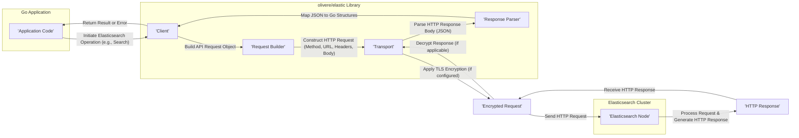

## Project Design Document: `olivere/elastic` Go Client Library (Improved)

**1. Introduction**

This document provides an enhanced design overview of the `olivere/elastic` Go client library, designed for interacting with Elasticsearch clusters. The primary purpose of this document is to offer a comprehensive understanding of the library's architecture, key components, and data flow, specifically tailored to facilitate effective threat modeling. This document focuses on the client library's internal workings and its interactions with Elasticsearch, excluding the internal architecture of Elasticsearch itself.

**2. Goals**

*   Present a clear, detailed, and easily understandable architectural overview of the `olivere/elastic` library.
*   Thoroughly identify and describe the key components of the library and their interactions.
*   Illustrate the data flow within the library during typical Elasticsearch operations, emphasizing security-relevant pathways.
*   Explicitly highlight security considerations and potential vulnerabilities within the library's design.
*   Serve as a robust and informative foundation for subsequent threat modeling activities, enabling the identification of potential attack vectors and risks.

**3. Non-Goals**

*   In-depth, line-by-line code implementation details.
*   Performance evaluation, benchmarking results, or optimization strategies for the library.
*   Comprehensive documentation of specific Elasticsearch API endpoints or their usage.
*   Detailed deployment instructions or configuration management strategies for applications utilizing the library.
*   The actual execution or results of a threat modeling exercise (this document prepares for that).

**4. Architectural Overview**

The `olivere/elastic` library acts as a crucial intermediary, enabling seamless communication between Go applications and Elasticsearch clusters. It provides a Go-centric interface, abstracting the complexities of the underlying HTTP communication with the Elasticsearch REST API. The library is designed following Go's idiomatic conventions, offering a fluent and intuitive interface for constructing and executing Elasticsearch queries and commands. Its architecture emphasizes modularity and extensibility.

**5. Key Components**

*   **`Client`:** The central point of interaction with Elasticsearch. It manages connections, global configurations, and the execution of requests.
    *   Maintains a pool of reusable HTTP connections to Elasticsearch nodes, optimizing resource utilization.
    *   Handles various authentication and authorization mechanisms required to access the Elasticsearch cluster.
    *   Provides a comprehensive set of methods corresponding to Elasticsearch operations (e.g., indexing, searching, deleting documents, managing indices).
    *   Highly configurable, allowing customization of transport behavior, retry policies for failed requests, and node discovery (sniffing).
*   **`Transport` Interface and Implementations:** Responsible for the low-level HTTP communication with Elasticsearch.
    *   Defines an interface for sending HTTP requests, allowing for pluggable implementations.
    *   The default implementation utilizes the standard `net/http` package in Go.
    *   Handles the construction of HTTP requests, including setting headers and serializing request bodies (typically JSON).
    *   Manages the reception and processing of HTTP responses from Elasticsearch.
    *   Crucially responsible for implementing TLS/SSL encryption for secure communication.
    *   Allows for customization with alternative HTTP client implementations, potentially for advanced features or specific security requirements.
*   **Request Builders:** A collection of structures and functions designed to simplify the creation of Elasticsearch API requests.
    *   Offers a fluent and type-safe interface for constructing complex queries and commands, reducing the risk of syntax errors.
    *   Ensures that requests adhere to the correct format and structure expected by the Elasticsearch API specification.
    *   Examples include `SearchRequest` for building search queries, `IndexRequest` for indexing documents, and `BulkRequest` for performing bulk operations.
*   **Response Parsers and Deserialization:** Handles the interpretation of JSON responses received from Elasticsearch.
    *   Unmarshals JSON response bodies into well-defined Go data structures, making the data accessible to the application.
    *   Provides mechanisms for accessing the data returned by Elasticsearch, including hits, aggregations, and other relevant information.
    *   Responsible for identifying and handling error responses returned by Elasticsearch, providing meaningful error information to the application.
*   **Error Handling Mechanisms:** Provides robust mechanisms for managing errors that occur during communication or request processing.
    *   Returns standard Go error values to indicate failures, allowing for consistent error handling within the application.
    *   May provide specific error types or structures to differentiate between various error scenarios (e.g., network errors, Elasticsearch API errors).
    *   Allows for the implementation of custom error handling logic within the application.
*   **Sniffing and Node Discovery:** A mechanism for dynamically discovering and maintaining an up-to-date list of available Elasticsearch nodes within a cluster.
    *   Periodically queries the Elasticsearch cluster's `/nodes` endpoint to retrieve information about active nodes.
    *   Updates the `Client`'s internal list of nodes, ensuring requests are distributed across healthy nodes.
    *   Improves the resilience and availability of the application by adapting to changes in the cluster topology.
*   **Retry Strategies:** Implements configurable logic for automatically retrying failed requests.
    *   Offers various retry strategies, such as exponential backoff, to handle transient network issues or temporary unavailability of Elasticsearch nodes.
    *   Helps to improve the reliability of interactions with Elasticsearch.
*   **Bulk Processor:** A specialized component for efficiently sending a large number of requests to Elasticsearch in a batched manner.
    *   Aggregates individual requests into bulk requests, reducing the overhead of sending multiple individual HTTP requests.
    *   Significantly improves performance for high-volume data ingestion or updates.
*   **Context Management:** Leverages Go's `context` package for managing request timeouts, cancellations, and deadlines.
    *   Allows for graceful termination of long-running operations, preventing resource exhaustion.
    *   Enables the application to control the lifecycle of requests.

**6. Data Flow (Detailed)**

**Detailed Data Flow for a Typical Indexing Request:**

1. The application code interacts with the `Client` to initiate an indexing operation for a document.
2. The application utilizes a specific `RequestBuilder` (e.g., `IndexRequest`) to construct the indexing request, specifying the index, document ID (optional), and the document source.
3. The `Client` delegates the request execution to the `Transport`.
4. The `Transport` constructs the underlying HTTP request:
    *   Determines the appropriate Elasticsearch endpoint URL based on the operation and index.
    *   Sets necessary HTTP headers, including content type (typically `application/json`).
    *   Serializes the document source into JSON format for the request body.
    *   Includes authentication credentials in the request headers (e.g., Basic Auth, API Key).
5. If TLS/SSL is configured, the `Transport` encrypts the HTTP request before sending it over the network.
6. The `Transport` sends the HTTP request to a selected Elasticsearch node. If sniffing is enabled, the `Client` will choose a node from its dynamically updated list of available nodes.
7. The Elasticsearch node receives the request, authenticates the request, and processes the indexing operation.
8. The Elasticsearch node generates an HTTP response, indicating the success or failure of the operation, along with relevant metadata.
9. The `Transport` receives the HTTP response. If the original request was encrypted, the response is decrypted.
10. The `Response Parser` parses the JSON response body.
11. The `Client` receives the parsed response and returns the result (e.g., the indexed document's metadata) or an error to the application code.

**7. Security Considerations (Expanded)**

*   **Authentication and Authorization:**
    *   The library supports various authentication methods for connecting to Elasticsearch, including Basic Authentication (username/password), API keys, and potentially integration with security plugins like X-Pack/Security.
    *   The security of the application heavily relies on the secure storage and management of these authentication credentials. Consider using environment variables, secrets management systems, or secure configuration providers instead of hardcoding credentials.
    *   The library itself does not enforce authorization; this is the responsibility of the Elasticsearch cluster. Ensure that the Elasticsearch cluster is properly configured with appropriate role-based access control (RBAC).
*   **Transport Layer Security (TLS/SSL):**
    *   The library strongly supports secure communication with Elasticsearch over HTTPS. Enabling and correctly configuring TLS is paramount to protect data in transit from eavesdropping and tampering.
    *   Configuration options are available to enforce TLS and to verify the server's certificate against a trusted Certificate Authority (CA). Disabling certificate verification should be avoided in production environments.
    *   Consider the TLS protocol versions and cipher suites supported by both the client and the Elasticsearch cluster to ensure strong encryption.
*   **Input Validation and Sanitization:**
    *   While the library's request builders help in constructing well-formed Elasticsearch API requests, the application code is ultimately responsible for validating and sanitizing any user-provided input before including it in queries or documents. Failure to do so can lead to injection vulnerabilities (e.g., NoSQL injection).
    *   Be cautious when constructing dynamic queries based on user input. Use parameterized queries or other safe methods to prevent malicious code injection.
*   **Dependency Management and Supply Chain Security:**
    *   The library depends on other Go packages. Vulnerabilities in these dependencies can introduce security risks. Regularly audit and update dependencies to mitigate known vulnerabilities. Utilize tools like `govulncheck` to identify potential issues.
    *   Be mindful of the provenance and integrity of the library itself. Obtain it from trusted sources.
*   **Error Handling and Information Disclosure:**
    *   Error messages returned by the library or Elasticsearch might inadvertently expose sensitive information about the application's internal workings or the Elasticsearch cluster's configuration. Avoid displaying raw error messages to end-users. Log errors securely and provide generic error messages to users.
*   **Logging Security:**
    *   The library or the application using it might log requests, responses, or other operational data. Ensure that sensitive information, such as authentication credentials, API keys, or personally identifiable information (PII) within query parameters or document data, is not logged or is properly redacted before logging.
*   **Configuration Management Security:**
    *   Securely manage the configuration of the `Client`, including Elasticsearch URLs, authentication details, and TLS settings. Avoid storing sensitive configuration in version control systems or easily accessible files. Utilize environment variables, dedicated secrets management solutions (e.g., HashiCorp Vault, AWS Secrets Manager), or secure configuration providers.
*   **Sniffing and Network Security:**
    *   While sniffing facilitates cluster discovery, ensure that the application has appropriate network access controls in place to prevent unauthorized access to Elasticsearch nodes. Restrict network access to only necessary components.
    *   Consider the security implications of exposing node information through the sniffing mechanism.
*   **Retry Logic and Denial of Service:**
    *   While retry mechanisms enhance resilience, improperly configured retry logic could potentially be exploited to amplify denial-of-service (DoS) attacks against the Elasticsearch cluster. Implement appropriate backoff strategies and limits on retry attempts.
*   **Rate Limiting and Request Throttling:**
    *   The library itself doesn't inherently implement rate limiting. Consider implementing rate limiting or request throttling at the application level or using Elasticsearch's built-in mechanisms to protect the cluster from being overwhelmed by excessive requests.

**8. Deployment Considerations**

*   The `olivere/elastic` library is typically deployed as an integral part of a Go application that interacts with an Elasticsearch cluster.
*   The application hosting the library requires reliable network connectivity to the Elasticsearch cluster. Ensure proper firewall rules and network segmentation are in place.
*   Configuration of the `Client` is crucial and should be managed securely, often through environment variables, configuration files loaded from secure locations, or dedicated secrets management services.
*   Consider the security posture of the deployment environment (e.g., cloud environment security controls, on-premise data center security policies).
*   Regularly update the library to benefit from security patches and bug fixes.

**9. Future Considerations**

*   Potential integration with more sophisticated authentication and authorization frameworks.
*   Enhanced observability features, such as built-in tracing and metrics export, to aid in monitoring and security analysis.
*   Further refinements to the fluent API to improve developer experience and reduce the likelihood of errors.
*   Exploration of more granular and context-aware error handling mechanisms.
*   Consideration of built-in support for request signing or other advanced security features.

This improved design document provides a more detailed and security-focused understanding of the `olivere/elastic` Go client library's architecture and operation. This enhanced information will be invaluable for conducting a comprehensive threat modeling exercise, enabling the identification of potential security vulnerabilities and the development of effective mitigation strategies.