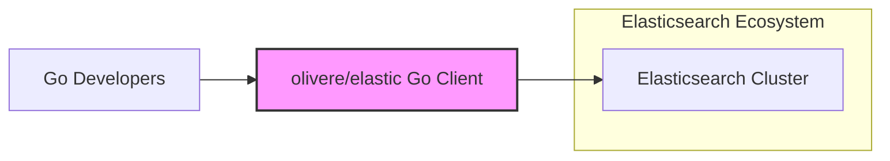
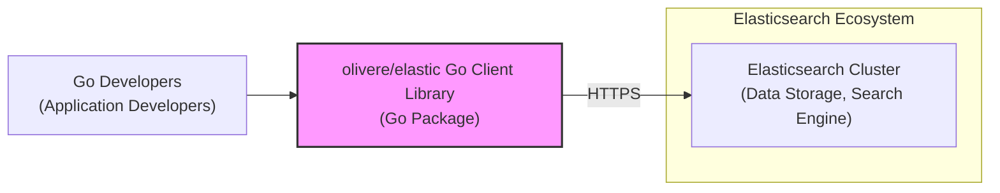
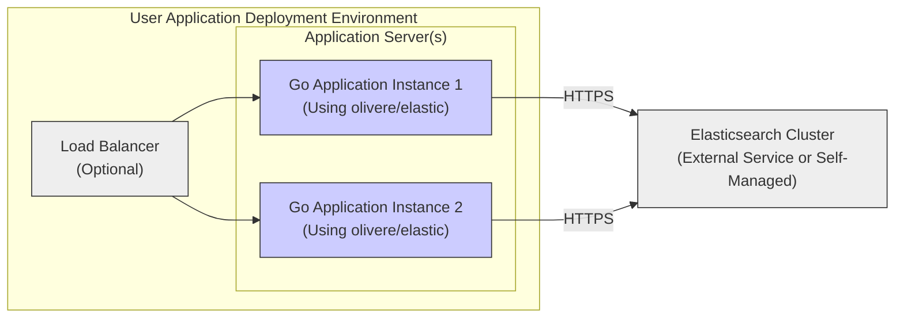

# BUSINESS POSTURE

This project, `olivere/elastic`, provides a Go client for Elasticsearch.

- Business Priorities:
  - Provide a comprehensive and feature-rich Go client that supports the full functionality of Elasticsearch.
  - Ensure the client is reliable, performant, and easy to use for Go developers.
  - Maintain compatibility with various versions of Elasticsearch.
  - Foster an active and supportive community around the client library.

- Business Goals:
  - Enable Go developers to seamlessly integrate Elasticsearch into their applications.
  - Reduce the complexity of interacting with Elasticsearch APIs from Go.
  - Offer a well-documented and actively maintained Go client as a preferred choice for Elasticsearch integration.

- Business Risks:
  - Security vulnerabilities in the client library could expose applications using it to risks.
  - Incompatibility with new Elasticsearch versions could lead to application failures or require significant updates.
  - Performance issues in the client could negatively impact applications relying on it.
  - Lack of maintenance or community support could make the client less attractive and reliable over time.

# SECURITY POSTURE

- Security Controls:
  - security control: Code is hosted on GitHub, leveraging GitHub's security features for repository management and access control. (Implemented: GitHub)
  - security control:  Likely uses standard Go security practices for code development. (Implemented: Development Process)
  - security control:  Relies on HTTPS for communication with Elasticsearch, ensuring data in transit is encrypted. (Implemented: Client Library Code)

- Accepted Risks:
  - accepted risk: Security vulnerabilities in dependencies of the client library.
  - accepted risk: Misuse of the client library by developers leading to insecure application configurations.
  - accepted risk:  Vulnerabilities in the underlying Elasticsearch service itself are outside the scope of this client library.
  - accepted risk:  Security of the Go runtime environment and the host system where the client library is used.

- Recommended Security Controls:
  - security control: Implement automated dependency scanning to identify and address vulnerabilities in third-party libraries.
  - security control: Integrate static application security testing (SAST) tools into the development pipeline to detect potential code-level vulnerabilities.
  - security control:  Consider providing security guidelines and best practices documentation for developers using the client library, focusing on secure Elasticsearch integration.
  - security control:  Establish a process for reporting and addressing security vulnerabilities in the client library.

- Security Requirements:
  - Authentication:
    - Requirement: The client library must support Elasticsearch authentication mechanisms (e.g., Basic Authentication, API keys, OAuth) to securely connect to Elasticsearch clusters.
    - Requirement:  Authentication credentials should be handled securely and not hardcoded in the client code.
  - Authorization:
    - Requirement: The client library should facilitate the implementation of Elasticsearch's role-based access control (RBAC) by allowing users to specify roles and permissions when interacting with Elasticsearch.
    - Requirement:  The client should not bypass or weaken Elasticsearch's authorization mechanisms.
  - Input Validation:
    - Requirement: The client library should provide mechanisms to help developers sanitize and validate user inputs before sending them to Elasticsearch queries to prevent injection attacks.
    - Requirement:  The client itself should validate inputs it receives from developers to prevent unexpected behavior or vulnerabilities.
  - Cryptography:
    - Requirement: All communication between the client library and Elasticsearch should be encrypted using HTTPS to protect data in transit.
    - Requirement:  If the client library handles sensitive data locally (e.g., temporary caching), consider encryption at rest. (Note: unlikely for a client library).

# DESIGN

## C4 Context

- Context Diagram Elements:
  - Element:
    - Name: Go Developers
    - Type: Person
    - Description: Software developers who use the `olivere/elastic` Go client to interact with Elasticsearch in their Go applications.
    - Responsibilities: Develop Go applications that require Elasticsearch functionality. Use the `olivere/elastic` client to interact with Elasticsearch. Securely configure and deploy their applications.
    - Security Controls: Responsible for securing their own development environments and applications that use the client library. Implement secure coding practices when using the client.
  - Element:
    - Name: olivere/elastic Go Client
    - Type: Software System
    - Description: A Go library that provides an interface for Go applications to communicate with and utilize the features of an Elasticsearch cluster.
    - Responsibilities: Provide a Go API for interacting with Elasticsearch. Handle communication with Elasticsearch over HTTP. Serialize and deserialize data between Go and Elasticsearch formats. Implement Elasticsearch features in Go.
    - Security Controls: HTTPS for communication with Elasticsearch. Input validation on client-side inputs.  Should not store sensitive data locally.
  - Element:
    - Name: Elasticsearch Cluster
    - Type: Software System
    - Description: A distributed search and analytics engine that stores, indexes, and searches data.  The backend system that the Go client interacts with.
    - Responsibilities: Store and index data. Process search and analytics queries. Manage data security and access control. Provide APIs for data interaction.
    - Security Controls: Authentication and authorization mechanisms. Data encryption at rest and in transit. Network security controls. Audit logging.

## C4 Container

- Container Diagram Elements:
  - Element:
    - Name: olivere/elastic Go Client Library
    - Type: Library
    - Description: A Go package that is imported and used by Go applications to interact with Elasticsearch. It encapsulates the logic for communicating with Elasticsearch APIs.
    - Responsibilities: Provide Go functions and data structures that map to Elasticsearch APIs. Handle HTTP requests and responses to Elasticsearch. Manage connection pooling and error handling.  Serialization and deserialization of data.
    - Security Controls:  HTTPS communication. Input validation.  Dependency management.  No local data storage of sensitive information.
  - Element:
    - Name: Elasticsearch Cluster
    - Type: Data Store / Application
    - Description: The backend Elasticsearch service, responsible for storing and indexing data, processing queries, and managing security.
    - Responsibilities: Data persistence. Query processing. Indexing. Search. Security enforcement (authentication, authorization).
    - Security Controls: Elasticsearch's built-in security features: authentication, authorization, TLS encryption, audit logging, field and document level security.

## DEPLOYMENT

The `olivere/elastic` Go client is a library, and its deployment is inherently tied to the deployment of the Go applications that use it.  There isn't a separate deployment for the client itself.  The deployment diagram below illustrates a typical deployment scenario for a Go application that utilizes the `olivere/elastic` client to connect to an Elasticsearch cluster.

- Deployment Diagram Elements:
  - Element:
    - Name: Go Application Instance 1 & 2
    - Type: Application Instance
    - Description: Instances of a Go application that incorporates the `olivere/elastic` client library. These applications are responsible for business logic and data processing, using Elasticsearch for search and analytics.
    - Responsibilities: Execute application logic. Utilize the `olivere/elastic` client to interact with Elasticsearch. Handle user requests. Manage application-level security.
    - Security Controls: Application-level authentication and authorization. Input validation. Secure configuration management.  Utilizing the `olivere/elastic` client securely (e.g., proper credential handling).
  - Element:
    - Name: Load Balancer (Optional)
    - Type: Infrastructure Component
    - Description: Distributes incoming traffic across multiple instances of the Go application for scalability and high availability.
    - Responsibilities: Traffic distribution. Load balancing.  Potentially TLS termination.
    - Security Controls: TLS termination (if configured).  Access control to the load balancer itself.
  - Element:
    - Name: Elasticsearch Cluster
    - Type: External Service / Infrastructure
    - Description: The Elasticsearch cluster that the Go applications connect to. It can be a cloud-managed service or a self-managed cluster.
    - Responsibilities: Data storage and indexing. Search and analytics query processing.  Providing Elasticsearch API access.  Managing Elasticsearch cluster security.
    - Security Controls: Elasticsearch's security features (authentication, authorization, TLS, audit logging). Network security controls around the Elasticsearch cluster.

## BUILD

```mermaid
flowchart LR
    A["Developer\n(Writes Go Code)"] --> B["Code Repository\n(GitHub)"]
    B --> C["CI/CD System\n(GitHub Actions, etc.)"]
    C --> D["Build Process\n(Go Build, Dependency Resolution)"]
    D --> E["Security Checks\n(SAST, Dependency Scan, Linters)"]
    E --> F["Build Artifacts\n(Go Library Package)"]
    F --> G["Package Registry\n(Go Modules, etc.)"]
    style A fill:#ccf,stroke:#333,stroke-width:1px
    style B fill:#eee,stroke:#333,stroke-width:1px
    style C fill:#eee,stroke:#333,stroke-width:1px
    style D fill:#eee,stroke:#333,stroke-width:1px
    style E fill:#eee,stroke:#333,stroke-width:1px
    style F fill:#eee,stroke:#333,stroke-width:1px
    style G fill:#eee,stroke:#333,stroke-width:1px
```

- Build Process Elements:
  - Element:
    - Name: Developer
    - Type: Person
    - Description: Software developers who write and maintain the Go code for the `olivere/elastic` client library.
    - Responsibilities: Writing code. Committing code to the repository.  Performing initial code testing.
    - Security Controls: Secure development environment. Code review practices.  Adherence to secure coding guidelines.
  - Element:
    - Name: Code Repository
    - Type: Software System
    - Description: A version control system (likely GitHub) that stores the source code of the `olivere/elastic` client library.
    - Responsibilities: Version control. Code storage. Collaboration. Access control to the codebase.
    - Security Controls: Access control (authentication and authorization for developers). Audit logging of code changes. Branch protection.
  - Element:
    - Name: CI/CD System
    - Type: Software System
    - Description: An automated system (e.g., GitHub Actions) that builds, tests, and potentially publishes the `olivere/elastic` client library.
    - Responsibilities: Automated build process. Automated testing.  Integration of security checks.  Artifact publishing.
    - Security Controls: Secure configuration of CI/CD pipelines. Access control to CI/CD system. Secrets management for credentials used in the build process.
  - Element:
    - Name: Build Process
    - Type: Process
    - Description: The steps involved in compiling the Go code, resolving dependencies, and creating the build artifacts (Go library package).
    - Responsibilities: Compilation of Go code. Dependency resolution (using Go modules).  Packaging the library.
    - Security Controls: Use of trusted build tools and environments. Dependency management and vulnerability scanning.
  - Element:
    - Name: Security Checks
    - Type: Process
    - Description: Automated security scans and checks performed during the build process to identify potential vulnerabilities. Includes SAST, dependency scanning, and linters.
    - Responsibilities: Static code analysis. Dependency vulnerability scanning. Code style and quality checks.
    - Security Controls: Integration of SAST tools. Integration of dependency scanning tools. Configuration of linters and code quality checks.
  - Element:
    - Name: Build Artifacts
    - Type: Data
    - Description: The resulting Go library package that is produced by the build process.
    - Responsibilities:  Representing the compiled and packaged client library.  Being the distributable unit of the library.
    - Security Controls:  Integrity checks (e.g., checksums) for build artifacts. Secure storage of build artifacts before publishing.
  - Element:
    - Name: Package Registry
    - Type: Software System
    - Description: A repository (e.g., Go Modules registry) where the built Go library package is published and made available for developers to download and use.
    - Responsibilities: Hosting and distributing the Go library package. Version management.
    - Security Controls: Access control to publish packages. Integrity checks for published packages.  Vulnerability scanning of published packages (by the registry provider).

# RISK ASSESSMENT

- Critical Business Processes:
  - For the `olivere/elastic` project itself, the critical business process is providing a functional, reliable, and secure Go client library for Elasticsearch.  Reputation and user trust are key assets.
  - For users of the library, critical business processes will vary widely depending on their applications.  Any application that relies on Elasticsearch for core functionality (e.g., search, data analytics, logging) and uses this client library is potentially impacted by vulnerabilities in the client.

- Data to Protect and Sensitivity:
  - The `olivere/elastic` client library itself does not store or directly handle sensitive data. It facilitates access to data stored in Elasticsearch.
  - The sensitivity of the data depends entirely on the data stored in the Elasticsearch clusters that users connect to. This could range from publicly available data to highly sensitive personal or financial information.
  - The primary data to protect in the context of the client library is the integrity and security of the library code itself, to prevent vulnerabilities that could be exploited by users and potentially compromise the security of applications and the Elasticsearch clusters they interact with.

# QUESTIONS & ASSUMPTIONS

- BUSINESS POSTURE:
  - Assumption: The primary business goal is to provide a high-quality, open-source Go client for Elasticsearch that is widely adopted by the Go developer community.
  - Question: What are the specific metrics for success for this project (e.g., adoption rate, number of users, community contributions)?
  - Question: What is the long-term vision and roadmap for the `olivere/elastic` project?

- SECURITY POSTURE:
  - Assumption: Security is a significant concern for the project, and efforts are made to develop and maintain the client library securely.
  - Question: Are there any specific security certifications or compliance requirements that the project aims to meet?
  - Question: What is the process for handling security vulnerability reports and releasing security patches?
  - Question: Are there any existing security audits or penetration testing reports for the client library?

- DESIGN:
  - Assumption: The design is intended to be a straightforward Go library that closely mirrors the Elasticsearch API.
  - Question: Are there any plans to introduce more complex features or architectural changes in the future?
  - Question: What are the performance considerations in the design, and how are they addressed?
  - Question: Is there any specific documentation or design rationale available that explains the architectural choices made in the client library?