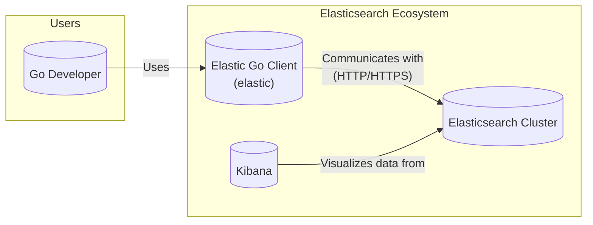
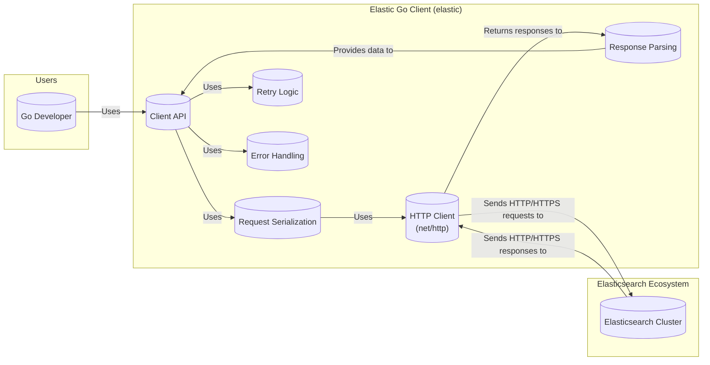
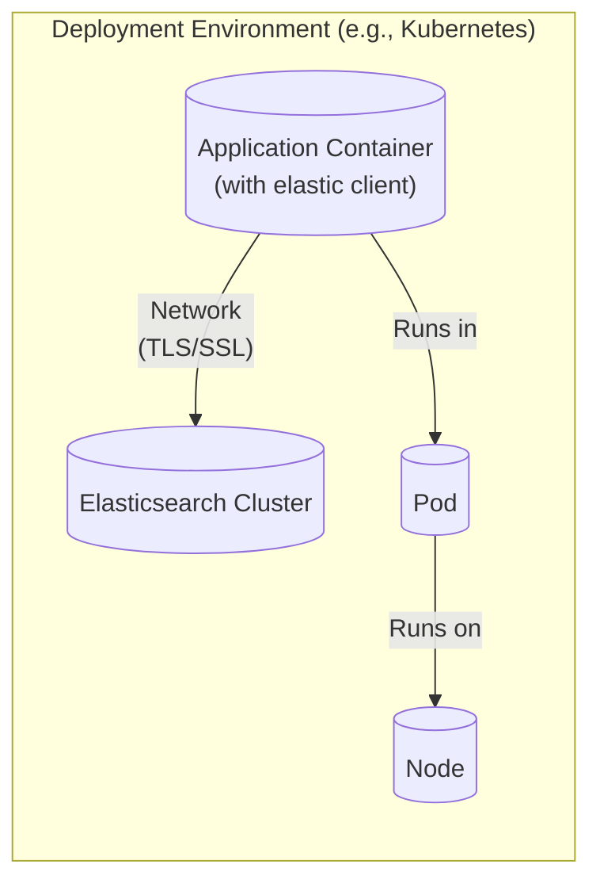
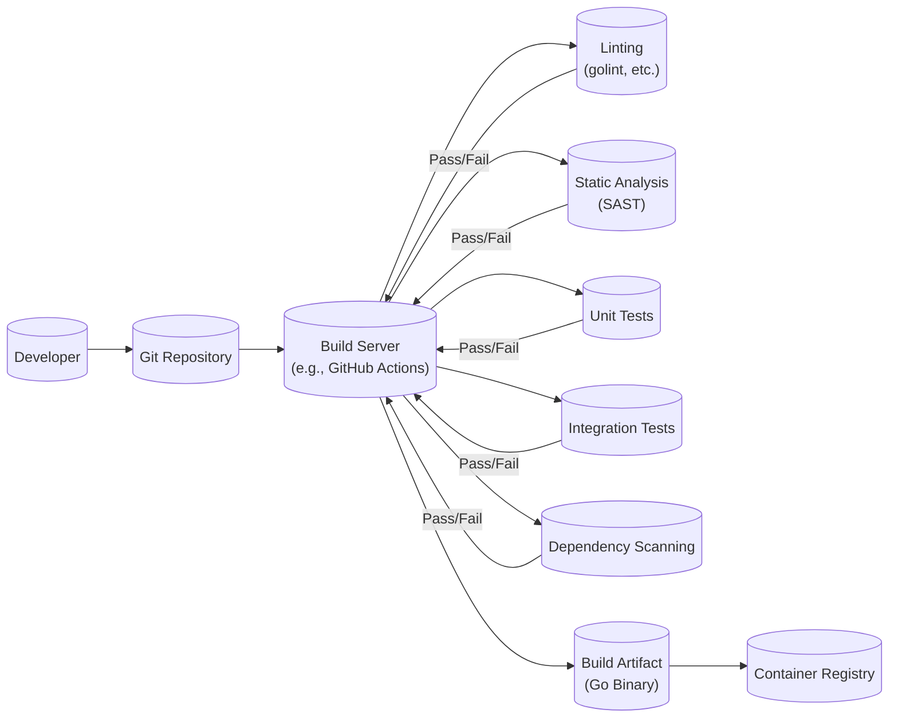

Okay, let's create a design document for the `elastic` project (the official Go client for Elasticsearch) based on the provided GitHub repository.

# BUSINESS POSTURE

Business Priorities and Goals:

*   Provide a stable, reliable, and performant Go client for interacting with Elasticsearch clusters.
*   Maintain compatibility with various Elasticsearch versions.
*   Enable developers to easily integrate Elasticsearch into their Go applications.
*   Offer a comprehensive feature set mirroring Elasticsearch's API.
*   Foster a strong community and encourage contributions.
*   Reduce development time for applications using Elasticsearch.
*   Provide high quality, well-tested, and documented code.

Business Risks:

*   Incompatibility with new Elasticsearch releases, leading to application failures or requiring significant refactoring.
*   Security vulnerabilities in the client that could expose sensitive data or compromise Elasticsearch clusters.
*   Performance bottlenecks that limit the scalability of applications using the client.
*   Lack of support for critical Elasticsearch features, hindering developer adoption.
*   Bugs or instability in the client that disrupt production systems.
*   Poor documentation or lack of examples, making it difficult for developers to use the client effectively.
*   Supply chain attacks that introduce malicious code into the client.

# SECURITY POSTURE

Existing Security Controls:

*   security control: Code Reviews: Pull requests are used for code review, ensuring multiple developers examine changes before merging. (Visible in the GitHub repository's pull request process).
*   security control: Testing: Extensive unit and integration tests are present to verify functionality and prevent regressions. (Visible in the `_test.go` files throughout the repository).
*   security control: Static Analysis: Linters and static analysis tools are likely used (though not explicitly configured in the repository's root), common practice in Go projects.
*   security control: Dependency Management: Go modules are used to manage dependencies, providing some level of version control and vulnerability awareness (go.mod and go.sum files).
*   security control: Regular Updates: Dependencies are likely updated regularly to address security vulnerabilities, although an automated process isn't explicitly visible in the repository.
*   security control: Documentation: The project includes comprehensive documentation, including security considerations when connecting to Elasticsearch clusters (README and godoc).

Accepted Risks:

*   accepted risk: Reliance on Third-Party Libraries: The client depends on external libraries (e.g., for HTTP communication), introducing a potential attack surface. While Go modules help, vulnerabilities in these dependencies could impact the client.
*   accepted risk: No Explicit Fuzzing: While extensive testing is present, there's no visible evidence of fuzzing, which could uncover edge-case vulnerabilities.
*   accepted risk: Limited Hardening: The client itself doesn't implement extensive security hardening measures (like memory protection techniques) as its primary role is communication, relying on the security of the underlying Go runtime and Elasticsearch cluster.

Recommended Security Controls:

*   security control: Implement Fuzzing: Integrate fuzz testing to identify potential vulnerabilities related to input parsing and data handling.
*   security control: Automated Dependency Scanning: Integrate a tool like `dependabot` or `renovate` to automatically scan for and update vulnerable dependencies.
*   security control: SAST Integration: Explicitly integrate a Static Application Security Testing (SAST) tool into the build process to identify potential code vulnerabilities.
*   security control: Supply Chain Security: Investigate and implement measures to enhance supply chain security, such as signing releases and using tools to verify the integrity of dependencies.
*   security control: Security Policy: Create and publish a `SECURITY.md` file outlining the project's security policy and vulnerability reporting process.

Security Requirements:

*   Authentication:
    *   The client must support various Elasticsearch authentication mechanisms, including basic authentication, API keys, and token-based authentication.
    *   Credentials must be handled securely, avoiding hardcoding and supporting secure storage mechanisms.
    *   Support TLS/SSL for secure communication with the Elasticsearch cluster.
*   Authorization:
    *   The client should not handle authorization logic itself but should correctly pass authentication credentials to Elasticsearch, which handles authorization.
*   Input Validation:
    *   The client should validate user-provided input (e.g., Elasticsearch queries, index names) to prevent injection attacks.  This is primarily relevant when constructing raw queries; the client's structured query builders help mitigate this.
    *   Escape user-provided data appropriately when constructing requests to prevent unintended behavior.
*   Cryptography:
    *   Use strong cryptographic algorithms and protocols for secure communication (TLS/SSL).
    *   Ensure proper handling of cryptographic keys and certificates.
    *   Avoid using deprecated or weak cryptographic primitives.

# DESIGN

## C4 CONTEXT

Context Diagram Element List:

*   1.  Name: Go Developer
    *   Type: User
    *   Description: A software developer using the Go programming language.
    *   Responsibilities: Develops and maintains applications that interact with Elasticsearch using the `elastic` Go client.
    *   Security controls: Follows secure coding practices; uses strong authentication mechanisms.

*   2.  Name: Elastic Go Client (elastic)
    *   Type: System
    *   Description: The official Go client for Elasticsearch.
    *   Responsibilities: Provides a Go API for interacting with Elasticsearch clusters; handles request serialization, communication, and response parsing.
    *   Security controls: Supports TLS/SSL; handles authentication credentials; performs input validation (primarily in raw query construction).

*   3.  Name: Elasticsearch Cluster
    *   Type: System
    *   Description: A distributed search and analytics engine.
    *   Responsibilities: Stores and indexes data; processes search queries and aggregations.
    *   Security controls: Implements authentication and authorization; supports encryption in transit and at rest; provides auditing capabilities.

*   4.  Name: Kibana
    *   Type: System
    *   Description: Data visualization and exploration tool for Elasticsearch.
    *   Responsibilities: Provides a user interface for interacting with Elasticsearch data.
    *   Security controls: Relies on Elasticsearch for authentication and authorization; supports secure connections.

## C4 CONTAINER

Container Diagram Element List:

*   1.  Name: Client API
    *   Type: Container
    *   Description: The public API exposed by the `elastic` client.
    *   Responsibilities: Provides a high-level interface for interacting with Elasticsearch; handles service creation, request building, and response processing.
    *   Security controls: Input validation (for raw queries); credential handling.

*   2.  Name: Request Serialization
    *   Type: Container
    *   Description: Component responsible for serializing Go data structures into JSON payloads for Elasticsearch requests.
    *   Responsibilities: Converts Go structs into JSON; handles different data types and encodings.
    *   Security controls: Escapes special characters to prevent JSON injection.

*   3.  Name: HTTP Client (net/http)
    *   Type: Container
    *   Description: Go's built-in HTTP client.
    *   Responsibilities: Sends HTTP requests to Elasticsearch; handles connection pooling, timeouts, and redirects.
    *   Security controls: Supports TLS/SSL for secure communication.

*   4.  Name: Response Parsing
    *   Type: Container
    *   Description: Component responsible for parsing JSON responses from Elasticsearch into Go data structures.
    *   Responsibilities: Converts JSON into Go structs; handles different data types and encodings; detects and reports errors.
    *   Security controls: Validates JSON structure; handles potential errors gracefully.

*   5.  Name: Retry Logic
    *   Type: Container
    *   Description: Component that handles retrying failed requests.
    *   Responsibilities: Implements retry mechanisms with backoff strategies; handles transient errors.
    *   Security controls: Limits the number of retries to prevent denial-of-service attacks on the Elasticsearch cluster.

*   6.  Name: Error Handling
    *   Type: Container
    *   Description: Component that handles errors returned by Elasticsearch.
    *   Responsibilities: Parses error responses; provides informative error messages to the user.
    *   Security controls: Avoids exposing sensitive information in error messages.

*   7.  Name: Go Developer
    *   Type: User
    *   Description: A software developer using the Go programming language.
    *   Responsibilities: Develops and maintains applications that interact with Elasticsearch using the `elastic` Go client.
    *   Security controls: Follows secure coding practices; uses strong authentication mechanisms.

*   8.  Name: Elasticsearch Cluster
    *   Type: System
    *   Description: A distributed search and analytics engine.
    *   Responsibilities: Stores and indexes data; processes search queries and aggregations.
    *   Security controls: Implements authentication and authorization; supports encryption in transit and at rest; provides auditing capabilities.

## DEPLOYMENT

Possible Deployment Solutions:

1.  **Standalone Go Application:** The `elastic` client is typically embedded within a Go application.  The application, including the client, is compiled into a single executable and deployed to a server (physical, virtual, or containerized).
2.  **Containerized Application (Docker):** The Go application using the `elastic` client is packaged into a Docker container. This container is then deployed to a container orchestration platform (e.g., Kubernetes, Docker Swarm, Amazon ECS).
3.  **Serverless Function (AWS Lambda, Google Cloud Functions, Azure Functions):** The Go application (or a part of it) using the `elastic` client is deployed as a serverless function.  The function is triggered by events (e.g., HTTP requests, messages) and interacts with Elasticsearch.

Chosen Solution (for detailed description): **Containerized Application (Docker)**

Deployment Diagram Element List:

*   1.  Name: Node
    *   Type: Infrastructure Node
    *   Description: A physical or virtual machine in the deployment environment.
    *   Responsibilities: Provides compute resources for running containers.
    *   Security controls: Operating system hardening; network security configuration; access control.

*   2.  Name: Pod
    *   Type: Kubernetes Pod
    *   Description: A group of one or more containers with shared storage and network resources.
    *   Responsibilities: Provides a runtime environment for the application container.
    *   Security controls: Kubernetes security context; network policies; resource limits.

*   3.  Name: Application Container (with elastic client)
    *   Type: Docker Container
    *   Description: A containerized instance of the Go application that uses the `elastic` client.
    *   Responsibilities: Runs the application logic; interacts with Elasticsearch.
    *   Security controls: Minimal base image; secure configuration; limited privileges.

*   4.  Name: Elasticsearch Cluster
    *   Type: System
    *   Description: The Elasticsearch cluster being accessed by the application.
    *   Responsibilities: Stores and indexes data; processes search queries.
    *   Security controls: Authentication; authorization; encryption; network security.

## BUILD

Build Process Description:

1.  **Developer:** The developer writes code and pushes changes to a Git repository (e.g., GitHub).
2.  **Git Repository:** The code repository stores the source code and triggers the build process upon changes.
3.  **Build Server (e.g., GitHub Actions):** A continuous integration/continuous delivery (CI/CD) platform orchestrates the build process.
4.  **Linting:** Linters (e.g., `golint`, `staticcheck`) analyze the code for style and potential errors.
5.  **Static Analysis (SAST):** A SAST tool (e.g., `gosec`) scans the code for security vulnerabilities.
6.  **Unit Tests:** Unit tests verify the functionality of individual components.
7.  **Integration Tests:** Integration tests verify the interaction between different components, including communication with a test Elasticsearch instance.
8.  **Dependency Scanning:** A tool (e.g., `dependabot`, `snyk`) scans project dependencies for known vulnerabilities.
9.  **Build Artifact (Go Binary):** If all checks pass, the build server compiles the code into a Go binary.
10. **Container Registry:** The Go binary is often packaged into a Docker image and pushed to a container registry (e.g., Docker Hub, Amazon ECR).

Security Controls in Build Process:

*   security control: Linting: Enforces code style and helps prevent common errors.
*   security control: Static Analysis (SAST): Identifies potential security vulnerabilities in the code.
*   security control: Unit and Integration Tests: Verify functionality and prevent regressions, including security-related issues.
*   security control: Dependency Scanning: Detects and reports known vulnerabilities in project dependencies.
*   security control: Build Automation: Ensures a consistent and repeatable build process, reducing the risk of manual errors.
*   security control: Immutable Artifacts: Build artifacts (e.g., Go binaries, Docker images) should be immutable, ensuring that what is tested is what is deployed.

# RISK ASSESSMENT

Critical Business Processes:

*   Data ingestion into Elasticsearch.
*   Data retrieval from Elasticsearch.
*   Application functionality relying on Elasticsearch.

Data Sensitivity:

The sensitivity of the data handled by the `elastic` client depends entirely on the data stored in the Elasticsearch cluster. The client itself doesn't store data persistently, but it transmits data between the application and Elasticsearch. Therefore, the data sensitivity can range from:

*   **Low:** Publicly available data, logs with no sensitive information.
*   **Medium:** Internal operational data, user activity logs (potentially containing usernames or IP addresses).
*   **High:** Personally Identifiable Information (PII), financial data, health records, authentication credentials.

The client *must* be treated as handling potentially high-sensitivity data, as it's a conduit to the data stored in Elasticsearch.

# QUESTIONS & ASSUMPTIONS

Questions:

*   What specific Elasticsearch version(s) are targeted? This impacts compatibility and feature support.
*   What is the expected load (requests per second, data volume)? This influences performance considerations and retry logic.
*   What is the deployment environment (cloud provider, on-premise, Kubernetes, etc.)? This affects deployment and networking configurations.
*   Are there any specific compliance requirements (e.g., GDPR, HIPAA)? This impacts data handling and security controls.
*   What level of logging and monitoring is required for the client's operation?
*   Is there a specific budget for security tooling and infrastructure?

Assumptions:

*   BUSINESS POSTURE: The primary goal is to provide a reliable and performant client, prioritizing stability and compatibility over cutting-edge features.
*   SECURITY POSTURE: A moderate level of security is assumed, with a focus on preventing common vulnerabilities and ensuring secure communication.  A high-security posture is not assumed (e.g., no formal verification or extensive hardening).
*   DESIGN: The client will primarily use the standard Go `net/http` library for communication.  The deployment environment will likely be containerized (e.g., Kubernetes). The build process will include basic CI/CD practices.