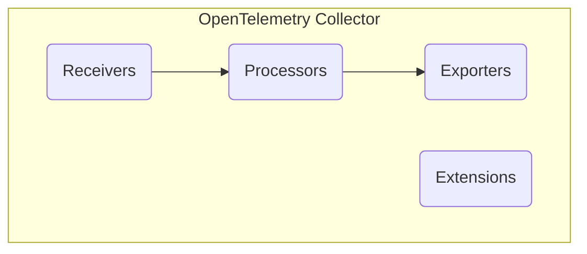
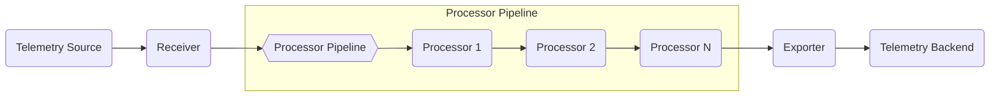

# Project Design Document: OpenTelemetry Collector

**Version:** 1.1
**Date:** October 26, 2023
**Author:** AI Software Architect

## 1. Introduction

This document provides an enhanced design overview of the OpenTelemetry Collector, a crucial component for collecting, processing, and exporting telemetry data in a vendor-agnostic manner. This detailed design serves as a foundational resource for subsequent threat modeling exercises, offering a clear understanding of the Collector's architecture, components, and data flows.

## 2. Goals and Objectives

*   Present a refined and more detailed architectural overview of the OpenTelemetry Collector.
*   Clearly define the responsibilities and interactions of the major components with a focus on security implications.
*   Illustrate the typical data flow through the Collector, highlighting potential interception points.
*   Emphasize key configuration aspects that are critical for security considerations.
*   Serve as a robust and comprehensive basis for identifying potential security threats, vulnerabilities, and attack vectors.

## 3. High-Level Architecture

The OpenTelemetry Collector employs a pipeline-based architecture, enabling a modular approach to telemetry data handling. Data flows sequentially through receivers, processors, and exporters. Extensions provide supplementary functionalities.

*   **Receivers:**  Act as entry points, accepting telemetry data from diverse sources and translating it into the Collector's internal format.
*   **Processors:**  Transform and enrich telemetry data according to defined rules, enabling filtering, sampling, and modification.
*   **Exporters:**  Transmit the processed telemetry data to various backend systems for storage, analysis, or visualization.
*   **Extensions:**  Offer supplementary capabilities, including health checks, metrics about the Collector itself, and mechanisms for remote configuration.

## 4. Detailed Component Design

### 4.1. Receivers

Receivers are the initial point of contact for telemetry data entering the Collector. Their security is paramount as they directly interact with external systems.

*   **Functionality:**
    *   Establish network listeners on specified ports and protocols (e.g., TCP, UDP, HTTP, gRPC).
    *   Deserialize incoming telemetry data based on the agreed-upon format (e.g., OTLP, Jaeger Thrift, Prometheus exposition format).
    *   Convert the received data into the Collector's internal representation, ensuring consistency for subsequent processing.
    *   Implement authentication and authorization mechanisms to verify the identity of the data source and control access (if configured and supported by the specific receiver).
*   **Examples:**
    *   `otlp`: Listens for data conforming to the OpenTelemetry Protocol (OTLP) over gRPC or HTTP. Configuration includes protocol, endpoint, and TLS settings.
    *   `jaeger`: Accepts Jaeger traces, supporting both gRPC and Thrift protocols. Configuration involves specifying the protocol and listening port.
    *   `prometheus`: Scrapes metrics from Prometheus-compatible endpoints by periodically sending HTTP requests. Configuration includes target URLs and scrape intervals.
    *   `zipkin`: Receives traces in Zipkin format over HTTP. Configuration specifies the listening path.
    *   `kafka`: Consumes telemetry data from specified Kafka topics. Configuration includes broker addresses, topic names, and consumer group settings, along with potential security configurations like SASL.
*   **Configuration:**
    *   `endpoints`:  Specifies the listening address and port for network-based receivers.
    *   `protocols`: Defines the supported communication protocols (e.g., `grpc`, `http`).
    *   `tls`:  Configuration options for Transport Layer Security, including certificate paths, key paths, and client authentication settings.
    *   `authentication`:  Settings for authentication mechanisms, such as API keys, bearer tokens, or mutual TLS. Specific options vary depending on the receiver type.

### 4.2. Processors

Processors operate on telemetry data after reception, allowing for manipulation and enrichment before export. Secure configuration of processors is crucial to prevent data loss or corruption.

*   **Functionality:**
    *   Modify telemetry data (traces, metrics, logs) by adding, updating, or removing attributes, tags, or metadata.
    *   Filter data based on defined criteria, allowing for the exclusion of irrelevant or sensitive information.
    *   Sample data to reduce volume and cost, employing strategies like probabilistic sampling or tail-based sampling.
    *   Batch data to improve export efficiency by grouping multiple telemetry items into a single request.
    *   Redact or mask sensitive information to comply with privacy regulations or security policies.
*   **Examples:**
    *   `batch`: Groups telemetry data into batches before sending to exporters. Configuration includes batch size and timeout.
    *   `attributes`: Adds, updates, or deletes attributes on spans, metrics, or logs based on defined rules. Configuration involves specifying attribute names, values, and operations.
    *   `filter`: Filters telemetry data based on conditions applied to attributes or other properties. Configuration defines the filtering rules.
    *   `sampler`: Samples traces based on configured strategies. Configuration varies depending on the sampling strategy (e.g., probability for probabilistic sampling).
    *   `redaction`: Masks or removes sensitive information from telemetry data using defined patterns or lists of sensitive attributes. Configuration includes specifying the redaction method and patterns.
*   **Configuration:**
    *   `rules`: Defines the specific logic for processing, such as filtering conditions, attribute manipulation rules, or sampling policies.
    *   `match`: Specifies which telemetry data the processor should act upon.
    *   `actions`: Defines the operations to be performed on the matched telemetry data.
    *   `settings`:  Processor-specific configuration parameters, such as batch sizes or sampling rates.

### 4.3. Exporters

Exporters are responsible for transmitting the processed telemetry data to external backend systems. Secure configuration of exporters is vital to protect data in transit and at rest.

*   **Functionality:**
    *   Establish connections to backend systems using specified protocols and endpoints.
    *   Serialize telemetry data into the format expected by the target backend (e.g., OTLP, Prometheus remote write format, Jaeger Thrift).
    *   Implement retry mechanisms and error handling to ensure reliable delivery of telemetry data.
    *   Manage authentication and authorization with the backend system, using credentials or tokens.
*   **Examples:**
    *   `otlp`: Exports data using the OpenTelemetry Protocol (OTLP) over gRPC or HTTP. Configuration includes endpoint, TLS settings, and authentication credentials.
    *   `prometheusremotewrite`: Sends metrics to Prometheus remote write endpoints. Configuration involves specifying the remote write URL and authentication details.
    *   `jaeger`: Exports traces to Jaeger. Configuration includes the Jaeger agent or collector endpoint.
    *   `zipkin`: Exports traces to Zipkin. Configuration specifies the Zipkin API endpoint.
    *   Cloud provider specific exporters (e.g., `awscloudwatch`, `googlecloudmonitoring`, `azuremonitor`):  Send telemetry data to the respective cloud monitoring services. Configuration typically involves authentication details and region information.
    *   `kafka`: Publishes telemetry data to specified Kafka topics. Configuration includes broker addresses, topic names, and producer settings, along with security configurations like SASL.
*   **Configuration:**
    *   `endpoint`: Specifies the URL or address of the backend system.
    *   `credentials`:  Configuration for authentication, such as API keys, tokens, usernames, and passwords. Secure storage and handling of these credentials are critical.
    *   `tls`: Configuration options for Transport Layer Security, including certificate paths, key paths, and client authentication settings.
    *   `retry_config`: Defines the retry policy, including maximum attempts and backoff strategies.
    *   `compression`: Specifies the compression algorithm to use for data transmission (e.g., gzip).

### 4.4. Extensions

Extensions provide supplementary functionalities to the Collector, often related to its management and observability. Security considerations for extensions focus on protecting access to management interfaces.

*   **Functionality:**
    *   Provide health check endpoints to monitor the Collector's status and availability.
    *   Expose metrics about the Collector's performance and resource utilization.
    *   Enable remote configuration management, allowing for dynamic updates to the Collector's configuration.
    *   Offer profiling and debugging capabilities for troubleshooting.
*   **Examples:**
    *   `health_check`: Provides an HTTP endpoint for health checks. Configuration includes the listening address and port.
    *   `pprof`: Enables profiling of the Collector's runtime. Configuration specifies the listening address and port.
    *   `zpages`: Offers a web interface for viewing internal Collector state and debugging information. Configuration includes the listening address and port.
    *   `file_config`: Allows loading configuration from local files. Configuration specifies the file paths.
    *   `http_forwarder`: Forwards HTTP requests to a specified endpoint, potentially used for tasks like sending alerts. Configuration includes the target URL and authentication details.
*   **Configuration:**
    *   `listen_address`: Specifies the address and port for management interfaces.
    *   `authentication`:  Settings for securing access to management endpoints, such as API keys or basic authentication.
    *   `tls`: Configuration for securing management interfaces with TLS.
    *   `config_sources`: Specifies the sources for configuration data.

## 5. Data Flow

The journey of telemetry data through the OpenTelemetry Collector follows a defined path, with each stage presenting potential security considerations.

*   Telemetry data originates from various sources, such as applications, infrastructure components, or other monitoring agents.
*   A **Receiver** acts as the entry point, accepting the data and converting it into the Collector's internal format. This stage is crucial for initial security checks and authentication.
*   The data then proceeds through a configurable **Processor Pipeline**. Each **Processor** in the pipeline performs specific transformations or enrichments. Security considerations here involve ensuring processors do not introduce vulnerabilities or leak sensitive information.
*   Finally, an **Exporter** transmits the processed data to the designated backend system. Secure communication and authentication are paramount at this stage.

## 6. Configuration

The OpenTelemetry Collector's behavior is defined by a YAML-based configuration file. Securing this configuration file is essential to maintain the integrity and security of the Collector.

*   **Key Configuration Sections:**
    *   `receivers`: Defines and configures the enabled receivers, including listening endpoints, protocols, and authentication settings.
    *   `processors`: Defines and configures the enabled processors, specifying their processing rules and settings.
    *   `exporters`: Defines and configures the enabled exporters, including backend endpoints, authentication credentials, and TLS settings.
    *   `extensions`: Defines and configures the enabled extensions, including listening addresses and security settings for management interfaces.
    *   `service`: Defines the pipelines for traces, metrics, and logs, linking receivers, processors, and exporters to create the data flow.
*   **Security Considerations for Configuration:**
    *   Secure storage of the configuration file with appropriate access controls.
    *   Protection against unauthorized modification of the configuration.
    *   Secure handling of sensitive information within the configuration, such as credentials (consider using secrets management solutions).
    *   Validation of the configuration to prevent errors or misconfigurations that could introduce vulnerabilities.

## 7. Deployment Considerations

The deployment model of the OpenTelemetry Collector significantly impacts its security posture.

*   **Agent:** Deployed as a sidecar or agent on individual hosts or containers, collecting telemetry data locally. Security considerations include securing the agent's communication with the application and the central collector (if applicable).
*   **Gateway:** Deployed as a centralized service, aggregating telemetry data from multiple agents or sources. Security considerations include securing the gateway's network access and protecting it from external threats.
*   **Collector as a Service:** Utilizing managed OpenTelemetry Collector offerings provided by cloud providers. Security responsibilities are shared between the user and the provider. Understanding the provider's security measures is crucial.

## 8. Security Considerations (Detailed for Threat Modeling)

This section provides a more detailed overview of security considerations to facilitate effective threat modeling.

*   **Data Ingestion:**
    *   **Threat:** Unauthorized data submission. **Mitigation:** Implement authentication and authorization mechanisms in receivers (e.g., API keys, mutual TLS).
    *   **Threat:** Injection of malicious or malformed data. **Mitigation:** Implement input validation and sanitization in receivers.
    *   **Threat:** Eavesdropping on data in transit. **Mitigation:** Enforce secure communication protocols (TLS) for receivers.
*   **Data Processing:**
    *   **Threat:** Information leakage through processor misconfiguration. **Mitigation:** Carefully configure processors, especially those handling sensitive data. Implement thorough testing of processor configurations.
    *   **Threat:** Unauthorized modification of telemetry data. **Mitigation:** Secure the configuration of processors and limit access to configuration files.
    *   **Threat:** Resource exhaustion due to malicious processing logic. **Mitigation:** Implement resource limits and monitoring for processors.
*   **Data Export:**
    *   **Threat:** Unauthorized access to backend systems. **Mitigation:** Enforce strong authentication and authorization for exporters connecting to backends. Securely manage credentials.
    *   **Threat:** Eavesdropping on exported data. **Mitigation:** Enforce secure communication protocols (TLS) for exporters.
    *   **Threat:** Data exfiltration through compromised exporters. **Mitigation:** Implement security best practices for the host or container running the exporter.
*   **Collector Configuration:**
    *   **Threat:** Unauthorized access to the configuration file. **Mitigation:** Implement strict access controls on the configuration file. Consider encrypting sensitive information within the configuration.
    *   **Threat:** Tampering with the configuration file. **Mitigation:** Use version control and auditing for configuration changes.
*   **Collector Deployment:**
    *   **Threat:** Unauthorized access to the Collector instance. **Mitigation:** Deploy the Collector in a secure environment with proper network segmentation and firewall rules.
    *   **Threat:** Vulnerabilities in the Collector software. **Mitigation:** Regularly update the Collector to the latest version and apply security patches.
    *   **Threat:** Denial-of-service attacks. **Mitigation:** Implement resource limits and rate limiting.
*   **Management Interfaces:**
    *   **Threat:** Unauthorized access to management endpoints. **Mitigation:** Implement authentication and authorization for management interfaces. Secure communication with TLS. Disable unnecessary management interfaces.
*   **Dependencies:**
    *   **Threat:** Vulnerabilities in third-party libraries. **Mitigation:** Regularly scan dependencies for vulnerabilities and update them promptly.

## 9. Future Considerations

*   Implementation of more granular role-based access control (RBAC) for managing Collector configurations and access to telemetry data.
*   Enhanced auditing capabilities to track configuration changes and data processing activities.
*   Integration with secrets management solutions for secure handling of sensitive credentials.
*   Advanced threat detection and response mechanisms within the Collector.
*   Formal security assessments and penetration testing of the Collector.

This enhanced design document provides a more detailed and security-focused overview of the OpenTelemetry Collector's architecture and components. It serves as a robust foundation for conducting thorough threat modeling and implementing appropriate security measures.