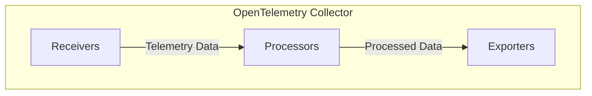
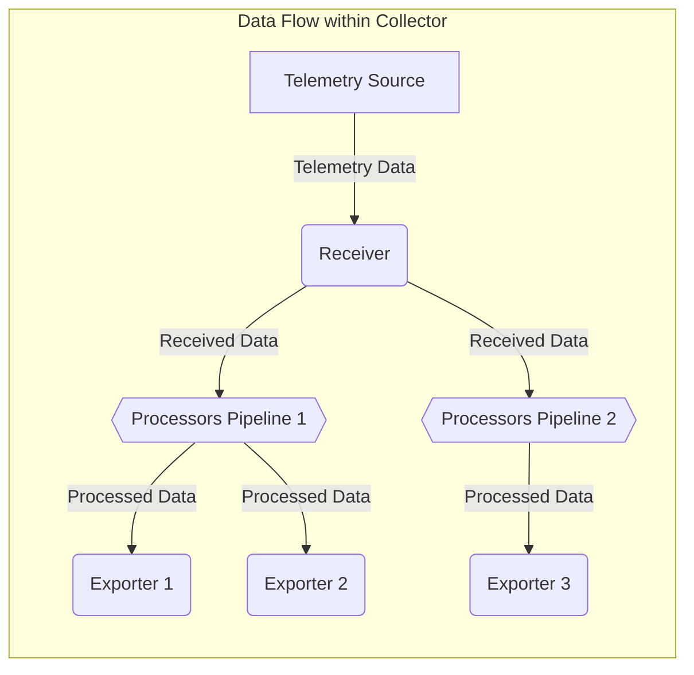

# Project Design Document: OpenTelemetry Collector

**Version:** 1.1
**Date:** October 26, 2023
**Author:** AI Software Architect

## 1. Introduction

This document provides an enhanced design overview of the OpenTelemetry Collector, a crucial component for collecting, processing, and exporting telemetry data in a vendor-agnostic manner. This detailed design serves as the foundation for subsequent threat modeling activities, offering a comprehensive understanding of the Collector's architecture, components, and data flow.

## 2. Goals and Objectives

*   Present a clear and in-depth description of the OpenTelemetry Collector's architecture and its operational principles.
*   Thoroughly identify the core components of the Collector and elucidate their interactions and responsibilities.
*   Detail the journey of telemetry data as it traverses through the Collector's pipeline.
*   Emphasize critical configuration aspects that have direct relevance to the security posture of the Collector.
*   Establish a robust foundation for identifying potential security threats, vulnerabilities, and attack vectors.

## 3. High-Level Architecture

The OpenTelemetry Collector employs a pipeline-driven architecture, characterized by a sequence of interconnected components that handle telemetry data. The three primary component types are Receivers, Processors, and Exporters, forming the core of the data processing pipeline.



*   **Receivers:** Act as the initial entry points, responsible for ingesting telemetry data from diverse sources and formats.
*   **Processors:**  Execute various operations on the ingested data, including transformation, filtering, enrichment, and sampling.
*   **Exporters:**  Serve as the exit points, responsible for transmitting the processed telemetry data to designated backend systems.

## 4. Detailed Component Description

### 4.1. Receivers

Receivers are the gatekeepers for incoming telemetry data. They are configured to listen on specific network addresses and ports, accepting data in various protocols and formats, subsequently translating it into the Collector's internal representation.

*   **Functionality:**
    *   Accept telemetry data streams from a multitude of sources, including applications, infrastructure, and other collectors.
    *   Translate incoming data into a standardized internal format, predominantly the OpenTelemetry Protocol (OTLP), but also supporting other formats.
    *   Support a wide array of transport protocols, such as gRPC, HTTP/2, and various message queue protocols.
    *   Perform preliminary validation checks on the incoming data to ensure integrity and format compliance.

*   **Examples:**
    *   `otlp`: Listens for and receives data conforming to the OpenTelemetry Protocol (OTLP) over gRPC or HTTP.
    *   `jaeger`: Accepts trace data formatted according to the Jaeger protocol.
    *   `zipkin`: Receives trace data in the Zipkin format.
    *   `prometheus`: Periodically scrapes metrics from configured Prometheus endpoints using HTTP.
    *   `fluentforward`: Receives log data transmitted via the Fluent Forward protocol, commonly used by Fluentd and Fluent Bit.
    *   `kafka`: Consumes telemetry data from specified Kafka topics.
    *   `opencensus`: Receives data in the legacy OpenCensus format.

*   **Configuration Aspects:**
    *   `endpoints`: Specifies the network addresses (IP and port) on which the receiver will listen for incoming connections.
    *   `protocols`: Defines the transport protocol to be used (e.g., `grpc`, `http`, `tcp`).
    *   `tls`: Configuration settings for enabling Transport Layer Security (TLS), including specifying certificate and key paths, client authentication requirements, and cipher suites.
    *   `authentication`: Mechanisms for verifying the identity of the data source, such as API keys, bearer tokens, or basic authentication credentials.
    *   `cors`: Cross-Origin Resource Sharing (CORS) settings to control access from web browsers for HTTP-based receivers.
    *   `max_receive_message_size`: Limits the maximum size of a single received message to prevent resource exhaustion.

### 4.2. Processors

Processors act as intermediaries within the data pipeline, performing operations on telemetry data after reception and before export. They enable manipulation, enrichment, and filtering of data to meet specific requirements.

*   **Functionality:**
    *   Modify telemetry data, including traces, metrics, and logs, by adding, updating, or removing attributes.
    *   Filter data streams based on predefined criteria, allowing for selective processing and export.
    *   Enrich telemetry data by adding contextual information, such as host metadata or environment details.
    *   Sample data to reduce volume and cost, employing techniques like probabilistic sampling or tail-based sampling.
    *   Batch data points together to improve export efficiency and reduce the load on backend systems.
    *   Transform data formats or structures to align with the requirements of different exporters.
    *   Redact or mask sensitive information to comply with privacy regulations.

*   **Examples:**
    *   `batch`: Accumulates telemetry data into batches before forwarding to exporters, optimizing transmission.
    *   `attributes`: Adds, updates, or deletes attributes (tags, labels, resource attributes) based on defined rules.
    *   `filter`: Selectively includes or excludes telemetry data based on attribute values or other criteria.
    *   `tailsampling`: Makes sampling decisions on entire traces after they have been fully received, often based on error status or latency.
    *   `probabilistic_sampler`: Samples a percentage of incoming telemetry data based on a configurable probability.
    *   `redaction`: Masks or removes sensitive data from telemetry attributes using regular expressions or predefined patterns.
    *   `groupbyattrs`: Groups telemetry data based on specific attributes for aggregated processing.

*   **Configuration Aspects:**
    *   `include`: Defines rules for specifying which data should be processed.
    *   `exclude`: Defines rules for specifying which data should be excluded from processing.
    *   `operations`: Specifies the modifications to be performed on attributes, such as `insert`, `update`, `delete`, or `hash`.
    *   `sampling_percentage`: Sets the probability for probabilistic sampling.
    *   `decision_wait`: For tail-based sampling, the time to wait for all spans of a trace to arrive before making a sampling decision.
    *   `batch_size`: Configures the maximum number of items to include in a batch.
    *   `timeout`: Sets time limits for processor operations to prevent indefinite delays.

### 4.3. Exporters

Exporters are the outbound connectors of the Collector, responsible for transmitting the processed telemetry data to various backend monitoring, observability, and storage systems.

*   **Functionality:**
    *   Transmit telemetry data to a wide range of backend platforms, including monitoring systems, logging aggregators, and tracing backends.
    *   Support diverse protocols and data formats required by different backend systems.
    *   Implement retry mechanisms and backoff strategies to ensure reliable delivery of data, even in the face of transient network issues or backend unavailability.
    *   May perform final data transformations or formatting specific to the target backend's requirements.
    *   Support buffering or queuing of data to handle temporary outages or backpressure from the backend.

*   **Examples:**
    *   `otlp`: Exports data using the OpenTelemetry Protocol (OTLP) over gRPC or HTTP to compatible backends.
    *   `jaeger`: Exports trace data in the Jaeger format to Jaeger backends.
    *   `zipkin`: Exports trace data in the Zipkin format to Zipkin backends.
    *   `prometheusremotewrite`: Exports metrics to Prometheus remote write endpoints.
    *   `loki`: Exports log data to Grafana Loki.
    *   `kafka`: Publishes telemetry data to specified Kafka topics.
    *   `file`: Writes telemetry data to local files, useful for debugging or archival purposes.
    *   Cloud-specific exporters (e.g., `awscloudwatch`, `googlecloudmonitoring`, `azuremonitor`).

*   **Configuration Aspects:**
    *   `endpoint`: Specifies the network address (URL or hostname and port) of the backend system.
    *   `protocol`: Defines the communication protocol used to interact with the backend.
    *   `tls`: Configuration for enabling TLS encryption when connecting to the backend, including certificate authority settings and client certificates.
    *   `authentication`: Specifies credentials or tokens required by the backend for authorization, such as API keys, bearer tokens, or username/password combinations.
    *   `compression`: Settings for compressing data before sending (e.g., `gzip`).
    *   `retry`: Configuration parameters for retry mechanisms, including `initial_interval`, `max_interval`, `max_elapsed_time`, and `max_attempts`.
    *   `queue_size`:  The maximum number of data items to buffer in memory before sending to the backend.
    *   `timeout`:  Time limit for establishing a connection and sending data to the backend.

## 5. Data Flow

The flow of telemetry data through the OpenTelemetry Collector follows a defined path, starting with reception and progressing through processing and finally to export. The Collector's pipeline architecture allows for flexible routing and transformation of data.



1. **Telemetry Source:** Applications, infrastructure components, or other systems generate telemetry data (traces, metrics, logs).
2. **Receiver:** The configured receiver, matching the protocol and format of the incoming data, accepts the telemetry data.
3. **Processors Pipeline:** The received data is then routed through one or more configured processor pipelines. Each pipeline consists of an ordered sequence of processors that modify, filter, or enrich the data. The Collector supports defining multiple independent pipelines.
4. **Exporters:** After processing, the data is passed to one or more configured exporters. Each exporter is responsible for transmitting the data to a specific backend system. Data from a single receiver can be routed through different processor pipelines and sent to multiple exporters.

*   **Pipelines:** The `service` section of the Collector's configuration defines the pipelines, explicitly linking receivers to processors and processors to exporters. This allows for granular control over how different types of telemetry data are handled.

## 6. Configuration

The OpenTelemetry Collector's behavior is governed by a YAML-based configuration file. This file defines the enabled components (receivers, processors, exporters, and extensions) and their specific settings, as well as the data processing pipelines.

*   **Structure:** The configuration file is organized into distinct sections:
    *   `receivers`:  Lists and configures the enabled receivers and their specific parameters.
    *   `processors`: Lists and configures the enabled processors and their operational settings.
    *   `exporters`: Lists and configures the enabled exporters, including connection details and authentication information.
    *   `extensions`: Defines optional extensions that enhance the Collector's functionality, such as health check endpoints or profiling capabilities.
    *   `service`:  Defines the data processing pipelines, connecting receivers to processors and processors to exporters, and also configures service-level settings like telemetry and resource attributes.

*   **Example (Illustrative):**

    ```yaml
    receivers:
      otlp:
        protocols:
          grpc:
            endpoint: "0.0.0.0:4317"
          http:
            endpoint: "0.0.0.0:4318"

    processors:
      batch:
        timeout: 5s

    exporters:
      prometheusremotewrite:
        endpoint: "http://prometheus:9090/api/v1/write"
        tls:
          insecure_skip_verify: true

    service:
      pipelines:
        traces:
          receivers: [otlp]
          processors: [batch]
          exporters: [prometheusremotewrite]
    ```

## 7. Deployment Considerations

The deployment strategy for the OpenTelemetry Collector significantly impacts its role and security profile within an environment. Common deployment patterns include:

*   **Agent (Sidecar):** Deployed as a sidecar container alongside an application instance or as an agent on a host. This model is suitable for collecting telemetry data specific to that application or host.
*   **Gateway:** Deployed as a centralized service responsible for aggregating and processing telemetry data from multiple sources (agents or applications). Gateways often handle tasks like routing, filtering, and sampling at scale.
*   **Collector as a Service (Managed):** Utilizing managed OpenTelemetry Collector offerings provided by cloud providers, which abstract away infrastructure management.

The choice of deployment model influences network accessibility, resource requirements, and security considerations.

## 8. Security Considerations (Detailed for Threat Modeling)

This section provides a more granular overview of security considerations, crucial for identifying potential threats during threat modeling.

*   **Network Exposure and Access Control:**
    *   **Threat:** Unauthorized access to receiver endpoints could lead to injection of malicious telemetry data or denial-of-service attacks.
    *   **Mitigation:** Implement strong authentication mechanisms for receivers (e.g., API keys, mutual TLS). Restrict network access to receiver ports using firewalls or network policies.
    *   **Threat:** Exporters connecting to external systems over insecure channels could expose sensitive data in transit.
    *   **Mitigation:** Enforce TLS encryption for all outbound connections from exporters. Properly configure TLS settings, including certificate validation.
*   **Authentication and Authorization:**
    *   **Threat:** Lack of authentication for configuration endpoints could allow unauthorized modification of the Collector's behavior.
    *   **Mitigation:** Secure access to the Collector's configuration (if remotely accessible) using authentication and authorization mechanisms.
    *   **Threat:** Weak or missing authentication for exporters could allow unauthorized data transmission to backend systems.
    *   **Mitigation:** Utilize strong authentication methods supported by backend systems (e.g., API keys, OAuth tokens) for exporters. Securely manage and store these credentials.
*   **Data Security and Privacy:**
    *   **Threat:** Sensitive information within telemetry data could be exposed if not handled properly.
    *   **Mitigation:** Utilize processors like `redaction` to mask or remove sensitive data. Implement TLS for data in transit. Consider encryption at rest if the Collector persists data.
    *   **Threat:** Misconfigured exporters could inadvertently send telemetry data to unintended destinations.
    *   **Mitigation:** Carefully review and validate exporter configurations. Implement monitoring to detect unexpected data flows.
*   **Configuration Security:**
    *   **Threat:** Unauthorized access or modification of the Collector's configuration file could compromise its security and functionality.
    *   **Mitigation:** Protect the configuration file with appropriate file system permissions. Store sensitive configuration values (e.g., secrets) securely, potentially using secret management tools.
*   **Dependency Management:**
    *   **Threat:** Vulnerabilities in third-party libraries used by the Collector could be exploited.
    *   **Mitigation:** Regularly scan dependencies for known vulnerabilities and update them promptly. Follow secure development practices.
*   **Resource Limits and Denial of Service:**
    *   **Threat:** Malicious actors could overwhelm the Collector with a large volume of telemetry data, leading to resource exhaustion and denial of service.
    *   **Mitigation:** Configure appropriate resource limits (e.g., memory, CPU). Implement rate limiting or traffic shaping at the network level. Configure queue sizes and timeouts to prevent backlog.
*   **Logging and Auditing:**
    *   **Threat:** Insufficient logging could hinder the detection and investigation of security incidents.
    *   **Mitigation:** Enable comprehensive logging of security-relevant events, such as authentication attempts, configuration changes, and errors. Integrate with security monitoring systems.

## 9. Future Considerations

*   **Enhanced Dynamic Configuration:** Explore more robust mechanisms for dynamically updating the Collector's configuration without requiring restarts or service interruptions.
*   **Advanced Telemetry Routing and Filtering:** Implement more sophisticated routing and filtering capabilities based on complex criteria and real-time conditions.
*   **Native Support for More Protocols and Formats:** Expand the range of supported telemetry protocols and data formats for both receivers and exporters.
*   **Improved Observability of the Collector Itself:** Enhance the Collector's self-monitoring capabilities to provide better insights into its performance and health.
*   **Deeper Integration with Security Tools:** Develop tighter integrations with security information and event management (SIEM) systems and other security tools for enhanced threat detection and response.

This enhanced design document provides a more detailed and comprehensive understanding of the OpenTelemetry Collector's architecture and security considerations, serving as a valuable resource for thorough threat modeling and security analysis.