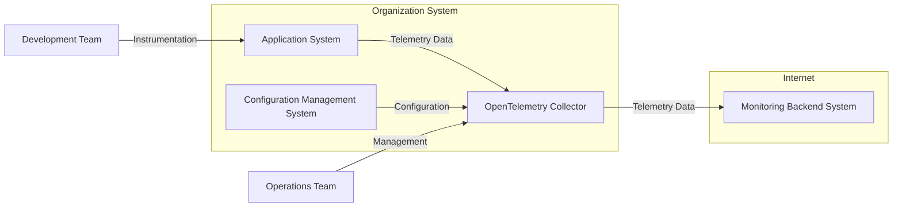
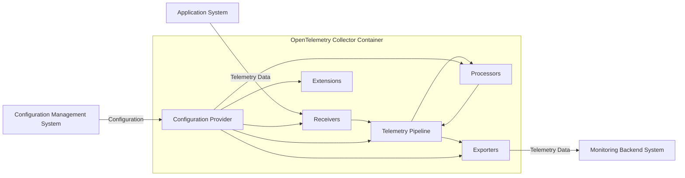
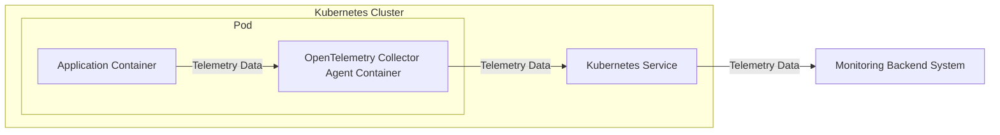

# BUSINESS POSTURE

The OpenTelemetry Collector project aims to provide a vendor-agnostic, open-source telemetry data collection, processing, and exporting solution. It addresses the business need for unified observability across diverse application and infrastructure landscapes.

Business Priorities and Goals:
- Standardize telemetry data collection across different environments and technologies.
- Simplify the process of sending telemetry data to multiple backends.
- Provide a flexible and extensible platform for telemetry data processing.
- Reduce vendor lock-in for observability solutions.
- Improve application performance monitoring and incident response capabilities.

Most Important Business Risks:
- Data Loss: Failure to reliably collect and deliver telemetry data can lead to gaps in observability and hinder incident response.
- Data Breach: Exposure of sensitive telemetry data (e.g., logs containing PII) due to security vulnerabilities or misconfigurations.
- Service Disruption: Downtime or performance degradation of the Collector can impact observability and monitoring capabilities.
- Vendor Lock-in (mitigation failure): If the Collector becomes overly complex or difficult to manage, it could inadvertently create a different form of lock-in, hindering the goal of vendor neutrality.

# SECURITY POSTURE

Existing Security Controls:
- security control: Code Reviews - The project is open source and benefits from community code reviews. Implemented on GitHub through pull request reviews.
- security control: Static Analysis Security Testing (SAST) - Likely used in development and CI pipelines, although not explicitly documented in the provided repository description. Assumed to be part of standard development practices.
- security control: Dependency Scanning -  Likely used to identify vulnerabilities in project dependencies. Assumed to be part of standard development practices.
- security control: Secure Software Development Lifecycle (SSDLC) -  The project follows open-source development best practices, which implicitly includes elements of SSDLC. Implemented through community guidelines and development processes.
- security control: Public Vulnerability Reporting - Open-source projects typically have a process for reporting and addressing security vulnerabilities. Assumed to be in place, although specific details are not in the repository description.

Accepted Risks:
- accepted risk: Vulnerabilities in Dependencies - Open-source projects rely on external dependencies, which may contain vulnerabilities. Risk is mitigated by dependency scanning and updates.
- accepted risk: Community-Driven Security - Security relies on the active participation of the community. Risk is mitigated by a large and active community.
- accepted risk: Configuration Errors - Misconfiguration of the Collector by users can lead to security vulnerabilities. Risk is mitigated by documentation and best practices.

Recommended Security Controls:
- security control: Dynamic Analysis Security Testing (DAST) - Implement DAST in CI/CD pipelines to identify runtime vulnerabilities.
- security control: Penetration Testing - Conduct periodic penetration testing to identify and address security weaknesses.
- security control: Security Champions - Designate security champions within the development team to promote security awareness and best practices.
- security control: Security Audits - Perform regular security audits of the codebase and infrastructure.
- security control: Incident Response Plan - Develop and maintain a clear incident response plan for security incidents.

Security Requirements:
- Authentication:
    - security requirement: For management interfaces (e.g., configuration reload endpoints), implement authentication to prevent unauthorized access.
    - security requirement: Consider mutual TLS (mTLS) for secure communication between Collector components and external systems where sensitive data is transmitted.
- Authorization:
    - security requirement: Implement role-based access control (RBAC) for management interfaces to restrict access based on user roles.
    - security requirement: If the Collector supports plugins or extensions, ensure proper authorization mechanisms to control plugin execution and resource access.
- Input Validation:
    - security requirement: Implement robust input validation for all telemetry data received by Receivers to prevent injection attacks and data corruption.
    - security requirement: Validate configuration data to prevent misconfigurations that could lead to security vulnerabilities.
- Cryptography:
    - security requirement: Encrypt sensitive telemetry data in transit using TLS/HTTPS for communication between Collector components and external systems.
    - security requirement: Consider encryption at rest for sensitive configuration data or persistent telemetry data if applicable and required by business needs or compliance.
    - security requirement: Securely manage cryptographic keys used for encryption and authentication.

# DESIGN

## C4 CONTEXT



Context Diagram Elements:

- Element:
    - Name: OpenTelemetry Collector
    - Type: Software System
    - Description: A vendor-agnostic agent to receive, process, and export telemetry data. It acts as a central hub for observability data within the organization.
    - Responsibilities:
        - Receiving telemetry data from various sources.
        - Processing and transforming telemetry data.
        - Exporting telemetry data to one or more monitoring backends.
        - Configuration management and self-monitoring.
    - Security controls:
        - Input validation on received telemetry data.
        - Secure configuration management.
        - Authentication and authorization for management interfaces.
        - Encryption of telemetry data in transit.

- Element:
    - Name: Application System
    - Type: Software System
    - Description: Applications and services within the organization that generate telemetry data (metrics, logs, traces).
    - Responsibilities:
        - Generating telemetry data using OpenTelemetry SDKs or other instrumentation methods.
        - Sending telemetry data to the OpenTelemetry Collector.
    - Security controls:
        - Secure coding practices to prevent injection vulnerabilities that could be exploited through telemetry data.
        - Proper configuration of OpenTelemetry SDKs to avoid exposing sensitive information in telemetry data.

- Element:
    - Name: Monitoring Backend System
    - Type: Software System
    - Description: External or internal systems used for storing, visualizing, and analyzing telemetry data (e.g., Prometheus, Jaeger, Grafana Cloud, Datadog).
    - Responsibilities:
        - Receiving and storing telemetry data from the OpenTelemetry Collector.
        - Providing interfaces for querying and visualizing telemetry data.
    - Security controls:
        - Secure APIs for receiving telemetry data.
        - Access control to telemetry data.
        - Data encryption at rest.

- Element:
    - Name: Configuration Management System
    - Type: Software System
    - Description: Systems used to manage and deploy configurations for the OpenTelemetry Collector (e.g., Ansible, Kubernetes ConfigMaps, HashiCorp Consul).
    - Responsibilities:
        - Storing and managing Collector configurations.
        - Deploying configurations to Collector instances.
    - Security controls:
        - Access control to configuration data.
        - Version control and audit logging of configuration changes.
        - Secure storage of sensitive configuration parameters (e.g., API keys).

- Element:
    - Name: Operations Team
    - Type: Person Role
    - Description: Team responsible for deploying, managing, and monitoring the OpenTelemetry Collector infrastructure.
    - Responsibilities:
        - Deploying and configuring Collector instances.
        - Monitoring Collector health and performance.
        - Managing Collector upgrades and maintenance.
    - Security controls:
        - Secure access to Collector infrastructure and management interfaces.
        - Following security best practices for system administration.

- Element:
    - Name: Development Team
    - Type: Person Role
    - Description: Teams responsible for developing and instrumenting applications to generate telemetry data.
    - Responsibilities:
        - Instrumenting applications with OpenTelemetry SDKs.
        - Configuring SDKs to send data to the Collector.
        - Ensuring applications generate relevant and secure telemetry data.
    - Security controls:
        - Secure coding practices in application development.
        - Awareness of security implications of telemetry data.

## C4 CONTAINER



Container Diagram Elements:

- Element:
    - Name: Receivers
    - Type: Container Component
    - Description: Components responsible for receiving telemetry data from various sources and protocols (e.g., OTLP, Prometheus, Jaeger).
    - Responsibilities:
        - Accepting telemetry data in different formats.
        - Deserializing and validating incoming data.
        - Forwarding data to the Telemetry Pipeline.
    - Security controls:
        - Input validation for all received data.
        - Rate limiting to prevent denial-of-service attacks.
        - Protocol-specific security measures (e.g., TLS for gRPC/HTTP).

- Element:
    - Name: Processors
    - Type: Container Component
    - Description: Components that modify, filter, or enrich telemetry data before it is exported (e.g., batching, filtering, attribute modification).
    - Responsibilities:
        - Transforming and manipulating telemetry data.
        - Filtering and sampling data based on configuration.
        - Enriching data with additional context.
    - Security controls:
        - Secure configuration of processing rules to avoid unintended data manipulation or exposure.
        - Input validation for processor configurations.

- Element:
    - Name: Exporters
    - Type: Container Component
    - Description: Components that send telemetry data to various monitoring backends and destinations (e.g., Prometheus, Jaeger, Kafka, Cloud providers).
    - Responsibilities:
        - Formatting and serializing telemetry data for different backends.
        - Establishing connections and sending data to backend systems.
        - Handling retries and error scenarios.
    - Security controls:
        - Secure communication channels (TLS/HTTPS) to backend systems.
        - Authentication and authorization with backend systems (API keys, tokens).
        - Secure storage of backend credentials.

- Element:
    - Name: Extensions
    - Type: Container Component
    - Description: Components that provide additional functionalities to the Collector, such as health checks, metrics exposition, and distributed tracing.
    - Responsibilities:
        - Providing management and operational capabilities.
        - Exposing Collector metrics and health status.
        - Supporting distributed tracing within the Collector.
    - Security controls:
        - Authentication and authorization for management interfaces exposed by extensions.
        - Secure configuration of extensions.

- Element:
    - Name: Configuration Provider
    - Type: Container Component
    - Description: Component responsible for loading and managing the Collector's configuration from various sources (e.g., files, environment variables, configuration management systems).
    - Responsibilities:
        - Reading and parsing configuration data.
        - Providing configuration to other Collector components.
        - Reloading configuration dynamically.
    - Security controls:
        - Secure access to configuration sources.
        - Validation of configuration data.
        - Secure storage of sensitive configuration parameters.

- Element:
    - Name: Telemetry Pipeline
    - Type: Container Component
    - Description: The core processing pipeline that routes telemetry data from Receivers through Processors to Exporters.
    - Responsibilities:
        - Managing the flow of telemetry data within the Collector.
        - Applying configured processors to data.
        - Routing data to appropriate exporters.
    - Security controls:
        - Ensuring secure data flow within the pipeline.
        - Enforcing configured security policies and processors.

## DEPLOYMENT

Deployment Architecture Options:
- Agent Deployment: Collector deployed as an agent alongside applications on the same host (e.g., sidecar in Kubernetes).
- Gateway Deployment: Collector deployed as a centralized gateway to receive data from multiple agents or applications.
- Standalone Deployment: Collector deployed as a single instance for smaller environments or specific use cases.

Detailed Deployment Architecture (Agent Deployment in Kubernetes):



Deployment Diagram Elements (Agent Deployment in Kubernetes):

- Element:
    - Name: Kubernetes Cluster
    - Type: Deployment Environment
    - Description: The Kubernetes cluster where applications and Collector agents are deployed. Provides orchestration and management for containers.
    - Responsibilities:
        - Container orchestration and scheduling.
        - Network management and service discovery.
        - Resource management and scaling.
    - Security controls:
        - Kubernetes RBAC for access control.
        - Network policies to restrict network traffic.
        - Pod Security Policies/Admission Controllers to enforce security constraints on pods.
        - Secrets management for storing sensitive credentials.

- Element:
    - Name: Pod
    - Type: Deployment Unit
    - Description: The smallest deployable unit in Kubernetes, containing one or more containers. In this case, it includes the Application Container and the OpenTelemetry Collector Agent Container.
    - Responsibilities:
        - Providing a shared network namespace and storage volumes for containers within the pod.
        - Ensuring co-location and lifecycle management of containers.
    - Security controls:
        - Pod security context to define security settings for containers within the pod.
        - Resource limits and quotas to prevent resource exhaustion.

- Element:
    - Name: Application Container
    - Type: Container
    - Description: Container running the application that generates telemetry data.
    - Responsibilities:
        - Running the application code.
        - Generating telemetry data using OpenTelemetry SDKs.
        - Sending data to the Collector Agent Container within the same pod (e.g., via localhost).
    - Security controls:
        - Application-level security controls.
        - Least privilege container user.

- Element:
    - Name: OpenTelemetry Collector Agent Container
    - Type: Container
    - Description: Container running the OpenTelemetry Collector agent, deployed as a sidecar within the same pod as the application container.
    - Responsibilities:
        - Receiving telemetry data from the Application Container (e.g., via localhost).
        - Processing and exporting data to the Kubernetes Service.
    - Security controls:
        - Collector-level security controls (input validation, secure configuration).
        - Least privilege container user.
        - Network policies to restrict network access.

- Element:
    - Name: Kubernetes Service
    - Type: Service
    - Description: Kubernetes Service that exposes the Monitoring Backend System, allowing Collector agents to send telemetry data.
    - Responsibilities:
        - Providing a stable endpoint for accessing the Monitoring Backend System.
        - Load balancing traffic to backend instances.
    - Security controls:
        - Network policies to control access to the service.
        - Service account-based authentication if required by the Monitoring Backend System.

## BUILD

```mermaid
flowchart LR
    A[Developer] --> B{Code Repository (GitHub)}
    B --> C[CI/CD Pipeline (GitHub Actions)]
    C --> D{Build Process (Go Build, Linters, SAST, Dependency Scan)}
    D --> E[Build Artifacts (Binaries, Container Images)]
    E --> F{Artifact Repository (Container Registry, Binary Storage)}
```

Build Process Description:

1. Developer: Developers write code, including Collector components and configurations, and commit changes to the Code Repository.
2. Code Repository (GitHub): The GitHub repository hosts the source code of the OpenTelemetry Collector project. It serves as the central version control system.
3. CI/CD Pipeline (GitHub Actions): GitHub Actions is used for continuous integration and continuous delivery. It automates the build, test, and release processes.
4. Build Process (Go Build, Linters, SAST, Dependency Scan): The CI/CD pipeline executes a series of build steps:
    - Go Build: Compiles the Go source code into executable binaries.
    - Linters: Runs linters to enforce code style and identify potential code quality issues.
    - SAST (Static Application Security Testing): Performs static analysis of the code to identify potential security vulnerabilities.
    - Dependency Scan: Scans project dependencies for known vulnerabilities.
5. Build Artifacts (Binaries, Container Images): The build process produces build artifacts:
    - Binaries: Executable binaries for different platforms.
    - Container Images: Container images for different Collector distributions (agent, gateway, etc.).
6. Artifact Repository (Container Registry, Binary Storage): Build artifacts are stored in artifact repositories:
    - Container Registry (e.g., Docker Hub, GitHub Container Registry): Stores container images.
    - Binary Storage (e.g., GitHub Releases, cloud storage): Stores binaries and other release artifacts.

Build Security Controls:
- security control: Automated Build Process: CI/CD pipeline ensures a consistent and repeatable build process, reducing manual errors.
- security control: Static Application Security Testing (SAST): SAST tools are integrated into the build pipeline to automatically detect potential security vulnerabilities in the code.
- security control: Dependency Scanning: Dependency scanning tools are used to identify and alert on vulnerabilities in project dependencies, enabling timely updates.
- security control: Code Linting: Linters help enforce code quality and consistency, indirectly contributing to security by reducing potential coding errors.
- security control: Signed Artifacts: Consider signing build artifacts (binaries, container images) to ensure integrity and authenticity.
- security control: Access Control to CI/CD Pipeline: Restrict access to the CI/CD pipeline to authorized personnel to prevent unauthorized modifications to the build process.
- security control: Secure Build Environment: Ensure the CI/CD build environment is secure and hardened to prevent compromise.

# RISK ASSESSMENT

Critical Business Processes:
- Observability and Monitoring: The primary critical business process is maintaining observability of applications and infrastructure. This is essential for performance monitoring, incident response, and capacity planning.
- Incident Response: Reliable telemetry data is crucial for effective incident response, enabling faster identification and resolution of issues.
- Performance Management: Telemetry data enables performance analysis and optimization, ensuring applications meet performance SLAs and user expectations.

Data to Protect and Sensitivity:
- Telemetry Data (Metrics, Logs, Traces): This is the primary data handled by the Collector.
    - Sensitivity: Varies depending on the content of the telemetry data. Metrics are generally less sensitive. Logs and traces can contain sensitive information, including:
        - Application-specific data (potentially sensitive business data).
        - User identifiers (potentially PII).
        - Internal system details (potentially revealing architectural information).
    - Classification:  Depending on the organization's data classification policy, telemetry data, especially logs and traces, might be classified as confidential or internal.
- Configuration Data: Collector configurations may contain sensitive information such as API keys, credentials for backend systems, and internal network details.
    - Sensitivity: High. Exposure of configuration data can lead to unauthorized access to backend systems or compromise of the Collector itself.
    - Classification: Confidential.

# QUESTIONS & ASSUMPTIONS

Questions:
- What are the specific regulatory compliance requirements for organizations using the OpenTelemetry Collector (e.g., GDPR, HIPAA, PCI DSS)? This would influence the required security controls, especially around data encryption and access control.
- What are the typical deployment environments for the Collector (cloud, on-premises, hybrid)? This impacts deployment security considerations.
- What is the expected data volume and velocity for typical Collector deployments? This can influence the need for performance-oriented security controls like rate limiting and efficient data processing.
- Are there specific security certifications or attestations that the OpenTelemetry Collector project aims to achieve?

Assumptions:
- The OpenTelemetry Collector project prioritizes performance and reliability as key non-functional requirements, alongside security.
- Users of the OpenTelemetry Collector are expected to implement security best practices in their deployment environments, in addition to the security features provided by the Collector itself.
- The open-source nature of the project implies a reliance on community contributions for identifying and addressing security vulnerabilities.
- The project aims to be vendor-neutral and avoid vendor lock-in, including in security solutions.
- The documentation for the OpenTelemetry Collector provides guidance on secure configuration and deployment practices.