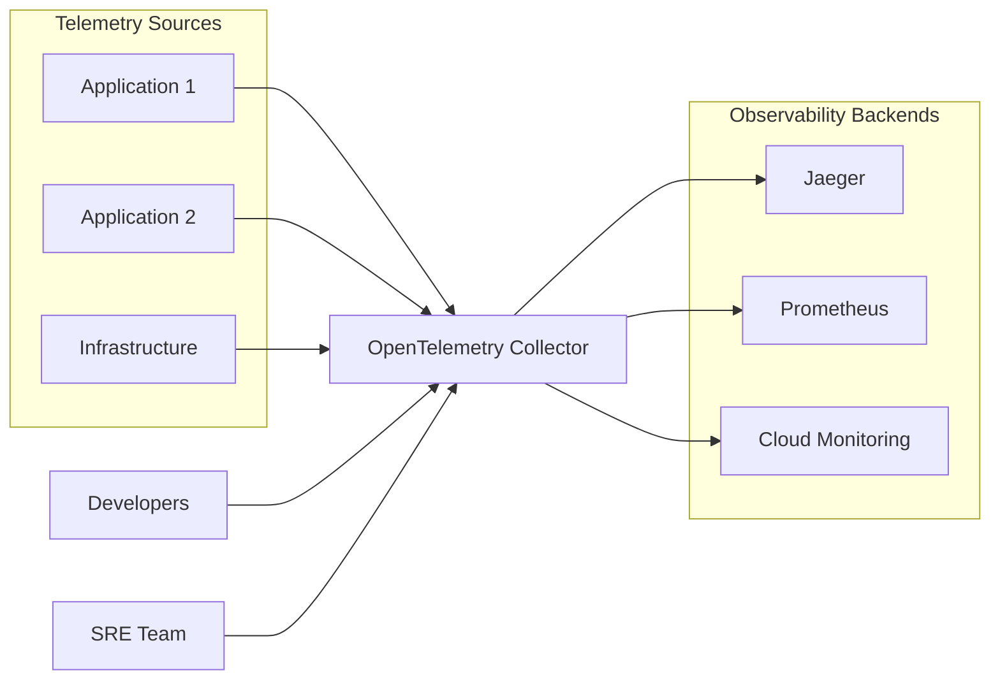
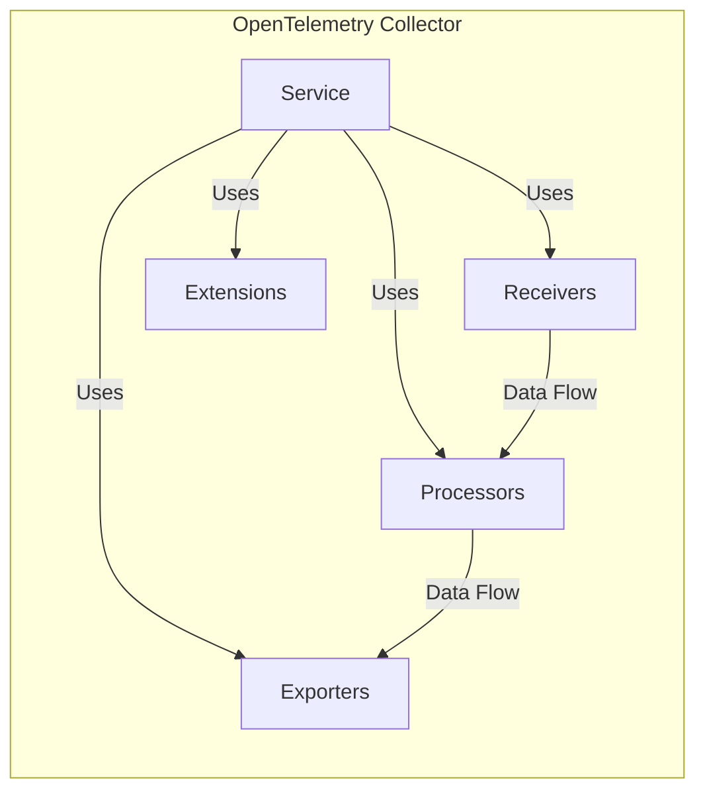

Okay, let's create a design document for the OpenTelemetry Collector, keeping in mind its purpose and potential deployment scenarios.

# BUSINESS POSTURE

The OpenTelemetry Collector is a crucial component in modern observability pipelines.  It's designed to be vendor-agnostic, receiving telemetry data (traces, metrics, logs) from various sources, processing it, and exporting it to one or more observability backends.

Business Priorities and Goals:

*   Reliability: The Collector must operate reliably, without data loss or significant performance degradation, even under heavy load.  It's often a critical path component.
*   Flexibility:  The Collector needs to support a wide range of input formats (OpenTelemetry, Jaeger, Zipkin, Prometheus, etc.) and output formats (various observability backends like Jaeger, Prometheus, cloud-specific services, etc.).
*   Extensibility:  The architecture should allow for easy addition of new receivers, processors, and exporters to adapt to evolving needs and new technologies.
*   Scalability:  The Collector should be able to scale horizontally to handle increasing volumes of telemetry data.
*   Cost-Effectiveness:  While providing robust functionality, the Collector should be resource-efficient to minimize operational costs.
*   Vendor Neutrality: A primary goal is to avoid vendor lock-in, allowing users to switch between different observability backends easily.
*   Observability of Itself: The Collector should expose its own metrics and traces for monitoring its health and performance.

Business Risks:

*   Data Loss: Loss of telemetry data due to Collector failure or misconfiguration can lead to blind spots in monitoring and hinder incident response.
*   Performance Bottlenecks:  If the Collector becomes a bottleneck, it can delay the delivery of telemetry data, impacting the effectiveness of monitoring and alerting.
*   Configuration Complexity:  Incorrect or overly complex configurations can lead to instability, data loss, or security vulnerabilities.
*   Security Vulnerabilities:  As a component handling potentially sensitive data, the Collector must be secure against attacks that could lead to data breaches or denial of service.
*   Dependency Issues:  Reliance on external libraries and components introduces the risk of supply chain attacks or vulnerabilities in those dependencies.
*   Lack of Observability: Inability to monitor the Collector's own health and performance can make it difficult to diagnose and resolve issues.

# SECURITY POSTURE

Existing Security Controls:

*   security control: Configuration via YAML files: The primary configuration mechanism is through YAML files, which define the receivers, processors, exporters, and pipelines. (Described in the Collector's documentation and configuration schema).
*   security control: Support for TLS/mTLS: The Collector supports TLS/mTLS for secure communication with receivers and exporters. (Described in the configuration options for individual receivers and exporters).
*   security control: Extensible Architecture: The modular design allows for the development of custom extensions with specific security considerations. (Described in the Collector's extensibility documentation).
*   security control: Community Scrutiny: As an open-source project, the Collector benefits from community review and contributions, which can help identify and address security issues.
*   security control: Regular Releases: The OpenTelemetry project maintains a regular release cadence, including security patches and updates.
*   security control: Authentication and authorization mechanisms for receivers: Some receivers (e.g., the OTLP receiver) can be configured with authentication and authorization mechanisms. (Described in the documentation for specific receivers).

Accepted Risks:

*   accepted risk: Default Configuration: The default configuration may not be secure for all environments and requires careful review and customization.
*   accepted risk: Extension Security: The security of custom extensions (receivers, processors, exporters) is the responsibility of the extension developer.
*   accepted risk: Dependency Management: While efforts are made to vet dependencies, there's always a residual risk of supply chain vulnerabilities.

Recommended Security Controls:

*   Implement robust input validation for all receivers to prevent injection attacks.
*   Provide clear guidelines and best practices for secure configuration, including examples for common use cases.
*   Integrate with secret management solutions (e.g., HashiCorp Vault, cloud-specific key management services) for secure handling of sensitive configuration values (API keys, credentials).
*   Implement a security linter for configuration files to detect potential misconfigurations.
*   Conduct regular security audits and penetration testing.
*   Establish a clear vulnerability disclosure and response process.

Security Requirements:

*   Authentication:
    *   Receivers should support authentication mechanisms appropriate for the data source (e.g., API keys, bearer tokens, mutual TLS).
    *   The Collector itself may need to authenticate to exporters (e.g., when sending data to a cloud service).
*   Authorization:
    *   Implement authorization policies to control access to specific receivers or data streams.
    *   Consider role-based access control (RBAC) for managing Collector configurations.
*   Input Validation:
    *   All receivers must perform rigorous input validation to prevent malformed data from causing crashes, resource exhaustion, or security vulnerabilities.
    *   Validation should be based on the expected data format and schema.
*   Cryptography:
    *   Use TLS/mTLS for all network communication, both for receiving and exporting data.
    *   Ensure that cryptographic libraries are up-to-date and configured securely.
    *   Use strong ciphers and protocols.
    *   Protect sensitive configuration values (e.g., API keys) using encryption at rest and in transit.

# DESIGN

## C4 CONTEXT



Context Diagram Element Description:

*   Element:
    *   Name: Application 1
    *   Type: Software System
    *   Description: An application that generates telemetry data (traces, metrics, logs).
    *   Responsibilities: Performing its business function and emitting telemetry data.
    *   Security controls: Application-level security controls (authentication, authorization, input validation, etc.).
*   Element:
    *   Name: Application 2
    *   Type: Software System
    *   Description: Another application that generates telemetry data.
    *   Responsibilities: Performing its business function and emitting telemetry data.
    *   Security controls: Application-level security controls.
*   Element:
    *   Name: Infrastructure
    *   Type: System
    *   Description: Infrastructure components (servers, databases, networks) that generate telemetry data.
    *   Responsibilities: Providing the underlying infrastructure for applications and emitting telemetry data.
    *   Security controls: Infrastructure-level security controls (firewalls, intrusion detection systems, etc.).
*   Element:
    *   Name: OpenTelemetry Collector
    *   Type: Software System
    *   Description: The central component that receives, processes, and exports telemetry data.
    *   Responsibilities: Receiving data from various sources, processing it (filtering, aggregation, etc.), and exporting it to various backends.
    *   Security controls: TLS/mTLS, authentication/authorization for receivers, input validation, secure configuration management.
*   Element:
    *   Name: Jaeger
    *   Type: Software System
    *   Description: A distributed tracing backend.
    *   Responsibilities: Storing and visualizing traces.
    *   Security controls: Access controls, data encryption.
*   Element:
    *   Name: Prometheus
    *   Type: Software System
    *   Description: A time-series database for metrics.
    *   Responsibilities: Storing and querying metrics.
    *   Security controls: Access controls, data encryption.
*   Element:
    *   Name: Cloud Monitoring
    *   Type: Software System
    *   Description: A cloud-based monitoring service.
    *   Responsibilities: Providing a comprehensive monitoring solution.
    *   Security controls: Cloud provider's security controls.
*   Element:
    *   Name: Developers
    *   Type: Person
    *   Description: Developers who configure and maintain the applications sending telemetry.
    *   Responsibilities: Instrumenting applications to emit telemetry data.
    *   Security controls: Access to development environments and code repositories.
*   Element:
    *   Name: SRE Team
    *   Type: Person
    *   Description: Site Reliability Engineers who manage the OpenTelemetry Collector and observability infrastructure.
    *   Responsibilities: Configuring, deploying, and monitoring the Collector.
    *   Security controls: Access to Collector configuration, deployment environments, and monitoring dashboards.

## C4 CONTAINER



Container Diagram Element Description:

*   Element:
    *   Name: Receivers
    *   Type: Container
    *   Description: Components that receive telemetry data from various sources.
    *   Responsibilities: Listening for incoming data, authenticating (if required), validating input, and converting it to an internal representation.
    *   Security controls: TLS/mTLS, authentication/authorization mechanisms, input validation.
*   Element:
    *   Name: Processors
    *   Type: Container
    *   Description: Components that process telemetry data.
    *   Responsibilities: Filtering, aggregating, sampling, transforming, and enriching data.
    *   Security controls: Secure configuration, protection against resource exhaustion.
*   Element:
    *   Name: Exporters
    *   Type: Container
    *   Description: Components that send telemetry data to various backends.
    *   Responsibilities: Converting data to the backend's format, authenticating (if required), and sending data over the network.
    *   Security controls: TLS/mTLS, authentication/authorization mechanisms.
*   Element:
    *   Name: Extensions
    *   Type: Container
    *   Description: Optional components that provide additional functionality.
    *   Responsibilities: Providing features like health checks, service discovery, and custom logic.
    *   Security controls: Dependent on the specific extension; should follow secure coding practices.
*   Element:
    *   Name: Service
    *   Type: Container
    *   Description: The core component that orchestrates the data flow between receivers, processors, and exporters.
    *   Responsibilities: Managing the pipeline, handling configuration, and providing a control plane.
    *   Security controls: Secure configuration management, access controls.

## DEPLOYMENT

Possible Deployment Solutions:

1.  Standalone Binary: Deploy the Collector as a standalone binary on a virtual machine or bare-metal server.
2.  Docker Container: Deploy the Collector as a Docker container.
3.  Kubernetes: Deploy the Collector as a Kubernetes Deployment or StatefulSet.
4.  Sidecar: Deploy the Collector as a sidecar container alongside the application.
5.  DaemonSet: Deploy as DaemonSet to collect host metrics.

Chosen Solution (Kubernetes Deployment):

```mermaid
graph LR
    subgraph "Kubernetes Cluster"
        subgraph "Namespace: monitoring"
            A[OpenTelemetry Collector Pod]
            B[ConfigMap]
            C[Service]
            D[Ingress (Optional)]

            A -- "Uses" --> B
            C -- "Exposes" --> A
            D -- "Routes to" --> C
        end
    end

    E[External Load Balancer (Optional)]
    E -- "Routes to" --> D

    subgraph "Telemetry Sources"
      F[Application Pods]
    end
    F --> C
```

Deployment Diagram Element Description:

*   Element:
    *   Name: OpenTelemetry Collector Pod
    *   Type: Kubernetes Pod
    *   Description: One or more instances of the OpenTelemetry Collector running as a Pod.
    *   Responsibilities: Running the Collector process.
    *   Security controls: Kubernetes security context, network policies.
*   Element:
    *   Name: ConfigMap
    *   Type: Kubernetes ConfigMap
    *   Description: Stores the Collector's configuration (YAML file).
    *   Responsibilities: Providing configuration to the Collector Pods.
    *   Security controls: Kubernetes RBAC, encryption at rest (if using a secrets management solution).
*   Element:
    *   Name: Service
    *   Type: Kubernetes Service
    *   Description: Provides a stable endpoint for accessing the Collector Pods.
    *   Responsibilities: Load balancing traffic across Collector Pods.
    *   Security controls: Kubernetes network policies.
*   Element:
    *   Name: Ingress (Optional)
    *   Type: Kubernetes Ingress
    *   Description: Exposes the Collector Service to external traffic (if required).
    *   Responsibilities: Routing external traffic to the Collector Service.
    *   Security controls: TLS termination, authentication/authorization (if configured).
*   Element:
    *   Name: External Load Balancer (Optional)
    *   Type: Load Balancer
    *   Description: Load balances traffic across multiple Kubernetes nodes (if using an Ingress).
    *   Responsibilities: Distributing external traffic to the Kubernetes cluster.
    *   Security controls: Cloud provider's load balancer security features.
*   Element:
    *   Name: Application Pods
    *   Type: Kubernetes Pod
    *   Description: Pods running the applications that generate telemetry data.
    *   Responsibilities: Running the application and emitting telemetry.
    *   Security controls: Application and Kubernetes security controls.

## BUILD

The OpenTelemetry Collector build process is primarily managed through GitHub Actions, leveraging Go's build system and various linters and security scanners.

```mermaid
graph LR
    A[Developer] --> B[GitHub Repository]
    B -- "Push/PR" --> C[GitHub Actions]
    C -- "Go Build" --> D[Build Artifacts]
    C -- "Linting (golangci-lint)" --> E{Linting Passed?}
    C -- "SAST (gosec)" --> F{SAST Passed?}
    C -- "Dependency Scanning (Snyk/Dependabot)" --> G{Dependency Check Passed?}
    E -- "Yes" --> H[Continue Build]
    E -- "No" --> I[Fail Build]
    F -- "Yes" --> H
    F -- "No" --> I
    G -- "Yes" --> H
    G -- "No" --> I
    H --> D
    D --> J[Container Registry (e.g., Docker Hub, Quay.io)]
    D --> K[Release Assets (GitHub Releases)]
```

Build Process Description:

1.  Developer: Developers write code and push changes to the GitHub repository.
2.  GitHub Repository: The central repository for the OpenTelemetry Collector code.
3.  GitHub Actions:  Automated workflows triggered by events (push, pull request) in the repository.
4.  Go Build: The Go compiler builds the Collector binary.
5.  Linting (golangci-lint):  Static analysis tool to enforce code style and identify potential issues.
6.  SAST (gosec):  Static Application Security Testing tool to scan for security vulnerabilities in the Go code.
7.  Dependency Scanning (Snyk/Dependabot):  Scans dependencies for known vulnerabilities.
8.  Build Artifacts: The output of the build process, including the Collector binary and container images.
9.  Container Registry:  Stores container images of the Collector.
10. Release Assets (GitHub Releases):  Stores release binaries and other artifacts.

Security Controls in Build Process:

*   Code Review:  All code changes are reviewed by other developers before merging.
*   Linting:  Enforces code style and helps prevent common errors.
*   SAST:  Identifies potential security vulnerabilities in the code.
*   Dependency Scanning:  Detects known vulnerabilities in dependencies.
*   Signed Releases:  Releases are often signed to ensure authenticity.
*   Automated Builds:  GitHub Actions provides a consistent and reproducible build environment.

# RISK ASSESSMENT

Critical Business Processes:

*   Monitoring and Alerting: The Collector is essential for collecting the data that powers monitoring and alerting systems.  Failure of the Collector can disrupt these processes, leading to delayed or missed alerts.
*   Incident Response:  Telemetry data is crucial for diagnosing and resolving incidents.  Loss of data or delays in data delivery can hinder incident response efforts.
*   Performance Analysis:  The Collector provides data for analyzing application and infrastructure performance, identifying bottlenecks, and optimizing resource utilization.
*   Security Monitoring:  The Collector can be used to collect security-related telemetry data, such as audit logs and security events.

Data Sensitivity:

*   Telemetry data can contain sensitive information, depending on the application and the level of instrumentation.  Examples include:
    *   Personally Identifiable Information (PII): User IDs, IP addresses, email addresses.
    *   Business-Sensitive Data:  Transaction details, customer data, internal API calls.
    *   Security Credentials:  API keys, tokens (if improperly exposed in traces or logs).
*   Data Sensitivity Levels:
    *   High:  Data that, if compromised, could lead to significant financial or reputational damage (e.g., PII, financial data).
    *   Medium:  Data that could cause moderate harm (e.g., internal API calls, operational metrics).
    *   Low:  Data that poses minimal risk (e.g., publicly available information).

# QUESTIONS & ASSUMPTIONS

Questions:

*   What specific compliance requirements (e.g., GDPR, HIPAA, PCI DSS) apply to the environments where the Collector will be deployed?
*   What are the expected data volumes (events per second, data size) that the Collector will need to handle?
*   What are the specific observability backends that the Collector will be exporting data to?
*   Are there any existing security tools or processes that the Collector needs to integrate with?
*   What is the level of expertise of the team that will be managing the Collector?
*   What level of access will the collector have to the network?
*   What is the expected latency for data ingestion and export?

Assumptions:

*   BUSINESS POSTURE: The organization prioritizes observability and understands the importance of reliable telemetry data collection.
*   BUSINESS POSTURE: The organization has a moderate risk appetite, balancing the need for innovation with the need for security and stability.
*   SECURITY POSTURE: The Collector will be deployed in a relatively secure environment (e.g., a private network, a Kubernetes cluster with appropriate security controls).
*   SECURITY POSTURE: The team managing the Collector has basic security awareness and will follow best practices.
*   DESIGN: The Collector will be configured to use TLS/mTLS for all network communication.
*   DESIGN: The Collector will be deployed with appropriate resource limits to prevent resource exhaustion.
*   DESIGN: Regular updates and security patches will be applied to the Collector.
*   DESIGN: Build process will be automated and secured.