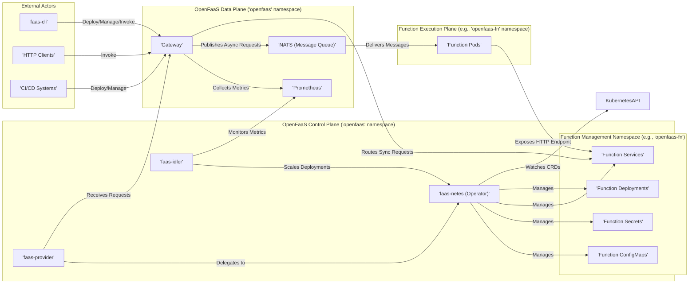
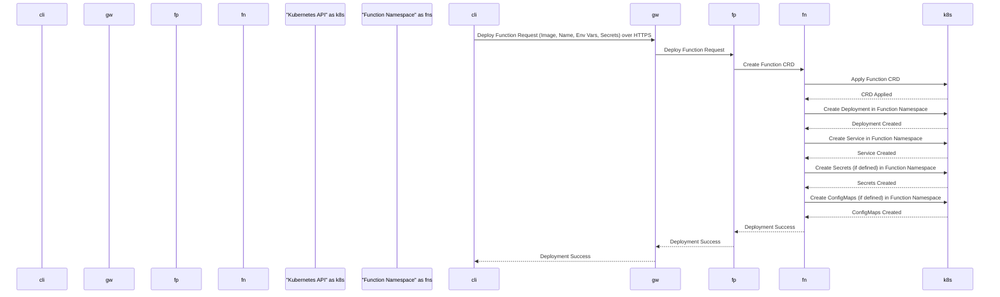
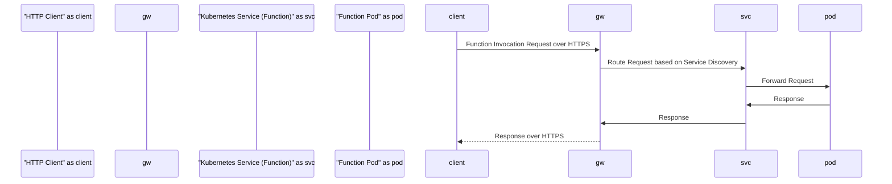
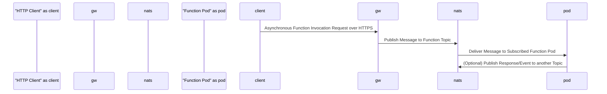

# Project Design Document: OpenFaaS (Improved)

**Document Version:** 1.1
**Date:** October 26, 2023
**Author:** AI Software Architect

## 1. Introduction

This document provides an enhanced architectural design of the OpenFaaS project, an open-source serverless functions framework built on containers. This design document aims to provide a more detailed and nuanced understanding of the system's components, their interactions, and the overall architecture, specifically tailored for effective threat modeling.

## 2. Goals and Objectives

The primary goals of OpenFaaS are to:

*   Empower developers to package and deploy event-driven functions as lightweight, isolated containers.
*   Offer a streamlined and developer-centric experience for building, deploying, and managing serverless functions with minimal operational overhead.
*   Abstract the complexities of the underlying infrastructure, allowing developers to focus on application logic.
*   Provide robust support for leading container orchestrators, with a primary focus on Kubernetes.
*   Enable automatic scaling and high availability for deployed functions, optimizing resource utilization.
*   Foster a vibrant ecosystem through extensible APIs and integrations with various tools and services.

## 3. High-Level Architecture

The OpenFaaS architecture comprises several interconnected components that orchestrate the execution of serverless functions. The following diagram illustrates the high-level architecture and key interactions:

## 4. Detailed Component Description

This section provides a more in-depth description of the core OpenFaaS components, highlighting their responsibilities and interactions with a focus on security implications.

### 4.1. faas-cli

*   **Description:** The command-line interface (CLI) tool enabling developers to interact with the OpenFaaS platform.
*   **Responsibilities:**
    *   Building function container images from source code using Docker.
    *   Deploying function definitions (including image, name, environment variables, secrets) to the OpenFaaS platform via the Gateway.
    *   Synchronously and asynchronously invoking deployed functions through the Gateway.
    *   Listing, scaling, updating, and deleting deployed functions.
    *   Managing secrets associated with functions, securely storing them in the underlying orchestrator's secret management system.
    *   Interacting with the OpenFaaS store to discover and deploy pre-built functions.
*   **Security Considerations:**
    *   The `faas-cli` itself should be obtained from trusted sources to prevent supply chain attacks.
    *   Credentials used by `faas-cli` to interact with the Gateway must be securely managed.
    *   Function definitions provided to `faas-cli` should be validated to prevent injection of malicious configurations.
*   **Interaction Points:** Primarily interacts with the `Gateway` component via its authenticated REST API over HTTPS.

### 4.2. Gateway

*   **Description:** The central, internet-facing entry point for all external interactions with the OpenFaaS platform.
*   **Responsibilities:**
    *   Receiving and routing HTTP requests for synchronous function invocations to the appropriate function service.
    *   Publishing messages to the `NATS` message queue for asynchronous function invocations.
    *   Authenticating and authorizing requests to the OpenFaaS API and potentially function invocations (configurable).
    *   Collecting and exposing metrics about function invocations and platform health to `Prometheus`.
    *   Serving the user interface for function management and monitoring.
    *   Providing an API endpoint for function deployments and management, interacting with the `faas-provider`.
*   **Security Considerations:**
    *   The Gateway is a critical security boundary and must be hardened against common web application attacks (e.g., XSS, CSRF, SQL injection - though less likely in this context).
    *   Proper authentication and authorization mechanisms are crucial to prevent unauthorized access and function invocation.
    *   Rate limiting and request size limits should be enforced to mitigate denial-of-service attacks.
    *   TLS encryption is essential for all communication with the Gateway.
*   **Interaction Points:**
    *   Receives requests from `faas-cli`, HTTP clients, and potentially other services.
    *   Interacts with `NATS` for asynchronous function calls.
    *   Discovers function endpoints through Kubernetes Services.
    *   Sends metrics to `Prometheus`.
    *   Communicates with the `faas-provider` for function management operations.

### 4.3. faas-netes (Operator)

*   **Description:** The Kubernetes operator responsible for managing the lifecycle of OpenFaaS functions within a Kubernetes cluster, acting as the primary `faas-provider`.
*   **Responsibilities:**
    *   Monitoring Kubernetes for `Function` Custom Resource Definitions (CRDs).
    *   Creating and managing Kubernetes Deployments and Services for each deployed function based on the CRD specifications.
    *   Scaling function replicas up or down based on demand, configured parameters, or signals from the `faas-idler`.
    *   Handling updates and rollouts of function deployments.
    *   Integrating with Kubernetes Secrets to securely inject sensitive information into function pods.
    *   Managing function-specific ConfigMaps for configuration data.
*   **Security Considerations:**
    *   The `faas-netes` operator requires appropriate RBAC permissions within the Kubernetes cluster to manage resources. These permissions should be narrowly scoped.
    *   The operator itself should be deployed securely and monitored for any suspicious activity.
    *   It's crucial to ensure the operator only acts on valid and authorized `Function` CRDs.
*   **Interaction Points:**
    *   Watches the Kubernetes API server for changes to `Function` CRDs.
    *   Interacts with the Kubernetes API server to create, update, and delete Deployments, Services, Secrets, and ConfigMaps in the designated function namespace.

### 4.4. faas-provider

*   **Description:** An abstraction layer allowing OpenFaaS to potentially integrate with different container orchestrators. Currently, `faas-netes` is the primary and most mature provider.
*   **Responsibilities:**
    *   Providing a consistent interface for the `Gateway` to manage functions, regardless of the underlying orchestrator.
    *   Translating generic function management requests into orchestrator-specific API calls.
*   **Security Considerations:**
    *   The security of the `faas-provider` depends heavily on the security of the underlying orchestrator and the specific provider implementation.
    *   It's important to ensure that the provider correctly handles authentication and authorization for orchestrator API calls.
*   **Interaction Points:**
    *   Receives function deployment and management requests from the `Gateway`.
    *   Delegates the actual orchestration tasks to the specific provider implementation (e.g., `faas-netes`).

### 4.5. Function Pods

*   **Description:** The actual containerized instances of the deployed functions, running the user-provided code.
*   **Responsibilities:**
    *   Executing the function code in response to incoming HTTP requests or messages from the message queue.
    *   Exposing an HTTP endpoint (typically on port 8080) for the `Gateway` to forward requests.
*   **Security Considerations:**
    *   Function pods represent a significant attack surface. It's crucial to use minimal base images and regularly scan them for vulnerabilities.
    *   Network policies should be implemented to restrict network access to and from function pods, following the principle of least privilege.
    *   Resource limits (CPU, memory) should be enforced to prevent resource exhaustion and potential denial-of-service scenarios.
    *   Secure coding practices within the function code are paramount to prevent vulnerabilities.
    *   Consider using security context constraints to further restrict the capabilities of function containers.
*   **Interaction Points:**
    *   Receives invocation requests from the `Gateway` (synchronous) or messages from `NATS` (asynchronous).
    *   May interact with external services, databases, or other internal components. These interactions should be secured.

### 4.6. Prometheus

*   **Description:** A time-series database and monitoring system used by OpenFaaS to collect and store metrics.
*   **Responsibilities:**
    *   Scraping metrics endpoints exposed by the `Gateway` and function pods.
    *   Storing time-series data representing various aspects of the OpenFaaS platform and function execution.
    *   Providing a query language (PromQL) for analyzing metrics and creating dashboards.
*   **Security Considerations:**
    *   Access to Prometheus should be restricted to authorized users and systems.
    *   Consider enabling authentication and authorization for the Prometheus UI and API.
    *   Ensure that sensitive information is not inadvertently exposed through metrics.
*   **Interaction Points:**
    *   The `Gateway` and function pods expose metrics in Prometheus format via HTTP endpoints.
    *   The `faas-idler` queries Prometheus for function activity metrics.
    *   Administrators and monitoring tools can query Prometheus for insights.

### 4.7. NATS (Message Queue)

*   **Description:** A lightweight, high-performance messaging system used for asynchronous function invocations and internal communication within OpenFaaS.
*   **Responsibilities:**
    *   Providing a message broker for asynchronous function calls, enabling event-driven architectures.
    *   Facilitating communication between different OpenFaaS components (though less common).
*   **Security Considerations:**
    *   Secure the NATS deployment with authentication and authorization to prevent unauthorized access and message manipulation.
    *   Consider using TLS encryption for communication with the NATS server.
    *   Implement appropriate access controls on NATS topics to restrict which functions can publish and subscribe to specific events.
*   **Interaction Points:**
    *   The `Gateway` publishes messages to NATS topics for asynchronous invocations.
    *   Function pods can subscribe to specific NATS topics to receive event triggers.

### 4.8. faas-idler

*   **Description:** A component responsible for automatically scaling down idle functions to zero replicas to conserve resources.
*   **Responsibilities:**
    *   Monitoring function activity by querying metrics from `Prometheus`.
    *   Scaling down Kubernetes Deployments of inactive functions by setting the replica count to zero.
    *   Scaling up function deployments when new invocation requests arrive at the `Gateway`.
*   **Security Considerations:**
    *   The `faas-idler` requires permissions to scale Kubernetes Deployments. These permissions should be carefully managed.
    *   Ensure the `faas-idler` relies on accurate metrics from Prometheus to avoid unnecessary scaling actions.
*   **Interaction Points:**
    *   Queries metrics from `Prometheus`.
    *   Interacts with the Kubernetes API (via `faas-netes`) to scale function deployments.

### 4.9. Function Namespace(s)

*   **Description:** Dedicated Kubernetes namespaces (e.g., `openfaas-fn`) where function-related resources (Deployments, Services, Secrets, ConfigMaps) are deployed. This provides logical and often security isolation.
*   **Responsibilities:**
    *   Providing isolation for function resources, preventing interference between different functions or applications.
    *   Enabling the application of specific resource quotas, network policies, and security contexts at the namespace level.
*   **Security Considerations:**
    *   Utilizing Kubernetes namespaces for function isolation is a key security best practice.
    *   Implement network policies to restrict traffic flow within and between function namespaces.
    *   Apply appropriate RBAC policies to control access to resources within function namespaces.
*   **Interaction Points:** Managed and utilized by `faas-netes` for deploying and managing function resources.

## 5. Data Flow Diagrams

### 5.1. Function Deployment (Detailed)

### 5.2. Synchronous Function Invocation (Detailed)

### 5.3. Asynchronous Function Invocation (Detailed)

## 6. Security Considerations (Expanded)

This section details specific security considerations for OpenFaaS, categorized for clarity:

*   **Authentication and Authorization:**
    *   **Gateway Authentication:** Implement robust authentication for the Gateway API (e.g., API keys, OAuth 2.0) to control who can deploy and manage functions.
    *   **Function Invocation Authorization:** Optionally configure authorization policies to control which clients or users can invoke specific functions.
    *   **RBAC for OpenFaaS Components:**  Properly configure RBAC within Kubernetes to restrict the permissions of OpenFaaS components like `faas-netes`.
    *   **Mutual TLS (mTLS):** Consider implementing mTLS for communication between internal OpenFaaS components for enhanced security.
*   **Network Security:**
    *   **Network Policies:** Implement Kubernetes Network Policies to restrict network traffic to and from function pods, following the principle of least privilege. Isolate function namespaces.
    *   **TLS Encryption:** Enforce TLS encryption for all external communication with the Gateway and consider it for internal communication as well.
    *   **Ingress Controller Security:** Secure the Ingress Controller used to expose the Gateway, including rate limiting and protection against common web attacks.
*   **Container Security:**
    *   **Base Image Security:** Use minimal and trusted base images for function containers. Regularly scan images for vulnerabilities.
    *   **Container Scanning:** Integrate container image scanning into the CI/CD pipeline to identify and address vulnerabilities before deployment.
    *   **Security Context Constraints (SCCs):** Apply SCCs to function pods to restrict their capabilities and access to host resources.
    *   **Immutable Infrastructure:** Treat function containers as immutable and redeploy them for updates and security patches.
*   **Secrets Management:**
    *   **Kubernetes Secrets:** Leverage Kubernetes Secrets to securely store and manage sensitive information used by functions. Avoid hardcoding secrets.
    *   **Secret Rotation:** Implement a strategy for rotating secrets regularly.
    *   **Principle of Least Privilege for Secrets:** Only grant functions access to the secrets they absolutely need.
    *   **Consider Vault or other Secret Management Solutions:** For more advanced secret management, consider integrating with HashiCorp Vault or similar tools.
*   **Input Validation:**
    *   **Function Code Validation:** Emphasize the importance of input validation within the function code to prevent injection attacks.
    *   **Gateway Input Sanitization:**  While the Gateway primarily routes requests, consider any potential areas where it might process input and ensure proper sanitization.
*   **Resource Limits:**
    *   **CPU and Memory Limits:** Configure appropriate CPU and memory limits for function pods to prevent resource exhaustion and noisy neighbor issues.
    *   **Request Limits:** Implement request size limits at the Gateway to prevent denial-of-service attacks.
*   **Monitoring and Auditing:**
    *   **Logging:** Implement comprehensive logging for API calls, function executions, and component activities.
    *   **Auditing:** Enable auditing of Kubernetes API calls to track changes to OpenFaaS resources.
    *   **Security Monitoring:** Integrate with security monitoring tools to detect suspicious activity and potential security breaches.
*   **Supply Chain Security:**
    *   **Verify Component Integrity:** Ensure that OpenFaaS components are obtained from trusted sources and their integrity is verified.
    *   **Dependency Management:**  Manage dependencies of OpenFaaS components and function code to mitigate supply chain risks.

## 7. Deployment Model (Detailed)

OpenFaaS is primarily designed for deployment within a Kubernetes cluster, offering several deployment options:

*   **Helm Chart:** The official OpenFaaS Helm chart provides a declarative and repeatable way to deploy and manage OpenFaaS and its dependencies on Kubernetes. This is the recommended method for production deployments.
    *   **Security Considerations:** Ensure the Helm chart is obtained from the official OpenFaaS repository and verify its integrity. Configure appropriate values in the `values.yaml` file, paying close attention to security-related settings.
*   **`arkade` Tool:** `arkade` simplifies the installation of various Kubernetes applications, including OpenFaaS. It provides a user-friendly way to deploy OpenFaaS with sensible defaults.
    *   **Security Considerations:** Similar to Helm, ensure `arkade` is from a trusted source. Review the deployment options offered by `arkade` and understand their security implications.
*   **Manual Deployment with `kubectl`:** Deploying individual OpenFaaS components using `kubectl` and YAML manifests offers fine-grained control but requires a deeper understanding of the underlying architecture.
    *   **Security Considerations:** This method requires careful attention to security configurations for each component. Ensure that all manifests are reviewed for security best practices.
*   **Kubernetes Operators (Beyond `faas-netes`):** While `faas-netes` is the core operator, other operators might manage supporting infrastructure.
    *   **Security Considerations:**  Understand the security implications of any additional operators involved in the deployment.

While Kubernetes is the primary focus, OpenFaaS can also be deployed on Docker Swarm, although this is less common and may have limitations in terms of feature parity and community support.

## 8. Assumptions and Constraints

The following assumptions and constraints are relevant to this design:

*   **Functional Kubernetes Cluster:** The design assumes the existence of a properly configured and secured Kubernetes cluster as the underlying infrastructure.
*   **Networking Configuration:**  Correct network configuration within the Kubernetes cluster is assumed, allowing communication between pods and external access.
*   **Security Best Practices Adherence:** It is assumed that general security best practices for containerized applications and cloud environments are followed.
*   **Scalability Requirements:** The design considers the need for horizontal scalability of function instances to handle varying workloads.
*   **Open Source Nature:** The design is based on the current open-source implementation of OpenFaaS.

## 9. Future Considerations

*   **Enhanced Multi-Tenancy:** Explore more robust mechanisms for multi-tenancy, including stronger isolation between tenants at the network and resource levels.
*   **Advanced Observability and Tracing:** Deeper integration with distributed tracing systems (e.g., Jaeger, Zipkin) for improved debugging and performance analysis.
*   **Improved Security Features:** Investigate and implement more advanced authentication and authorization options, such as fine-grained access control policies.
*   **WASM Support:**  Further enhance support for WebAssembly (WASM) as a function runtime environment.
*   **Serverless Workflow Orchestration:** Explore integration with workflow engines to enable the creation of more complex serverless applications.

This improved document provides a more detailed and security-focused overview of the OpenFaaS architecture, intended to serve as a valuable resource for threat modeling and security analysis.