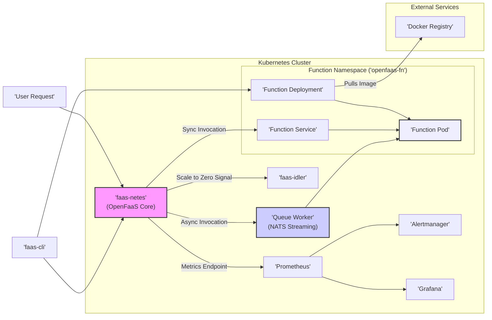

## Project Design Document: OpenFaaS (Improved)

**Project Name:** OpenFaaS (Functions as a Service)

**Project Repository:** https://github.com/openfaas/faas

**Document Version:** 1.1

**Date:** October 26, 2023

**Author:** AI Software Architecture Expert

**1. Introduction**

This document provides an enhanced architectural overview of the OpenFaaS project, building upon the previous version. It aims to offer a more detailed description of the system's components, their interactions, and the data flow within the platform. This refined document will serve as a stronger foundation for subsequent threat modeling activities, enabling a more granular understanding of potential security vulnerabilities and attack surfaces.

OpenFaaS is a serverless functions framework leveraging Docker and Kubernetes. It empowers developers to package event-driven functions as lightweight Docker images and seamlessly deploy them onto a Kubernetes cluster. OpenFaaS abstracts away the complexities of underlying infrastructure management, handling scaling, networking, and monitoring of these functions. This allows developers to focus primarily on writing business logic.

**2. Goals**

* Provide a clear, comprehensive, and more detailed architectural overview of OpenFaaS.
* Elaborate on the responsibilities and interactions of key components.
* Provide more granular detail on the data flow during function deployment and invocation, including different invocation types.
* Serve as a robust and detailed basis for threat modeling and security analysis, identifying potential attack vectors and vulnerabilities.

**3. Architectural Overview**

The OpenFaaS architecture is composed of several interconnected core components, primarily deployed within a Kubernetes cluster. These components work in concert to manage the lifecycle and execution of serverless functions.

**4. Key Components and Responsibilities (Detailed)**

* **faas-netes (OpenFaaS Core):**
    * The central nervous system of OpenFaaS, typically deployed as a Kubernetes Deployment named `gateway`.
    * **API Gateway:** Exposes the primary API endpoints for interacting with OpenFaaS, including deploying (`/system/functions`), invoking (`/function/{function_name}`), updating, and deleting functions. It handles routing incoming requests based on the function name.
    * **Function Controller:**  Monitors Kubernetes events (e.g., Deployment changes) and reconciles the state of OpenFaaS functions. It ensures that the desired number of function replicas are running.
    * **Service Discovery:**  Maintains an internal registry of deployed functions and their corresponding Kubernetes Services.
    * **Authentication and Authorization:** Enforces authentication (e.g., API keys via headers) and authorization policies for accessing the API and invoking functions.
    * **Metrics Aggregation:** Collects basic metrics about function invocations and exposes them via a `/metrics` endpoint for Prometheus to scrape.
    * **Logs Aggregation (via Kubernetes):** Relies on Kubernetes' logging infrastructure to collect logs from function pods.
    * **Scalability Management:**  Interacts with the Kubernetes Horizontal Pod Autoscaler (HPA) or its own internal scaler to adjust the number of function replicas based on load.

* **faas-idler:**
    * An optional, yet valuable, component deployed as a Kubernetes Deployment.
    * **Monitoring Function Activity:** Continuously monitors the invocation rate and other metrics of deployed functions through the OpenFaaS API.
    * **Scaling to Zero:** When a function remains idle (no invocations) for a configurable period, `faas-idler` scales the function's Deployment down to zero replicas, conserving resources.
    * **Scaling Up:** Upon the next invocation request, `faas-netes` detects the zero replicas and triggers a scale-up event, bringing the function back online.

* **Queue Worker (NATS Streaming):**
    * An optional component, typically deployed as a Kubernetes Deployment, enabling asynchronous function invocation.
    * **Message Consumer:** Subscribes to specific NATS Streaming topics corresponding to functions configured for asynchronous invocation.
    * **Function Invoker:** Upon receiving a message, the Queue Worker retrieves the function details and invokes the corresponding Kubernetes Service.
    * **Error Handling and Retries:**  Implements mechanisms for handling failed function invocations and potentially retrying them based on configuration.
    * **Decoupling:** Provides a decoupling mechanism between request producers and function consumers, improving system resilience and scalability.

* **Prometheus:**
    * A standard monitoring and alerting toolkit deployed within the Kubernetes cluster.
    * **Metrics Scraper:**  Periodically scrapes metrics endpoints exposed by `faas-netes` and individual function pods (if instrumented).
    * **Time-Series Database:** Stores collected metrics in a time-series database.
    * **Querying and Analysis:** Allows users to query and analyze metrics data for performance monitoring, troubleshooting, and capacity planning.

* **Alertmanager:**
    * A component that handles alerts generated by Prometheus.
    * **Alert Processing:** Receives alerts from Prometheus based on predefined rules.
    * **Deduplication and Grouping:**  Deduplicates and groups similar alerts to reduce noise.
    * **Notification Routing:** Routes notifications to various channels (e.g., email, Slack, PagerDuty) based on alert severity and configuration.

* **Grafana:**
    * A powerful data visualization and dashboarding tool.
    * **Dashboard Creation:**  Used to create interactive dashboards that visualize metrics collected by Prometheus.
    * **Monitoring and Observability:** Provides a visual overview of OpenFaaS and function performance, enabling better monitoring and observability.

* **Function Namespace ('openfaas-fn'):**
    * A dedicated Kubernetes namespace, typically named `openfaas-fn`, where all deployed functions reside.
    * **Resource Isolation:** Provides resource isolation for functions, preventing them from interfering with other workloads in the cluster.
    * **Security Boundaries:**  Can be used to enforce network policies and other security controls to isolate functions.

* **Function Deployment:**
    * A standard Kubernetes Deployment object created for each deployed function within the `openfaas-fn` namespace.
    * **Declarative Management:** Defines the desired state of the function, including the number of replicas, container image, and resource requests.
    * **Rolling Updates and Rollbacks:** Enables zero-downtime updates and rollbacks of function deployments.

* **Function Service:**
    * A standard Kubernetes Service object that exposes the function's pods within the cluster.
    * **Stable Endpoint:** Provides a stable internal endpoint for invoking the function, regardless of pod IP address changes.
    * **Load Balancing:**  Distributes incoming requests across the available function pods.

* **Function Pod:**
    * One or more Kubernetes Pods running the containerized function.
    * **Containerized Function:** Contains the actual function code and any necessary dependencies packaged within a Docker container.
    * **Resource Limits:**  Can have resource limits (CPU, memory) defined to prevent resource exhaustion.

* **faas-cli:**
    * The command-line interface for interacting with the OpenFaaS API.
    * **Function Management:** Used for building, deploying, updating, deleting, and invoking functions.
    * **Template Management:**  Allows users to manage function templates for different programming languages and frameworks.
    * **Configuration:**  Used to configure OpenFaaS settings and connect to the Kubernetes cluster.

* **Docker Registry:**
    * A repository (e.g., Docker Hub, GitLab Container Registry, Amazon ECR) for storing and retrieving Docker images.
    * **Image Storage:** Stores the Docker images of deployed functions.
    * **Image Pulling:** Kubernetes pulls function images from the configured Docker registry during deployment.

**5. Data Flow (Detailed)**

This section provides a more granular breakdown of the data flow for function deployment and invocation.

**5.1 Function Deployment (Detailed):**

1. **Developer Action:** The developer uses the `faas-cli` with commands like `faas-cli build` to build a Docker image based on a function handler and a base image.
2. **Image Tagging:** The `faas-cli` tags the Docker image with a name and version, often including the Docker Registry URL.
3. **Image Push:** The developer uses `docker push` or `faas-cli push` to push the tagged Docker image to the configured Docker Registry. Authentication with the registry is required.
4. **Deployment Request:** The developer uses `faas-cli deploy` to send a deployment request to the `faas-netes` API (specifically the `/system/functions` endpoint). This request includes the function name, image name, and other configuration parameters (e.g., environment variables, resource requests).
5. **API Authentication and Authorization:** `faas-netes` authenticates and authorizes the deployment request.
6. **Kubernetes Deployment Creation:** `faas-netes` interacts with the Kubernetes API server to create a Deployment object in the `openfaas-fn` namespace. The Deployment specification includes the function's Docker image, replica count (initially 1), and resource requests.
7. **Kubernetes Service Creation:** `faas-netes` also creates a corresponding Kubernetes Service object for the function. This Service typically uses a ClusterIP and targets the pods managed by the newly created Deployment.
8. **Image Pull by Kubernetes:** The Kubernetes kubelet on the nodes pulls the function's Docker image from the specified Docker Registry. Kubernetes uses configured credentials to access private registries.
9. **Pod Creation:** Kubernetes creates one or more Pods based on the Deployment specification. Each Pod runs a container based on the pulled Docker image.
10. **Service Endpoint Update:** The Kubernetes Service controller updates the Service's endpoints to reflect the newly created Pods.

**5.2 Function Invocation (Synchronous - Detailed):**

1. **User Request:** A client sends an HTTP request to the OpenFaaS Gateway (part of the `faas-netes` Deployment). The request URL typically follows the pattern `/function/{function_name}`.
2. **Gateway Routing:** The Gateway examines the request path and routes it to the appropriate Kubernetes Service based on the function name.
3. **Service Load Balancing:** The Kubernetes Service load-balances the request to one of the healthy Function Pods.
4. **Function Container Processing:** The request reaches the function container within the Pod. The OpenFaaS function invoker process within the container receives the request.
5. **Function Execution:** The invoker process executes the user-defined function code, passing the request data as input.
6. **Response Generation:** The function code generates a response.
7. **Response Transmission:** The response is sent back through the Kubernetes Service to the Gateway.
8. **Response Delivery:** The Gateway sends the HTTP response back to the original client.

**5.3 Function Invocation (Asynchronous - using Queue Worker - Detailed):**

1. **User Request:** A client sends an HTTP request to the OpenFaaS Gateway, specifically targeting the asynchronous invocation endpoint (e.g., `/async-function/{function_name}`).
2. **Message Enqueue:** The Gateway, instead of directly invoking the function, publishes a message containing the request data (including headers and body) to a specific NATS Streaming topic associated with the function.
3. **Queue Worker Consumption:** The Queue Worker, subscribed to the function's NATS Streaming topic, receives the message.
4. **Function Invocation by Worker:** The Queue Worker retrieves the function's service details and sends an internal HTTP request to the function's Kubernetes Service.
5. **Function Execution:** The function executes as in the synchronous invocation flow.
6. **(Optional) Result Handling:** The function might send a response back to the Queue Worker, or it might store the results in a persistent store. The original client does not receive an immediate response in this flow.

**6. Deployment Options (Expanded)**

OpenFaaS offers flexibility in deployment environments, each with its own security implications:

* **Managed Kubernetes Services (EKS, GKE, AKS):**
    * **Pros:** Simplified infrastructure management, automatic scaling of underlying nodes, integrated security features.
    * **Security Considerations:** Leverage the platform's IAM roles and network security groups, ensure proper configuration of managed Kubernetes security features.
* **Self-Managed Kubernetes Clusters (On-premises, Rancher, k3s):**
    * **Pros:** Greater control over the underlying infrastructure, customization options.
    * **Security Considerations:** Requires more manual configuration and management of security aspects, including network security, OS hardening, and access control.
* **Lightweight Kubernetes Distributions (minikube, kind):**
    * **Pros:** Primarily for local development and testing.
    * **Security Considerations:**  Security is often less emphasized in these environments, so they are not recommended for production deployments without careful consideration.

**7. Security Considerations (More Granular)**

This section expands on the initial security considerations, providing more specific examples and categories.

* **API Security:**
    * **Authentication:** Enforce strong authentication mechanisms for accessing the `faas-netes` API (e.g., API keys with proper rotation, OAuth 2.0 integration).
    * **Authorization:** Implement fine-grained authorization using Kubernetes RBAC to control who can deploy, invoke, and manage functions.
    * **TLS Encryption:** Ensure all communication with the API is encrypted using TLS (HTTPS).
    * **Rate Limiting and Throttling:** Implement rate limiting to prevent abuse and denial-of-service attacks on the API.

* **Function Security:**
    * **Secure Base Images:** Use minimal and regularly updated base images for function containers to reduce the attack surface.
    * **Vulnerability Scanning:** Implement automated vulnerability scanning of function container images before deployment.
    * **Least Privilege:** Run function containers with the least necessary privileges.
    * **Secure Coding Practices:** Encourage developers to follow secure coding practices to prevent vulnerabilities in function code.
    * **Input Validation:**  Thoroughly validate all input received by functions to prevent injection attacks.

* **Network Security:**
    * **Network Policies:** Implement Kubernetes Network Policies to restrict network traffic between namespaces and between function pods.
    * **Service Mesh:** Consider using a service mesh (e.g., Istio, Linkerd) for enhanced security features like mutual TLS (mTLS) and fine-grained traffic control.
    * **Ingress Security:** Secure the ingress controller that exposes the OpenFaaS Gateway with appropriate authentication and authorization mechanisms (e.g., TLS termination, web application firewall).

* **Secrets Management:**
    * **Kubernetes Secrets:** Use Kubernetes Secrets to securely store sensitive information (e.g., API keys, database credentials) required by functions.
    * **Secrets Management Tools:** Consider using dedicated secrets management tools (e.g., HashiCorp Vault) for more advanced features like secret rotation and auditing. Avoid storing secrets directly in environment variables or code.

* **Image Security:**
    * **Trusted Registries:** Use trusted and secure Docker registries to store function images.
    * **Image Signing:** Implement image signing and verification to ensure the integrity and authenticity of function images.
    * **Content Trust:** Enable Docker Content Trust to verify the publisher of images.

* **Monitoring and Logging:**
    * **Centralized Logging:** Implement centralized logging to collect and analyze logs from all OpenFaaS components and functions.
    * **Security Auditing:**  Enable auditing of API calls and other critical events for security monitoring and incident response.
    * **Alerting:** Configure alerts for suspicious activity and security events.

* **Supply Chain Security:**
    * **Dependency Management:** Carefully manage dependencies used in function development and regularly update them to patch vulnerabilities.
    * **Software Bill of Materials (SBOM):** Generate and review SBOMs for function images to understand their components and potential vulnerabilities.

* **RBAC (Role-Based Access Control):**
    * **Principle of Least Privilege:** Grant only the necessary permissions to users and service accounts interacting with OpenFaaS.
    * **Regular Review:** Regularly review and update RBAC configurations to ensure they remain appropriate.

* **Rate Limiting (Gateway Level):**
    * Implement rate limiting on the OpenFaaS Gateway to protect against denial-of-service attacks targeting function invocations.

**8. Diagrams**

The architectural overview diagram in section 3 provides a visual representation of the key components. The detailed data flow descriptions in section 5 illustrate the interactions between these components.

**9. Future Considerations**

* **Enhanced Authorization:** Exploring more sophisticated authorization models for function access, potentially integrating with external identity providers.
* **Advanced Networking:** Investigating advanced networking options for enhanced security and isolation, such as Kubernetes pod security policies or dedicated network namespaces per function.
* **Integration with Security Scanning Tools:**  Automating the integration with security scanning tools within the CI/CD pipeline for continuous vulnerability assessment.
* **WebAssembly (Wasm) Support:**  Exploring the security implications and best practices for deploying WebAssembly functions on OpenFaaS.

This improved document provides a more detailed and comprehensive design overview of the OpenFaaS project. The enhanced descriptions of components, more granular data flow explanations, and expanded security considerations will significantly aid in conducting a thorough and effective threat modeling exercise. This detailed understanding of the system's architecture is crucial for identifying potential vulnerabilities and developing appropriate security mitigations.