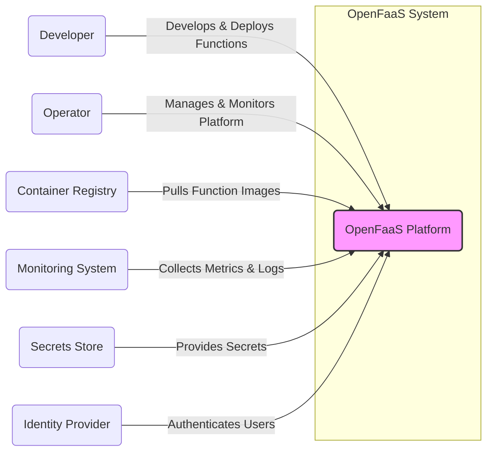
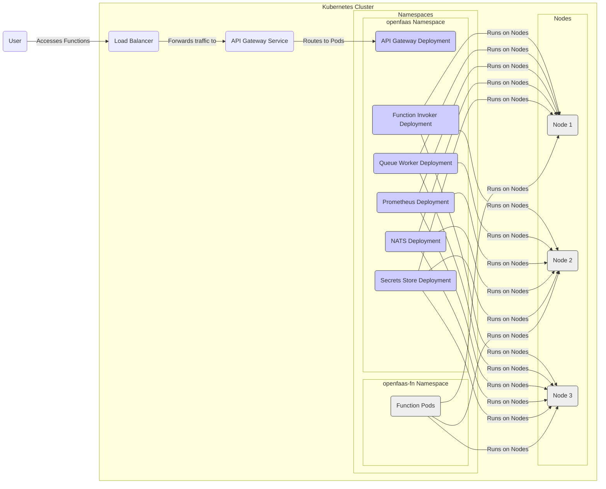
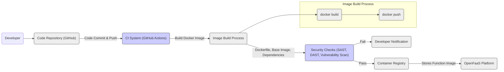

# BUSINESS POSTURE

- Business Priorities and Goals:
  - Primary goal is to provide a serverless functions platform that simplifies the deployment and management of event-driven applications.
  - Focus on developer productivity by offering a simple and intuitive user experience for function creation, deployment, and invocation.
  - Aim for portability and infrastructure independence, allowing users to run serverless functions on various environments, including on-premises, public clouds, and edge devices.
  - Emphasize operational simplicity by automating infrastructure management tasks and providing tools for monitoring and scaling functions.
- Business Risks:
  - Security vulnerabilities in the platform itself could lead to unauthorized access, data breaches, or service disruptions.
  - Misconfiguration of the platform or deployed functions by users can introduce security weaknesses.
  - Dependence on underlying infrastructure (e.g., Kubernetes, Docker) and potential vulnerabilities within those components.
  - Supply chain risks associated with dependencies and base images used in function containers.
  - Operational complexity at scale, especially in managing and securing a large number of functions and users.

# SECURITY POSTURE

- Existing Security Controls:
  - security control HTTPS is enforced for API access to the OpenFaaS gateway. (Implemented in API Gateway component)
  - security control Authentication is required for accessing the OpenFaaS gateway and deploying/invoking functions. (Implemented in API Gateway component, configurable with different providers)
  - security control Authorization is implemented using Role-Based Access Control (RBAC) to manage permissions for users and functions. (Implemented in API Gateway and Function Invoker components)
  - security control Secrets management is provided through a dedicated secrets store, allowing secure storage and access to sensitive information for functions. (Implemented using Kubernetes Secrets or external secrets providers)
  - security control Network policies can be configured to restrict network access between components and functions. (Implemented at Kubernetes network level)
- Accepted Risks:
  - accepted risk Potential vulnerabilities in underlying container runtime (Docker, containerd) and operating system of nodes.
  - accepted risk Misconfiguration of network policies or RBAC rules by operators.
  - accepted risk Vulnerabilities in user-provided function code and dependencies.
  - accepted risk Reliance on third-party components and potential vulnerabilities within them.
- Recommended Security Controls:
  - security control Implement vulnerability scanning for function containers and base images during the build process.
  - security control Conduct regular penetration testing and security audits of the OpenFaaS platform and deployed functions.
  - security control Enhance input validation mechanisms within the function invoker to prevent injection attacks.
  - security control Implement security linters and static analysis tools in the function development and deployment pipeline.
  - security control Provide security guidelines and best practices for function developers to promote secure coding practices.
- Security Requirements:
  - Authentication:
    - Requirement: Securely authenticate users and services accessing the OpenFaaS platform.
    - Requirement: Support multiple authentication methods (e.g., API keys, OAuth 2.0, OpenID Connect).
    - Requirement: Implement strong password policies and multi-factor authentication where applicable.
  - Authorization:
    - Requirement: Enforce fine-grained authorization to control access to functions, deployments, and platform resources.
    - Requirement: Implement RBAC to manage permissions based on roles and responsibilities.
    - Requirement: Ensure least privilege access for all users and services.
  - Input Validation:
    - Requirement: Validate all inputs to functions and the OpenFaaS API to prevent injection attacks (e.g., SQL injection, command injection, cross-site scripting).
    - Requirement: Sanitize and encode outputs to prevent output-based vulnerabilities.
    - Requirement: Implement input validation at multiple layers (e.g., API gateway, function invoker, function code).
  - Cryptography:
    - Requirement: Use HTTPS for all communication channels to ensure data confidentiality and integrity in transit.
    - Requirement: Encrypt sensitive data at rest, such as secrets and function code (if applicable).
    - Requirement: Utilize strong cryptographic algorithms and protocols.
    - Requirement: Securely manage cryptographic keys and certificates.

# DESIGN

## C4 CONTEXT



- Context Diagram Elements:
  - Element:
    - Name: OpenFaaS Platform
    - Type: Software System
    - Description: The core OpenFaaS platform responsible for deploying, managing, and executing serverless functions. It provides an API for users and integrates with various external systems.
    - Responsibilities: Function deployment, function invocation, function scaling, API gateway, management UI, metrics collection, secrets management.
    - Security controls: Authentication, authorization, input validation at API gateway, secrets management, network policies.
  - Element:
    - Name: Developer
    - Type: User
    - Description: Software developers who create, package, and deploy serverless functions using the OpenFaaS platform.
    - Responsibilities: Writing function code, creating Dockerfiles, deploying functions, testing functions.
    - Security controls: Secure coding practices, vulnerability scanning of function dependencies, secure storage of function code.
  - Element:
    - Name: Operator
    - Type: User
    - Description: System administrators or operations engineers who manage and maintain the OpenFaaS platform infrastructure.
    - Responsibilities: Platform installation, configuration, monitoring, scaling, security patching, user management.
    - Security controls: Secure platform configuration, access control to infrastructure, monitoring and logging, incident response.
  - Element:
    - Name: Container Registry
    - Type: External System
    - Description: Stores Docker images for functions. OpenFaaS pulls function images from the container registry during deployment.
    - Responsibilities: Storing and serving container images, image vulnerability scanning (optional).
    - Security controls: Access control to container images, image signing and verification, vulnerability scanning of images.
  - Element:
    - Name: Monitoring System
    - Type: External System
    - Description: Collects metrics and logs from the OpenFaaS platform and functions for monitoring and alerting. Examples include Prometheus, Grafana, ELK stack.
    - Responsibilities: Metrics collection, log aggregation, alerting, dashboarding.
    - Security controls: Secure access to monitoring data, data retention policies, audit logging of access.
  - Element:
    - Name: Secrets Store
    - Type: External System
    - Description: Securely stores secrets used by functions and the OpenFaaS platform. Examples include Kubernetes Secrets, HashiCorp Vault, cloud provider secrets managers.
    - Responsibilities: Secure storage of secrets, access control to secrets, secrets rotation.
    - Security controls: Encryption at rest, access control, audit logging, secrets rotation.
  - Element:
    - Name: Identity Provider
    - Type: External System
    - Description: Provides user authentication services for the OpenFaaS platform. Examples include LDAP, Active Directory, OAuth 2.0 providers.
    - Responsibilities: User authentication, user management (optional).
    - Security controls: Secure authentication protocols, multi-factor authentication, access control policies.

## C4 CONTAINER

```mermaid
flowchart LR
    subgraph "OpenFaaS Platform"
        APIGateway("API Gateway")
        FunctionInvoker("Function Invoker")
        QueueWorker("Queue Worker")
        Watchdog("Watchdog")
        Prometheus("Prometheus")
        MessageQueue("Message Queue (NATS)")
        SecretsStoreContainer("Secrets Store")
    end
    ContainerRegistry("Container Registry") -- "Pulls Function Images" --> FunctionInvoker
    MonitoringSystem("Monitoring System") -- "Collects Metrics" --> Prometheus
    IdentityProvider("Identity Provider") -- "Authenticates Users" --> APIGateway
    UserDev("Developer") -- "Deploys Functions" --> APIGateway
    UserDev -- "Invokes Functions (Sync)" --> APIGateway
    UserDev -- "Invokes Functions (Async)" --> APIGateway
    APIGateway -- "Routes Requests & Authenticates" --> FunctionInvoker
    APIGateway -- "Enqueues Async Requests" --> MessageQueue
    FunctionInvoker -- "Pulls Function Image" --> ContainerRegistry
    FunctionInvoker -- "Executes Function" --> Watchdog
    QueueWorker -- "Dequeues & Invokes Functions" --> FunctionInvoker
    Watchdog -- "Provides Function Runtime" --> Function Container
    FunctionContainer("Function Container") -- "Executes Function Code" --> FunctionInvoker
    FunctionInvoker -- "Retrieves Secrets" --> SecretsStoreContainer
    Prometheus -- "Scrapes Metrics" --> Watchdog

    style APIGateway fill:#ccf,stroke:#333,stroke-width:1px
    style FunctionInvoker fill:#ccf,stroke:#333,stroke-width:1px
    style QueueWorker fill:#ccf,stroke:#333,stroke-width:1px
    style Watchdog fill:#ccf,stroke:#333,stroke-width:1px
    style Prometheus fill:#ccf,stroke:#333,stroke-width:1px
    style MessageQueue fill:#ccf,stroke:#333,stroke-width:1px
    style SecretsStoreContainer fill:#ccf,stroke:#333,stroke-width:1px
    style FunctionContainer fill:#eee,stroke:#333,stroke-width:1px
```

- Container Diagram Elements:
  - Element:
    - Name: API Gateway
    - Type: Container
    - Description: The entry point for all external requests to the OpenFaaS platform. It handles routing, authentication, authorization, and request forwarding to the Function Invoker or Queue Worker.
    - Responsibilities: API routing, authentication, authorization, input validation, rate limiting, request logging.
    - Security controls: HTTPS termination, authentication and authorization mechanisms, input validation, rate limiting, web application firewall (WAF) integration (optional).
  - Element:
    - Name: Function Invoker
    - Type: Container
    - Description: Responsible for executing functions synchronously. It pulls function images from the container registry, creates function containers, and manages function runtime.
    - Responsibilities: Function container creation, function execution, resource management, watchdog interaction, secrets retrieval.
    - Security controls: Container runtime security, resource limits, network policies, secure secrets retrieval, input validation passed from API Gateway.
  - Element:
    - Name: Queue Worker
    - Type: Container
    - Description: Handles asynchronous function invocations. It dequeues messages from the message queue and invokes functions through the Function Invoker.
    - Responsibilities: Message queue processing, function invocation, error handling, retry mechanisms.
    - Security controls: Secure communication with message queue, input validation from message queue messages, error handling and logging.
  - Element:
    - Name: Watchdog
    - Type: Container
    - Description: A lightweight HTTP server that acts as a proxy between the Function Invoker and the function container. It handles health checks, request forwarding, and metrics collection for functions.
    - Responsibilities: HTTP request handling, process management, health checks, metrics exposure.
    - Security controls: Minimal attack surface, process isolation, resource limits.
  - Element:
    - Name: Prometheus
    - Type: Container
    - Description: Collects and stores metrics from OpenFaaS components and functions for monitoring and alerting.
    - Responsibilities: Metrics scraping, metrics storage, metrics querying.
    - Security controls: Access control to metrics data, secure configuration, data retention policies.
  - Element:
    - Name: Message Queue (NATS)
    - Type: Container
    - Description: A message broker used for asynchronous function invocations. NATS is the default, but other message queues can be integrated.
    - Responsibilities: Message queuing, message delivery, message persistence (optional).
    - Security controls: Access control to message queue, message encryption in transit (TLS), message persistence security.
  - Element:
    - Name: Secrets Store
    - Type: Container
    - Description: Provides access to secrets for OpenFaaS components and functions. It can be Kubernetes Secrets or an external secrets management system.
    - Responsibilities: Secrets storage, secrets retrieval, access control to secrets.
    - Security controls: Encryption at rest, access control, audit logging, secrets rotation.
  - Element:
    - Name: Function Container
    - Type: Container
    - Description: A container that runs the user-provided function code. It interacts with the Watchdog to receive requests and send responses.
    - Responsibilities: Function code execution, request processing, response generation.
    - Security controls: Secure coding practices, minimal base image, vulnerability scanning of dependencies, resource limits, input validation within function code.

## DEPLOYMENT

- Deployment Options:
  - Kubernetes: The most common and recommended deployment platform for OpenFaaS, providing scalability, resilience, and rich features.
  - Docker Swarm: A simpler container orchestration platform, suitable for smaller deployments or environments where Kubernetes is not desired.
  - Bare Metal/VMs: OpenFaaS components can be deployed directly on virtual machines or bare metal servers, offering more control over the infrastructure.

- Detailed Deployment (Kubernetes):



- Deployment Diagram Elements (Kubernetes):
  - Element:
    - Name: Kubernetes Cluster
    - Type: Infrastructure
    - Description: The underlying Kubernetes cluster that hosts the OpenFaaS platform and functions. Provides container orchestration, scalability, and resilience.
    - Responsibilities: Container orchestration, resource management, networking, storage, security.
    - Security controls: Kubernetes RBAC, network policies, pod security policies/admission controllers, security updates, cluster hardening.
  - Element:
    - Name: Nodes
    - Type: Infrastructure
    - Description: Worker nodes in the Kubernetes cluster where containers are deployed and executed.
    - Responsibilities: Running containers, providing compute resources, network connectivity.
    - Security controls: Operating system hardening, security updates, node isolation, container runtime security.
  - Element:
    - Name: Namespaces (openfaas, openfaas-fn)
    - Type: Kubernetes Resource
    - Description: Kubernetes namespaces used to logically isolate OpenFaaS components and function workloads. `openfaas` namespace for platform components, `openfaas-fn` for function containers.
    - Responsibilities: Resource isolation, access control, network segmentation.
    - Security controls: Kubernetes RBAC, network policies, resource quotas.
  - Element:
    - Name: Deployments (API Gateway, Function Invoker, etc.)
    - Type: Kubernetes Resource
    - Description: Kubernetes Deployments used to manage and scale OpenFaaS components. Ensure desired number of replicas and rolling updates.
    - Responsibilities: Application deployment, scaling, rolling updates, health checks.
    - Security controls: Pod security context, resource limits, security configurations in deployment manifests.
  - Element:
    - Name: Services (API Gateway Service)
    - Type: Kubernetes Resource
    - Description: Kubernetes Services used to expose OpenFaaS components within the cluster and externally (e.g., API Gateway Service exposed via Load Balancer).
    - Responsibilities: Service discovery, load balancing within the cluster, external access.
    - Security controls: Service type configuration (e.g., LoadBalancer, ClusterIP), network policies.
  - Element:
    - Name: Function Pods
    - Type: Kubernetes Resource
    - Description: Kubernetes Pods that run function containers. Managed by Function Invoker and deployed in `openfaas-fn` namespace.
    - Responsibilities: Function execution, resource isolation, network connectivity within the cluster.
    - Security controls: Pod security context, resource limits, network policies, secure secrets injection.
  - Element:
    - Name: Load Balancer
    - Type: Infrastructure
    - Description: External load balancer that distributes traffic to the API Gateway Service, making OpenFaaS accessible from outside the Kubernetes cluster.
    - Responsibilities: External traffic routing, load balancing, TLS termination (optional).
    - Security controls: HTTPS configuration, access control lists (ACLs), DDoS protection.

## BUILD



- Build Process Description:
  - Developer writes function code and creates a Dockerfile.
  - Code is committed and pushed to a code repository (e.g., GitHub).
  - CI/CD system (e.g., GitHub Actions) is triggered by code changes.
  - CI system builds a Docker image using the provided Dockerfile. This involves:
    - Pulling base image.
    - Copying function code and dependencies.
    - Running build commands defined in Dockerfile.
  - Security checks are performed on the Docker image:
    - Static Application Security Testing (SAST) to analyze code for vulnerabilities.
    - Dependency vulnerability scanning to identify vulnerable libraries.
    - Dockerfile linting to ensure best practices.
  - If security checks pass, the Docker image is pushed to the Container Registry.
  - If security checks fail, developers are notified, and the build process is stopped.
  - OpenFaaS platform pulls function images from the Container Registry during deployment.
- Build Process Security Controls:
  - security control Code Repository Security: Access control to code repository, branch protection, code review process.
  - security control CI/CD Pipeline Security: Secure CI/CD configuration, access control to CI/CD system, audit logging.
  - security control Base Image Security: Use minimal and trusted base images, regularly update base images, vulnerability scanning of base images.
  - security control Dependency Management: Use dependency management tools, vulnerability scanning of dependencies, dependency pinning.
  - security control Static Application Security Testing (SAST): Integrate SAST tools into the build pipeline to detect code vulnerabilities.
  - security control Dockerfile Linting: Use Dockerfile linters to enforce best practices and security guidelines.
  - security control Container Image Scanning: Integrate container image vulnerability scanners to identify vulnerabilities in the final image.
  - security control Image Signing and Verification: Sign Docker images to ensure integrity and authenticity, verify image signatures during deployment.
  - security control Access Control to Container Registry: Restrict access to the container registry, enforce authentication and authorization.

# RISK ASSESSMENT

- Critical Business Processes:
  - Function Execution: Ensuring functions are executed reliably, securely, and with expected performance is critical for applications relying on OpenFaaS.
  - Function Deployment: Secure and reliable function deployment process is essential for developers to update and manage their applications.
  - Platform Management: Maintaining the availability, security, and performance of the OpenFaaS platform itself is crucial for all dependent functions.
- Data Sensitivity:
  - Function Code: May contain sensitive business logic, API keys, or intellectual property. Sensitivity level depends on the function's purpose.
  - Environment Variables (Secrets): Often contain highly sensitive information like API keys, database credentials, and encryption keys. High sensitivity.
  - Logs: Can contain sensitive data depending on function logging practices and application behavior. Sensitivity level varies.
  - Metrics: Generally less sensitive, but can reveal performance characteristics and usage patterns. Low to medium sensitivity.

# QUESTIONS & ASSUMPTIONS

- Questions:
  - What is the primary use case for OpenFaaS in the target environment? (e.g., internal microservices, public-facing APIs, event processing)
  - What is the expected scale of the OpenFaaS deployment? (number of functions, request volume, users)
  - What are the compliance requirements for the target environment? (e.g., GDPR, HIPAA, PCI DSS)
  - What existing security infrastructure and tools are available in the target environment? (e.g., WAF, SIEM, vulnerability scanners)
  - What is the organization's risk appetite and security maturity level?
- Assumptions:
  - Deployment environment is Kubernetes.
  - Focus is on securing web-based functions and APIs.
  - Standard security best practices are desired and applicable.
  - Users are developers and operators with varying levels of security awareness.
  - Container registry is a private registry within the organization's control.
  - Secrets management is handled using Kubernetes Secrets or a similar secure secrets store.