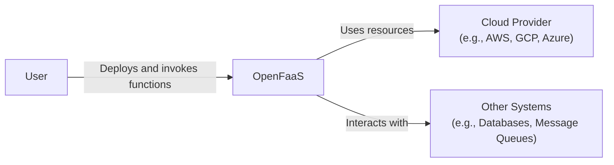
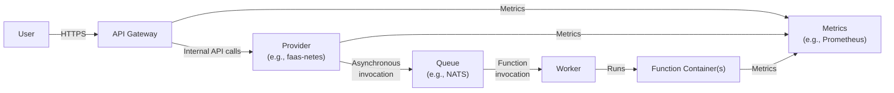
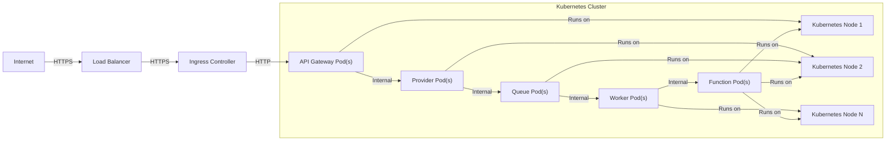
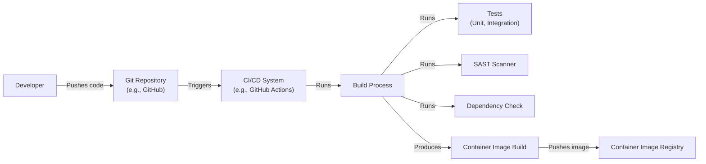

# BUSINESS POSTURE

Business Priorities and Goals:

*   Provide a platform for developers to easily deploy and manage serverless functions.
*   Enable rapid development and deployment of applications without managing servers.
*   Offer a cost-effective solution for running event-driven workloads.
*   Support a wide range of programming languages and frameworks.
*   Ensure scalability and high availability of deployed functions.
*   Foster an active open-source community and ecosystem.
*   Provide portability across different cloud providers and on-premises environments.

Most Important Business Risks:

*   Service disruption or downtime impacting customer applications.
*   Security breaches leading to unauthorized access to customer data or functions.
*   Performance bottlenecks affecting the responsiveness of deployed functions.
*   Lack of scalability to handle peak loads or growing user demand.
*   Incompatibility with specific programming languages or frameworks limiting adoption.
*   Complexity in managing and monitoring deployed functions.
*   Vendor lock-in to a specific cloud provider or infrastructure.

# SECURITY POSTURE

Existing Security Controls:

*   security control: Role-Based Access Control (RBAC) for managing user permissions within the OpenFaaS platform (described in OpenFaaS documentation and Kubernetes RBAC).
*   security control: Network policies to control traffic flow between functions and other services (implemented using Kubernetes Network Policies).
*   security control: Support for HTTPS/TLS encryption for secure communication (implemented in Gateway and function invocations).
*   security control: Secret management for storing sensitive information like API keys and passwords (implemented using Kubernetes Secrets).
*   security control: Authentication mechanisms for securing access to the OpenFaaS gateway and functions (implemented in Gateway and can be extended with plugins).
*   security control: Image signing and verification to ensure the integrity of function deployments (can be implemented using tools like Notary or Cosign).
*   security control: Regular security audits and penetration testing of the OpenFaaS platform (responsibility of the OpenFaaS maintainers and community).

Accepted Risks:

*   accepted risk: Reliance on the underlying container runtime (e.g., Docker, containerd) for security isolation.
*   accepted risk: Potential for vulnerabilities in third-party dependencies used by OpenFaaS or deployed functions.
*   accepted risk: Limited built-in protection against denial-of-service (DoS) attacks.
*   accepted risk: The need for users to properly configure security settings and follow best practices.

Recommended Security Controls:

*   Implement a Web Application Firewall (WAF) to protect against common web attacks.
*   Integrate with a vulnerability scanning tool to automatically identify security issues in function code and dependencies.
*   Implement rate limiting and throttling to mitigate DoS attacks.
*   Provide detailed security documentation and guidelines for users.
*   Establish a security response process for handling reported vulnerabilities.

Security Requirements:

*   Authentication:
    *   The system must authenticate users and services accessing the OpenFaaS gateway and functions.
    *   Support for multiple authentication methods (e.g., OAuth 2.0, OpenID Connect, API keys).
    *   Enforce strong password policies and multi-factor authentication (MFA) where applicable.
*   Authorization:
    *   The system must implement fine-grained access control based on roles and permissions.
    *   Restrict access to functions and resources based on the principle of least privilege.
    *   Audit all access attempts and authorization decisions.
*   Input Validation:
    *   All input to functions and the OpenFaaS API must be validated to prevent injection attacks.
    *   Use a whitelist approach to define allowed input patterns.
    *   Sanitize input to remove or encode potentially harmful characters.
*   Cryptography:
    *   Use strong encryption algorithms and protocols (e.g., TLS 1.3) for all communication.
    *   Protect sensitive data at rest using encryption.
    *   Securely manage cryptographic keys and certificates.

# DESIGN

## C4 CONTEXT

Element Descriptions:

*   Element:
    *   Name: User
    *   Type: Person
    *   Description: A developer or operator who interacts with OpenFaaS to deploy, manage, and invoke functions.
    *   Responsibilities: Deploying functions, configuring settings, monitoring performance, invoking functions.
    *   Security controls: Authentication, Authorization (RBAC).

*   Element:
    *   Name: OpenFaaS
    *   Type: Software System
    *   Description: The serverless platform that manages the lifecycle of functions.
    *   Responsibilities: Receiving function deployment requests, scheduling function execution, scaling functions, providing API access.
    *   Security controls: Authentication, Authorization (RBAC), Input Validation, Network Policies, Secret Management.

*   Element:
    *   Name: Cloud Provider
    *   Type: External System
    *   Description: The underlying infrastructure provider where OpenFaaS is deployed (e.g., AWS, GCP, Azure, or on-premises).
    *   Responsibilities: Providing compute, storage, and networking resources.
    *   Security controls: Infrastructure-level security controls provided by the cloud provider.

*   Element:
    *   Name: Other Systems
    *   Type: External System
    *   Description: External systems that functions may interact with, such as databases, message queues, or other APIs.
    *   Responsibilities: Providing specific services to functions.
    *   Security controls: Dependent on the specific external system.

## C4 CONTAINER

Element Descriptions:

*   Element:
    *   Name: User
    *   Type: Person
    *   Description: A developer or operator who interacts with OpenFaaS.
    *   Responsibilities: Deploying functions, configuring settings, monitoring performance, invoking functions.
    *   Security controls: Authentication, Authorization (RBAC).

*   Element:
    *   Name: API Gateway
    *   Type: Container (API)
    *   Description: The entry point for all API requests to OpenFaaS.
    *   Responsibilities: Routing requests, authentication, authorization, rate limiting.
    *   Security controls: Authentication, Authorization (RBAC), TLS encryption, Input Validation, Rate Limiting (recommended).

*   Element:
    *   Name: Provider
    *   Type: Container
    *   Description: The component that interacts with the underlying container orchestration platform (e.g., Kubernetes).
    *   Responsibilities: Managing function deployments, scaling, networking.
    *   Security controls: RBAC, Network Policies.

*   Element:
    *   Name: Queue
    *   Type: Container
    *   Description: A message queue used for asynchronous function invocations.
    *   Responsibilities: Storing function invocation requests, delivering requests to workers.
    *   Security controls: Authentication, Authorization, Encryption (if supported by the queue implementation).

*   Element:
    *   Name: Worker
    *   Type: Container
    *   Description: A component that pulls function invocation requests from the queue and executes the corresponding function.
    *   Responsibilities: Fetching requests, executing functions, reporting results.
    *   Security controls: Authentication, Authorization.

*   Element:
    *   Name: Function Container(s)
    *   Type: Container
    *   Description: The container(s) that run the user's function code.
    *   Responsibilities: Executing the function logic.
    *   Security controls: Container image security (signing, vulnerability scanning), Resource limits.

*   Element:
    *   Name: Metrics
    *   Type: Container
    *   Description: System for collecting and exposing metrics.
    *   Responsibilities: Collect metrics from all components.
    *   Security controls: Authentication, Authorization.

## DEPLOYMENT

Possible Deployment Solutions:

1.  Kubernetes (most common)
2.  Docker Swarm
3.  HashiCorp Nomad
4.  Manual deployment (less common, for specific use cases)

Chosen Solution: Kubernetes

Element Descriptions:

*   Element:
    *   Name: Internet
    *   Type: External
    *   Description: The public internet.
    *   Responsibilities: Source of external traffic.
    *   Security controls: External network security.

*   Element:
    *   Name: Load Balancer
    *   Type: Infrastructure
    *   Description: Distributes incoming traffic across multiple instances of the Ingress Controller.
    *   Responsibilities: Load balancing, TLS termination (optional).
    *   Security controls: TLS configuration, DDoS protection (if provided by the cloud provider).

*   Element:
    *   Name: Ingress Controller
    *   Type: Kubernetes Resource
    *   Description: Manages external access to services within the Kubernetes cluster.
    *   Responsibilities: Routing traffic to the API Gateway, TLS termination.
    *   Security controls: TLS configuration, Access control rules.

*   Element:
    *   Name: API Gateway Pod(s)
    *   Type: Kubernetes Pod
    *   Description: Instance(s) of the API Gateway container.
    *   Responsibilities: Handling API requests, authentication, authorization.
    *   Security controls: Authentication, Authorization (RBAC), Input Validation, Rate Limiting (recommended).

*   Element:
    *   Name: Provider Pod(s)
    *   Type: Kubernetes Pod
    *   Description: Instance(s) of the Provider container.
    *   Responsibilities: Managing function deployments, scaling.
    *   Security controls: RBAC, Network Policies.

*   Element:
    *   Name: Queue Pod(s)
    *   Type: Kubernetes Pod
    *   Description: Instance(s) of the message queue container.
    *   Responsibilities: Storing and delivering function invocation requests.
    *   Security controls: Authentication, Authorization, Encryption (if supported by the queue implementation).

*   Element:
    *   Name: Worker Pod(s)
    *   Type: Kubernetes Pod
    *   Description: Instance(s) of the Worker container.
    *   Responsibilities: Executing functions.
    *   Security controls: Authentication, Authorization.

*   Element:
    *   Name: Function Pod(s)
    *   Type: Kubernetes Pod
    *   Description: Instance(s) of the user's function container.
    *   Responsibilities: Executing the function logic.
    *   Security controls: Container image security (signing, vulnerability scanning), Resource limits.

*   Element:
    *   Name: Kubernetes Node 1, 2, N
    *   Type: Infrastructure
    *   Description: Physical or virtual machines that run the Kubernetes pods.
    *   Responsibilities: Providing compute resources.
    *   Security controls: Node-level security configuration, OS hardening.

## BUILD

Build Process Description:

1.  Developer pushes code changes to a Git repository (e.g., GitHub, GitLab).
2.  The code push triggers a CI/CD pipeline (e.g., GitHub Actions, Jenkins, CircleCI).
3.  The CI/CD pipeline executes a build process.
4.  The build process includes:
    *   Running unit and integration tests.
    *   Performing static analysis security testing (SAST) using a tool like SonarQube or Semgrep.
    *   Checking for vulnerable dependencies using a tool like OWASP Dependency-Check or Snyk.
    *   Building a container image for the function.
5.  If all checks pass, the container image is pushed to a container image registry (e.g., Docker Hub, Amazon ECR, Google Container Registry).
6.  Security controls:
    *   security control: SAST scanning to identify code vulnerabilities.
    *   security control: Dependency checking to identify vulnerable libraries.
    *   security control: Container image signing (recommended) to ensure image integrity.
    *   security control: Automated build process to ensure consistency and repeatability.
    *   security control: Access control to the CI/CD system and image registry.

# RISK ASSESSMENT

Critical Business Processes:

*   Function deployment and execution.
*   API access to functions.
*   Scalability and availability of the platform.

Data Sensitivity:

*   Function code: Potentially sensitive intellectual property. Sensitivity: Medium to High.
*   Function input/output data: May contain user data, PII, or other sensitive information. Sensitivity: Variable, depending on the specific function and its use case.
*   Configuration data (secrets, API keys): Highly sensitive. Sensitivity: High.
*   Metrics and logs: May contain information about system behavior and user activity. Sensitivity: Low to Medium.

# QUESTIONS & ASSUMPTIONS

Questions:

*   What specific cloud provider(s) will OpenFaaS be deployed on?
*   What are the expected traffic patterns and load requirements?
*   What are the specific security compliance requirements (e.g., GDPR, HIPAA)?
*   What are the existing monitoring and logging infrastructure?
*   Are there any existing security tools or services that should be integrated with?
*   What level of access will developers have to the underlying infrastructure?
*   What is the process for managing and updating OpenFaaS and its components?

Assumptions:

*   BUSINESS POSTURE: The primary goal is to provide a reliable and scalable serverless platform. Cost optimization is a secondary concern.
*   SECURITY POSTURE: A moderate level of security is required, balancing ease of use with protection against common threats.
*   DESIGN: Kubernetes will be used as the primary deployment platform. The default OpenFaaS components (API Gateway, Provider, Queue, Worker) will be used. A standard CI/CD pipeline will be used for building and deploying functions.