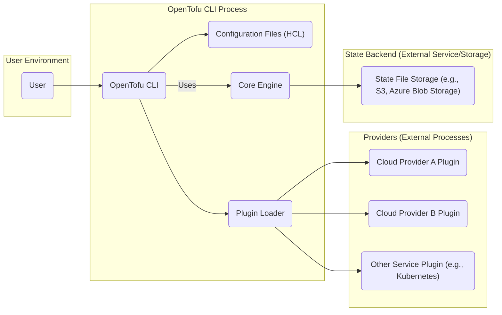
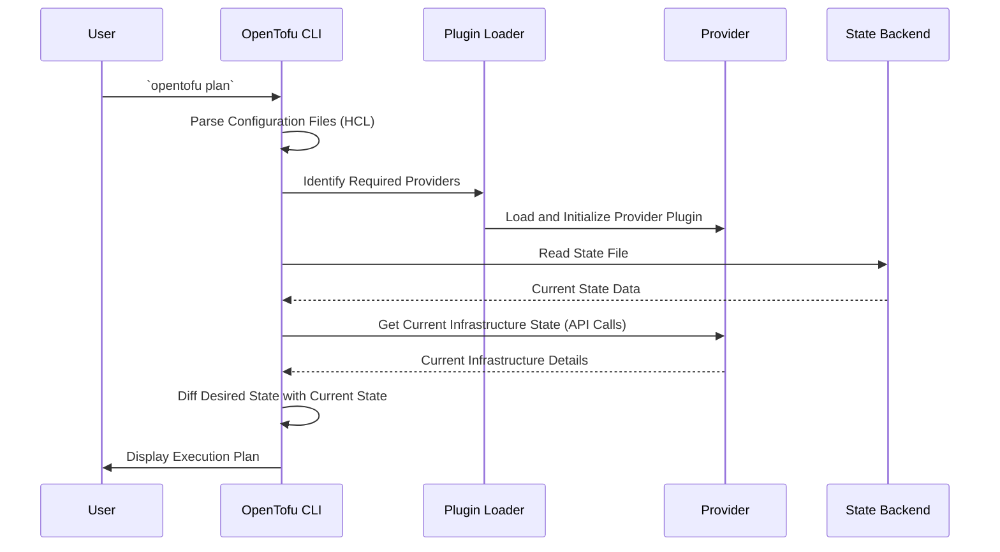
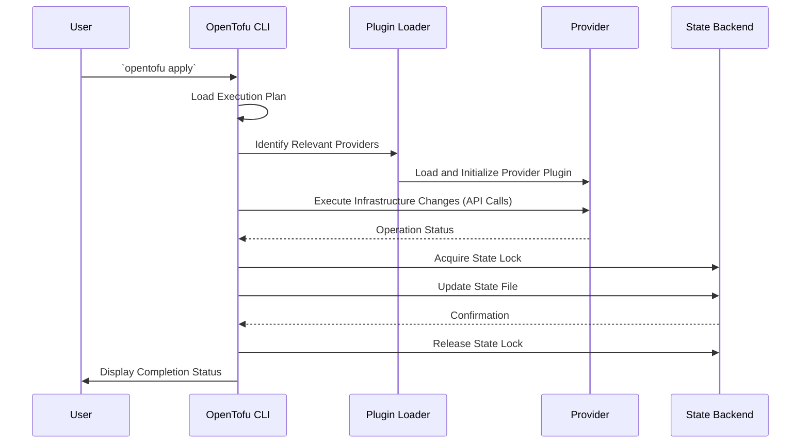

# OpenTofu Project Design Document

**Version:** 1.1
**Date:** October 26, 2023
**Author:** AI Architecture Expert

## 1. Introduction

This document provides a detailed architectural overview of the OpenTofu project, an open-source infrastructure-as-code tool. OpenTofu enables users to define and provision infrastructure using declarative configuration files. This document aims to offer a comprehensive understanding of the system's components, data flows, and key functionalities, serving as a foundation for subsequent threat modeling activities and broader understanding of the project.

## 2. Goals and Objectives

The primary goals of OpenTofu are:

*   To provide a community-driven, truly open-source alternative to Terraform.
*   To empower users to efficiently manage infrastructure across diverse cloud providers and services.
*   To maintain a high degree of compatibility with existing Terraform configurations and providers, minimizing migration friction.
*   To offer a robust, reliable, and extensible platform for infrastructure automation.

## 3. Target Audience

This document is intended for:

*   Security engineers and architects responsible for threat modeling and security assessments.
*   Software developers contributing to the OpenTofu project's codebase.
*   Operations teams involved in deploying, managing, and maintaining OpenTofu instances.
*   Technical stakeholders seeking a deep understanding of OpenTofu's internal architecture and workings.

## 4. Scope

This document comprehensively covers the core architectural components and functionalities of the OpenTofu CLI, including its interaction with providers, state backends, and configuration files. The focus is on aspects directly relevant to security considerations, potential threat vectors, and the overall system design.

## 5. High-Level Architecture

OpenTofu functions as a command-line tool that orchestrates infrastructure management by interacting with various components. The following diagram illustrates the high-level architecture:

**Components:**

*   **User:** The individual or automated system initiating OpenTofu commands.
*   **OpenTofu CLI:** The primary executable responsible for parsing configurations, managing plugins, interacting with state, and orchestrating infrastructure changes.
*   **Configuration Files (HCL):** Human-readable files written in HashiCorp Configuration Language (HCL) that declaratively define the desired infrastructure state.
*   **Plugin Loader:** The component within the OpenTofu CLI responsible for discovering, loading, and managing provider plugins.
*   **Core Engine:** The central part of the OpenTofu CLI that handles the planning and application logic, state management, and interaction with providers.
*   **Providers:** External plugins (typically separate processes) that implement the specific logic for interacting with infrastructure providers or services.
*   **State Backend:** An external service or storage mechanism responsible for persistently storing the OpenTofu state file.

## 6. Component Details

### 6.1. OpenTofu CLI

*   **Functionality:**
    *   **Configuration Parsing:** Reads and interprets HCL configuration files, building an internal representation of the desired infrastructure.
    *   **Plugin Management:** Discovers, loads, initializes, and manages the lifecycle of provider plugins.
    *   **State Management:** Interacts with the configured state backend to read the current state, update the state after applying changes, and manage state locking.
    *   **Planning:** Compares the desired state (from configuration) with the current state (from the state backend) and generates an execution plan outlining the necessary changes.
    *   **Applying:** Executes the generated plan by invoking the appropriate provider functions to create, update, or delete infrastructure resources.
    *   **User Interface:** Provides a command-line interface for users to interact with OpenTofu.
*   **Key Processes:**
    *   **Initialization (`opentofu init`):**
        *   Reads the configuration to determine required providers.
        *   Downloads and installs the necessary provider plugins.
        *   Initializes the configured state backend.
    *   **Planning (`opentofu plan`):**
        *   Loads the current state from the state backend.
        *   Invokes provider functions to read the current state of managed resources.
        *   Performs a diff between the desired and current states.
        *   Generates an execution plan.
    *   **Applying (`opentofu apply`):**
        *   Loads the execution plan.
        *   Invokes provider functions to perform the planned infrastructure changes.
        *   Updates the state backend with the new state after successful application.
    *   **State Refresh (`opentofu refresh`):**
        *   Queries providers for the current state of managed resources.
        *   Updates the state backend to reflect the actual infrastructure state.
    *   **Destruction (`opentofu destroy`):**
        *   Generates a plan to delete all managed resources.
        *   Applies the destruction plan by invoking provider functions.
        *   Updates the state backend.

### 6.2. Configuration Files (HCL)

*   **Functionality:** Serve as the declarative definition of the desired infrastructure.
*   **Structure:** Utilize a block-based syntax to define resources, data sources, variables, and outputs.
*   **Security Considerations:**
    *   **Sensitive Data:** May inadvertently contain sensitive information such as API keys, passwords, and connection strings. Secure handling and secret management practices are crucial.
    *   **Injection Risks:** If configuration files are dynamically generated or manipulated based on untrusted input, they can be susceptible to injection vulnerabilities.

### 6.3. Plugin System

*   **Functionality:** Enables OpenTofu to interact with a wide range of infrastructure providers and services.
*   **Providers:**
    *   Implement the specific logic for interacting with the APIs of different infrastructure providers (e.g., AWS, Azure, GCP).
    *   Handle authentication and authorization with the target provider.
    *   Translate OpenTofu's resource definitions into provider-specific API calls.
*   **Discovery and Loading:** The Plugin Loader within the OpenTofu CLI is responsible for finding and loading provider plugins, typically as separate executable processes.
*   **Communication:** Communication between the OpenTofu CLI and provider plugins typically occurs over gRPC.
*   **Security Considerations:**
    *   **Credential Exposure:** Providers handle sensitive credentials for accessing infrastructure. Secure credential management within providers is paramount.
    *   **Malicious Plugins:** The risk of using compromised or malicious provider plugins that could perform unauthorized actions on infrastructure.
    *   **API Security:** The security of the APIs exposed by the infrastructure providers themselves is a critical dependency.

### 6.4. State Backend

*   **Functionality:** Provides persistent storage for the OpenTofu state file, which contains a snapshot of the managed infrastructure's configuration and metadata.
*   **Types:** Supports various backends, including:
    *   Local file storage (suitable for testing or single-user scenarios).
    *   Cloud object storage services (e.g., AWS S3, Azure Blob Storage, Google Cloud Storage).
    *   Remote backends (e.g., HashiCorp Consul, etcd).
    *   Custom backends.
*   **State Locking:** Many backends support state locking mechanisms to prevent concurrent modifications to the state file, ensuring data consistency.
*   **Security Considerations:**
    *   **Confidentiality:** The state file often contains sensitive information about the infrastructure's configuration and resources. Encryption at rest and in transit is essential.
    *   **Integrity:** Protecting the state file from unauthorized modification or corruption is crucial for maintaining the integrity of the managed infrastructure.
    *   **Availability:** Ensuring the availability and durability of the state backend is critical for the reliable operation of OpenTofu.
    *   **Access Control:** Implementing strong access control policies to restrict who can read, write, or delete the state file.

## 7. Data Flow Diagrams

### 7.1. `opentofu plan` Data Flow (Detailed)

**Description:**

1. The user initiates the `opentofu plan` command.
2. The OpenTofu CLI parses the configuration files to determine the desired infrastructure state.
3. The Plugin Loader identifies the necessary provider plugins based on the configuration.
4. The Plugin Loader loads and initializes the required provider plugins.
5. The OpenTofu CLI retrieves the current infrastructure state from the configured state backend.
6. The State Backend returns the current state data.
7. The OpenTofu CLI interacts with the relevant provider plugins, making API calls to fetch the actual state of the managed resources.
8. Providers return the current infrastructure details.
9. OpenTofu compares the desired state with the current state to generate an execution plan.
10. The execution plan, outlining the changes to be made, is displayed to the user.

### 7.2. `opentofu apply` Data Flow (Detailed)

**Description:**

1. The user initiates the `opentofu apply` command.
2. The OpenTofu CLI loads the execution plan (either from a previous `plan` command or generated internally).
3. The Plugin Loader identifies the relevant provider plugins required for the execution plan.
4. The Plugin Loader loads and initializes the necessary provider plugins.
5. The OpenTofu CLI interacts with the relevant provider plugins, making API calls to create, update, or delete infrastructure resources based on the plan.
6. Providers return the status of each operation.
7. The OpenTofu CLI attempts to acquire a lock on the state file in the state backend.
8. Upon successful execution of the plan, the OpenTofu CLI updates the state file in the state backend to reflect the changes.
9. The State Backend confirms the update.
10. The OpenTofu CLI releases the state lock.
11. The user is notified of the completion status.

## 8. Security Considerations (Expanded)

This section elaborates on potential security considerations based on the architectural overview, providing more specific examples and potential mitigation strategies:

*   **Secrets Management:**
    *   **Risk:** Hardcoding secrets in configuration files exposes them.
    *   **Mitigation:** Utilize OpenTofu's built-in secret management features (where available), integrate with dedicated secrets management tools (e.g., HashiCorp Vault, AWS Secrets Manager), or use environment variables. Avoid committing secrets to version control.
*   **State Backend Security:**
    *   **Risk:** Unauthorized access to the state backend could lead to data breaches or manipulation of infrastructure.
    *   **Mitigation:** Enforce strong authentication and authorization for accessing the state backend. Enable encryption at rest and in transit. Regularly back up the state file. Consider using a backend with built-in versioning.
*   **Provider Security:**
    *   **Risk:** Compromised provider plugins could execute malicious code or leak credentials.
    *   **Mitigation:** Only use trusted and verified provider plugins. Implement a process for verifying the integrity of provider plugins. Consider using provider signing and verification mechanisms if available.
*   **Supply Chain Security:**
    *   **Risk:** Vulnerabilities in dependencies of OpenTofu or its providers could be exploited.
    *   **Mitigation:** Regularly audit and update dependencies. Utilize software composition analysis tools to identify potential vulnerabilities.
*   **Authentication and Authorization:**
    *   **Risk:** Unauthorized users could execute OpenTofu commands or access the underlying infrastructure.
    *   **Mitigation:** Implement strong authentication for accessing the OpenTofu CLI (e.g., using SSO or MFA). Utilize role-based access control (RBAC) to restrict permissions.
*   **Configuration File Security:**
    *   **Risk:** Unauthorized access or modification of configuration files could lead to unintended infrastructure changes.
    *   **Mitigation:** Store configuration files in secure repositories with appropriate access controls. Utilize version control to track changes and enable rollback capabilities.
*   **Remote State Management:**
    *   **Risk:** Misconfigured or insecure remote state backends can expose sensitive information.
    *   **Mitigation:** Follow the security best practices for the specific remote state backend being used. Ensure proper authentication and authorization are configured.
*   **Local State Security:**
    *   **Risk:** Local state files are vulnerable if the local system is compromised.
    *   **Mitigation:** Avoid using local state in production environments. If necessary, restrict file system permissions appropriately.
*   **Audit Logging:**
    *   **Risk:** Lack of audit logs hinders security monitoring and incident response.
    *   **Mitigation:** Enable and regularly review audit logs for OpenTofu operations and interactions with the state backend and providers.
*   **Input Validation:**
    *   **Risk:** Improperly validated input in configuration files could lead to injection attacks or unexpected behavior.
    *   **Mitigation:** Follow secure coding practices when generating or manipulating configuration files programmatically.

## 9. Technologies Used

*   **Core Programming Language:** Go
*   **Configuration Language:** HashiCorp Configuration Language (HCL)
*   **Plugin Communication:** gRPC (likely)
*   **API Communication:** HTTPS for interactions with cloud provider APIs and state backends.

## 10. Deployment Considerations

*   **Execution Environment:** OpenTofu CLI can be executed on various platforms (Linux, macOS, Windows). Secure the environment where OpenTofu is executed.
*   **Automation:** OpenTofu is often integrated into CI/CD pipelines. Secure these pipelines to prevent unauthorized infrastructure changes.
*   **Remote Execution:** Consider the security implications of executing OpenTofu commands remotely. Secure remote access mechanisms.
*   **Agent Considerations:** While OpenTofu itself is agentless, some providers might require agents on the target infrastructure. Secure these agents according to best practices.

## 11. Error Handling and Logging

*   **Error Reporting:** OpenTofu provides informative error messages to the user. Ensure these messages do not inadvertently leak sensitive information.
*   **Logging:** OpenTofu generates logs that can be used for debugging and auditing. Secure the storage and access to these logs. Configure appropriate log levels.

## 12. Future Considerations

*   **Enhanced Security Features:** Explore and implement advanced security features such as policy-as-code enforcement, built-in secrets management with stronger encryption, and more granular access control mechanisms.
*   **Integration with Security Tools:** Develop integrations with security scanning tools (e.g., static analysis, vulnerability scanners) and security information and event management (SIEM) systems.
*   **Improved Provider Security Mechanisms:** Investigate and promote best practices for secure provider development and distribution, potentially including more robust signing and verification processes.
*   **Formal Security Audits:** Conduct regular independent security audits of the OpenTofu codebase and its core components.

This improved document provides a more detailed and comprehensive understanding of the OpenTofu project's architecture, enhancing its value for threat modeling and overall project comprehension.