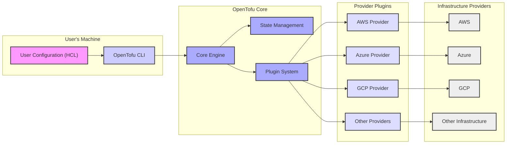
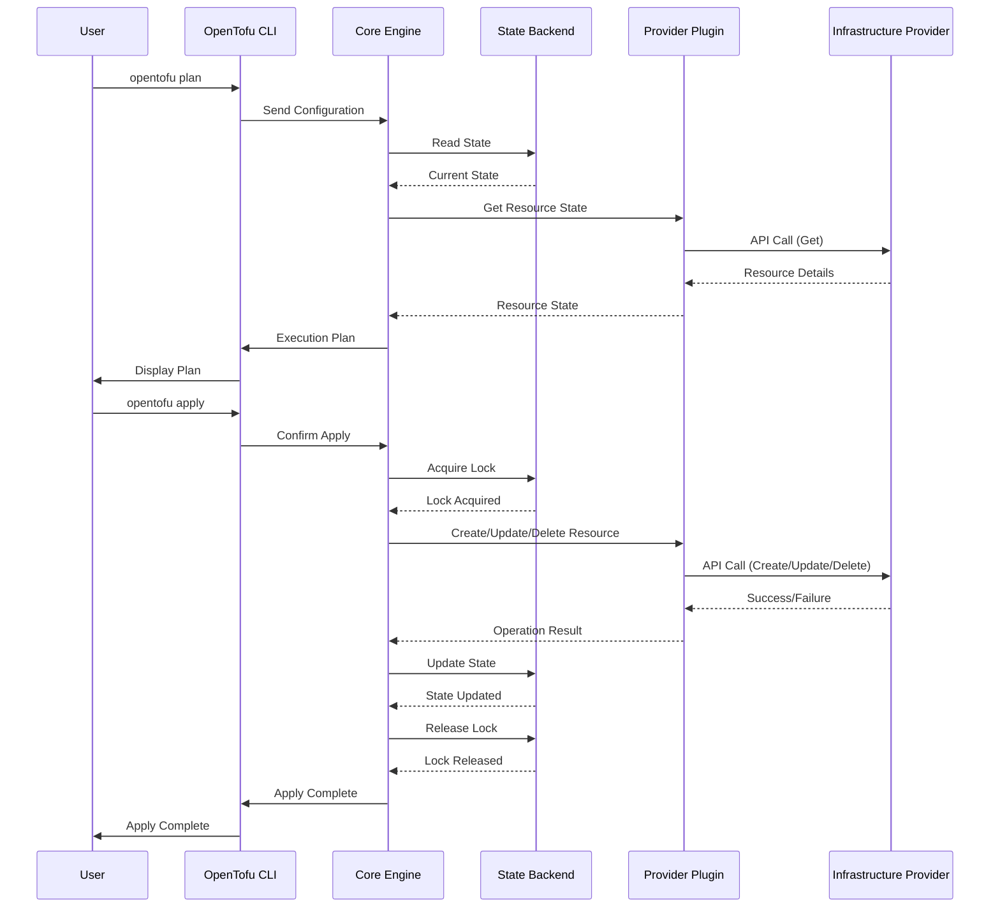

## Project Design Document: OpenTofu

**1. Introduction**

This document outlines the design of the OpenTofu project. It aims to provide a comprehensive overview of the system's architecture, components, and interactions, serving as a foundation for subsequent threat modeling activities. OpenTofu is an open-source infrastructure-as-code tool that enables users to define and provision infrastructure using a declarative configuration language. It is a fork of Terraform.

**2. Goals and Objectives**

*   Provide an open-source alternative to Terraform.
*   Maintain compatibility with existing Terraform configurations and providers.
*   Offer a community-driven platform for infrastructure management.
*   Enable users to automate infrastructure provisioning and management across various cloud providers and services.
*   Ensure secure and reliable infrastructure deployments.

**3. Target Audience**

This document is intended for:

*   Security engineers involved in threat modeling and security assessments.
*   Software architects and developers contributing to OpenTofu.
*   Operations engineers responsible for deploying and managing OpenTofu.
*   Users of OpenTofu seeking a deeper understanding of its architecture.

**4. System Architecture**

OpenTofu's architecture is centered around a core engine that interprets configuration files and interacts with provider plugins to manage infrastructure.

**5. Component Description**

*   **User Configuration (HCL):**  Human-readable configuration files written in HashiCorp Configuration Language (HCL) that define the desired infrastructure state.
*   **OpenTofu CLI:** The command-line interface used by users to interact with OpenTofu, including commands for initializing, planning, applying, and destroying infrastructure.
*   **Core Engine:** The central component responsible for parsing configuration files, managing the state, and coordinating with provider plugins.
*   **State Management:**  Manages the current state of the infrastructure. This state is crucial for understanding the differences between the desired and actual infrastructure. State is typically stored in a backend, which can be local or remote.
    *   **Local Backend:** Stores the state file on the user's local machine.
    *   **Remote Backends:**  Stores the state file in a remote storage service (e.g., AWS S3, Azure Blob Storage, Google Cloud Storage). Remote backends often provide features like state locking and versioning.
*   **Plugin System:**  A mechanism for extending OpenTofu's functionality by loading provider plugins.
*   **Provider Plugins:**  Executable binaries that implement the logic for interacting with specific infrastructure providers' APIs. Each provider plugin is responsible for understanding the provider's resources and translating OpenTofu's resource definitions into API calls.
    *   Examples: AWS Provider, Azure Provider, GCP Provider, Kubernetes Provider.
*   **Infrastructure Providers:** The underlying cloud platforms or services being managed by OpenTofu (e.g., AWS, Azure, GCP).

**6. Key Interactions and Data Flows**

1. **Initialization (`opentofu init`):**
    *   The OpenTofu CLI reads the configuration files.
    *   It downloads and initializes the necessary provider plugins based on the configuration.
    *   It configures the state backend.
2. **Planning (`opentofu plan`):**
    *   The OpenTofu CLI sends the configuration to the Core Engine.
    *   The Core Engine reads the current state from the backend.
    *   It communicates with the relevant Provider Plugins to determine the current state of the infrastructure.
    *   The Core Engine compares the desired state (from the configuration) with the current state.
    *   It generates an execution plan outlining the changes required to reach the desired state.
    *   The plan is displayed to the user.
3. **Applying (`opentofu apply`):**
    *   The OpenTofu CLI confirms the execution plan with the user.
    *   The Core Engine acquires a state lock (if using a remote backend) to prevent concurrent modifications.
    *   It iterates through the planned changes and invokes the corresponding functions in the Provider Plugins.
    *   Provider Plugins make API calls to the Infrastructure Providers to create, update, or delete resources.
    *   The Core Engine updates the state file with the changes made.
    *   The state lock is released.
4. **Destroying (`opentofu destroy`):**
    *   Similar to `apply`, but the plan involves deleting resources defined in the configuration.
    *   The Core Engine interacts with Provider Plugins to delete resources from the Infrastructure Providers.
    *   The state file is updated to reflect the removal of the resources.

**7. Security Considerations**

*   **State File Security:** The state file contains sensitive information about the infrastructure and should be protected.
    *   Encryption at rest and in transit for remote backends.
    *   Access control mechanisms for state backends.
    *   Proper handling of secrets within the state.
*   **Provider Plugin Security:** Provider plugins execute code on the user's machine and interact with infrastructure provider APIs.
    *   Verification of plugin integrity and authenticity.
    *   Secure handling of provider credentials.
    *   Sandboxing or isolation of plugin execution.
*   **Configuration Security:**  Configuration files can contain sensitive information, such as API keys and passwords.
    *   Secure storage and management of configuration files.
    *   Use of secrets management tools.
    *   Avoiding hardcoding secrets in configuration.
*   **Communication Security:** Communication between OpenTofu components (CLI, Core Engine, Plugins) should be secure.
*   **User Permissions:**  OpenTofu operates with the permissions of the user running it. Least privilege principles should be applied to user accounts.
*   **Supply Chain Security:** Ensuring the integrity and security of the OpenTofu codebase and its dependencies is crucial.
*   **Remote State Locking:** Proper implementation and enforcement of state locking mechanisms in remote backends to prevent race conditions and data corruption.

**8. Deployment Considerations**

*   OpenTofu is typically run from a developer's workstation or a CI/CD pipeline.
*   The choice of state backend depends on the team's requirements for collaboration, security, and scalability.
*   Proper configuration of provider credentials is essential for OpenTofu to interact with infrastructure providers.

**9. Future Enhancements (Potential Areas for Threat Modeling)**

*   Improved secrets management integration.
*   Enhanced policy enforcement capabilities.
*   More granular access control for state management.
*   Built-in security scanning of configurations.

**10. Glossary**

*   **HCL:** HashiCorp Configuration Language.
*   **Provider:** A plugin that allows OpenTofu to interact with a specific infrastructure provider.
*   **Resource:** A unit of infrastructure managed by OpenTofu (e.g., a virtual machine, a database).
*   **State:** A snapshot of the current configuration of the managed infrastructure.
*   **Backend:** The storage location for the OpenTofu state file.

This document provides a foundational understanding of the OpenTofu project's design, which will be crucial for conducting thorough threat modeling activities. The identified components, interactions, and security considerations serve as key areas of focus for identifying potential vulnerabilities and developing appropriate mitigation strategies.
