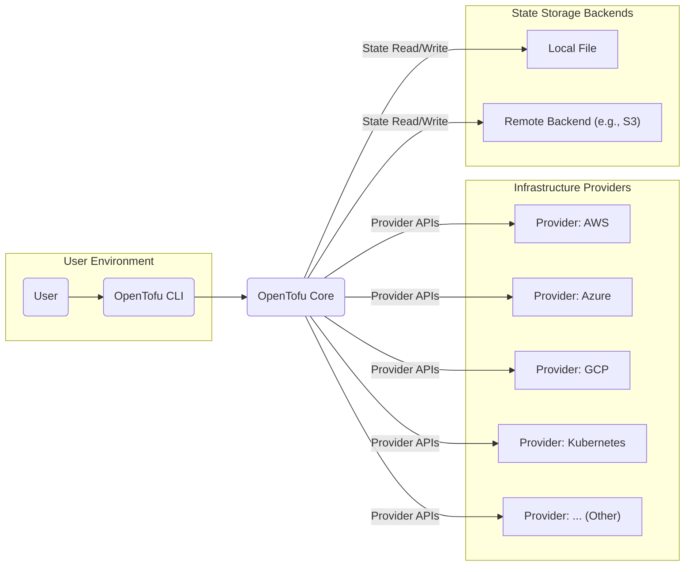
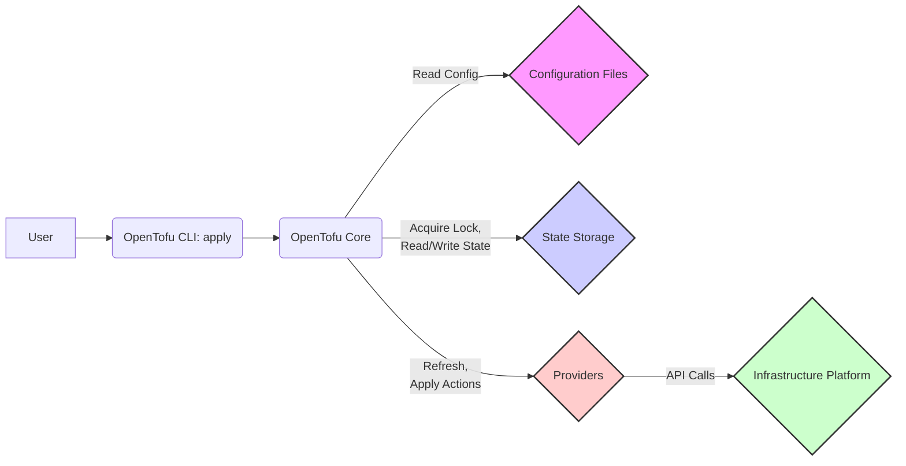

# Project Design Document: OpenTofu

**Version:** 1.1
**Date:** October 26, 2023
**Author:** AI Software Architect

## 1. Introduction

This document provides a detailed design overview of the OpenTofu project, an open-source infrastructure-as-code tool. OpenTofu enables users to define and provision infrastructure using declarative configuration files. This document aims to provide a comprehensive understanding of the system's architecture, components, and data flows, serving as a foundation for subsequent threat modeling activities.

## 2. Goals and Non-Goals

### 2.1. Goals

*   Provide a detailed architectural overview of OpenTofu, suitable for threat modeling.
*   Identify key components, their functionalities, and interactions.
*   Describe the data flow within the system, highlighting sensitive data paths.
*   Elaborate on security considerations relevant for identifying potential threats and vulnerabilities.

### 2.2. Non-Goals

*   Provide a line-by-line code explanation or API documentation.
*   Detail the specific implementation of every feature or edge case.
*   Offer a comprehensive user guide or operational manual for OpenTofu.
*   Include performance benchmarks, scalability analysis, or optimization strategies.

## 3. High-Level Architecture

OpenTofu functions as a command-line interface (CLI) tool that orchestrates infrastructure provisioning by interacting with various providers and a state storage mechanism. The core process involves reading user-defined configuration files, planning infrastructure changes, and applying those changes to the target environment.

**Key Components:**

*   **User:** The individual or automated system interacting with the OpenTofu CLI to manage infrastructure.
*   **OpenTofu CLI:** The command-line interface responsible for accepting user commands, parsing arguments, and presenting output.
*   **OpenTofu Core:** The central engine that interprets configuration, manages state, orchestrates provider interactions, and executes the provisioning logic.
*   **Providers:** Plugins that provide the interface to interact with specific infrastructure platforms (e.g., cloud providers, SaaS services). They translate OpenTofu resource definitions into platform-specific API calls.
*   **State Storage:** The mechanism used to persist the current known state of the managed infrastructure. This is crucial for tracking changes, drift detection, and ensuring idempotent operations.

## 4. Detailed Design

### 4.1. OpenTofu CLI

*   **Functionality:**
    *   Provides the primary interface for users to interact with OpenTofu.
    *   Parses user commands (e.g., `init`, `plan`, `apply`, `destroy`) and their arguments.
    *   Loads and validates OpenTofu configuration files (`.tf` files).
    *   Communicates with the OpenTofu Core, passing commands and receiving results.
    *   Formats and displays output (plan details, error messages, progress updates) to the user.
*   **Key Responsibilities:**
    *   Command-line argument parsing and validation.
    *   Configuration file discovery, loading, and basic syntax validation.
    *   User authentication for accessing remote state backends (if configured).
    *   Presenting information to the user in a readable format.

### 4.2. OpenTofu Core

*   **Functionality:**
    *   **Configuration Parsing and Evaluation:** Reads and interprets the `.tf` configuration files, building an in-memory representation of the desired infrastructure.
    *   **State Management:** Reads the current infrastructure state from the configured state storage backend, writes updated state after applying changes, and manages state locking to prevent concurrent modifications.
    *   **Provider Management:** Discovers, loads, and manages the lifecycle of required provider plugins.
    *   **Dependency Resolution:** Analyzes resource dependencies defined in the configuration to determine the order of operations.
    *   **Planning:** Compares the desired state (from configuration) with the current state (from state storage and provider APIs) to generate an execution plan outlining the changes needed.
    *   **Applying:** Executes the planned changes by invoking the appropriate provider functions to create, update, or delete infrastructure resources.
    *   **Error Handling:** Manages errors encountered during planning and applying, providing informative messages to the user.
*   **Key Responsibilities:**
    *   Orchestrating the entire infrastructure provisioning process.
    *   Maintaining the integrity and consistency of the infrastructure state.
    *   Interacting with providers to manage infrastructure resources.
    *   Ensuring idempotent operations (applying the same configuration multiple times results in the same infrastructure state).

### 4.3. Providers

*   **Functionality:**
    *   Abstract the complexities of interacting with specific infrastructure platforms' APIs.
    *   Define a schema for resources and data sources specific to the target platform.
    *   Translate OpenTofu resource definitions into concrete API calls to the underlying infrastructure.
    *   Retrieve the current state of managed resources from the platform's APIs.
*   **Key Responsibilities:**
    *   Authenticating and authorizing API requests to the target infrastructure platform.
    *   Constructing and executing API calls based on OpenTofu's instructions.
    *   Mapping platform-specific API responses to OpenTofu's internal representation.
    *   Handling API rate limiting and error conditions.
*   **Examples:**
    *   `opentofu-provider-aws`
    *   `opentofu-provider-azure`
    *   `opentofu-provider-google`
    *   `opentofu-provider-kubernetes`

### 4.4. State Storage

*   **Functionality:**
    *   Persistently stores the current state of the managed infrastructure as a snapshot in time.
    *   Provides a consistent view of the infrastructure, enabling OpenTofu to track changes and detect drift.
    *   Facilitates collaboration by providing a shared understanding of the infrastructure's current configuration.
    *   Supports state locking mechanisms to prevent concurrent modifications and potential corruption.
*   **Key Responsibilities:**
    *   Securely storing the state data (typically in JSON format).
    *   Providing mechanisms for acquiring and releasing state locks.
    *   Supporting various storage backends with different characteristics (e.g., local file system, object storage, managed services).
    *   Potentially offering features like state versioning and history tracking (depending on the backend).
*   **Types of Backends:**
    *   **Local Backend:** Stores the state in a file (`terraform.tfstate` or `opentofu.tfstate`) on the local file system. Suitable for individual use and testing.
    *   **Remote Backends:** Store the state in remote storage services, enabling collaboration and providing durability and availability. Examples include:
        *   AWS S3
        *   Azure Blob Storage
        *   Google Cloud Storage
        *   OpenTofu Cloud (or compatible Terraform Cloud)
        *   Other compatible backend implementations.

## 5. Data Flow

The typical workflow of OpenTofu involves the following data flow during an `apply` operation:

1. **User initiates `opentofu apply`:** The user executes the `apply` command via the OpenTofu CLI.
2. **CLI forwards command to Core:** The OpenTofu CLI passes the `apply` command to the OpenTofu Core.
3. **Core reads configuration:** The Core reads and parses the configuration files (`.tf`).
4. **Core acquires state lock:** If a remote backend is configured, the Core attempts to acquire a lock on the state file to prevent concurrent modifications.
5. **Core reads current state:** The Core retrieves the current infrastructure state from the configured state storage backend.
6. **Core interacts with Providers (Refresh):** The Core calls the relevant providers to refresh the state of existing resources, comparing the stored state with the actual state in the infrastructure.
7. **Core plans changes:** The Core compares the desired state (from configuration) with the refreshed current state to generate a plan of actions (create, update, delete).
8. **CLI displays plan (optional):** The OpenTofu CLI displays the generated plan to the user for review and approval.
9. **Core applies changes:** Upon confirmation (or in non-interactive mode), the Core iterates through the planned actions.
10. **Core interacts with Providers (Apply):** For each action, the Core calls the appropriate provider functions with the necessary parameters to create, update, or delete resources on the target infrastructure platform.
11. **Providers execute API calls:** Providers translate the Core's instructions into platform-specific API calls and execute them.
12. **Providers return results:** Providers return the results of the API calls (success or failure, resource attributes) to the Core.
13. **Core updates state:** The Core updates the state file with the new state of the managed infrastructure, reflecting the applied changes.
14. **Core releases state lock:** The Core releases the lock on the state file.
15. **CLI displays output:** The OpenTofu CLI displays the results of the apply operation to the user.

**Key Data Elements:**

*   **Configuration Files (`.tf`):** Text files defining the desired infrastructure resources and their configurations.
*   **State File (`opentofu.tfstate`):** A JSON file containing the current known state of the managed infrastructure, including resource attributes and dependencies.
*   **Plan:** A representation of the changes that OpenTofu intends to make to the infrastructure.
*   **Provider Requests:** Data sent from the OpenTofu Core to providers, instructing them to perform specific actions.
*   **Provider Responses:** Data returned from providers to the OpenTofu Core, indicating the success or failure of actions and the resulting resource attributes.

## 6. Security Considerations

This section outlines security considerations relevant for threat modeling OpenTofu deployments:

*   **Secrets Management:**
    *   **Storage of Sensitive Data:** How are sensitive credentials (API keys, passwords, certificates) handled within configuration files and the state file? Are they stored in plaintext?
    *   **Secret Injection:** What mechanisms are available for securely injecting secrets into the OpenTofu workflow (e.g., environment variables, dedicated secret management tools)?
    *   **State File Security:** How is the state file protected from unauthorized access, especially when using remote backends? Is encryption at rest and in transit enforced?
*   **Provider Security:**
    *   **Provider Verification:** How are provider plugins verified to ensure their authenticity and integrity? Is there a mechanism to prevent the use of malicious providers?
    *   **Provider Credentials:** How are credentials used by providers to authenticate with infrastructure platforms managed and secured?
    *   **Least Privilege:** Are providers granted only the necessary permissions to perform their intended actions?
*   **State Security:**
    *   **Access Control:** Who has access to the state file and the state storage backend? Are appropriate access controls in place?
    *   **Integrity Protection:** How is the state file protected against unauthorized modification or deletion? Are there mechanisms for auditing state changes?
    *   **Encryption:** Is the state data encrypted both at rest and in transit, especially for remote backends?
*   **Authentication and Authorization:**
    *   **Provider Authentication:** How does OpenTofu authenticate with infrastructure providers? Are secure authentication methods used?
    *   **Remote Backend Authentication:** How are users authenticated when accessing remote state backends?
    *   **Authorization within OpenTofu:** Are there mechanisms for role-based access control within OpenTofu itself (e.g., for managing who can execute certain commands)?
*   **Supply Chain Security:**
    *   **Binary Verification:** How are OpenTofu binaries distributed and verified to ensure they haven't been tampered with?
    *   **Provider Plugin Security:** How are provider plugins distributed and verified? Are there checks for known vulnerabilities?
*   **Configuration Security:**
    *   **Secure Coding Practices:** Are there guidelines or linters to help users write secure OpenTofu configurations and avoid common pitfalls (e.g., hardcoding secrets)?
    *   **Policy Enforcement:** Can policies be enforced to ensure configurations adhere to security best practices?
*   **Remote Backend Communication Security:**
    *   **Transport Layer Security (TLS):** Is communication with remote state backends secured using TLS to prevent eavesdropping and man-in-the-middle attacks?
*   **Local Execution Environment Security:**
    *   **Permissions:** What permissions does the OpenTofu process require on the local machine?
    *   **Temporary Files:** How are temporary files created and managed by OpenTofu? Do they contain sensitive information?

## 7. Deployment Considerations

*   **Installation:** OpenTofu is typically distributed as a single binary executable for various operating systems.
*   **Execution Environment:** OpenTofu can be executed on local workstations, servers, or within CI/CD pipelines. It requires network access to download providers and interact with infrastructure platforms.
*   **Configuration Management:** OpenTofu configuration files are typically stored in version control systems (e.g., Git) to track changes and enable collaboration.
*   **State Backend Configuration:** Users must choose and configure an appropriate state backend based on their requirements for collaboration, durability, and security.
*   **Provider Plugin Management:** OpenTofu automatically downloads and manages provider plugins based on the configuration.
*   **CI/CD Integration:** OpenTofu is commonly integrated into CI/CD pipelines to automate infrastructure provisioning and management as part of the software delivery process.

## 8. Future Considerations

*   **Enhanced Secrets Management Integration:** Deeper integration with dedicated secret management solutions.
*   **Policy as Code Frameworks:** Integration with policy engines (e.g., Open Policy Agent) to enforce security and compliance policies.
*   **Improved State Locking Mechanisms:** Exploring more robust and granular state locking options.
*   **Enhanced Auditing and Logging:** More comprehensive logging of OpenTofu operations for security monitoring and compliance.
*   **Graphical User Interface (GUI):** Potential development of a GUI for certain OpenTofu functionalities.

This document provides a detailed design overview of the OpenTofu project, focusing on aspects relevant for security analysis and threat modeling. It outlines the key components, data flows, and security considerations to facilitate the identification of potential vulnerabilities and the development of appropriate security mitigations.