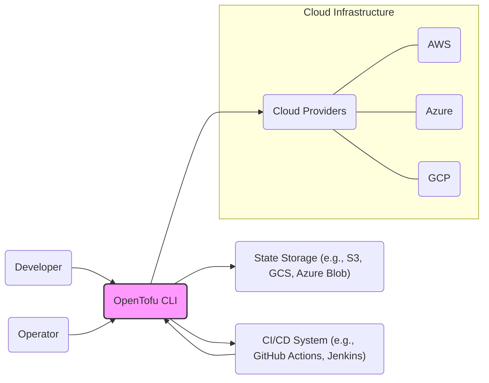
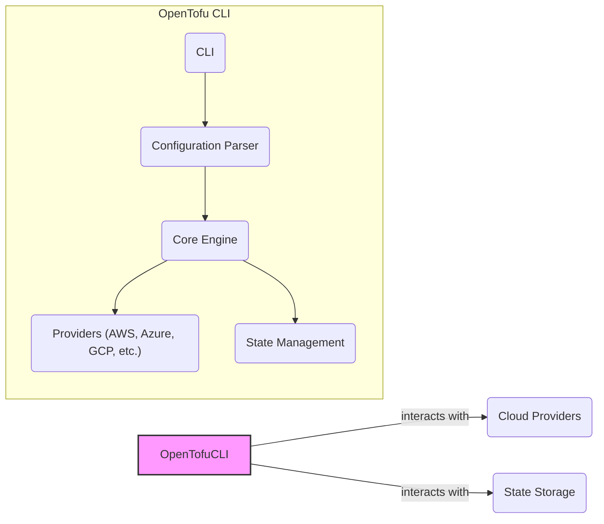
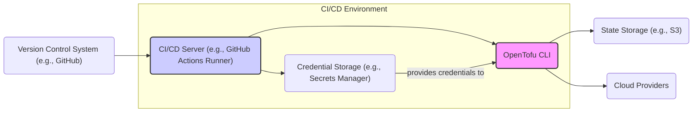

# BUSINESS POSTURE

- Business Priorities and Goals:
  - Provide an open-source, community-driven infrastructure-as-code tool as an alternative to Terraform.
  - Ensure feature parity and compatibility with Terraform to facilitate easy migration for users.
  - Foster a vibrant community of contributors and users.
  - Maintain a stable, reliable, and secure infrastructure-as-code platform.
  - Promote vendor neutrality and avoid vendor lock-in for infrastructure management.
- Business Risks:
  - Community adoption and contribution might be slower than anticipated, hindering project growth and sustainability.
  - Technical challenges in maintaining compatibility with Terraform while innovating and adding new features.
  - Security vulnerabilities in the core platform or providers could damage reputation and user trust.
  - Governance and decision-making within the community might become complex and slow down development.
  - Dependence on volunteer contributors could lead to inconsistent development pace and resource limitations.

# SECURITY POSTURE

- Existing Security Controls:
  - security control: Open Source Development Model - publicly accessible code repository and development process for transparency and community review (Implemented: GitHub repository).
  - security control: Code Review Process - pull requests are reviewed by maintainers before merging to ensure code quality and security (Implemented: GitHub pull request workflow).
  - security control: Static Code Analysis - usage of linters and static analysis tools to identify potential code defects and security vulnerabilities (Implemented: likely in CI pipelines, details to be confirmed).
  - security control: Dependency Management - using dependency management tools to track and manage project dependencies (Implemented: Go modules).
  - security control: Vulnerability Scanning - potentially using automated vulnerability scanning tools on dependencies (Implemented: likely in CI pipelines, details to be confirmed).
  - security control: Release Process - signed releases to ensure integrity and authenticity of distributed binaries (Implemented: likely through GitHub Actions and release workflows).
  - security control: Security Advisories - process for reporting and disclosing security vulnerabilities (Implemented: likely through GitHub Security Advisories or project website).
- Accepted Risks:
  - accepted risk: Reliance on community contributions for security vulnerability discovery and patching.
  - accepted risk: Potential delays in security patch releases due to volunteer-driven nature of the project.
  - accepted risk: Risk of supply chain attacks through dependencies, despite dependency management and scanning.
  - accepted risk: Security vulnerabilities might be present in early releases as the project matures.
- Recommended Security Controls:
  - security control: Implement automated security testing as part of the CI/CD pipeline, including SAST, DAST, and dependency vulnerability scanning.
  - security control: Establish a dedicated security team or security champions within the project to proactively address security concerns.
  - security control: Conduct regular security audits and penetration testing of the OpenTofu platform.
  - security control: Implement a bug bounty program to incentivize external security researchers to find and report vulnerabilities.
  - security control: Enhance input validation and sanitization across all modules, especially in provider interactions and state management.
- Security Requirements:
  - Authentication:
    - OpenTofu itself does not directly handle user authentication as it's a CLI tool. Authentication is delegated to the underlying infrastructure providers (e.g., AWS, Azure, GCP) and state storage backends.
    - Requirement: Ensure secure configuration and management of provider credentials and state backend authentication mechanisms.
  - Authorization:
    - OpenTofu relies on the authorization mechanisms provided by the infrastructure providers and state storage backends.
    - Requirement: Users should adhere to the principle of least privilege when configuring provider credentials and access to state storage.
    - Requirement: OpenTofu configuration language should not introduce any authorization bypass vulnerabilities.
  - Input Validation:
    - OpenTofu needs to validate user-provided configurations to prevent injection attacks and ensure data integrity. This includes validation of provider configurations, resource definitions, and variable inputs.
    - Requirement: Implement robust input validation for all user-provided data, especially when interacting with providers and state storage.
    - Requirement: Sanitize inputs to prevent command injection, code injection, and other input-based vulnerabilities.
  - Cryptography:
    - OpenTofu uses cryptography for secure storage of sensitive data in state files and secure communication with providers and state backends.
    - Requirement: Use strong cryptographic algorithms and libraries for encryption of sensitive data in state files.
    - Requirement: Ensure secure communication channels (HTTPS, TLS) when interacting with providers and state backends.
    - Requirement: Properly manage cryptographic keys and secrets, avoiding hardcoding or insecure storage.

# DESIGN

## C4 CONTEXT

- Context Diagram Elements:
  - - Name: Developer
    - Type: Person
    - Description: Software developers and infrastructure engineers who write and manage infrastructure-as-code configurations using OpenTofu.
    - Responsibilities: Define infrastructure configurations, execute OpenTofu commands, manage state, and integrate OpenTofu into development workflows.
    - Security controls: Local workstation security, secure credential management for cloud providers and state storage, secure coding practices.
  - - Name: Operator
    - Type: Person
    - Description: Operations and infrastructure teams who manage and maintain the infrastructure provisioned by OpenTofu in production environments.
    - Responsibilities: Execute OpenTofu commands for infrastructure changes, monitor infrastructure state, troubleshoot issues, and ensure infrastructure stability and security.
    - Security controls: Access control to production environments, secure credential management, monitoring and logging of infrastructure changes.
  - - Name: OpenTofu CLI
    - Type: Software System
    - Description: The OpenTofu command-line interface tool that interprets infrastructure-as-code configurations and interacts with cloud providers and state storage.
    - Responsibilities: Parse configuration files, plan infrastructure changes, apply changes to cloud providers, manage infrastructure state, and provide a CLI interface for users.
    - Security controls: Input validation, secure communication with providers and state storage, secure state management, logging and auditing of actions.
  - - Name: Cloud Providers
    - Type: Software System
    - Description: Cloud service providers like AWS, Azure, GCP, and others that offer infrastructure services (compute, storage, networking, etc.) managed by OpenTofu.
    - Responsibilities: Provide infrastructure resources, APIs for resource management, authentication and authorization mechanisms, and security features for cloud services.
    - Security controls: Cloud provider security controls (IAM, network security groups, encryption, etc.), API security, compliance certifications.
  - - Name: State Storage
    - Type: Software System
    - Description: Backend storage systems (e.g., AWS S3, Google Cloud Storage, Azure Blob Storage) used by OpenTofu to store the state of managed infrastructure.
    - Responsibilities: Persistently store infrastructure state data, provide access control mechanisms, ensure data integrity and availability, and offer encryption for stored data.
    - Security controls: Access control policies, encryption at rest and in transit, data backup and recovery, versioning.
  - - Name: CI/CD System
    - Type: Software System
    - Description: Continuous Integration and Continuous Delivery systems (e.g., GitHub Actions, Jenkins, GitLab CI) that automate the execution of OpenTofu for infrastructure provisioning and updates.
    - Responsibilities: Automate OpenTofu workflows, manage infrastructure deployments, integrate with version control systems, and provide audit trails for infrastructure changes.
    - Security controls: Secure pipeline configuration, secret management for provider credentials, access control to CI/CD system, audit logging.

## C4 CONTAINER

- Container Diagram Elements:
  - - Name: OpenTofu CLI
    - Type: Container
    - Description: The main command-line interface application that users interact with to manage infrastructure. It encapsulates all OpenTofu functionalities.
    - Responsibilities: Provide user interface, orchestrate core engine, manage providers and state, handle user commands and output.
    - Security controls: Input validation on CLI arguments, secure handling of credentials passed via CLI, logging of user actions.
  - - Name: Configuration Parser
    - Type: Container
    - Description: Component responsible for parsing and validating OpenTofu configuration files (e.g., `.tf` files).
    - Responsibilities: Read and parse configuration files, validate syntax and semantics, generate internal representation of configuration.
    - Security controls: Input validation to prevent malicious configurations, secure parsing logic to avoid vulnerabilities.
  - - Name: Core Engine
    - Type: Container
    - Description: The central component that drives the infrastructure provisioning process. It plans and applies infrastructure changes based on configurations and state.
    - Responsibilities: Plan infrastructure changes, interact with providers to apply changes, manage resource dependencies, handle error conditions, orchestrate state management.
    - Security controls: Secure interaction with providers, secure state update logic, authorization checks based on configuration, logging and auditing of actions.
  - - Name: Providers
    - Type: Container
    - Description: Plugins that provide specific integrations with different infrastructure providers (AWS, Azure, GCP, etc.).
    - Responsibilities: Translate OpenTofu resource definitions into provider-specific API calls, manage resource lifecycle within providers, handle provider authentication and authorization.
    - Security controls: Secure API interaction with providers, credential management for providers, input validation for provider APIs, handling of provider-specific security features.
  - - Name: State Management
    - Type: Container
    - Description: Component responsible for managing the infrastructure state, including reading, writing, and locking state files.
    - Responsibilities: Store and retrieve infrastructure state, implement state locking to prevent concurrent modifications, handle state encryption and backup, interact with state storage backends.
    - Security controls: Secure state storage backend configuration, state encryption at rest and in transit, access control to state data, state locking mechanisms.

## DEPLOYMENT

- Deployment Architecture Options:
  - Developer Workstation: OpenTofu CLI is installed directly on a developer's local machine for development and testing.
  - CI/CD Pipeline: OpenTofu CLI is executed within a CI/CD pipeline for automated infrastructure deployments in staging and production environments.
  - Server-based Execution: OpenTofu CLI is deployed on dedicated servers within a controlled environment for centralized infrastructure management.

- Detailed Deployment Architecture (CI/CD Pipeline):

- Deployment Diagram Elements:
  - - Name: CI/CD Server
    - Type: Infrastructure
    - Description: Server or virtual machine running the CI/CD system (e.g., GitHub Actions runner, Jenkins agent).
    - Responsibilities: Execute CI/CD pipelines, run OpenTofu CLI, manage workflow execution, provide execution environment.
    - Security controls: Secure operating system configuration, access control to CI/CD server, network security, monitoring and logging.
  - - Name: OpenTofu CLI (Deployed)
    - Type: Software
    - Description: Instance of the OpenTofu CLI application deployed within the CI/CD environment.
    - Responsibilities: Execute OpenTofu commands within the CI/CD pipeline, interact with cloud providers and state storage, manage infrastructure deployments.
    - Security controls: Secure configuration within CI/CD environment, least privilege access, logging and auditing of actions.
  - - Name: Credential Storage
    - Type: Infrastructure
    - Description: Secure storage for sensitive credentials (e.g., cloud provider API keys, state storage credentials) used by OpenTofu in the CI/CD pipeline (e.g., Secrets Manager, HashiCorp Vault).
    - Responsibilities: Securely store and manage credentials, provide access control to credentials, audit access to credentials.
    - Security controls: Encryption at rest and in transit, access control policies, audit logging, rotation of credentials.
  - - Name: Version Control System
    - Type: Infrastructure
    - Description: System for managing source code and configuration files (e.g., GitHub, GitLab).
    - Responsibilities: Store infrastructure-as-code configurations, track changes, manage versions, provide access control to repositories.
    - Security controls: Access control to repositories, branch protection, audit logging, secure communication (HTTPS).
  - - Name: State Storage (Deployed)
    - Type: Infrastructure
    - Description: Instance of state storage backend (e.g., S3 bucket, GCS bucket) used by OpenTofu deployed in the cloud environment.
    - Responsibilities: Persistently store infrastructure state data from CI/CD deployments, provide access control, ensure data integrity and availability.
    - Security controls: Access control policies (IAM), encryption at rest and in transit, data backup and recovery, versioning, secure bucket policies.
  - - Name: Cloud Providers (Deployed)
    - Type: Infrastructure
    - Description: Cloud infrastructure services provided by cloud providers (AWS, Azure, GCP) that are managed by OpenTofu deployments from the CI/CD pipeline.
    - Responsibilities: Provide infrastructure resources, execute API requests from OpenTofu, enforce security policies, provide monitoring and logging.
    - Security controls: Cloud provider security controls (IAM, network security groups, encryption, etc.), API security, compliance certifications.

## BUILD

```mermaid
flowchart LR
    Developer("Developer") --> VCS("Version Control System (GitHub)")
    VCS --> BuildSystem("Build System (GitHub Actions)")
    subgraph BuildSystem
        direction TB
        CodeCheckout("Code Checkout")
        DependencyResolution("Dependency Resolution (Go Modules)")
        StaticAnalysis("Static Analysis (Linters, SAST)")
        Testing("Testing (Unit, Integration)")
        Compilation("Compilation (Go Compiler)")
        ArtifactPackaging("Artifact Packaging")
        Signing("Signing (Code Signing)")
        Publishing("Publishing (GitHub Releases, Package Registries)")

        CodeCheckout --> DependencyResolution
        DependencyResolution --> StaticAnalysis
        StaticAnalysis --> Testing
        Testing --> Compilation
        Compilation --> ArtifactPackaging
        ArtifactPackaging --> Signing
        Signing --> Publishing
    end
    Publishing --> Artifacts("Build Artifacts (Binaries, Packages)")

    style BuildSystem fill:#efe,stroke:#333,stroke-width:2px
```

- Build Process Description:
  - Developer commits code changes to the Version Control System (GitHub).
  - The Build System (GitHub Actions) is triggered by code changes.
  - Code Checkout: Source code is checked out from the VCS.
  - Dependency Resolution: Go modules are used to resolve and download project dependencies.
  - Static Analysis: Static analysis tools (linters, SAST scanners) are executed to identify potential code quality issues and security vulnerabilities.
  - Testing: Unit and integration tests are executed to ensure code functionality and stability.
  - Compilation: Go compiler compiles the source code into executable binaries.
  - Artifact Packaging: Build artifacts (binaries, packages) are created.
  - Signing: Build artifacts are signed using code signing to ensure integrity and authenticity.
  - Publishing: Build artifacts are published to distribution channels (GitHub Releases, package registries).
- Build Process Security Controls:
  - security control: Secure Build Environment - using isolated and hardened build environments (e.g., GitHub Actions runners).
  - security control: Dependency Scanning - automated scanning of dependencies for known vulnerabilities during the build process.
  - security control: Static Application Security Testing (SAST) - automated SAST tools integrated into the build pipeline to detect code-level vulnerabilities.
  - security control: Code Signing - signing build artifacts to ensure integrity and prevent tampering.
  - security control: Build Artifact Verification - verifying the integrity and authenticity of build artifacts before deployment or distribution.
  - security control: Access Control to Build System - restricting access to the build system and build configurations to authorized personnel.
  - security control: Audit Logging - logging all build activities for auditing and security monitoring.
  - security control: Supply Chain Security - implementing measures to secure the software supply chain, including dependency management and build process security.

# RISK ASSESSMENT

- Critical Business Processes:
  - Infrastructure Provisioning and Management: OpenTofu is critical for automating the deployment and management of cloud infrastructure, which underpins various business applications and services. Disruption or compromise of OpenTofu could impact the availability and security of these services.
  - State Management: The infrastructure state managed by OpenTofu is crucial for maintaining consistency and control over infrastructure. Corruption or unauthorized modification of state could lead to infrastructure instability or security breaches.
  - Secure Infrastructure Configuration: OpenTofu configurations define the security posture of the deployed infrastructure. Misconfigurations or vulnerabilities in configurations could directly translate to security risks in the cloud environment.
- Data Sensitivity:
  - Infrastructure State Data: State files can contain sensitive information, including resource IDs, configuration details, and sometimes secrets (though best practices discourage storing secrets in state). Compromise of state data could expose infrastructure details and potentially lead to unauthorized access or control. Sensitivity: Medium to High, depending on the specific infrastructure and data stored in state.
  - Provider Credentials: OpenTofu requires credentials to interact with cloud providers and state storage backends. These credentials are highly sensitive and must be protected. Compromise of these credentials could lead to unauthorized access to cloud resources and data. Sensitivity: High.
  - Configuration Files: Configuration files themselves might contain sensitive information or reveal infrastructure design details. While generally less sensitive than state or credentials, they should still be treated with care. Sensitivity: Low to Medium.

# QUESTIONS & ASSUMPTIONS

- BUSINESS POSTURE Questions:
  - What are the key performance indicators (KPIs) for measuring the success of OpenTofu project adoption and community growth?
  - What is the long-term funding and sustainability model for the OpenTofu project?
  - What are the specific target markets and user segments for OpenTofu?
- BUSINESS POSTURE Assumptions:
  - The primary business goal is to establish OpenTofu as a leading open-source infrastructure-as-code tool.
  - Community growth and adoption are critical for the project's success and sustainability.
  - Maintaining compatibility with Terraform is a high priority for user migration and adoption.
- SECURITY POSTURE Questions:
  - What security tools are currently used in the CI/CD pipeline for static analysis, dependency scanning, and vulnerability management?
  - Is there a documented security incident response plan for OpenTofu?
  - Are there specific security compliance requirements that OpenTofu needs to meet (e.g., SOC 2, ISO 27001)?
- SECURITY POSTURE Assumptions:
  - Security is a high priority for the OpenTofu project and its users.
  - The project aims to follow secure software development lifecycle (SSDLC) best practices.
  - Open source transparency and community review are considered important security controls.
- DESIGN Questions:
  - What are the performance and scalability requirements for OpenTofu core engine and state management?
  - What are the supported state storage backends and cloud providers?
  - Are there plans for implementing features like policy enforcement or drift detection in OpenTofu?
- DESIGN Assumptions:
  - OpenTofu architecture is modular and extensible, allowing for the addition of new providers and features.
  - State management is a critical component, and its security and reliability are paramount.
  - The design prioritizes compatibility with existing Terraform configurations and workflows.