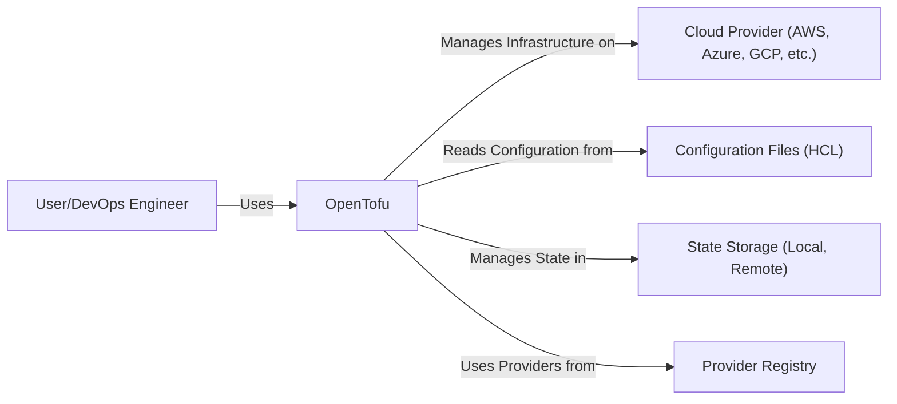
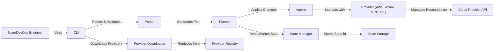
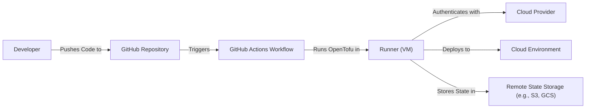
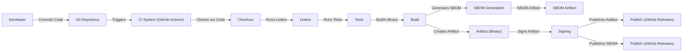

Okay, let's craft a design document for the OpenTofu project, keeping in mind its purpose and potential security considerations.

# BUSINESS POSTURE

OpenTofu is a fork of Terraform, initiated in response to HashiCorp's license change.  Its primary business goals are:

*   Provide a truly open-source Infrastructure as Code (IaC) tool.
*   Maintain compatibility with existing Terraform configurations.
*   Foster a community-driven development model.
*   Ensure long-term viability and stability of the project.
*   Offer a reliable and trustworthy alternative to Terraform.

Business priorities:

*   Community adoption and growth.
*   Maintaining feature parity with Terraform (where appropriate).
*   Ensuring the security and integrity of the codebase.
*   Establishing a robust governance model.

Most important business risks:

*   Loss of community trust due to security vulnerabilities or instability.
*   Inability to keep pace with Terraform's development (falling behind).
*   Legal challenges related to the fork.
*   Fragmentation of the community or ecosystem.
*   Lack of sufficient maintainers or contributors.

# SECURITY POSTURE

Existing security controls (based on the GitHub repository and common practices):

*   security control: Code reviews: Pull requests are used, implying a code review process.
*   security control: Static analysis: Some static analysis tools are present in the CI pipeline (e.g., linters).
*   security control: Dependency management: Dependencies are managed using Go modules, allowing for version pinning and vulnerability scanning.
*   security control: Contributor License Agreement (CLA): A CLA is in place, which helps manage intellectual property and legal risks.
*   security control: Code of Conduct: A Code of Conduct exists to foster a safe and respectful community.
*   security control: Security Policy: Security policy is defined and published.
*   security control: Software Bill of Materials (SBOM): SBOM is generated as part of build process.
*   security control: Signing: Release artifacts are signed.

Accepted risks:

*   accepted risk: Reliance on third-party providers: OpenTofu interacts with numerous cloud providers, inheriting some of their security risks.
*   accepted risk: Complexity of IaC: The inherent complexity of IaC can lead to misconfigurations and security vulnerabilities if not used carefully.
*   accepted risk: Evolving threat landscape: New vulnerabilities and attack vectors are constantly emerging, requiring ongoing vigilance.

Recommended security controls:

*   Implement comprehensive SAST (Static Application Security Testing) and DAST (Dynamic Application Security Testing).
*   Establish a vulnerability disclosure program and bug bounty.
*   Conduct regular security audits and penetration testing.
*   Implement robust secrets management for CI/CD pipelines.
*   Provide security training for contributors and maintainers.
*   Implement Software Composition Analysis (SCA) to identify vulnerabilities in third-party dependencies.

Security Requirements:

*   Authentication:
    *   OpenTofu itself does not handle user authentication directly. It relies on the authentication mechanisms of the target cloud providers (e.g., AWS IAM, Azure AD, GCP IAM).
    *   API keys, access tokens, and other credentials used to authenticate with providers must be stored and managed securely.
*   Authorization:
    *   OpenTofu relies on the authorization models of the target cloud providers.
    *   Users should adhere to the principle of least privilege, granting only the necessary permissions to OpenTofu.
*   Input Validation:
    *   OpenTofu should validate user-provided input (e.g., configuration files, variables) to prevent injection attacks and other vulnerabilities.
    *   Schema validation should be enforced to ensure that configurations adhere to the expected format.
*   Cryptography:
    *   Sensitive data (e.g., passwords, secrets) should be encrypted at rest and in transit.
    *   Cryptographic best practices should be followed for key management and data protection.
    *   State files, which may contain sensitive information, should be encrypted.

# DESIGN

## C4 CONTEXT

Element Descriptions:

*   Element:
    *   Name: User/DevOps Engineer
    *   Type: Person
    *   Description: The person who writes and applies OpenTofu configurations.
    *   Responsibilities: Writing IaC code, managing infrastructure, ensuring security best practices.
    *   Security controls: Strong authentication to cloud providers, adherence to least privilege, secure handling of credentials.

*   Element:
    *   Name: OpenTofu
    *   Type: Software System
    *   Description: The open-source infrastructure-as-code tool.
    *   Responsibilities: Parsing configuration files, interacting with cloud provider APIs, managing state, planning and applying changes.
    *   Security controls: Input validation, secure handling of credentials, regular security audits, vulnerability scanning.

*   Element:
    *   Name: Cloud Provider (AWS, Azure, GCP, etc.)
    *   Type: External System
    *   Description: The cloud platform where infrastructure is provisioned.
    *   Responsibilities: Providing APIs for resource management, enforcing access controls, ensuring platform security.
    *   Security controls: Provider-specific security features (e.g., IAM, security groups, network policies), compliance certifications.

*   Element:
    *   Name: Configuration Files (HCL)
    *   Type: Data
    *   Description: Files written in HashiCorp Configuration Language (HCL) that define the desired infrastructure.
    *   Responsibilities: Describing the infrastructure resources, their configurations, and dependencies.
    *   Security controls: Version control, code reviews, static analysis, secrets management.

*   Element:
    *   Name: State Storage (Local, Remote)
    *   Type: Data Store
    *   Description: The location where OpenTofu stores the state of the managed infrastructure.
    *   Responsibilities: Persisting the current state of resources, enabling OpenTofu to track changes and plan updates.
    *   Security controls: Encryption at rest, access controls, regular backups.

*   Element:
    *   Name: Provider Registry
    *   Type: External System
    *   Description: Registry from which OpenTofu downloads providers.
    *   Responsibilities: Storing and serving provider plugins.
    *   Security controls: Secure communication (HTTPS), provider signing, vulnerability scanning.

## C4 CONTAINER

Element Descriptions:

*   Element:
    *   Name: CLI
    *   Type: Component
    *   Description: Command-line interface for interacting with OpenTofu.
    *   Responsibilities: Accepting user commands, displaying output, managing the OpenTofu workflow.
    *   Security controls: Input validation, secure handling of credentials passed via command-line arguments or environment variables.

*   Element:
    *   Name: Parser
    *   Type: Component
    *   Description: Parses and validates OpenTofu configuration files.
    *   Responsibilities: Lexing, parsing, and validating HCL syntax, checking for configuration errors.
    *   Security controls: Input validation, schema validation, error handling.

*   Element:
    *   Name: Planner
    *   Type: Component
    *   Description: Generates an execution plan by comparing the desired state (configuration) with the current state.
    *   Responsibilities: Determining the changes needed to reach the desired state, identifying dependencies, creating a graph of resources.
    *   Security controls: Secure comparison of state, protection against race conditions.

*   Element:
    *   Name: Applier
    *   Type: Component
    *   Description: Applies the execution plan, making changes to the infrastructure.
    *   Responsibilities: Interacting with cloud provider APIs, creating, updating, and deleting resources.
    *   Security controls: Secure communication with APIs, error handling, idempotency.

*   Element:
    *   Name: Provider (AWS, Azure, GCP, etc.)
    *   Type: Component
    *   Description: Plugin that interacts with a specific cloud provider's API.
    *   Responsibilities: Translating OpenTofu resource definitions into provider-specific API calls, managing resource lifecycles.
    *   Security controls: Secure communication with APIs, authentication and authorization using provider credentials, adherence to provider-specific security best practices.

*   Element:
    *   Name: Cloud Provider API
    *   Type: External System
    *   Description: The API exposed by the cloud provider for managing resources.
    *   Responsibilities: Providing endpoints for creating, reading, updating, and deleting resources.
    *   Security controls: Provider-specific security features (e.g., IAM, API gateways, rate limiting).

*   Element:
    *   Name: State Manager
    *   Type: Component
    *   Description: Manages the state of the infrastructure.
    *   Responsibilities: Reading and writing state files, locking state to prevent concurrent modifications.
    *   Security controls: Encryption of state files, access controls, concurrency control.

*   Element:
    *   Name: State Storage
    *   Type: Data Store
    *   Description: The location where state files are stored (local filesystem, remote backend).
    *   Responsibilities: Persisting state data.
    *   Security controls: Encryption at rest, access controls, backups.

*   Element:
    *   Name: Provider Downloader
    *   Type: Component
    *   Description: Downloads provider plugins.
    *   Responsibilities: Retrieving provider binaries from a registry.
    *   Security controls: Secure communication (HTTPS), verification of provider signatures.

*   Element:
    *   Name: Provider Registry
    *   Type: External System
    *   Description: Registry from which OpenTofu downloads providers.
    *   Responsibilities: Storing and serving provider plugins.
    *   Security controls: Secure communication (HTTPS), provider signing, vulnerability scanning.

## DEPLOYMENT

Possible deployment solutions:

1.  Local machine: Developers run OpenTofu directly on their workstations.
2.  CI/CD pipeline: OpenTofu is executed within a CI/CD pipeline (e.g., GitHub Actions, Jenkins, GitLab CI).
3.  Dedicated infrastructure: A dedicated server or virtual machine is used to run OpenTofu.
4.  Managed service: A cloud-based service that manages OpenTofu execution (less likely for OpenTofu, given its nature).

Chosen solution (for detailed description): CI/CD pipeline (GitHub Actions).

Element Descriptions:

*   Element:
    *   Name: Developer
    *   Type: Person
    *   Description: The person who writes and commits OpenTofu code.
    *   Responsibilities: Writing IaC code, committing changes to the repository.
    *   Security controls: Strong authentication to GitHub, secure coding practices.

*   Element:
    *   Name: GitHub Repository
    *   Type: Source Code Repository
    *   Description: The repository hosting the OpenTofu configuration files.
    *   Responsibilities: Storing code, tracking changes, triggering CI/CD workflows.
    *   Security controls: Access controls, branch protection rules, code scanning.

*   Element:
    *   Name: GitHub Actions Workflow
    *   Type: CI/CD Pipeline
    *   Description: The automated workflow that executes OpenTofu.
    *   Responsibilities: Defining the steps for building, testing, and deploying infrastructure.
    *   Security controls: Secure configuration of the workflow, secrets management, least privilege for runners.

*   Element:
    *   Name: Runner (VM)
    *   Type: Virtual Machine
    *   Description: The virtual machine provided by GitHub Actions to execute the workflow.
    *   Responsibilities: Running OpenTofu commands, interacting with the cloud provider.
    *   Security controls: Ephemeral environment, limited access, regular patching.

*   Element:
    *   Name: Cloud Provider
    *   Type: External System
    *   Description: The cloud platform where infrastructure is provisioned.
    *   Responsibilities: Providing APIs for resource management.
    *   Security controls: Provider-specific security features.

*   Element:
    *   Name: Cloud Environment
    *   Type: Deployment Environment
    *   Description: The target environment within the cloud provider (e.g., a specific AWS account, Azure subscription, GCP project).
    *   Responsibilities: Hosting the deployed infrastructure.
    *   Security controls: Network security, access controls, monitoring.

*   Element:
    *   Name: Remote State Storage (e.g., S3, GCS)
    *   Type: Data Store
    *   Description: A remote storage service used to store the OpenTofu state file.
    *   Responsibilities: Persisting state data, enabling collaboration and preventing conflicts.
    *   Security controls: Encryption at rest, access controls, versioning.

## BUILD

Build process description:

1.  Developer commits code to the Git repository.
2.  The CI system (GitHub Actions) is triggered.
3.  The code is checked out.
4.  Linters are run to check for code style and potential errors.
5.  Tests (unit, integration) are executed.
6.  The OpenTofu binary is built.
7.  Software Bill of Materials (SBOM) is generated.
8.  The build artifact (binary) is created.
9.  SBOM artifact is created.
10. Artifact is signed using a cryptographic key.
11. SBOM is signed.
12. The signed artifact and SBOM are published to GitHub Releases.

Security controls in the build process:

*   Code review: All code changes are reviewed before merging.
*   Static analysis: Linters and static analysis tools are used to identify potential vulnerabilities.
*   Testing: Automated tests are run to ensure code quality and functionality.
*   Dependency management: Dependencies are managed using Go modules, and their versions are pinned.
*   SBOM generation: An SBOM is generated to track all dependencies and their versions.
*   Artifact signing: The build artifact is signed to ensure its integrity and authenticity.
*   Secure CI/CD configuration: The CI/CD pipeline is configured securely, with secrets management and least privilege for runners.

# RISK ASSESSMENT

Critical business processes to protect:

*   Infrastructure provisioning and management: Ensuring that OpenTofu can reliably and securely provision and manage infrastructure.
*   State management: Protecting the integrity and confidentiality of the OpenTofu state file.
*   Community trust: Maintaining the trust of the OpenTofu community.

Data to protect and their sensitivity:

*   OpenTofu configuration files: May contain sensitive information such as cloud provider credentials, API keys, and other secrets. Sensitivity: High.
*   OpenTofu state file: Contains the current state of the infrastructure, including potentially sensitive information about resources and their configurations. Sensitivity: High.
*   Provider credentials: Used to authenticate with cloud providers. Sensitivity: High.
*   User data (if any): OpenTofu itself does not directly handle user data, but it may interact with services that do. Sensitivity: Depends on the specific services and data.

# QUESTIONS & ASSUMPTIONS

Questions:

*   What is the specific threat model for OpenTofu? (This document provides a general overview, but a more detailed threat model would be beneficial.)
*   What are the specific security requirements for different deployment scenarios (e.g., local machine, CI/CD, dedicated infrastructure)?
*   What are the plans for handling security vulnerabilities and incidents?
*   What is the long-term governance model for OpenTofu, and how will it ensure the security of the project?
*   How will OpenTofu ensure the security and integrity of provider plugins?
*   What level of support will be provided for different state backends, and what are the security implications of each?

Assumptions:

*   BUSINESS POSTURE: The OpenTofu community is committed to maintaining a secure and reliable tool.
*   BUSINESS POSTURE: The project will prioritize security and address vulnerabilities promptly.
*   SECURITY POSTURE: Users will follow security best practices when using OpenTofu (e.g., securely managing credentials, using least privilege).
*   SECURITY POSTURE: Cloud providers will maintain the security of their platforms and APIs.
*   DESIGN: The design of OpenTofu will evolve over time, and this document will need to be updated accordingly.
*   DESIGN: The CI/CD pipeline (GitHub Actions) is configured securely.
*   DESIGN: Remote state storage is used and configured securely.