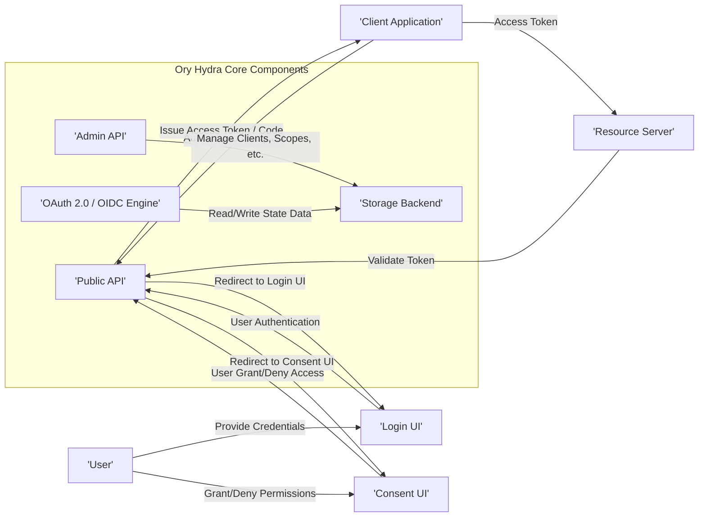
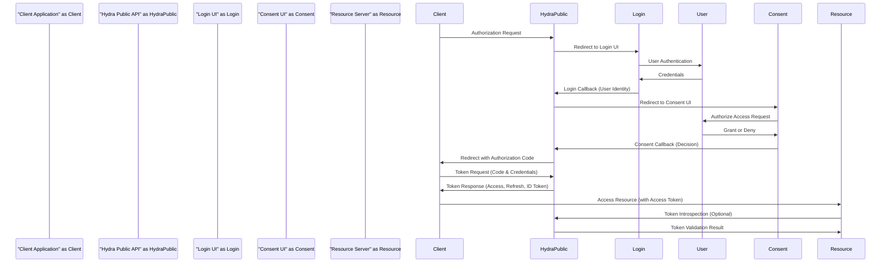

# Project Design Document: Ory Hydra

**Version:** 1.1
**Date:** October 26, 2023
**Author:** AI Software Architect

## 1. Introduction

This document provides an enhanced and detailed design overview of the Ory Hydra project. It elaborates on the system's architecture, components, data flow, and crucial security considerations. This refined document will serve as a robust foundation for subsequent threat modeling activities.

## 2. Project Overview

Ory Hydra is a cloud-native, open-source OAuth 2.0 and OpenID Connect provider. Its primary function is to delegate user authentication and authorization decisions to external services, acting as a compliant and secure OAuth 2.0 framework without managing user credentials directly. This separation of concerns enhances security, scalability, and flexibility for modern application development.

## 3. System Architecture

The Ory Hydra system comprises several key interacting components:

- **Hydra Core:** The central processing unit responsible for orchestrating OAuth 2.0 and OpenID Connect flows. It handles request validation, token generation, and consent management logic.
- **Admin API:**  A secure interface providing endpoints for managing Hydra's configuration, including OAuth 2.0 clients, scopes, JSON Web Keys (JWKs), and other administrative settings. This API is intended for backend services and administrative users.
- **Public API:**  The externally facing interface exposing endpoints for initiating OAuth 2.0 flows (e.g., authorization code grant), token introspection, token revocation, and verifying JSON Web Keys (JWKs). Client applications interact with this API.
- **Consent User Interface (UI):** A customizable user interface where users grant or deny permission to client applications requesting access to their resources. Hydra redirects users to this external UI.
- **Login User Interface (UI):** An external user interface responsible for authenticating the user's identity. Hydra redirects users to this UI to establish their identity.
- **Storage Backend:**  The persistent storage layer for Hydra's state, encompassing client details, granted consents, issued tokens, and JWKs. It supports various database systems for flexibility.

### 3.1. Detailed Component Descriptions

- **Hydra Core:**
    - Implements the core logic defined by the OAuth 2.0 and OpenID Connect specifications.
    - Manages the complete lifecycle of authorization requests, including validation, redirection, and callback handling.
    - Responsible for issuing and managing access tokens, refresh tokens, and ID tokens based on granted permissions.
    - Enforces configured policies, scopes, and access control rules.
    - Delegates the responsibility of user authentication to the external Login UI.
    - Manages the process of obtaining and recording user consent through the external Consent UI.

- **Admin API:**
    - Secured with robust authentication and authorization mechanisms (e.g., API keys, mutual TLS, OAuth 2.0 itself).
    - Provides endpoints for:
        - Creating, reading, updating, and deleting OAuth 2.0 client applications.
        - Defining and managing OAuth 2.0 scopes and their associated permissions.
        - Managing JSON Web Keys (JWKs) used for signing and verifying JWTs.
        - Inspecting and revoking active tokens.
        - Managing consent sessions.

- **Public API:**
    - Serves as the primary interaction point for client applications.
    - Implements the following key OAuth 2.0 and OIDC endpoints:
        - `/oauth2/auth`: The authorization endpoint for initiating authorization flows.
        - `/oauth2/token`: The token endpoint for exchanging authorization codes for tokens or for obtaining tokens using other grant types.
        - `/oauth2/introspect`:  Allows resource servers to verify the validity and metadata of access tokens.
        - `/oauth2/revoke`: Enables client applications or users to revoke access or refresh tokens.
        - `/.well-known/jwks.json`:  Provides the public JSON Web Keys for verifying JWT signatures.
    - May require client authentication for certain endpoints (e.g., token revocation, client credentials grant).

- **Consent UI:**
    - Presents a user-friendly interface displaying the client application's identity and the requested scopes.
    - Allows the user to make an informed decision about granting or denying access to their resources.
    - Communicates the user's consent decision back to Hydra via a redirect.
    - The implementation and hosting of this UI are the responsibility of the integrator.

- **Login UI:**
    - Provides the interface for users to authenticate themselves.
    - Supports various authentication methods (e.g., username/password, social logins, multi-factor authentication).
    - Communicates the successful authentication and the user's identity back to Hydra.
    - The implementation and hosting of this UI are the responsibility of the integrator.

- **Storage Backend:**
    - Persistently stores critical data for Hydra's operation.
    - Supports a range of relational databases, including:
        - PostgreSQL
        - MySQL
        - CockroachDB
        - SQLite (primarily for development and testing)
    - Stores the following data:
        - Registered OAuth 2.0 client application details (client ID, secrets, redirect URIs, etc.).
        - Records of granted consents, linking users, clients, and scopes.
        - Issued access tokens, refresh tokens, and authorization codes, along with their associated metadata.
        - JSON Web Keys (JWKs) used for cryptographic operations.
        - Potentially, audit logs and other operational data.

## 4. Data Flow

A typical OAuth 2.0 Authorization Code Grant flow using Ory Hydra involves these steps:

- **Initiate Authorization Request:** The client application directs the user's browser to Hydra's authorization endpoint (`/oauth2/auth`).
- **Redirection to Login UI:** Hydra redirects the user to the configured Login UI for authentication.
- **User Authentication:** The user authenticates themselves through the Login UI.
- **Login Callback to Hydra:** The Login UI redirects the user back to Hydra, providing information about the authenticated user.
- **Redirection to Consent UI:** Hydra redirects the user to the configured Consent UI to obtain authorization.
- **User Authorization Decision:** The user reviews the requested permissions and either grants or denies access on the Consent UI.
- **Consent Callback to Hydra:** The Consent UI redirects the user back to Hydra, indicating the user's decision.
- **Authorization Code Issuance:** If the user granted access, Hydra issues an authorization code.
- **Token Request:** The client application sends a request to Hydra's token endpoint (`/oauth2/token`) with the authorization code and its credentials.
- **Token Issuance:** Hydra validates the authorization code and client credentials, and if valid, issues an access token (and potentially a refresh token and ID token).
- **Accessing Protected Resources:** The client application uses the access token to make requests to the Resource Server.
- **Token Validation by Resource Server:** The Resource Server validates the access token with Hydra (typically via the introspection endpoint or by verifying the JWT signature using the JWKS endpoint).

## 5. Key Security Considerations

- **Transport Layer Security (TLS):** All communication channels, especially between clients, Hydra, and the UIs, MUST be secured using HTTPS to protect sensitive data in transit.
- **Input Validation and Sanitization:** Rigorous validation and sanitization of all input data received by Hydra's APIs are crucial to prevent injection attacks (e.g., SQL injection, cross-site scripting).
- **Secure Secret Management:** Client secrets and other sensitive credentials must be securely stored and managed. Consider using secrets management solutions.
- **Authentication and Authorization for Admin API:** Access to the Admin API must be strictly controlled using strong authentication (e.g., mutual TLS, API keys) and authorization mechanisms based on the principle of least privilege.
- **Cross-Site Request Forgery (CSRF) Protection:** Implement robust CSRF protection mechanisms, particularly for the Consent UI, to prevent unauthorized actions.
- **Open Redirect Prevention:**  Thoroughly validate and sanitize redirect URIs to prevent attackers from exploiting them for phishing or other malicious purposes.
- **Rate Limiting and Abuse Prevention:** Implement rate limiting on API endpoints to mitigate denial-of-service attacks and prevent abuse.
- **Comprehensive Auditing:** Maintain detailed audit logs of significant events, including client registration, consent grants, token issuance, and administrative actions, for security monitoring and incident response.
- **Secure Key Management for JWTs:**  Protect the private keys used for signing JWTs. Rotate keys regularly and store them securely (e.g., using Hardware Security Modules - HSMs).
- **Regular Security Assessments:** Conduct periodic security audits and penetration testing to identify and address potential vulnerabilities in the Hydra deployment and configuration.
- **Dependency Management and Vulnerability Scanning:** Keep all dependencies up-to-date and regularly scan for known vulnerabilities to ensure a secure operating environment.
- **Principle of Least Privilege:** Grant only the necessary permissions to users, applications, and services interacting with Hydra.
- **Secure Defaults and Configuration:** Ensure that Hydra is deployed with secure default configurations and that all configuration options are reviewed for potential security implications.
- **Content Security Policy (CSP):** Implement and enforce a strong Content Security Policy for the Consent and Login UIs to mitigate the risk of XSS attacks.
- **HTTP Strict Transport Security (HSTS):** Enforce HSTS to ensure that browsers always connect to Hydra over HTTPS.

## 6. Deployment Considerations

- **Deployment Environments:** Hydra can be deployed in various environments, including:
    - Containerized environments (e.g., Docker, Kubernetes, OpenShift)
    - Virtual machines
    - Cloud platforms (e.g., AWS, Azure, GCP) as managed services or self-hosted deployments.
- **High Availability and Scalability:** For production environments, deploy Hydra in a highly available and scalable manner using multiple instances behind a load balancer. Consider database replication and clustering for the storage backend.
- **Database Selection and Configuration:** The choice of the storage backend database impacts performance, scalability, and operational complexity. Configure the database securely and optimize it for Hydra's workload.
- **Custom UI Security:**  The security of the Login and Consent UIs is paramount. Implement security best practices during their development, including input validation, output encoding, and protection against common web vulnerabilities.
- **Network Segmentation and Firewalling:** Isolate Hydra components within the network using firewalls and network segmentation to limit the impact of potential security breaches. Restrict access to the Admin API to authorized networks or individuals.
- **Monitoring and Logging:** Implement comprehensive monitoring and logging for Hydra and its dependencies to detect and respond to security incidents and performance issues.

## 7. Assumptions and Limitations

- This document assumes a foundational understanding of OAuth 2.0 and OpenID Connect protocols.
- The design focuses on the core components and common deployment scenarios of Ory Hydra. Specific customizations and extensions are not exhaustively covered.
- The security considerations outlined are not an exhaustive checklist but highlight critical areas for attention.
- The implementation details and security of the external Login and Consent UIs are the responsibility of the integrator and are not detailed within this document.

## 8. Future Considerations

- Exploring integration with Hardware Security Modules (HSMs) for enhanced key management.
- Investigating advanced threat detection and mitigation strategies.
- Evaluating support for emerging authentication and authorization standards.
- Enhancing monitoring and observability capabilities for improved security insights.
- Continuous review and updates to security best practices based on the evolving threat landscape.
