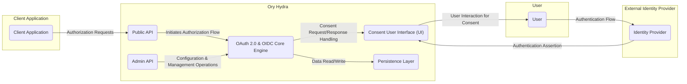
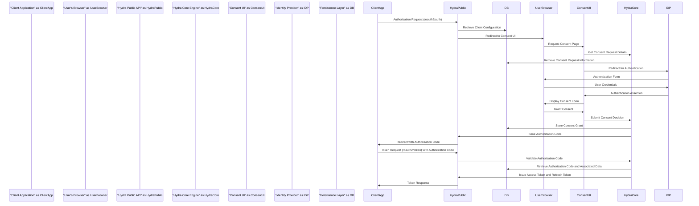

# Project Design Document: Ory Hydra

**Version:** 1.1
**Date:** October 26, 2023
**Author:** AI Software Architect

## 1. Introduction

This document provides an enhanced and detailed design overview of the Ory Hydra project, an open-source, standards-compliant OAuth 2.0 and OpenID Connect provider. The primary goal of this document is to clearly articulate the architecture, individual components, and critical data flows within Hydra. This detailed design serves as a foundational resource for conducting comprehensive threat modeling and security assessments, enabling a deeper understanding of the system's internal workings and potential vulnerabilities.

## 2. Goals and Objectives

The fundamental goals of Ory Hydra are to deliver:

* **Strict Adherence to OAuth 2.0 and OpenID Connect Specifications:** Ensuring compliance with industry standards for secure and interoperable authorization and authentication.
* **Scalable and Resilient Stateless Operation:**  Architected for high availability and horizontal scaling by minimizing reliance on stateful dependencies within the core service.
* **Dedicated Authorization Server Functionality:**  Focusing solely on authorization responsibilities, delegating user authentication and identity management to external, specialized Identity Providers.
* **Highly Flexible and Customizable Integration:**  Designed to seamlessly integrate with a diverse range of external Identity Providers and accommodate custom business logic extensions.
* **Robust Security and Comprehensive Auditability:**  Implementing security best practices throughout the design and providing detailed logging capabilities for monitoring and incident response.

This design document specifically aims to:

* Provide a clear and comprehensive description of each architectural component within Ory Hydra.
* Illustrate the critical data flows involved in core authorization and authentication processes.
* Precisely identify key security boundaries, trust zones, and sensitive data handling procedures.
* Establish a solid and detailed foundation for subsequent threat modeling and vulnerability analysis activities.

## 3. High-Level Architecture

Ory Hydra functions as a centralized authorization server, orchestrating interactions between client applications, end-users (via external Identity Providers), and a persistent data store.

**Architectural Components:**

* **Client Application:**  Any application (web, mobile, desktop, etc.) that initiates authorization requests to access protected resources on behalf of a user.
* **User:** The end-user who interacts with the system, authenticates with the Identity Provider, and grants or denies consent.
* **Ory Hydra:** The core authorization server responsible for managing authorization flows.
    * **Public API:**  The publicly accessible API endpoints that implement the OAuth 2.0 and OIDC specifications (e.g., `/oauth2/auth`, `/oauth2/token`, `/oauth2/revoke`, `/openid/v1/userinfo`).
    * **Admin API:**  A privileged API used for managing Hydra's configuration, including registering and managing OAuth 2.0 clients, defining scopes, and managing JSON Web Keys (JWKs).
    * **Consent User Interface (UI):** The user interface (often a separate, customizable application) responsible for presenting consent requests to the user and capturing their decisions. Hydra redirects users to this UI.
    * **OAuth 2.0 & OIDC Core Engine:**  The central component that implements the core logic of the OAuth 2.0 and OpenID Connect specifications, including handling various grant types, issuing and validating tokens, and managing authorization flows.
    * **Persistence Layer:**  The abstraction layer responsible for interacting with the underlying data store, abstracting away the specific database implementation.
* **External Identity Provider:**  A separate system responsible for authenticating users and asserting their identity (e.g., username/password databases, social login providers, enterprise identity systems).

## 4. Detailed Component Descriptions

* **Client Application:**
    * Initiates OAuth 2.0 authorization requests to the Hydra Public API.
    * Receives and processes authorization codes, access tokens, and refresh tokens from Hydra.
    * Presents access tokens to resource servers to access protected resources.
    * Is uniquely identified by a `client_id` and may possess a `client_secret` for authentication with Hydra.
    * Must be pre-registered with Hydra, including specifying allowed `redirect_uri` values.

* **User:**
    * Authenticates their identity with an external Identity Provider.
    * Interacts with the Consent UI to review the permissions requested by a Client Application and explicitly grant or deny access.

* **Ory Hydra - Public API:**
    * Accepts and processes incoming OAuth 2.0 authorization requests (e.g., via the `/oauth2/auth` endpoint).
    * Validates client credentials (if provided) and the parameters of the authorization request.
    * Initiates the appropriate authorization flow based on the `response_type` and `grant_type`.
    * Issues authorization codes, access tokens, and refresh tokens upon successful authorization.
    * Provides endpoints for token introspection (`/oauth2/introspect`) and revocation (`/oauth2/revoke`).
    * Implements various OAuth 2.0 grant types, including authorization code, client credentials, refresh token, and implicit grants.
    * Implements OpenID Connect flows for user authentication, including the issuance of ID Tokens.

* **Ory Hydra - Admin API:**
    * Provides a set of privileged endpoints for managing OAuth 2.0 clients (creation, retrieval, update, deletion).
    * Allows administrators to configure scopes, define access policies, and manage trust relationships.
    * Enables the management of JSON Web Keys (JWKs) used for signing and verifying JWTs (including access tokens and ID tokens).
    * Typically requires strong authentication and authorization (e.g., API keys or bearer tokens with specific scopes) to access.

* **Ory Hydra - Consent User Interface (UI):**
    * Receives consent requests from the OAuth 2.0 & OIDC Core Engine, typically via redirects.
    * Presents a user-friendly interface displaying the Client Application's name, the requested permissions (scopes), and a description of what these permissions entail.
    * Allows the User to make an informed decision to grant or deny the requested access.
    * Communicates the User's consent decision back to the OAuth 2.0 & OIDC Core Engine, often through a redirect back to Hydra.
    * **Important:** The Consent UI is often implemented as a separate application, allowing for customization of the user experience. Hydra provides hooks and APIs for integration.

* **Ory Hydra - OAuth 2.0 & OIDC Core Engine:**
    * Acts as the central orchestrator for all OAuth 2.0 and OIDC flows.
    * Validates incoming requests against the configured clients, scopes, and policies.
    * Interacts with the Persistence Layer to retrieve and store client configurations, granted consents, and other necessary data.
    * Communicates with the Consent UI to obtain explicit user consent when required.
    * Generates and cryptographically signs access tokens, refresh tokens, and ID tokens (as JWTs).
    * Handles token revocation requests, invalidating tokens in the Persistence Layer.

* **Ory Hydra - Persistence Layer:**
    * Provides an abstraction over the underlying data storage mechanism.
    * Stores OAuth 2.0 client configurations, including client IDs, secrets, redirect URIs, allowed grant types, and scopes.
    * Persists records of granted consents, associating users with the permissions they have granted to specific clients.
    * Stores authorization codes (temporarily) and refresh tokens.
    * May store access token metadata for revocation purposes.
    * Stores JSON Web Keys (JWKs) used for signing tokens.
    * Supports various relational database backends (e.g., PostgreSQL, MySQL, CockroachDB) and potentially other storage mechanisms.

* **External Identity Provider:**
    * Authenticates Users based on their credentials (e.g., username/password, multi-factor authentication).
    * Provides assertions of user identity to Hydra, often through protocols like OpenID Connect (acting as an OP) or SAML.
    * May provide user attributes (claims) that can be included in ID Tokens issued by Hydra.
    * The integration mechanism between Hydra and the Identity Provider needs to be securely configured.

## 5. Data Flow: Authorization Code Grant

The following sequence diagram illustrates the data flow for a typical OAuth 2.0 Authorization Code Grant flow, a commonly used and secure flow:

**Key Data Elements in the Flow:**

* **Authorization Request:**  A request from the Client Application to the Hydra Public API, initiating the authorization flow. Contains parameters like `response_type`, `client_id`, `redirect_uri`, and `scope`.
* **Client Configuration:**  Data stored in the Persistence Layer about registered Client Applications, including their `client_id`, `client_secret` (if any), allowed `redirect_uri` values, and granted scopes.
* **Authentication Assertion:**  A statement from the Identity Provider confirming the User's identity, used by the Consent UI to associate the User with the consent request.
* **Consent Decision:** The User's explicit choice to grant or deny the requested permissions.
* **Authorization Code:** A short-lived, single-use code issued by Hydra, which the Client Application exchanges for access and refresh tokens.
* **Access Token:** A credential that the Client Application uses to access protected resources on behalf of the User.
* **Refresh Token:** A long-lived credential that the Client Application can use to obtain new access tokens without requiring the User to re-authenticate.
* **Token Request:** A request from the Client Application to the Hydra Public API to exchange the authorization code for access and refresh tokens.

## 6. Key Security Considerations for Threat Modeling

This design highlights several critical areas that require careful consideration during threat modeling:

* **Client Authentication and Authorization:**
    * **Threats:**  Bypassing client authentication, unauthorized client registration, privilege escalation through client manipulation.
    * **Considerations:**  Strength of client secrets, secure storage of client credentials, validation of `redirect_uri`, enforcement of allowed grant types.
* **Authorization Flow Security:**
    * **Threats:** Authorization code interception and replay, Cross-Site Request Forgery (CSRF) attacks on the authorization endpoint, attacks targeting the Consent UI.
    * **Considerations:**  State parameter usage, PKCE (Proof Key for Code Exchange) implementation, secure communication channels (TLS), input validation on all request parameters.
* **Token Security (Access Tokens, Refresh Tokens, ID Tokens):**
    * **Threats:** Token theft, token forgery, token leakage, replay attacks using tokens.
    * **Considerations:**  Secure generation of tokens (cryptographically strong random values), appropriate token lifetimes, secure storage and transmission of tokens, use of HTTPS, JWT signing and encryption, token revocation mechanisms.
* **Consent Management Security:**
    * **Threats:**  Consent bypass, misleading consent screens, manipulation of consent decisions.
    * **Considerations:**  Secure implementation of the Consent UI, clear and understandable presentation of permissions, prevention of UI redressing, integrity of the consent decision transmission.
* **Admin API Security:**
    * **Threats:** Unauthorized access to administrative functions, manipulation of client configurations, key compromise.
    * **Considerations:**  Strong authentication and authorization for the Admin API, role-based access control, audit logging of administrative actions, secure storage of API keys or credentials.
* **Persistence Layer Security:**
    * **Threats:**  Data breaches, unauthorized access to sensitive data (client secrets, refresh tokens, consent grants), data integrity violations.
    * **Considerations:**  Encryption at rest and in transit, access control mechanisms, regular security audits of the database infrastructure.
* **Consent UI Security:**
    * **Threats:** Cross-Site Scripting (XSS) vulnerabilities, CSRF attacks, information disclosure.
    * **Considerations:**  Secure coding practices, input validation, output encoding, protection against common web vulnerabilities.
* **Integration with External Identity Providers:**
    * **Threats:**  Man-in-the-middle attacks during authentication, insecure exchange of authentication assertions, vulnerabilities in the Identity Provider itself.
    * **Considerations:**  Use of secure protocols (e.g., HTTPS), validation of Identity Provider signatures, secure configuration of trust relationships.
* **Input Validation and Output Encoding:**
    * **Threats:** Injection attacks (SQL injection, command injection, etc.), Cross-Site Scripting (XSS).
    * **Considerations:**  Thorough validation of all input data received by Hydra, proper encoding of output data to prevent interpretation as code.
* **Rate Limiting and Denial of Service (DoS) Prevention:**
    * **Threats:**  Overwhelming the service with requests, resource exhaustion.
    * **Considerations:**  Implementation of rate limiting on API endpoints, protection against distributed denial-of-service (DDoS) attacks.
* **Logging and Auditing:**
    * **Threats:**  Lack of visibility into security events, difficulty in incident response.
    * **Considerations:**  Comprehensive logging of authentication and authorization events, administrative actions, and errors; secure storage and management of logs.

## 7. Deployment Architecture Considerations

Ory Hydra is designed for deployment as a stateless service, commonly leveraging containerization technologies like Docker and orchestration platforms like Kubernetes.

* **Stateless Design:** Facilitates horizontal scaling by allowing multiple instances of Hydra to handle requests without sharing session state. This enhances resilience and availability.
* **Database Dependency:**  Requires a reliable and persistent database backend to store configuration, grants, and tokens. The choice of database can impact performance and scalability.
* **Load Balancing:**  Essential for distributing traffic across multiple Hydra instances, improving performance and fault tolerance.
* **Transport Layer Security (TLS):**  Mandatory for securing all communication channels, especially between clients and Hydra, and between Hydra and the Consent UI. TLS termination can occur at a reverse proxy or directly at the Hydra instances.
* **Reverse Proxy:**  Often deployed in front of Hydra to handle TLS termination, routing, and potentially other security functions like web application firewall (WAF) capabilities.
* **Containerization (Docker):**  Packages Hydra and its dependencies into a consistent and portable unit, simplifying deployment and management.
* **Orchestration (Kubernetes):**  Automates the deployment, scaling, and management of Hydra containers, providing features like health checks, auto-scaling, and self-healing.

## 8. Assumptions and Constraints

* **Secure Network Infrastructure:**  The underlying network where Hydra is deployed is assumed to be adequately secured, with appropriate firewall rules and network segmentation.
* **Robust Key Management Practices:**  The security of cryptographic keys used for signing and encrypting tokens is paramount. Secure key generation, storage, rotation, and access control are assumed.
* **Security of External Identity Providers:**  The security posture of the integrated Identity Providers is a critical dependency. Vulnerabilities in the Identity Provider can impact Hydra's overall security.
* **Regular Security Updates and Patching:**  The Ory Hydra software and its dependencies require regular updates and patching to address newly discovered vulnerabilities.
* **Secure Configuration Management:**  The configuration of Hydra, including client registrations and security settings, must be managed securely to prevent unauthorized modifications.
* **Compliance with Security Best Practices:**  The development and deployment of applications interacting with Hydra adhere to general security best practices.

This improved document provides a more detailed and comprehensive design overview of the Ory Hydra project, with a strong focus on security considerations relevant for threat modeling. This enhanced information should facilitate a more thorough and effective security assessment of the system.
