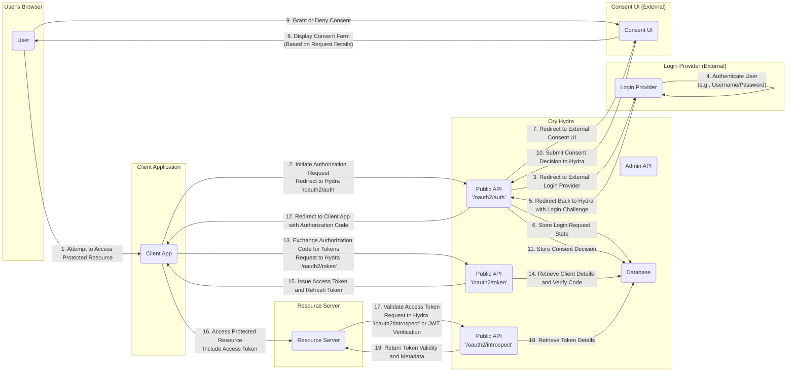

# Project Design Document: Ory Hydra

**Version:** 1.1
**Date:** October 26, 2023
**Author:** AI Software Architect

## 1. Introduction

This document provides an enhanced and detailed design overview of the Ory Hydra project, an open-source OAuth 2.0 and OpenID Connect provider. This document is intended to serve as a robust foundation for subsequent threat modeling activities. It clearly defines the system's boundaries, components, and interactions, enabling security professionals to identify potential vulnerabilities and design appropriate mitigations.

### 1.1. Purpose

The primary purpose of this document is to provide a comprehensive and refined architectural understanding of Ory Hydra to facilitate effective and targeted threat modeling. It aims to precisely define the system's boundaries, internal components, and external interactions, empowering security engineers to systematically identify potential security weaknesses and devise appropriate countermeasures.

### 1.2. Scope

This document comprehensively covers the core architectural aspects of Ory Hydra, including a detailed breakdown of its key components, a precise depiction of data flow during authentication and authorization processes, and a thorough examination of common deployment scenarios. The focus remains on the server-side components of Hydra, deliberately excluding specifics of client application implementations and the intricacies of the user interface for consent management, which is intentionally delegated to the integrator for maximum flexibility.

### 1.3. Target Audience

This document is specifically intended for:

* Security Engineers and Architects: Those responsible for conducting threat modeling exercises, performing security assessments, and defining security requirements.
* Software Developers: Individuals actively working with or integrating Ory Hydra into their applications and services.
* DevOps and Operations Teams: Personnel responsible for the deployment, configuration, maintenance, and monitoring of Ory Hydra in various environments.

## 2. System Overview

Ory Hydra is a stateless, API-first, and standards-compliant OAuth 2.0 and OpenID Connect provider. It functions as a centralized and authoritative service for managing authentication and authorization within complex and distributed systems. A key design principle of Hydra is its separation of concerns: it does not directly handle user authentication or consent decisions. Instead, it strategically delegates these crucial responsibilities to external, integrator-provided services. This architectural choice promotes significant flexibility, allowing integrators to tailor user authentication and consent experiences to their specific needs and security requirements.

### 2.1. Key Features

* **Standards-Compliant OAuth 2.0 Authorization Server:** Implements the full spectrum of the OAuth 2.0 specification, enabling the secure issuance of access tokens, refresh tokens, and authorization codes.
* **Certified OpenID Connect Provider:**  Provides verifiable identity information about successfully authenticated users through the issuance of digitally signed ID Tokens, adhering to the OpenID Connect standard.
* **Designed for Stateless Operation:**  Architected to be inherently stateless, facilitating horizontal scalability, improved resilience, and simplified deployment in distributed environments.
* **Pluggable and Extensible Authentication and Consent Framework:**  Intentionally relies on external services for core user login and consent management functionalities, offering unparalleled flexibility and customization options for integrators.
* **Leverages JSON Web Tokens (JWT):**  Employs industry-standard JWTs for the secure and verifiable representation of access tokens and ID tokens.
* **Secure Admin API:**  Exposes a robust and secure RESTful API, typically protected by API keys or mutual TLS, for managing critical configurations, including OAuth 2.0 clients, scopes, and JSON Web Keys (JWKs).
* **Publicly Accessible API:**  Provides a set of well-defined public API endpoints essential for core OAuth 2.0 and OpenID Connect flows, including token issuance, introspection, and revocation.

## 3. Key Components

Ory Hydra is composed of several distinct yet interconnected components that collaborate to deliver its core authentication and authorization capabilities.

* **Admin API:**
    *  A secure RESTful API, typically accessed over HTTPS and secured using mechanisms like API keys or mutual TLS authentication.
    *  Provides administrative functionalities for managing the lifecycle of OAuth 2.0 clients (representing applications), defining and managing permission scopes, uploading and managing JSON Web Keys (JWKs) used for token signing and verification, and configuring other operational settings.
    *  Primarily intended for use by administrators, automated provisioning scripts, or trusted backend services.
* **Public API:**
    *  A publicly accessible RESTful API, designed for interaction with client applications and, in some cases, end-users (through browser redirects).
    *  Offers critical endpoints for:
        *  Initiating the OAuth 2.0 authorization code grant flow, guiding users through the authorization process.
        *  Exchanging authorization codes for access tokens and refresh tokens, enabling secure access to protected resources.
        *  Refreshing expired access tokens using refresh tokens, maintaining user sessions without requiring repeated authentication.
        *  Introspecting tokens, allowing resource servers to verify the validity and metadata of access tokens.
        *  Revoking issued tokens, providing a mechanism to terminate access.
        *  Serving the OpenID Connect discovery document (`/.well-known/openid-configuration`), enabling clients to dynamically discover the provider's configuration.
        *  Providing access to the JSON Web Key Set (JWKS) (`/jwks.json`), allowing clients and resource servers to verify the signatures of JWT-based tokens.
* **Consent User Interface (External, Integrator-Provided):**
    *  **A fundamental aspect of Hydra's design is its deliberate omission of a built-in consent UI.**
    *  Integrators bear the responsibility of developing and deploying their own custom user interface to manage user login and consent decisions, ensuring a tailored user experience.
    *  Hydra orchestrates the consent flow by redirecting the user's browser to this external service during the authorization process.
    *  The custom consent UI interacts with specific Hydra endpoints (`/oauth2/auth/requests/login` and `/oauth2/auth/requests/consent`) to retrieve details about pending requests and submit the user's authentication and consent decisions back to Hydra.
* **Login Provider (External, Integrator-Provided):**
    *  Mirroring the consent UI, Hydra delegates the crucial task of user authentication to an external service implemented by the integrator.
    *  Integrators are responsible for building a login provider that securely handles the verification of user credentials (e.g., username/password, multi-factor authentication).
    *  Hydra initiates the authentication process by redirecting the user to this external login provider.
    *  The login provider communicates the outcome of the authentication process back to Hydra via the `/oauth2/auth/requests/login` endpoint, providing details about the authenticated user.
* **Database:**
    *  Hydra relies on a persistent database to maintain the state and configuration necessary for its operation. This includes storing:
        *  Detailed configurations for registered OAuth 2.0 clients, including their allowed grant types, redirect URIs, and secrets.
        *  Records of granted consents, documenting the permissions users have authorized for specific clients.
        *  Issued authorization codes, access tokens, and refresh tokens (the storage mechanism and duration are configurable).
        *  The current state of ongoing login and consent requests, ensuring proper flow management.
    *  Hydra offers flexibility in database backend selection, supporting popular options such as PostgreSQL, MySQL, and CockroachDB.
* **Cache (Optional):**
    *  An optional caching layer, often implemented using technologies like Redis or Memcached, can be integrated to enhance performance.
    *  The cache is used to store frequently accessed data, such as client configurations and JSON Web Keys (JWKs), reducing database load and improving response times.
* **Configuration:**
    *  Hydra's behavior and operational parameters are configured through a variety of mechanisms, including environment variables, command-line flags, and configuration files.
    *  Key configuration settings include database connection strings, URLs for external services (login and consent UIs), token signing keys, and various security-related parameters.
* **Metrics and Logging:**
    *  Hydra exposes operational metrics in the Prometheus format, enabling comprehensive monitoring of its performance and health.
    *  Generates detailed logs that provide valuable insights for auditing security events, debugging issues, and tracking system activity.

## 4. Data Flow

The following diagram illustrates a simplified yet representative data flow for a standard OAuth 2.0 Authorization Code Grant flow involving Ory Hydra:

**Detailed Step-by-Step Explanation:**

1. **User Attempts to Access Protected Resource:** A user attempts to access a resource within the client application that requires authentication and authorization.
2. **Initiate Authorization Request:** The client application redirects the user's browser to Hydra's `/oauth2/auth` endpoint, including essential parameters such as `client_id`, `redirect_uri`, `response_type` (typically `code`), and `scope`.
3. **Redirect to External Login Provider:** Hydra, based on its configuration, redirects the user to the URL of the externally provided login provider.
4. **User Authentication:** The external login provider authenticates the user, typically by collecting and verifying credentials like username and password, or through other authentication methods.
5. **Redirect Back to Hydra with Login Challenge:** Upon successful authentication, the login provider redirects the user back to Hydra, including a login challenge identifier.
6. **Store Login Request State:** Hydra stores the state of the login request in its database, ensuring that the subsequent steps are associated with the correct initial request.
7. **Redirect to External Consent UI:** Hydra redirects the user to the URL of the externally provided consent user interface.
8. **Display Consent Form:** The consent UI retrieves details about the pending authorization request from Hydra and presents a user-friendly form, outlining the permissions the client application is requesting.
9. **Grant or Deny Consent:** The user reviews the requested permissions and makes a decision to either grant or deny consent.
10. **Submit Consent Decision to Hydra:** The consent UI submits the user's decision back to Hydra.
11. **Store Consent Decision:** Hydra records the user's consent decision in its database.
12. **Redirect to Client App with Authorization Code:** If consent is granted, Hydra redirects the user back to the client application's specified `redirect_uri`, including an authorization code.
13. **Exchange Authorization Code for Tokens:** The client application sends a request to Hydra's `/oauth2/token` endpoint, presenting the authorization code along with its client credentials.
14. **Retrieve Client Details and Verify Code:** Hydra retrieves the client's configuration and verifies the provided authorization code against the stored request.
15. **Issue Access Token and Refresh Token:** Upon successful verification, Hydra issues an access token (and optionally a refresh token) to the client application.
16. **Access Protected Resource:** The client application uses the issued access token to make requests to the protected resource server.
17. **Validate Access Token:** The resource server validates the received access token. This can be done by calling Hydra's `/oauth2/introspect` endpoint or by directly verifying the JWT signature using Hydra's public keys (JWKS).
18. **Retrieve Token Details:** Hydra (in the case of introspection) retrieves the details associated with the access token from its database or verifies the JWT signature.
19. **Return Token Validity and Metadata:** Hydra (or the JWT verification process) returns the validity status of the access token and associated metadata to the resource server, allowing it to make authorization decisions.

## 5. Deployment Architecture

Ory Hydra's stateless design allows for flexible deployment across various infrastructure environments. Common deployment architectures include:

* **Containerized Deployment (Docker, Kubernetes):** This is the generally recommended approach for production environments due to its scalability, resilience, and ease of management.
    *  Hydra is typically deployed as a set of Docker containers.
    *  The underlying database can be deployed separately, either within the same Kubernetes cluster or as an external managed service.
    *  Load balancers are essential for distributing traffic across multiple instances of Hydra, ensuring high availability and fault tolerance.
* **Cloud Platforms (AWS, Azure, GCP):** Major cloud providers offer services that seamlessly integrate with containerized applications like Hydra.
    *  Utilizing services like AWS ECS/EKS, Azure Container Instances/AKS, or Google Kubernetes Engine simplifies deployment and management.
    *  Cloud-managed database services (e.g., AWS RDS, Azure SQL Database, Google Cloud SQL) provide scalable and reliable persistence.
    *  Cloud-native load balancing and auto-scaling capabilities can be readily leveraged to optimize performance and resilience.
* **Self-Managed Infrastructure (Virtual Machines, Bare Metal):** While less common for large-scale deployments, Hydra can be deployed on traditional infrastructure.
    *  Requires manual configuration and management of the operating system, networking, and database.
    *  Load balancing and high availability need to be implemented manually.

**Critical Deployment Considerations:**

* **High Availability and Redundancy:** Deploying multiple instances of Hydra behind a load balancer is crucial for ensuring continuous availability and fault tolerance.
* **Database Scalability and Resilience:** The database is a critical dependency; ensure it is configured for scalability and has appropriate backup and recovery mechanisms in place.
* **Secure Communication (TLS/HTTPS):** All communication with Hydra, especially the public API, must be secured using TLS (HTTPS) to protect sensitive data in transit.
* **Secure Secret Management:** Implement robust mechanisms for securely storing and managing sensitive secrets, such as API keys, database credentials, and private keys used for token signing. Consider using dedicated secret management solutions.
* **Comprehensive Monitoring and Logging:** Implement thorough monitoring of Hydra's performance, resource utilization, and error rates. Centralized logging is essential for auditing, debugging, and security analysis.
* **Network Security:** Properly configure network firewalls and security groups to restrict access to Hydra's ports and services, limiting exposure to potential threats.

## 6. Security Considerations (Detailed for Threat Modeling)

This section expands on the initial security considerations, providing a more detailed breakdown for effective threat modeling.

* **Admin API Security:**
    *  **Authentication and Authorization:** Implement strong authentication mechanisms (e.g., mutual TLS, strong API keys with proper rotation) and fine-grained authorization controls to restrict access to administrative functions.
    *  **Input Validation:** Rigorously validate all input received by the Admin API to prevent injection attacks (e.g., command injection, NoSQL injection).
    *  **Protection Against Brute-Force Attacks:** Implement rate limiting and account lockout policies to mitigate brute-force attempts against administrative credentials.
* **Public API Security:**
    *  **Rate Limiting:** Implement rate limiting on all public API endpoints to prevent denial-of-service attacks and abuse.
    *  **Input Validation:** Thoroughly validate all input parameters to prevent injection vulnerabilities and other input-related attacks.
    *  **Protection Against Open Redirects:** Carefully validate redirect URIs to prevent attackers from leveraging Hydra for phishing attacks.
* **Data Protection:**
    *  **Encryption at Rest:** Encrypt sensitive data stored in the database, including client secrets and potentially refresh tokens.
    *  **Encryption in Transit:** Enforce the use of TLS (HTTPS) for all communication with Hydra to protect data confidentiality and integrity.
    *  **Secure Handling of Secrets:**  Avoid storing secrets directly in code or configuration files. Utilize secure secret management solutions.
* **External Component Security (Login Provider and Consent UI):**
    *  **Secure Communication:** Ensure all communication between Hydra and the external login provider and consent UI is secured using TLS.
    *  **Input Validation:** The external components must also implement robust input validation to prevent vulnerabilities.
    *  **Protection Against CSRF:** Implement CSRF protection mechanisms in the consent UI to prevent unauthorized actions.
    *  **Authentication of External Components:**  Consider mechanisms to authenticate the external login provider and consent UI to Hydra.
* **Token Security:**
    *  **Strong Signing Keys:** Use strong, randomly generated private keys for signing JWTs. Rotate these keys regularly.
    *  **Secure Key Storage:** Protect the private keys used for signing tokens.
    *  **Appropriate Token Lifetimes:** Configure appropriate expiration times for access and refresh tokens to minimize the window of opportunity for misuse.
    *  **Token Revocation:** Implement and utilize token revocation mechanisms to invalidate compromised or no longer needed tokens.
* **General Security Practices:**
    *  **Regular Security Audits and Penetration Testing:** Conduct periodic security assessments to identify and address potential vulnerabilities.
    *  **Dependency Management:** Keep all dependencies up-to-date to patch known security vulnerabilities.
    *  **Secure Configuration Management:**  Implement secure configuration practices and avoid using default or insecure configurations.
    *  **Logging and Monitoring:** Maintain comprehensive audit logs and implement real-time monitoring for security events.

## 7. Assumptions and Constraints

* It is assumed that integrators will develop and maintain secure and reliable external Login Provider and Consent UI components, adhering to security best practices.
* All communication with Ory Hydra will be conducted over HTTPS, ensuring encryption in transit.
* The underlying infrastructure (network, servers, cloud environment) is assumed to be configured with reasonable security measures in place.
* This design document focuses on the core functionality and common deployment scenarios of Ory Hydra and may not cover all possible configurations, extensions, or edge cases.

## 8. Future Considerations

* **Detailed Threat Modeling Exercises:** Conduct comprehensive threat modeling sessions based on this design document to identify specific threats and vulnerabilities.
* **Development of Security Best Practices Guide:** Create a detailed guide outlining security best practices for integrating with and deploying Ory Hydra.
* **Performance Optimization Strategies:** Explore and document strategies for optimizing the performance and scalability of Ory Hydra deployments.
* **Disaster Recovery and Business Continuity Planning:** Develop and document plans for disaster recovery and business continuity to ensure the resilience of the authentication and authorization infrastructure.
* **Integration with Hardware Security Modules (HSMs):** Investigate and document options for integrating with HSMs for enhanced security of token signing keys.
* **Formal Security Verification:** Consider formal security verification methods for critical components of the system.