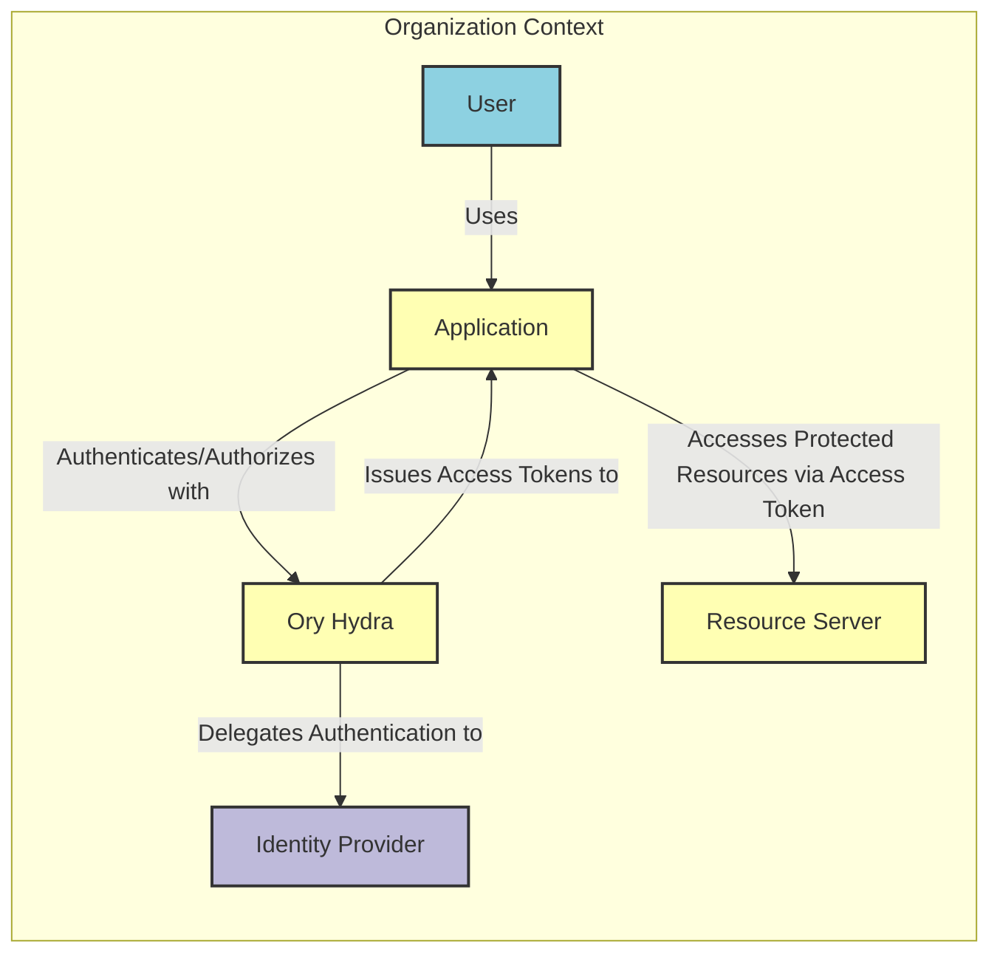
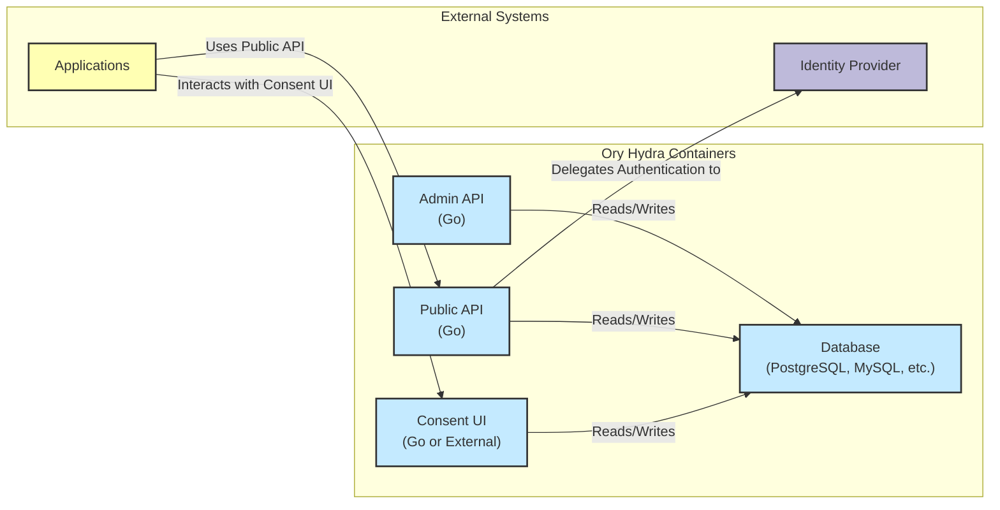
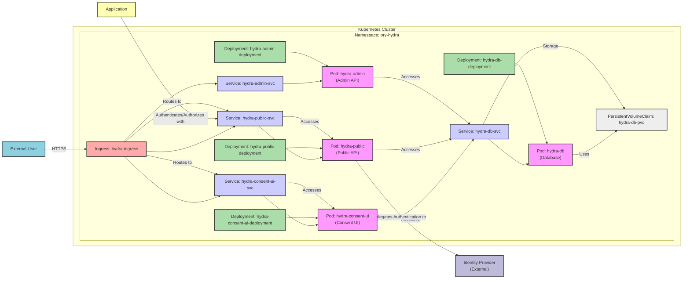
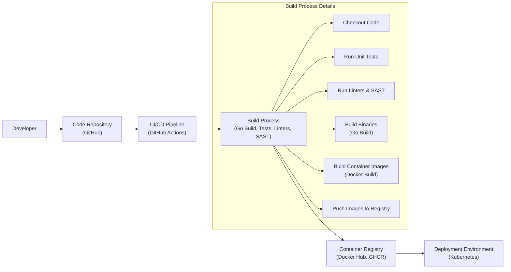

# BUSINESS POSTURE

Ory Hydra is an OpenID Certified OAuth 2.0 and OpenID Connect provider that is designed for cloud native environments and microservices architectures. It is focused on providing secure authentication and authorization without managing user accounts or storing sensitive user data. It delegates user management to external identity providers.

Business Priorities and Goals:
- Provide secure authentication and authorization for applications and services.
- Simplify identity management by delegating user management to external systems.
- Enable fine-grained access control based on OAuth 2.0 scopes and policies.
- Support modern authentication standards like OAuth 2.0 and OpenID Connect.
- Offer a scalable and performant authorization solution for cloud-native environments.
- Reduce the complexity and risk associated with building and maintaining a custom authorization server.
- Ensure compliance with industry security standards and best practices for authentication and authorization.

Business Risks:
- Availability and reliability of Ory Hydra service impacting all dependent applications.
- Security vulnerabilities in Ory Hydra potentially leading to unauthorized access to protected resources.
- Misconfiguration of Ory Hydra leading to security breaches or operational issues.
- Integration complexity with existing identity providers and applications.
- Performance bottlenecks in Ory Hydra affecting application responsiveness.
- Vendor lock-in if heavily reliant on Ory Hydra specific features.
- Compliance risks if Ory Hydra is not configured or used correctly in regulated industries.

# SECURITY POSTURE

Existing Security Controls:
- security control: OAuth 2.0 and OpenID Connect standards compliance. Implemented as core functionality of Ory Hydra.
- security control: Separation of concerns by delegating user authentication and management to external identity providers. Described in Ory Hydra documentation and architecture.
- security control: Policy-based access control using OAuth 2.0 scopes and access control policies. Implemented as core functionality of Ory Hydra.
- security control: HTTPS enforced for all communication. Recommended best practice and likely enforced in deployment configurations.
- security control: Secure storage of configuration and operational data in a database. Assumed based on typical application architecture.
- security control: Audit logging of security-relevant events. Likely implemented as a standard feature for security and compliance.
- security control: Input validation and output encoding to prevent common web vulnerabilities. Implemented within Ory Hydra codebase.
- security control: Regular security updates and patching. Part of Ory project maintenance and release cycle.

Accepted Risks:
- accepted risk: Reliance on external identity providers for user authentication security. Assumed to be managed by choosing reputable and secure identity providers.
- accepted risk: Complexity of OAuth 2.0 and OpenID Connect configuration potentially leading to misconfigurations. Mitigated by documentation and best practices.
- accepted risk: Potential vulnerabilities in underlying dependencies and libraries. Mitigated by dependency scanning and regular updates.

Recommended Security Controls:
- security control: Implement a Web Application Firewall (WAF) in front of Ory Hydra to protect against common web attacks.
- security control: Regularly perform penetration testing and vulnerability scanning of Ory Hydra deployments.
- security control: Implement rate limiting and request throttling to prevent denial-of-service attacks.
- security control: Use a dedicated and hardened database server for Ory Hydra data.
- security control: Implement robust monitoring and alerting for security events and anomalies.
- security control: Secure secret management for cryptographic keys and database credentials.
- security control: Implement a Security Information and Event Management (SIEM) system to aggregate and analyze security logs.

Security Requirements:
- Authentication:
    - requirement: Ory Hydra must support OAuth 2.0 Authorization Code Grant, Client Credentials Grant, and other relevant OAuth 2.0 flows.
    - requirement: Ory Hydra must support OpenID Connect for user authentication and identity federation.
    - requirement: Ory Hydra must integrate with various identity providers via standard protocols like OpenID Connect and SAML.
    - requirement: Ory Hydra must support multi-factor authentication (MFA) through integration with identity providers.
- Authorization:
    - requirement: Ory Hydra must enforce policy-based access control based on OAuth 2.0 scopes and custom policies.
    - requirement: Ory Hydra must support fine-grained authorization decisions based on user attributes and context.
    - requirement: Ory Hydra must provide APIs for policy management and enforcement.
    - requirement: Ory Hydra must support different authorization models like Attribute-Based Access Control (ABAC) and Role-Based Access Control (RBAC).
- Input Validation:
    - requirement: Ory Hydra must validate all inputs to prevent injection attacks (e.g., SQL injection, Cross-Site Scripting).
    - requirement: Ory Hydra must sanitize and encode outputs to prevent Cross-Site Scripting (XSS) vulnerabilities.
    - requirement: Ory Hydra must implement input validation for all API endpoints and user interfaces.
    - requirement: Ory Hydra must handle invalid inputs gracefully and provide informative error messages without revealing sensitive information.
- Cryptography:
    - requirement: Ory Hydra must use strong cryptography for all sensitive data at rest and in transit.
    - requirement: Ory Hydra must securely store and manage cryptographic keys.
    - requirement: Ory Hydra must use TLS/HTTPS for all communication channels.
    - requirement: Ory Hydra must support industry-standard cryptographic algorithms and protocols.

# DESIGN

## C4 CONTEXT

Context Diagram Elements:

- Element:
    - Name: User
    - Type: Person
    - Description: End-user who wants to access applications and resources.
    - Responsibilities: Authenticates with Identity Provider, uses Applications.
    - Security controls: User-managed credentials, multi-factor authentication (if enabled by Identity Provider).

- Element:
    - Name: Application
    - Type: Software System
    - Description: Client application (web, mobile, or service) that needs to authenticate users and access protected resources.
    - Responsibilities: Redirects users to Ory Hydra for authentication, requests access tokens, accesses Resource Servers using access tokens.
    - Security controls: Securely stores client credentials (if applicable), implements proper OAuth 2.0 client flow, validates access tokens.

- Element:
    - Name: Ory Hydra
    - Type: Software System
    - Description: OpenID Certified OAuth 2.0 and OpenID Connect provider responsible for issuing access tokens and managing authorization policies.
    - Responsibilities: Authenticates Applications, delegates user authentication to Identity Providers, issues access tokens and refresh tokens, enforces authorization policies, manages OAuth 2.0 clients and scopes.
    - Security controls: Input validation, output encoding, secure session management, secure storage of secrets, access control to admin APIs, audit logging, rate limiting, TLS/HTTPS.

- Element:
    - Name: Identity Provider
    - Type: External System
    - Description: External system responsible for managing user identities and authenticating users. Examples include Active Directory, Google, Okta, Keycloak.
    - Responsibilities: User authentication, user management, identity provisioning.
    - Security controls: User authentication mechanisms (passwords, MFA, biometrics), access control to user management interfaces, secure storage of user credentials, audit logging.

- Element:
    - Name: Resource Server
    - Type: Software System
    - Description: API or service that hosts protected resources and requires valid access tokens for access.
    - Responsibilities: Validates access tokens, enforces authorization based on scopes, provides access to protected resources.
    - Security controls: Access token validation, scope enforcement, input validation, output encoding, authorization logic, audit logging, TLS/HTTPS.

## C4 CONTAINER

Container Diagram Elements:

- Element:
    - Name: Admin API
    - Type: Container
    - Description: Provides administrative REST API for managing Ory Hydra configuration, clients, policies, and other administrative tasks. Implemented in Go.
    - Responsibilities: Configuration management, client management, policy management, system monitoring, and health checks.
    - Security controls: Authentication and authorization for admin access (e.g., API keys, RBAC), input validation, output encoding, audit logging, TLS/HTTPS.

- Element:
    - Name: Public API
    - Type: Container
    - Description: Provides public REST API for OAuth 2.0 and OpenID Connect flows, token issuance, introspection, and revocation. Implemented in Go.
    - Responsibilities: OAuth 2.0 and OpenID Connect protocol implementation, token issuance, token validation, token revocation, consent management delegation, interaction with Identity Providers.
    - Security controls: Input validation, output encoding, secure session management, rate limiting, TLS/HTTPS, OAuth 2.0 and OpenID Connect security best practices.

- Element:
    - Name: Consent UI
    - Type: Container
    - Description: User interface for handling consent requests during OAuth 2.0 authorization flows. Can be a built-in component or an external application. Implemented in Go or can be replaced by a custom UI.
    - Responsibilities: Presenting consent requests to users, collecting user consent decisions, interacting with the Public API to process consent.
    - Security controls: Input validation, output encoding, secure session management, protection against CSRF, TLS/HTTPS. If external, secure communication with Public API.

- Element:
    - Name: Database
    - Type: Container
    - Description: Persistent storage for Ory Hydra configuration, clients, policies, tokens, and consent sessions. Supports various databases like PostgreSQL, MySQL, and CockroachDB.
    - Responsibilities: Persistent storage of Ory Hydra data, data integrity, data availability.
    - Security controls: Database access control, encryption at rest (if supported by database), regular backups, database hardening, network security (firewall rules).

- Element:
    - Name: Identity Provider
    - Type: External System
    - Description: External system responsible for user authentication.
    - Responsibilities: User authentication.
    - Security controls: Managed by external provider.

- Element:
    - Name: Applications
    - Type: Software System
    - Description: Client applications interacting with Ory Hydra.
    - Responsibilities: Requesting authentication and authorization.
    - Security controls: Client-side security controls.

## DEPLOYMENT

Deployment Architecture (Kubernetes):

Deployment Diagram Elements (Kubernetes):

- Element:
    - Name: Kubernetes Cluster
    - Type: Infrastructure
    - Description: Container orchestration platform hosting Ory Hydra.
    - Responsibilities: Container management, scaling, networking, resource allocation.
    - Security controls: Kubernetes RBAC, network policies, pod security policies, node security, audit logging.

- Element:
    - Name: Namespace: ory-hydra
    - Type: Kubernetes Namespace
    - Description: Isolated environment within the Kubernetes cluster for Ory Hydra resources.
    - Responsibilities: Resource isolation, access control within the namespace.
    - Security controls: Kubernetes RBAC for namespace access control, network policies to restrict traffic within the namespace.

- Element:
    - Name: Pod: hydra-admin
    - Type: Kubernetes Pod
    - Description: Pod running the Ory Hydra Admin API container.
    - Responsibilities: Hosting and running the Admin API container.
    - Security controls: Container security context, resource limits, network policies.

- Element:
    - Name: Pod: hydra-public
    - Type: Kubernetes Pod
    - Description: Pod running the Ory Hydra Public API container.
    - Responsibilities: Hosting and running the Public API container.
    - Security controls: Container security context, resource limits, network policies.

- Element:
    - Name: Pod: hydra-consent-ui
    - Type: Kubernetes Pod
    - Description: Pod running the Ory Hydra Consent UI container.
    - Responsibilities: Hosting and running the Consent UI container.
    - Security controls: Container security context, resource limits, network policies.

- Element:
    - Name: Service: hydra-admin-svc
    - Type: Kubernetes Service
    - Description: Kubernetes service exposing the Admin API pods.
    - Responsibilities: Load balancing and service discovery for Admin API pods.
    - Security controls: Network policies to restrict access to the service, service account security.

- Element:
    - Name: Service: hydra-public-svc
    - Type: Kubernetes Service
    - Description: Kubernetes service exposing the Public API pods.
    - Responsibilities: Load balancing and service discovery for Public API pods.
    - Security controls: Network policies to control access to the service, service account security.

- Element:
    - Name: Service: hydra-consent-ui-svc
    - Type: Kubernetes Service
    - Description: Kubernetes service exposing the Consent UI pods.
    - Responsibilities: Load balancing and service discovery for Consent UI pods.
    - Security controls: Network policies to control access to the service, service account security.

- Element:
    - Name: Deployment: hydra-admin-deployment
    - Type: Kubernetes Deployment
    - Description: Kubernetes deployment managing the Admin API pods.
    - Responsibilities: Declarative pod management, scaling, rolling updates for Admin API pods.
    - Security controls: Deployment security context, update strategies.

- Element:
    - Name: Deployment: hydra-public-deployment
    - Type: Kubernetes Deployment
    - Description: Kubernetes deployment managing the Public API pods.
    - Responsibilities: Declarative pod management, scaling, rolling updates for Public API pods.
    - Security controls: Deployment security context, update strategies.

- Element:
    - Name: Deployment: hydra-consent-ui-deployment
    - Type: Kubernetes Deployment
    - Description: Kubernetes deployment managing the Consent UI pods.
    - Responsibilities: Declarative pod management, scaling, rolling updates for Consent UI pods.
    - Security controls: Deployment security context, update strategies.

- Element:
    - Name: PersistentVolumeClaim: hydra-db-pvc
    - Type: Kubernetes PersistentVolumeClaim
    - Description: Request for persistent storage for the database.
    - Responsibilities: Persistent storage provisioning for the database.
    - Security controls: Storage access control, encryption at rest (depending on storage provider).

- Element:
    - Name: Pod: hydra-db
    - Type: Kubernetes Pod
    - Description: Pod running the database container.
    - Responsibilities: Hosting and running the database container.
    - Security controls: Container security context, resource limits, network policies, database access control.

- Element:
    - Name: Deployment: hydra-db-deployment
    - Type: Kubernetes Deployment
    - Description: Kubernetes deployment managing the database pod.
    - Responsibilities: Declarative pod management, scaling, rolling updates for database pod.
    - Security controls: Deployment security context, update strategies.

- Element:
    - Name: Service: hydra-db-svc
    - Type: Kubernetes Service
    - Description: Kubernetes service exposing the database pod internally.
    - Responsibilities: Service discovery for the database pod within the cluster.
    - Security controls: Network policies to restrict access to the database service, service account security.

- Element:
    - Name: Ingress: hydra-ingress
    - Type: Kubernetes Ingress
    - Description: Kubernetes ingress controller to expose Ory Hydra services externally.
    - Responsibilities: External access point, TLS termination, routing to services.
    - Security controls: TLS configuration, WAF integration, rate limiting, access control policies.

- Element:
    - Name: External User
    - Type: Person
    - Description: End-user accessing applications through Ory Hydra.
    - Responsibilities: Accessing applications.
    - Security controls: User-managed security controls.

- Element:
    - Name: Application
    - Type: Software System
    - Description: Client application interacting with Ory Hydra.
    - Responsibilities: Using Ory Hydra for authentication and authorization.
    - Security controls: Application-level security controls.

- Element:
    - Name: Identity Provider (External)
    - Type: External System
    - Description: External Identity Provider for user authentication.
    - Responsibilities: User authentication.
    - Security controls: Managed by external provider.

## BUILD

Build Process Description:

- Element:
    - Name: Developer
    - Type: Person
    - Description: Software developer contributing to the Ory Hydra project.
    - Responsibilities: Writing code, committing code, creating pull requests.
    - Security controls: Developer workstation security, code review process, access control to code repository.

- Element:
    - Name: Code Repository (GitHub)
    - Type: Software System
    - Description: Git repository hosted on GitHub, storing the Ory Hydra source code.
    - Responsibilities: Version control, source code management, collaboration platform.
    - Security controls: Access control (authentication and authorization), branch protection, audit logging, vulnerability scanning (GitHub Dependabot).

- Element:
    - Name: CI/CD Pipeline (GitHub Actions)
    - Type: Software System
    - Description: Automated CI/CD pipeline using GitHub Actions to build, test, and publish Ory Hydra.
    - Responsibilities: Automated build process, testing, security checks, artifact publishing.
    - Security controls: Secure pipeline configuration, secret management (GitHub Secrets), access control to pipeline configuration, audit logging.

- Element:
    - Name: Build Process (Go Build, Tests, Linters, SAST)
    - Type: Process
    - Description: Set of automated steps in the CI/CD pipeline to build and secure Ory Hydra.
    - Responsibilities: Code compilation (Go build), unit testing, code linting, Static Application Security Testing (SAST), container image building (Docker build).
    - Security controls: SAST tools, linters, dependency scanning, secure build environment, artifact signing.

- Element:
    - Name: Container Registry (Docker Hub, GHCR)
    - Type: Software System
    - Description: Container registry to store and distribute Docker images of Ory Hydra. Examples: Docker Hub, GitHub Container Registry (GHCR).
    - Responsibilities: Container image storage, image distribution, image versioning.
    - Security controls: Access control to container registry, vulnerability scanning of container images, image signing and verification.

- Element:
    - Name: Deployment Environment (Kubernetes)
    - Type: Infrastructure
    - Description: Target environment where Ory Hydra is deployed and running, e.g., Kubernetes cluster.
    - Responsibilities: Running Ory Hydra instances, providing runtime environment.
    - Security controls: Deployment environment security controls (as described in Deployment section).

# RISK ASSESSMENT

Critical Business Processes:
- User authentication and authorization for all applications and services relying on Ory Hydra.
- Access control to protected resources managed by Ory Hydra.
- Management of OAuth 2.0 clients and authorization policies.

Data Sensitivity:
- Configuration data: Sensitive, includes client secrets, database credentials, and policy definitions. High sensitivity.
- Audit logs: Potentially sensitive, may contain information about user access and application usage. Medium sensitivity.
- Database backups: Sensitive, contains all Ory Hydra data including configuration and operational data. High sensitivity.
- Access tokens and refresh tokens: Highly sensitive, compromise can lead to unauthorized access. High sensitivity (short-lived tokens reduce risk).
- Consent data: Potentially sensitive, depending on the data consented to. Medium to High sensitivity.

Data to Protect:
- Client secrets
- Database credentials
- Cryptographic keys
- Authorization policies
- Audit logs
- Database backups
- Access tokens and refresh tokens
- Consent data

# QUESTIONS & ASSUMPTIONS

Questions:
- What are the specific identity providers that Ory Hydra will integrate with?
- What are the performance and scalability requirements for Ory Hydra?
- What are the specific compliance requirements (e.g., GDPR, HIPAA, PCI DSS)?
- What is the expected user base and application load?
- What is the disaster recovery and business continuity plan for Ory Hydra?
- Is there a dedicated security team responsible for Ory Hydra deployment and maintenance?
- What are the specific monitoring and alerting requirements for Ory Hydra?

Assumptions:
- Ory Hydra will be deployed in a cloud-native environment, likely Kubernetes.
- HTTPS will be enforced for all external and internal communication.
- A robust database system (PostgreSQL, MySQL, or similar) will be used for persistent storage.
- Standard OAuth 2.0 and OpenID Connect flows will be used.
- Integration with external identity providers is a key requirement.
- Security is a high priority for the Ory Hydra deployment.
- Regular security updates and patching will be applied.
- Monitoring and logging will be implemented for security and operational visibility.