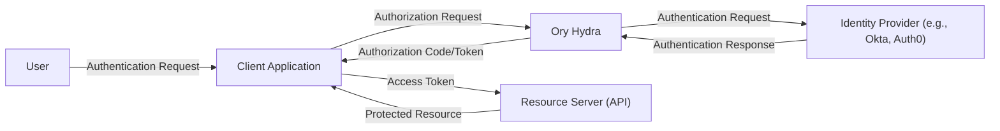
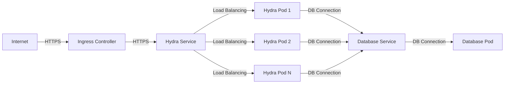

Okay, let's create a design document for the Ory Hydra project, focusing on aspects relevant for threat modeling.

# BUSINESS POSTURE

Ory Hydra is an OpenID Connect Certified™ OAuth 2.0 and OpenID Connect Provider. It's designed to enable any application to easily interact with an OAuth 2.0 and/or OpenID Connect ecosystem, acting as a crucial component in modern identity and access management (IAM) infrastructure.  It's not an identity provider (like Okta, Auth0, Google, Facebook, etc.) itself, but rather connects to existing user stores and identity providers.

Business Priorities:

*   Enable secure and standardized authorization and authentication flows for applications.
*   Provide a flexible and extensible solution that can integrate with various identity providers and user management systems.
*   Reduce the complexity and risk associated with implementing OAuth 2.0 and OpenID Connect.
*   Offer a high-performance and scalable solution suitable for demanding environments.
*   Maintain a strong security posture, adhering to industry best practices and standards.
*   Provide a solution that is easy to deploy, configure, and maintain.

Business Goals:

*   Become a leading OAuth 2.0 and OpenID Connect provider, trusted by developers and organizations.
*   Facilitate the adoption of secure and interoperable identity solutions.
*   Support a wide range of use cases, from simple single-page applications to complex microservices architectures.

Most Important Business Risks:

*   Compromise of client secrets or other sensitive configuration data, leading to unauthorized access to protected resources.
*   Vulnerabilities in the implementation of OAuth 2.0 or OpenID Connect protocols, allowing attackers to bypass security controls.
*   Incorrect or insufficient integration with identity providers, resulting in authentication or authorization failures.
*   Denial-of-service attacks that disrupt the availability of the service.
*   Data breaches involving sensitive user information or tokens.
*   Failure to comply with relevant regulations and standards (e.g., GDPR, CCPA).

# SECURITY POSTURE

Existing Security Controls:

*   security control: OpenID Connect Certified™: Adherence to the OpenID Connect standard ensures a baseline level of security and interoperability. (Described in OpenID Connect specifications and certification process).
*   security control: OAuth 2.0 Compliant: Implementation of the OAuth 2.0 framework provides a standardized approach to authorization. (Described in OAuth 2.0 specifications).
*   security control: Use of HTTPS: Enforces encrypted communication between clients, Hydra, and identity providers. (Described in deployment documentation and configuration options).
*   security control: Support for various grant types: Offers flexibility in choosing the appropriate authorization flow for different use cases. (Described in documentation and API specifications).
*   security control: Token revocation: Allows for invalidating issued tokens in case of compromise or policy changes. (Described in API specifications).
*   security control: Client authentication: Supports various methods for authenticating clients, including client secret, private key JWT, and others. (Described in documentation and API specifications).
*   security control: Consent management: Provides mechanisms for obtaining user consent before granting access to protected resources. (Described in documentation and API specifications).
*   security control: Regular security audits and penetration testing: The Ory team and community conduct security assessments to identify and address vulnerabilities. (Described in security documentation and community channels).
*   security control: Use of secure coding practices: Development follows secure coding guidelines to minimize the risk of introducing vulnerabilities. (Described in contribution guidelines and code review process).
*   security control: Input validation: Hydra validates input parameters to prevent injection attacks and other vulnerabilities. (Described in code and API specifications).
*   security control: Cryptographic key management: Hydra supports secure storage and management of cryptographic keys. (Described in documentation and configuration options).
*   security control: Rate limiting: Protects against brute-force attacks and denial-of-service. (Described in documentation and configuration options).

Accepted Risks:

*   accepted risk: Reliance on external identity providers: The security of the overall system depends on the security of the integrated identity providers.
*   accepted risk: Complexity of configuration: Incorrect configuration can lead to security vulnerabilities.
*   accepted risk: Potential for zero-day vulnerabilities: As with any software, there is a risk of undiscovered vulnerabilities.

Recommended Security Controls:

*   Implement robust monitoring and logging to detect and respond to security incidents.
*   Provide detailed security hardening guides for different deployment scenarios.
*   Offer integration with Web Application Firewalls (WAFs) for additional protection.
*   Implement regular vulnerability scanning and dependency analysis.
*   Consider supporting hardware security modules (HSMs) for enhanced key protection.

Security Requirements:

*   Authentication:
    *   Support for various client authentication methods (e.g., client secret, private key JWT, mTLS).
    *   Integration with existing identity providers via standard protocols (e.g., OpenID Connect, SAML).
    *   Secure handling of authentication credentials.
*   Authorization:
    *   Implementation of OAuth 2.0 authorization code flow, implicit flow, resource owner password credentials flow, client credentials flow, and device authorization flow.
    *   Support for scopes and claims to define granular access control.
    *   Enforcement of access policies based on user roles and attributes.
*   Input Validation:
    *   Strict validation of all input parameters, including redirect URIs, client IDs, scopes, and claims.
    *   Prevention of injection attacks (e.g., SQL injection, cross-site scripting).
    *   Validation of token formats and signatures.
*   Cryptography:
    *   Use of strong cryptographic algorithms and key lengths.
    *   Secure storage and management of cryptographic keys.
    *   Protection of sensitive data in transit and at rest.
    *   Support for JWT (JSON Web Token) and JWS (JSON Web Signature).

# DESIGN

## C4 CONTEXT



Element Descriptions:

*   Element:
    *   Name: User
    *   Type: Person
    *   Description: The end-user who wants to access a protected resource.
    *   Responsibilities: Initiates the authentication and authorization process.
    *   Security controls: Strong passwords, multi-factor authentication (managed by the Identity Provider).

*   Element:
    *   Name: Client Application
    *   Type: Software System
    *   Description: The application that wants to access a protected resource on behalf of the user.
    *   Responsibilities: Initiates the authorization request to Ory Hydra, handles the authorization code/token, and accesses the protected resource.
    *   Security controls: Secure storage of client credentials, HTTPS communication, input validation.

*   Element:
    *   Name: Ory Hydra
    *   Type: Software System
    *   Description: The OAuth 2.0 and OpenID Connect provider.
    *   Responsibilities: Handles authorization requests, interacts with the identity provider, issues tokens, and manages consent.
    *   Security controls: OpenID Connect Certified, OAuth 2.0 compliant, HTTPS, token revocation, client authentication, consent management, input validation, rate limiting.

*   Element:
    *   Name: Identity Provider (e.g., Okta, Auth0)
    *   Type: Software System
    *   Description: The system that manages user identities and authenticates users.
    *   Responsibilities: Authenticates users, provides user information, and manages user accounts.
    *   Security controls: Strong authentication mechanisms, secure storage of user data, access controls.

*   Element:
    *   Name: Resource Server (API)
    *   Type: Software System
    *   Description: The API that provides access to protected resources.
    *   Responsibilities: Validates access tokens, enforces access control policies, and provides access to protected resources.
    *   Security controls: Token validation, authorization checks, input validation, HTTPS.

## C4 CONTAINER

```mermaid
graph LR
    App["Client Application"]
    HydraAPI["Hydra API (REST)"]
    HydraAdminAPI["Hydra Admin API (REST)"]
    DB[(Database (SQL))]

    App -- Authorization Request --> HydraAPI
    HydraAPI -- User Authentication, Token Issuance --> DB
    HydraAdminAPI -- Configuration, Management --> DB
```

Element Descriptions:

*   Element:
    *   Name: Client Application
    *   Type: Software System
    *   Description: The application that wants to access a protected resource on behalf of the user.
    *   Responsibilities: Initiates the authorization request to Ory Hydra, handles the authorization code/token, and accesses the protected resource.
    *   Security controls: Secure storage of client credentials, HTTPS communication, input validation.

*   Element:
    *   Name: Hydra API (REST)
    *   Type: Web Application
    *   Description: The main API endpoint for interacting with Ory Hydra. Handles authorization requests, token issuance, and other OAuth 2.0/OpenID Connect flows.
    *   Responsibilities: Processing authorization requests, interacting with the database, issuing tokens, validating tokens.
    *   Security controls: Input validation, HTTPS, authentication, authorization, rate limiting.

*   Element:
    *   Name: Hydra Admin API (REST)
    *   Type: Web Application
    *   Description: The API endpoint for managing Ory Hydra configuration, clients, and other administrative tasks.
    *   Responsibilities: Managing clients, configuring policies, managing cryptographic keys.
    *   Security controls: Strong authentication, authorization, input validation, HTTPS, rate limiting.

*   Element:
    *   Name: Database (SQL)
    *   Type: Database
    *   Description: The database used to store Ory Hydra's configuration, clients, tokens, and other data.
    *   Responsibilities: Storing and retrieving data.
    *   Security controls: Access controls, encryption at rest, regular backups, auditing.

## DEPLOYMENT

Possible Deployment Solutions:

1.  Docker Compose: Suitable for development and testing environments.
2.  Kubernetes: Ideal for production environments, providing scalability, resilience, and manageability.
3.  Cloud-Specific Managed Services (e.g., AWS ECS, Google Kubernetes Engine, Azure Kubernetes Service): Leverage cloud provider's infrastructure and management capabilities.
4.  Bare Metal/Virtual Machines: Traditional deployment approach, offering full control over the infrastructure.

Chosen Solution (for detailed description): Kubernetes



Element Descriptions:

*   Element:
    *   Name: Internet
    *   Type: External Network
    *   Description: The public internet.
    *   Responsibilities: Provides access to the Ory Hydra service.
    *   Security controls: Firewall, DDoS protection.

*   Element:
    *   Name: Ingress Controller
    *   Type: Load Balancer
    *   Description: Manages external access to the Ory Hydra service.
    *   Responsibilities: Routing traffic to the appropriate service, TLS termination.
    *   Security controls: HTTPS, TLS configuration, access controls.

*   Element:
    *   Name: Hydra Service
    *   Type: Kubernetes Service
    *   Description: A Kubernetes service that provides a stable endpoint for accessing Ory Hydra pods.
    *   Responsibilities: Load balancing traffic across Ory Hydra pods.
    *   Security controls: Network policies.

*   Element:
    *   Name: Hydra Pod 1, Hydra Pod 2, Hydra Pod N
    *   Type: Kubernetes Pod
    *   Description: Instances of the Ory Hydra application running in Kubernetes pods.
    *   Responsibilities: Handling authorization requests, interacting with the database, issuing tokens.
    *   Security controls: Container security best practices, resource limits, network policies.

*   Element:
    *   Name: Database Service
    *   Type: Kubernetes Service
    *   Description: A Kubernetes service that provides a stable endpoint for accessing the database pod.
    *   Responsibilities: Load balancing traffic to the database pod.
    *   Security controls: Network policies.

*   Element:
    *   Name: Database Pod
    *   Type: Kubernetes Pod
    *   Description: The database instance running in a Kubernetes pod.
    *   Responsibilities: Storing and retrieving data.
    *   Security controls: Access controls, encryption at rest, regular backups, auditing, network policies.

## BUILD

Ory Hydra uses a combination of Go modules and Makefiles for building and testing. GitHub Actions is used for continuous integration and delivery.


Build Process Security Controls:

*   security control: Go Modules: Ensures dependency management and reproducibility.
*   security control: Makefiles: Automates build and test processes.
*   security control: GitHub Actions: Provides a secure and automated CI/CD pipeline.
*   security control: Code Scanning: GitHub's built-in code scanning tools are used to identify vulnerabilities.
*   security control: SAST (Static Application Security Testing): Go linters and static analysis tools are used to detect potential security issues in the code.
*   security control: Dependency Scanning: Tools like `go mod verify` and `go list -m all` are used to check for known vulnerabilities in dependencies.
*   security control: Docker Image Scanning: Docker images are scanned for vulnerabilities before being published.
*   security control: Signed Commits: Developers are encouraged to sign their commits to ensure code integrity.
*   security control: Code Review: All code changes are reviewed by other developers before being merged.

# RISK ASSESSMENT

Critical Business Processes:

*   User Authentication and Authorization: Ensuring that only authorized users can access protected resources.
*   Token Issuance and Management: Securely issuing and managing access tokens and refresh tokens.
*   Client Management: Managing client applications and their credentials.
*   Consent Management: Obtaining user consent before granting access to protected resources.
*   System Availability: Maintaining the availability of the Ory Hydra service.

Data Sensitivity:

*   Client Secrets: Highly sensitive. Compromise leads to unauthorized access.
*   Authorization Codes: Moderately sensitive. Short-lived, but can be used to obtain access tokens.
*   Access Tokens: Highly sensitive. Allow access to protected resources.
*   Refresh Tokens: Highly sensitive. Allow obtaining new access tokens without re-authentication.
*   User Data (PII): Potentially sensitive, depending on the information stored by the integrated identity provider. Ory Hydra itself does not store user data, but it processes user identifiers and claims.
*   Configuration Data: Sensitive. Contains database connection strings, cryptographic keys, and other sensitive information.

# QUESTIONS & ASSUMPTIONS

Questions:

*   What specific identity providers will be integrated with Ory Hydra?
*   What are the expected traffic patterns and load requirements?
*   What are the specific compliance requirements (e.g., GDPR, CCPA)?
*   What is the existing security infrastructure (e.g., firewalls, WAFs)?
*   What is the organization's risk tolerance?
*   What level of monitoring and logging is required?
*   Are there any specific deployment constraints or requirements?

Assumptions:

*   BUSINESS POSTURE: The organization prioritizes security and compliance.
*   SECURITY POSTURE: The organization has a mature security program and follows secure development practices.
*   DESIGN: The deployment environment will be Kubernetes. The database will be a SQL database (e.g., PostgreSQL, MySQL). The identity provider will support OpenID Connect.