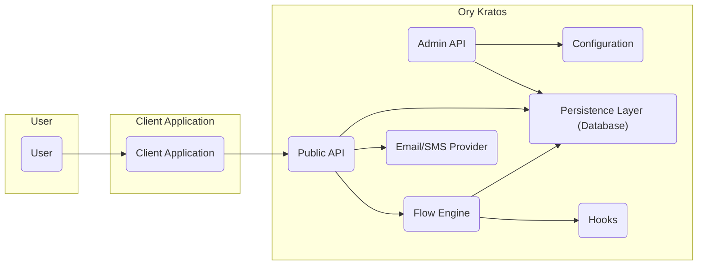
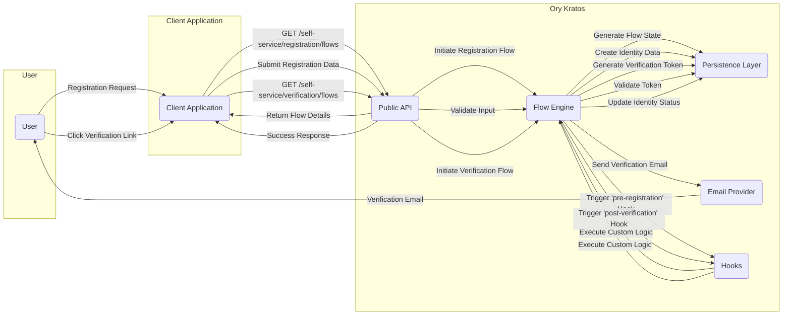
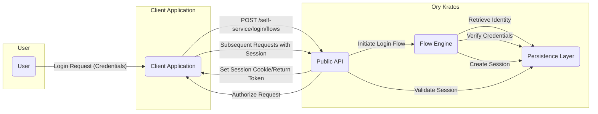

# Project Design Document: Ory Kratos

**Version:** 1.1
**Date:** October 26, 2023
**Author:** AI Software Architect

## 1. Introduction

This document provides an enhanced and detailed design overview of Ory Kratos, an open-source identity management system. This document is intended to serve as a robust foundation for subsequent threat modeling activities. It elaborates on the key components, functionalities, data flows, and security considerations of the system, providing a deeper understanding of its architecture.

## 2. Goals and Objectives

The primary goals of Ory Kratos are to:

* Provide a secure, reliable, and scalable platform for managing user identities and their associated data.
* Offer a comprehensive suite of self-service functionalities for users, including registration, login, password recovery, account verification, and profile management.
* Be highly customizable and extensible through its plugin architecture and configuration options to seamlessly integrate with diverse application requirements.
* Facilitate secure integration with other systems and services via well-defined APIs and webhooks.
* Adhere to stringent security best practices, industry standards, and privacy regulations.

## 3. High-Level Architecture

Ory Kratos employs a microservices architecture, promoting modularity and independent deployability. The core components interact through well-defined interfaces to deliver the overall identity management functionality.

**Key Components:**

* **User:** Represents the end-user interacting with the system through a client application.
* **Client Application:** The application (web, mobile, desktop, etc.) that integrates with Ory Kratos to delegate identity management tasks.
* **Public API:** The primary interface exposed to client applications for user-facing identity management operations and self-service flows.
* **Admin API:** Provides privileged administrative functionalities for managing identities, configurations, schemas, and other system-level operations.
* **Configuration:**  Manages the configuration settings for the entire Kratos instance, including database connections, SMTP settings, and security policies.
* **Flow Engine:**  Orchestrates the various self-service flows (registration, login, recovery, etc.), managing state and transitions.
* **Persistence Layer (Database):** Stores all persistent data for Ory Kratos, including identity data, session information, and configuration settings.
* **Email/SMS Provider:**  An external service integrated with Kratos for sending transactional emails and SMS messages for verification, recovery, and MFA.
* **Hooks:**  A mechanism for extending Kratos functionality by executing custom logic at specific points within the self-service flows.

## 4. Component Details

This section provides a more granular description of each key component within Ory Kratos, highlighting their responsibilities and interactions.

### 4.1. Public API

* **Purpose:**  Exposes a RESTful interface for client applications to interact with Kratos for user authentication, authorization (indirectly through session management), and self-service identity management.
* **Key Functionalities:**
    * Initiating and completing self-service flows (registration, login, password recovery, verification, settings update).
    * Managing user sessions (creation, retrieval, invalidation).
    * Providing endpoints for checking session validity.
    * Exposing identity schemas for customizing user attributes.
    * Handling OAuth 2.0 authorization flows (if configured as an OAuth 2.0 provider).
* **Security Considerations:**
    * Strict input validation and sanitization to prevent injection attacks (e.g., XSS, HTML injection).
    * Rate limiting and abuse prevention mechanisms to mitigate denial-of-service attacks.
    * Secure handling of sensitive data in transit (HTTPS enforcement).
    * Protection against Cross-Site Request Forgery (CSRF) attacks.
    * Proper authentication and authorization of client applications (e.g., API keys, OAuth 2.0 client credentials).

### 4.2. Admin API

* **Purpose:** Provides a privileged interface for administrators to manage the Kratos instance and user identities. Access should be strictly controlled.
* **Key Functionalities:**
    * CRUD operations on identities (create, read, update, delete).
    * Management of Kratos configuration settings.
    * Schema management (defining custom identity attributes).
    * Retrieval of audit logs for security monitoring and compliance.
    * Management of webhooks for event-driven integrations.
    * Impersonating users for troubleshooting (with proper auditing).
* **Security Considerations:**
    * Requires strong authentication and authorization (e.g., API keys with specific permissions).
    * Access should be restricted to authorized administrators only, following the principle of least privilege.
    * All administrative actions should be logged for auditing purposes.
    * Protection against unauthorized access and manipulation of sensitive data.

### 4.3. Configuration

* **Purpose:**  Centralized management of Kratos's configuration, allowing for customization and adaptation to different environments and requirements.
* **Key Functionalities:**
    * Defining database connection details.
    * Configuring SMTP settings for email communication.
    * Setting up integration with external services (e.g., SMS providers, identity providers).
    * Defining security policies (e.g., password complexity, session timeouts).
    * Configuring self-service flow settings.
* **Security Considerations:**
    * Secure storage of sensitive configuration data (e.g., database credentials, API keys).
    * Access to configuration should be restricted to authorized personnel.
    * Version control and audit logging of configuration changes.

### 4.4. Flow Engine

* **Purpose:**  Manages the state and transitions of the various self-service flows, ensuring a consistent and secure user experience.
* **Key Functionalities:**
    * Handling the logic for registration, login, password recovery, verification, and settings update flows.
    * Managing the state of each flow (e.g., identifying the current step).
    * Enforcing security checks and validations within the flows.
    * Triggering hooks at specific points in the flows for extensibility.
* **Security Considerations:**
    * Protection against flow manipulation and bypass attempts.
    * Secure handling of sensitive data within the flow state.
    * Prevention of replay attacks on flow initiation requests.

### 4.5. Persistence Layer (Database)

* **Purpose:**  Provides durable storage for all of Kratos's persistent data.
* **Data Stored:**
    * User identities (credentials, attributes, recovery information, verification status).
    * Session data (active sessions, session tokens).
    * Configuration settings.
    * Self-service flow states.
    * Audit logs.
    * Webhook subscriptions.
* **Technology:** Supports various SQL databases (e.g., PostgreSQL, MySQL) and potentially other storage mechanisms.
* **Security Considerations:**
    * Encryption of sensitive data at rest using database-level encryption or transparent data encryption (TDE).
    * Secure database access controls, limiting access to only necessary Kratos components.
    * Regular database backups and disaster recovery mechanisms.
    * Protection against SQL injection vulnerabilities through parameterized queries and input validation.

### 4.6. Email/SMS Provider

* **Purpose:**  Facilitates communication with users via email and SMS for critical identity management functions.
* **Key Functionalities:**
    * Sending account verification emails.
    * Sending password reset links or codes.
    * Sending multi-factor authentication (MFA) verification codes via SMS.
* **Integration:** Integrates with external email service providers (ESPs) and SMS gateways.
* **Security Considerations:**
    * Secure storage and management of provider credentials (API keys, usernames/passwords).
    * Implementation of SPF, DKIM, and DMARC to prevent email spoofing.
    * Rate limiting to prevent abuse and excessive sending.
    * Secure transmission of sensitive information to the provider.

### 4.7. Hooks

* **Purpose:**  Provides a mechanism to extend Kratos's functionality by executing custom logic at specific points within the self-service flows.
* **Key Functionalities:**
    * Executing custom code before or after specific events in the flows (e.g., before user registration, after successful login).
    * Allowing for integration with external systems or custom business logic.
* **Security Considerations:**
    * Secure deployment and management of hook implementations.
    * Input validation and sanitization within hook logic to prevent vulnerabilities.
    * Proper error handling and logging within hooks.
    * Resource limits to prevent resource exhaustion by malicious hooks.

## 5. Data Flow Diagrams

This section provides more detailed illustrations of the data flow for key user journeys within Ory Kratos.

### 5.1. User Registration Flow (Detailed)

**Steps:**

* User initiates registration through the client application.
* Client application requests the registration flow from the Kratos Public API.
* Kratos API instructs the Flow Engine to initiate the registration flow.
* Flow Engine generates and persists the flow state.
* Kratos API returns the flow details to the client application.
* Client application submits the user's registration data to the Kratos Public API.
* Kratos API validates the input through the Flow Engine.
* Flow Engine creates the initial identity data in the persistence layer.
* Flow Engine triggers the 'pre-registration' hook (if configured).
* Hook executes custom logic.
* Flow Engine generates a verification token and stores it.
* Flow Engine sends a verification email to the user via the email provider.
* User clicks the verification link in the email.
* Client application requests the verification flow from the Kratos Public API.
* Kratos API instructs the Flow Engine to initiate the verification flow.
* Flow Engine validates the provided token against the stored token.
* Flow Engine updates the identity status in the persistence layer.
* Flow Engine triggers the 'post-verification' hook (if configured).
* Hook executes custom logic.
* Kratos API sends a success response to the client application.

### 5.2. User Login Flow (Password-Based with Session Management)

**Steps:**

* User submits login credentials through the client application.
* Client application sends a login request to the Kratos Public API.
* Kratos API instructs the Flow Engine to initiate the login flow.
* Flow Engine retrieves the user's identity from the persistence layer.
* Flow Engine verifies the provided credentials against the stored credentials.
* If authentication is successful, Flow Engine creates a session and stores it in the persistence layer.
* Kratos API sets a session cookie or returns a session token to the client application.
* For subsequent requests, the client application includes the session cookie or token.
* Kratos API validates the session against the persistence layer.
* Kratos API authorizes the request based on the valid session.

## 6. Security Considerations

This section provides a more detailed breakdown of security considerations for the Ory Kratos deployment, including potential threats and mitigation strategies.

* **Authentication:**
    * **Threat:** Brute-force attacks on login endpoints.
        * **Mitigation:** Rate limiting on login attempts, account lockout mechanisms after multiple failed attempts, CAPTCHA implementation.
    * **Threat:** Credential stuffing attacks.
        * **Mitigation:** Monitoring for suspicious login patterns, implementing device fingerprinting, encouraging strong and unique passwords.
    * **Threat:** Weak password policies.
        * **Mitigation:** Enforce strong password complexity requirements, provide password strength indicators.
    * **Threat:** Compromised credentials.
        * **Mitigation:** Multi-factor authentication (MFA) enforcement, regular password rotation recommendations.
* **Authorization:**
    * **Threat:** Unauthorized access to administrative functionalities.
        * **Mitigation:** Strict access control policies for the Admin API, role-based access control (RBAC), principle of least privilege.
    * **Threat:** Privilege escalation.
        * **Mitigation:** Thoroughly review and restrict permissions granted to different roles and API keys.
* **Data Protection:**
    * **Threat:** Data breaches and unauthorized access to sensitive user data.
        * **Mitigation:** Encryption of sensitive data at rest and in transit, secure storage of encryption keys, access controls on the database.
    * **Threat:** Exposure of sensitive data through logging.
        * **Mitigation:** Implement secure logging practices, redact sensitive information from logs, secure storage and access control for log files.
* **Session Management:**
    * **Threat:** Session hijacking and fixation attacks.
        * **Mitigation:** Use secure session tokens, implement HTTPOnly and Secure flags for session cookies, regular session rotation, protection against cross-site scripting (XSS).
    * **Threat:** Session replay attacks.
        * **Mitigation:** Implement short session timeouts, include anti-replay mechanisms in session tokens.
* **Input Validation:**
    * **Threat:** Injection attacks (SQL injection, XSS, command injection).
        * **Mitigation:** Strict input validation and sanitization on all API endpoints, use parameterized queries, proper output encoding.
* **API Security:**
    * **Threat:** Denial-of-service (DoS) attacks.
        * **Mitigation:** Rate limiting on API endpoints, implementing request size limits.
    * **Threat:** Man-in-the-middle (MITM) attacks.
        * **Mitigation:** Enforce HTTPS for all API communication.
* **Dependency Management:**
    * **Threat:** Vulnerabilities in third-party libraries.
        * **Mitigation:** Regularly update dependencies to patch security vulnerabilities, use dependency scanning tools.
* **Deployment Security:**
    * **Threat:** Unauthorized access to the deployment environment.
        * **Mitigation:** Secure the underlying infrastructure (e.g., firewalls, network segmentation), follow security best practices for containerization and orchestration (if applicable).
* **Auditing and Logging:**
    * **Threat:** Lack of visibility into security events.
        * **Mitigation:** Comprehensive audit logging of security-relevant events, secure storage and monitoring of logs, implement alerting for suspicious activity.

## 7. Deployment Considerations

* **Infrastructure:**
    * **Option:** Containerized deployment (e.g., Docker, Kubernetes).
        * **Security Implication:** Requires secure container image management, proper configuration of container orchestration platforms, and network policies.
    * **Option:** Virtual Machines (VMs).
        * **Security Implication:** Requires hardening of the operating system and secure configuration of the VM environment.
    * **Option:** Serverless deployment (e.g., AWS Lambda, Google Cloud Functions).
        * **Security Implication:** Relies on the security of the serverless platform provider, requires careful management of function permissions and secrets.
* **Scalability:**
    * **Consideration:** Database scalability is crucial for handling a large number of users and sessions.
    * **Consideration:** Horizontal scaling of Kratos instances behind a load balancer for high availability and performance.
* **High Availability:**
    * **Requirement:** Deploying multiple instances of Kratos across availability zones.
    * **Requirement:** Database replication and failover mechanisms.
* **Configuration Management:**
    * **Method:** Environment variables.
        * **Security Implication:** Ensure secure storage and management of sensitive environment variables.
    * **Method:** Configuration files.
        * **Security Implication:** Secure access control and storage for configuration files.
    * **Method:** Dedicated configuration management tools (e.g., HashiCorp Consul, etcd).
        * **Security Implication:** Secure the configuration management infrastructure itself.

## 8. Future Considerations

* **Enhanced integration with identity providers via standard protocols (e.g., SAML, OIDC).**
* **Implementation of advanced risk-based authentication mechanisms.**
* **Development of more comprehensive user analytics and reporting dashboards.**
* **Support for more granular and dynamic authorization policies.**
* **Exploration of passwordless authentication methods (e.g., WebAuthn).**
* **Improved support for verifiable credentials.**

This enhanced document provides a more in-depth design overview of Ory Kratos, with a strong focus on security considerations relevant for threat modeling. It aims to provide a clear understanding of the system's components, data flows, and potential vulnerabilities.
