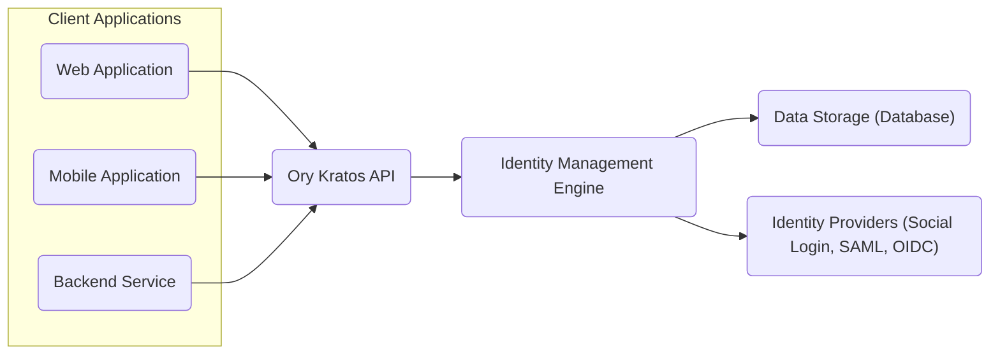
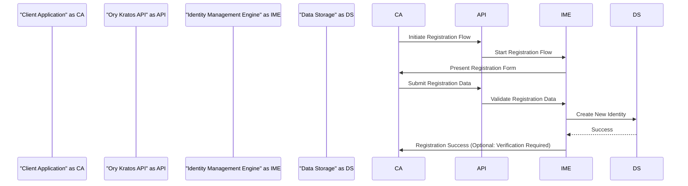
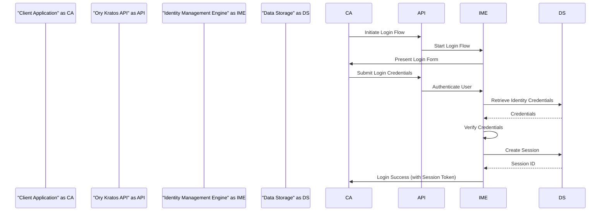
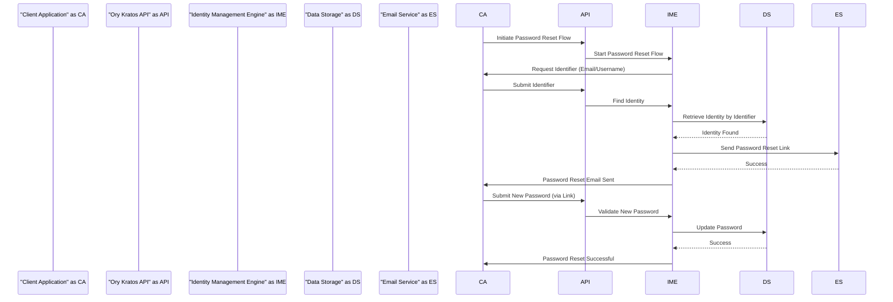

# Project Design Document: Ory Kratos

**Version:** 1.1
**Date:** October 26, 2023
**Author:** AI Software Architect

## 1. Introduction

This document provides a detailed design overview of the Ory Kratos project, as represented by the codebase available at [https://github.com/ory/kratos](https://github.com/ory/kratos). This document is specifically crafted to serve as a foundation for threat modeling activities, offering a clear understanding of the system's architecture, components, data flow, and key security considerations. It aims to provide security engineers and developers with the necessary context to identify potential vulnerabilities and design appropriate mitigations.

## 2. Goals and Scope

The primary goal of this document is to comprehensively describe the architecture and functionality of Ory Kratos to facilitate effective threat modeling. The scope of this document includes:

*   Detailed explanation of the high-level system architecture and interactions between components.
*   In-depth description of core components, emphasizing their security responsibilities and potential attack surfaces.
*   Precise illustration of data flow for critical identity management operations, highlighting sensitive data handling.
*   Identification of key API endpoints relevant to identity management flows, serving as potential entry points for attacks.
*   Description of data storage mechanisms, focusing on the storage of sensitive information and its protection.
*   Explicit articulation of key security considerations and potential vulnerabilities derived from the design.

This document deliberately excludes deployment specifics, operational procedures, and granular code implementation details, focusing instead on the architectural aspects relevant to security analysis.

## 3. High-Level Architecture

Ory Kratos is a cloud-native, API-first identity management system designed for modern applications. It provides self-service identity management features, allowing developers to decouple identity logic from their core applications.

Here's a high-level architectural overview illustrating the key interactions:

*   **Client Applications:**  These are the applications or services that integrate with Ory Kratos for identity management. They interact exclusively through the Kratos API.
*   **Ory Kratos API:** This is the central point of interaction. It exposes a well-defined set of RESTful API endpoints for all identity management operations. It handles request routing, authentication (of clients if needed), and response formatting.
*   **Identity Management Engine:** This is the core business logic layer. It orchestrates identity management flows, enforces configured policies (e.g., password requirements, MFA), and interacts with the data storage and external identity providers. This component is crucial for understanding the system's behavior and potential vulnerabilities.
*   **Data Storage (Database):** Kratos relies on a database to persistently store identity-related data, including user credentials, profiles, recovery information, and session data. The security of this component is paramount.
*   **Identity Providers (Social Login, SAML, OIDC):** Kratos supports integration with external identity providers, enabling features like social login and federated authentication. This interaction introduces potential security considerations related to trust and data exchange with external systems.

## 4. Detailed Design

### 4.1. Core Components

*   **API Gateway (Conceptual):** While not a physically separate component, the Kratos API acts as an API gateway, managing access to identity management functionalities. This includes handling authentication of clients interacting with the API (e.g., using API keys for backend services).
*   **Identity Schema Management:** Kratos allows defining flexible schemas for identity data. This feature determines the structure of user profiles and impacts how user information is stored and retrieved. Improperly configured schemas could lead to data integrity issues or information leaks.
*   **Self-Service Flows:** These are pre-defined workflows that guide users through various identity management tasks. Key flows include:
    *   **Registration Flow:**  The process of creating a new user account, including collecting user details and setting initial credentials. Security considerations include preventing bot registration and ensuring strong password creation.
    *   **Login Flow:**  The process of authenticating an existing user, typically involving credential verification. Security considerations include protection against brute-force attacks and credential stuffing.
    *   **Password Reset Flow:**  The process for users to recover access to their account when they have forgotten their password. Security considerations involve ensuring the legitimacy of the request and preventing account takeover.
    *   **Account Verification Flow:**  The process of verifying a user's contact information (e.g., email or phone number). Security considerations include preventing abuse and ensuring the verified information belongs to the user.
    *   **Account Recovery Flow:** A more general mechanism for regaining access, potentially using backup codes or other recovery methods. Security considerations focus on preventing unauthorized access through recovery mechanisms.
    *   **Settings Flow:**  Allows users to manage their profile information and security settings. Security considerations include protecting sensitive user data and preventing unauthorized modifications.
*   **Session Management:** Kratos is responsible for managing user sessions after successful authentication. This involves creating, storing, and validating session tokens. Security considerations include preventing session hijacking and ensuring secure token storage.
*   **Policy Engine:** Kratos enforces configurable policies related to identity management. This includes password complexity rules, multi-factor authentication (MFA) enforcement, and other security constraints. The configuration and enforcement of these policies are critical for security.
*   **Webhooks:** Kratos can trigger webhooks to notify external systems about identity-related events (e.g., successful registration, password change). Security considerations involve ensuring the security of webhook delivery and preventing malicious actors from triggering or intercepting webhooks.
*   **Admin API:** A separate API provides administrative functionalities for managing users, identities, and Kratos configuration. Access to this API should be strictly controlled and secured.

### 4.2. Data Flow for Key Operations

#### 4.2.1. User Registration

*   The **Client Application** initiates the registration flow by sending a request to the **Ory Kratos API**.
*   The **Ory Kratos API** forwards the request to the **Identity Management Engine**.
*   The **Identity Management Engine** instructs the **Client Application** to present the registration form to the user.
*   The **Client Application** submits the user-provided registration data to the **Ory Kratos API**.
*   The **Ory Kratos API** passes the data to the **Identity Management Engine** for validation against configured schemas and policies.
*   If the data is valid, the **Identity Management Engine** instructs the **Data Storage** to create a new identity record.
*   The **Data Storage** confirms the successful creation.
*   The **Identity Management Engine** informs the **Client Application** about the successful registration. Optionally, a verification step might be required.

#### 4.2.2. User Login

*   The **Client Application** initiates the login flow by contacting the **Ory Kratos API**.
*   The **Ory Kratos API** directs the request to the **Identity Management Engine**.
*   The **Identity Management Engine** prompts the **Client Application** to display the login form.
*   The **Client Application** submits the user's login credentials to the **Ory Kratos API**.
*   The **Ory Kratos API** sends the credentials to the **Identity Management Engine** for authentication.
*   The **Identity Management Engine** retrieves the stored credentials for the user from the **Data Storage**.
*   The **Data Storage** returns the stored credentials.
*   The **Identity Management Engine** verifies the submitted credentials against the retrieved ones.
*   Upon successful verification, the **Identity Management Engine** instructs the **Data Storage** to create a new session.
*   The **Data Storage** returns the generated session ID.
*   The **Identity Management Engine** informs the **Client Application** of the successful login, including the session token.

#### 4.2.3. Password Reset

*   The **Client Application** starts the password reset process by contacting the **Ory Kratos API**.
*   The **Ory Kratos API** forwards the request to the **Identity Management Engine**.
*   The **Identity Management Engine** asks the **Client Application** to request an identifier (e.g., email or username) from the user.
*   The **Client Application** submits the identifier to the **Ory Kratos API**.
*   The **Ory Kratos API** sends the identifier to the **Identity Management Engine** to find the corresponding identity.
*   The **Identity Management Engine** queries the **Data Storage** to retrieve the identity based on the identifier.
*   The **Data Storage** returns the matching identity.
*   The **Identity Management Engine** instructs the **Email Service** to send a password reset link to the user's email address.
*   The **Email Service** confirms the successful sending of the email.
*   The **Identity Management Engine** informs the **Client Application** that the password reset email has been sent.
*   The user clicks the link in the email, and the **Client Application** submits the new password to the **Ory Kratos API**.
*   The **Ory Kratos API** passes the new password to the **Identity Management Engine** for validation.
*   The **Identity Management Engine** instructs the **Data Storage** to update the user's password.
*   The **Data Storage** confirms the successful update.
*   The **Identity Management Engine** informs the **Client Application** that the password reset was successful.

### 4.3. API Endpoints (Examples Relevant for Threat Modeling)

This list highlights key API endpoints that are potential targets for attacks:

*   `/self-service/registration/flows`:  Endpoints for initiating and completing registration flows. Potential vulnerabilities include account enumeration and bot registration.
*   `/self-service/login/flows`: Endpoints for initiating and completing login flows. Susceptible to brute-force attacks, credential stuffing, and potentially session fixation.
*   `/self-service/recovery/flows`: Endpoints for initiating and completing account recovery flows. Vulnerable to account takeover if not properly secured.
*   `/self-service/verification/flows`: Endpoints for managing account verification. Potential for abuse to verify unintended accounts.
*   `/self-service/settings/flows`: Endpoints for managing user settings. Could be targeted for unauthorized modification of user data or security settings.
*   `/sessions/whoami`:  Endpoint to retrieve information about the currently authenticated user. Information leakage if not properly protected.
*   `/admin/identities`:  Admin API endpoint for managing identities. If compromised, attackers gain full control over user accounts.

### 4.4. Data Storage

Ory Kratos stores critical identity data in a persistent data store. The choice of database is configurable. Security considerations for the data storage are paramount. Examples of stored data include:

*   **Identity Data:**  Usernames, email addresses, phone numbers, and custom attributes defined by the identity schema. This data is a primary target for attackers.
*   **Credentials:**  Password hashes (using strong, salted hashing algorithms), recovery codes, and verification tokens. Secure storage and handling of these credentials are vital.
*   **Sessions:**  Session tokens (which should be treated as highly sensitive), user agent information, and session expiry timestamps. Compromised session tokens allow for account hijacking.
*   **Policies:**  Configuration settings for password complexity, MFA requirements, and other security-related configurations. Unauthorized modification of policies can weaken the system's security.
*   **Flow State:**  Temporary data associated with ongoing self-service flows. While temporary, this data can sometimes contain sensitive information and should be handled securely.

**Sensitive Data Handling Best Practices:**

*   **Password Hashing:** Employ strong, industry-standard hashing algorithms (e.g., Argon2id) with unique salts for each password.
*   **Token Storage:** Store session tokens and other sensitive tokens securely, ideally encrypted at rest. Consider using HTTP-only and secure flags for session cookies.
*   **Data Encryption in Transit:** Enforce HTTPS for all communication between clients and the Kratos API to protect data in transit.
*   **Data Encryption at Rest:**  Encrypt sensitive data at rest within the database.
*   **Access Control:** Implement strict access controls to the data storage to limit access to authorized Kratos components only.

## 5. Security Considerations (Actionable for Threat Modeling)

This section provides specific security considerations relevant for threat modeling:

*   **Authentication and Authorization:**
    *   **Threat:** Weak or predictable password policies leading to easy password cracking.
    *   **Threat:** Lack of multi-factor authentication allowing unauthorized access with compromised credentials.
    *   **Threat:** Insecure handling or storage of API keys used by backend services to interact with Kratos.
*   **Session Management:**
    *   **Threat:** Predictable or easily guessable session tokens leading to session hijacking.
    *   **Threat:** Lack of proper session invalidation after logout or password change.
    *   **Threat:** Vulnerabilities allowing session fixation attacks.
*   **Input Validation:**
    *   **Threat:** Insufficient input validation on registration or profile update fields leading to XSS or injection attacks (e.g., SQL injection if Kratos interacts directly with SQL without proper ORM usage).
    *   **Threat:** Lack of rate limiting on login attempts allowing brute-force attacks.
    *   **Threat:** Failure to sanitize user-provided data displayed in error messages, potentially revealing sensitive information.
*   **Data Protection:**
    *   **Threat:** Unencrypted storage of sensitive data in the database.
    *   **Threat:** Exposure of sensitive data through insecure API responses or logging.
    *   **Threat:** Inadequate access controls to the database, allowing unauthorized access.
*   **Account Recovery and Password Reset:**
    *   **Threat:** Predictable or easily guessable recovery codes.
    *   **Threat:** Vulnerabilities in the password reset flow allowing attackers to reset other users' passwords (e.g., lack of proper link validation).
    *   **Threat:** Insufficient protection against brute-forcing recovery codes.
*   **Rate Limiting:**
    *   **Threat:** Absence of rate limiting on critical endpoints (login, registration, password reset) leading to denial-of-service or brute-force attacks.
*   **Cross-Site Request Forgery (CSRF) Protection:**
    *   **Threat:** Lack of CSRF protection on state-changing endpoints allowing attackers to perform actions on behalf of authenticated users.
*   **Cross-Site Scripting (XSS) Prevention:**
    *   **Threat:** Vulnerabilities allowing attackers to inject malicious scripts into the application, potentially stealing session tokens or user credentials.
*   **Dependency Management:**
    *   **Threat:** Use of vulnerable dependencies with known security flaws.
*   **Admin API Security:**
    *   **Threat:** Weak authentication or authorization on the admin API, allowing unauthorized administrative actions.
    *   **Threat:** Exposure of the admin API to the public internet.
*   **Webhook Security:**
    *   **Threat:** Webhooks sent over insecure channels (HTTP) allowing interception.
    *   **Threat:** Lack of signature verification on webhooks allowing malicious actors to forge webhook requests.

## 6. Deployment Considerations (Security Implications)

While deployment is out of scope, certain deployment choices impact security:

*   **Exposure of Kratos API:**  Proper network segmentation and firewall rules are essential to restrict access to the Kratos API.
*   **Database Security:** The security of the underlying database infrastructure is critical.
*   **Secrets Management:** Securely managing secrets like database credentials and API keys is crucial.
*   **TLS Configuration:**  Ensuring proper TLS configuration for HTTPS is vital to protect data in transit.

## 7. Future Considerations

*   **Integration with Ory Oathkeeper:**  Understanding how Kratos integrates with Ory Oathkeeper for authorization is important for a complete security picture.
*   **Advanced Policy Enforcement Mechanisms:**  Future enhancements in policy enforcement could introduce new security considerations.

## 8. Terminology

*   **Identity:** A unique representation of a user or entity within the system.
*   **Credential:**  Secret information used to authenticate an identity (e.g., password, API key).
*   **Session:** A record of a user's authenticated state, typically maintained through a session token.
*   **Flow:** A defined sequence of steps for a self-service identity management operation.
*   **Schema:** The structure defining the attributes and data types of an identity.
*   **Policy:** A rule or configuration that governs the behavior of the identity management system.
